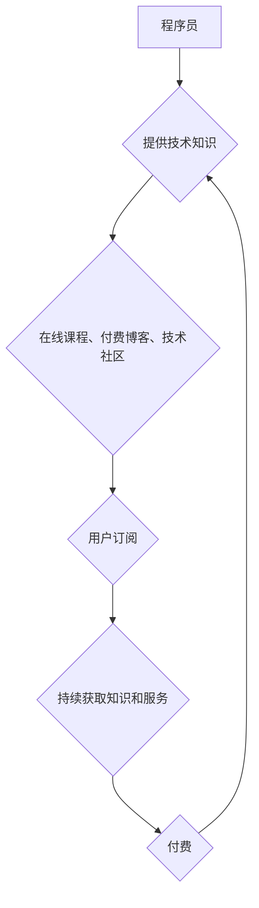

                 

## 程序员如何打造知识付费的订阅模式

> 关键词：知识付费、订阅模式、程序员、在线教育、内容运营、社区建设、技术博客、会员体系

### 1. 背景介绍

在互联网时代，知识成为最宝贵的资源之一。程序员作为技术人才，拥有丰富的专业知识和经验，也具备打造知识付费产品的潜力。订阅模式作为一种新型的商业模式，为程序员提供了持续输出价值、建立稳定收入来源的有效途径。

近年来，知识付费市场蓬勃发展，在线教育平台、技术博客、社区论坛等纷纷涌现。程序员可以通过多种方式进行知识付费，例如：

* **在线课程:**  录制视频课程，教授编程语言、框架、算法等技术知识。
* **付费博客:**  提供高质量的技术文章、代码示例、项目案例等内容，并设置会员订阅制度。
* **技术社区:**  建立线上或线下技术社区，提供技术交流、项目合作、 mentorship 等服务，并收取会员费用。

### 2. 核心概念与联系

**2.1 知识付费**

知识付费是指通过付费的方式获取知识、技能和经验。它是一种基于价值交换的商业模式，用户通过支付费用获得知识和服务，而知识提供者则通过知识的传播获得收益。

**2.2 订阅模式**

订阅模式是一种持续付费的商业模式，用户在支付一定的费用后，可以持续获得服务或内容。订阅模式的特点是：

* **持续收入:**  通过定期收取订阅费用，可以获得稳定的收入来源。
* **用户粘性:**  订阅模式可以增强用户粘性，因为用户需要持续支付费用才能获得服务或内容。
* **内容更新:**  订阅模式鼓励知识提供者持续更新内容，以满足用户的需求。

**2.3 程序员知识付费**

程序员知识付费是指程序员通过付费的方式提供技术知识和服务。它可以包括在线课程、付费博客、技术社区等多种形式。

**2.4 订阅模式与程序员知识付费的联系**

订阅模式可以有效地帮助程序员打造知识付费产品。通过订阅模式，程序员可以：

* **建立稳定的收入来源:**  定期收取订阅费用，可以获得稳定的收入。
* **增强用户粘性:**  用户需要持续支付费用才能获得内容和服务，可以增强用户粘性。
* **持续更新内容:**  订阅模式鼓励程序员持续更新内容，以满足用户的需求。

**Mermaid 流程图**



### 3. 核心算法原理 & 具体操作步骤

**3.1 算法原理概述**

知识付费订阅模式的核心算法原理是基于用户价值和内容价值的匹配。

* **用户价值:**  指的是用户对知识和服务的需求和支付意愿。
* **内容价值:**  指的是知识和服务的质量、实用性和独特性。

通过算法匹配用户价值和内容价值，可以提高用户订阅率和付费意愿。

**3.2 算法步骤详解**

1. **用户画像:**  收集用户数据，包括用户兴趣、技能水平、学习目标等，构建用户画像。
2. **内容分类:**  对知识和服务进行分类，例如编程语言、框架、算法等，并对内容进行打分和排序。
3. **推荐算法:**  根据用户画像和内容分类，使用推荐算法推荐用户感兴趣的内容。
4. **个性化定制:**  根据用户的反馈和行为，对推荐内容进行个性化定制。
5. **订阅管理:**  提供便捷的订阅管理功能，方便用户订阅和取消订阅。

**3.3 算法优缺点**

* **优点:**  可以提高用户订阅率和付费意愿，提高知识付费产品的效率。
* **缺点:**  需要收集和分析大量用户数据，算法的准确性会影响推荐效果。

**3.4 算法应用领域**

* **在线教育平台:**  推荐课程、学习资源和导师。
* **技术博客:**  推荐文章、代码示例和项目案例。
* **技术社区:**  推荐技术交流、项目合作和 mentorship 等服务。

### 4. 数学模型和公式 & 详细讲解 & 举例说明

**4.1 数学模型构建**

知识付费订阅模式的数学模型可以基于用户价值和内容价值的匹配度进行构建。

* **用户价值:**  可以用用户对知识和服务的评分或购买意愿来表示。
* **内容价值:**  可以用内容的质量、实用性和独特性来表示。

**4.2 公式推导过程**

可以定义一个匹配度函数来衡量用户价值和内容价值的匹配度。例如，可以使用以下公式：

$$
Match\_Score = \frac{User\_Value \times Content\_Value}{Max(User\_Value, Content\_Value)}
$$

其中：

* $Match\_Score$ 是匹配度分数，范围在 0 到 1 之间。
* $User\_Value$ 是用户的价值评分。
* $Content\_Value$ 是内容的价值评分。

**4.3 案例分析与讲解**

假设有一个用户对机器学习有很高的兴趣，并给出了 9 分的价值评分。

假设有一个机器学习课程，其价值评分为 8 分。

根据公式，匹配度分数为：

$$
Match\_Score = \frac{9 \times 8}{Max(9, 8)} = \frac{72}{9} = 8
$$

这个匹配度分数表明，用户对该课程的兴趣很高，并且课程的价值也较高。

### 5. 项目实践：代码实例和详细解释说明

**5.1 开发环境搭建**

* **操作系统:**  Linux、macOS 或 Windows
* **编程语言:**  Python
* **框架:**  Django 或 Flask
* **数据库:**  MySQL 或 PostgreSQL

**5.2 源代码详细实现**

以下是一个简单的 Python 代码示例，演示如何使用 Flask 框架构建一个知识付费订阅模式的网站：

```python
from flask import Flask, render_template, request

app = Flask(__name__)

# 模拟用户数据
users = {
    "user1": {"name": "张三", "subscription": True},
    "user2": {"name": "李四", "subscription": False},
}

@app.route("/")
def index():
    return render_template("index.html")

@app.route("/subscribe", methods=["POST"])
def subscribe():
    user_id = request.form.get("user_id")
    users[user_id]["subscription"] = True
    return "订阅成功！"

if __name__ == "__main__":
    app.run(debug=True)
```

**5.3 代码解读与分析**

* **Flask 框架:**  用于构建网站的 Web 应用程序。
* **用户数据:**  使用字典模拟用户数据，包括用户名和订阅状态。
* **路由:**  定义了网站的 URL 路由和对应的处理函数。
* **订阅功能:**  使用 POST 请求处理订阅请求，更新用户的订阅状态。

**5.4 运行结果展示**

运行上述代码后，可以访问 http://127.0.0.1:5000/，查看网站首页。

点击订阅按钮，可以提交订阅请求，更新用户的订阅状态。

### 6. 实际应用场景

**6.1 在线课程平台**

程序员可以录制视频课程，教授编程语言、框架、算法等技术知识，并通过订阅模式提供持续更新的内容和服务。

**6.2 技术博客**

程序员可以创建技术博客，分享技术文章、代码示例、项目案例等内容，并设置会员订阅制度，提供独家内容和社区服务。

**6.3 技术社区**

程序员可以建立线上或线下技术社区，提供技术交流、项目合作、 mentorship 等服务，并收取会员费用。

**6.4 未来应用展望**

随着人工智能、大数据等技术的不断发展，知识付费订阅模式将更加智能化、个性化和多元化。

* **人工智能推荐:**  利用人工智能算法，更精准地推荐用户感兴趣的内容。
* **个性化学习路径:**  根据用户的学习目标和进度，定制个性化的学习路径。
* **虚拟现实/增强现实:**  利用虚拟现实和增强现实技术，提供更加沉浸式的学习体验。

### 7. 工具和资源推荐

**7.1 学习资源推荐**

* **书籍:**  《程序员的自我修养》、《代码的艺术》
* **在线课程:**  Coursera、edX、Udemy
* **技术博客:**  Hacker News、Stack Overflow

**7.2 开发工具推荐**

* **框架:**  Django、Flask
* **数据库:**  MySQL、PostgreSQL
* **支付平台:**  Stripe、PayPal

**7.3 相关论文推荐**

* **知识付费模式的构建与发展**
* **基于用户画像的知识推荐算法**
* **人工智能在知识付费领域的应用**

### 8. 总结：未来发展趋势与挑战

**8.1 研究成果总结**

知识付费订阅模式为程序员提供了新的商业模式，可以帮助他们持续输出价值、建立稳定收入来源。

**8.2 未来发展趋势**

知识付费订阅模式将更加智能化、个性化和多元化，人工智能、大数据等技术将推动模式的创新发展。

**8.3 面临的挑战**

* **内容质量:**  需要持续输出高质量的内容，才能吸引和留住用户。
* **用户粘性:**  需要不断提升用户体验，增强用户粘性。
* **竞争压力:**  知识付费市场竞争激烈，需要不断创新和 differentiation。

**8.4 研究展望**

未来研究可以关注以下方面：

* **更精准的用户画像和推荐算法**
* **更个性化的学习体验**
* **更有效的知识付费模式**

### 9. 附录：常见问题与解答

**9.1 如何选择合适的知识付费平台？**

需要根据自己的需求和目标选择合适的平台，例如：

* **用户规模:**  选择用户规模较大的平台，可以获得更多曝光机会。
* **平台功能:**  选择功能齐全的平台，可以提供更完善的服务。
* **平台费用:**  选择费用合理的平台，可以降低成本。

**9.2 如何提高知识付费产品的竞争力？**

* **内容质量:**  输出高质量、实用、独一无二的内容。
* **用户体验:**  提供便捷、流畅、个性化的用户体验。
* **营销推广:**  进行有效的营销推广，提高产品知名度和销量。


作者：禅与计算机程序设计艺术 / Zen and the Art of Computer Programming 
<end_of_turn>

