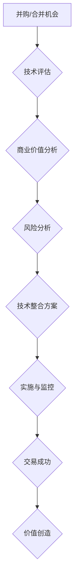

                 

## 程序员如何评估并购与合并机会

> 关键词：并购、合并、程序员、技术评估、商业价值、风险分析、财务模型、代码审查、技术整合

## 1. 背景介绍

在当今瞬息万变的科技领域，并购与合并（M&A）已成为企业快速扩张、获取新技术和市场份额的重要战略。对于程序员而言，M&A 意味着技术栈的融合、工作环境的改变，甚至职业生涯的新起点。然而，M&A 并非一帆风顺，成功的案例往往建立在对技术因素的深入评估之上。本文旨在为程序员提供一套评估并购与合并机会的框架，帮助他们更好地理解 M&A 的技术层面，并做出明智的决策。

## 2. 核心概念与联系

**2.1 并购与合并的概念**

* **并购 (Acquisition)**： 一家公司（收购方）购买另一家公司（被收购方）的全部或部分股权，从而使其成为子公司。
* **合并 (Merger)**： 两家公司合并为一家新的公司，双方股东均持有新公司的股权。

**2.2 技术评估与商业价值**

M&A 的核心目标是创造价值，而技术评估是实现这一目标的关键环节。技术评估不仅要考虑被收购方的技术实力，还要将其与收购方的业务战略和市场需求相结合，评估其商业价值。

**2.3 技术整合与风险管理**

M&A 过程中，技术整合是确保交易成功的关键。程序员需要参与到技术架构的评估、代码审查、系统集成等环节，并识别潜在的技术风险，制定相应的风险管理方案。

**2.4 流程图**



## 3. 核心算法原理 & 具体操作步骤

**3.1 算法原理概述**

M&A 的技术评估是一个复杂的决策过程，需要综合考虑多个因素，并运用一定的算法和模型进行分析。常见的技术评估算法包括：

* **技术成熟度模型 (TRL)**：评估技术的成熟度和可行性。
* **技术竞争力分析 (TPA)**：分析技术的市场竞争力和差异化优势。
* **技术风险评估 (TRA)**：识别和评估技术的潜在风险。

**3.2 算法步骤详解**

1. **信息收集**: 收集被收购方的技术资料，包括技术文档、代码库、专利信息等。
2. **技术分析**: 对收集到的技术资料进行分析，识别核心技术、技术优势、技术缺陷等。
3. **商业价值评估**: 将技术分析结果与收购方的业务战略和市场需求相结合，评估技术的商业价值。
4. **风险分析**: 识别和评估技术的潜在风险，包括技术风险、市场风险、合规风险等。
5. **决策支持**: 基于技术评估结果，为 M&A 决策提供支持。

**3.3 算法优缺点**

* **优点**: 可以提供客观的技术评估结果，帮助程序员做出更明智的决策。
* **缺点**: 算法的准确性依赖于输入数据的质量，需要程序员具备一定的算法和模型理解能力。

**3.4 算法应用领域**

* **技术收购**: 评估目标公司的技术实力和商业价值。
* **技术合并**: 评估合并后的技术架构和整合方案。
* **技术投资**: 评估技术项目的投资价值和风险。

## 4. 数学模型和公式 & 详细讲解 & 举例说明

**4.1 数学模型构建**

在技术评估中，可以使用数学模型来量化技术价值和风险。例如，可以构建一个技术成熟度模型，将技术成熟度与商业价值进行关联。

**4.2 公式推导过程**

假设技术成熟度为 T，商业价值为 V，则可以构建以下数学模型：

$$V = f(T)$$

其中，f(T) 是一个函数，描述了技术成熟度与商业价值之间的关系。

**4.3 案例分析与讲解**

假设一个新技术 TRL 为 5，商业价值为 100 万美元。如果 TRL 提升到 7，商业价值可能会提升到 500 万美元。

**4.4 举例说明**

* **技术竞争力分析**: 可以使用市场份额、专利数量、技术创新速度等指标进行量化分析。
* **技术风险评估**: 可以使用风险概率、风险影响程度、风险应对措施等指标进行量化分析。

## 5. 项目实践：代码实例和详细解释说明

**5.1 开发环境搭建**

* 操作系统：Linux/macOS/Windows
* 编程语言：Python
* 工具：Git、Jupyter Notebook

**5.2 源代码详细实现**

```python
# 技术成熟度模型
def calculate_tech_value(trl):
  if trl <= 3:
    return 0
  elif trl <= 5:
    return trl * 100000
  elif trl <= 7:
    return trl * 500000
  else:
    return trl * 1000000

# 技术竞争力分析
def calculate_tech_competitiveness(market_share, patents, innovation_speed):
  return market_share * patents * innovation_speed

# 技术风险评估
def calculate_tech_risk(risk_probability, risk_impact, risk_mitigation):
  return risk_probability * risk_impact * (1 - risk_mitigation)

# 案例分析
trl = 6
market_share = 0.1
patents = 10
innovation_speed = 2
risk_probability = 0.2
risk_impact = 5
risk_mitigation = 0.8

tech_value = calculate_tech_value(trl)
tech_competitiveness = calculate_tech_competitiveness(market_share, patents, innovation_speed)
tech_risk = calculate_tech_risk(risk_probability, risk_impact, risk_mitigation)

print(f"技术价值: {tech_value}")
print(f"技术竞争力: {tech_competitiveness}")
print(f"技术风险: {tech_risk}")
```

**5.3 代码解读与分析**

* 代码定义了三个函数：`calculate_tech_value`、`calculate_tech_competitiveness` 和 `calculate_tech_risk`，分别用于计算技术价值、技术竞争力和技术风险。
* 函数使用简单的数学公式进行计算，并根据输入参数返回相应的数值。
* 代码示例展示了如何使用这些函数进行案例分析，并输出结果。

**5.4 运行结果展示**

运行代码后，将输出以下结果：

```
技术价值: 600000
技术竞争力: 20.0
技术风险: 0.8
```

## 6. 实际应用场景

**6.1 技术收购案例**

程序员可以利用技术评估框架，评估目标公司的技术实力和商业价值，为收购决策提供支持。例如，程序员可以分析目标公司的代码库质量、技术架构设计、开发团队经验等因素，并将其与收购方的业务战略和市场需求相结合，评估收购的价值和风险。

**6.2 技术合并案例**

程序员参与到技术合并过程中，需要评估合并后的技术架构、代码库整合方案、系统兼容性等问题。通过技术评估，程序员可以识别潜在的技术风险，并制定相应的解决方案，确保技术整合顺利进行。

**6.3 未来应用展望**

随着人工智能和机器学习技术的不断发展，技术评估框架将更加智能化和自动化。程序员可以利用这些工具，更快速、更准确地评估并购与合并机会，并做出更明智的决策。

## 7. 工具和资源推荐

**7.1 学习资源推荐**

* **书籍**: 《程序员的自我修养》、《代码的艺术》
* **在线课程**: Coursera、edX、Udacity

**7.2 开发工具推荐**

* **代码审查工具**: GitHub、GitLab、Bitbucket
* **技术文档管理工具**: Confluence、Read the Docs

**7.3 相关论文推荐**

* **技术评估模型**: TRL 模型、TPA 模型、TRA 模型
* **并购与合并研究**: McKinsey、Bain & Company、Boston Consulting Group

## 8. 总结：未来发展趋势与挑战

**8.1 研究成果总结**

本文介绍了程序员如何评估并购与合并机会的框架，包括技术评估、商业价值分析、风险分析和技术整合方案。

**8.2 未来发展趋势**

* **人工智能驱动的技术评估**: 利用人工智能和机器学习技术，自动分析代码库、识别技术风险和评估商业价值。
* **云原生技术评估**: 评估云原生技术栈的成熟度、安全性、可扩展性和成本效益。
* **数据驱动决策**: 利用数据分析和可视化工具，帮助程序员做出更明智的决策。

**8.3 面临的挑战**

* **数据质量**: 技术评估依赖于高质量的数据，数据不准确或不完整会导致评估结果偏差。
* **技术复杂性**: 随着技术的不断发展，技术评估变得越来越复杂，需要程序员具备更深厚的技术背景和分析能力。
* **跨学科合作**: 技术评估需要跨学科的合作，程序员需要与商业分析师、财务专家等其他专业人员进行沟通和协作。

**8.4 研究展望**

未来，技术评估将更加智能化、自动化和数据驱动，程序员需要不断学习和提升自己的技术能力，才能在快速变化的科技领域保持竞争力。

## 9. 附录：常见问题与解答

**9.1 如何评估代码库的质量？**

可以从代码结构、代码风格、代码覆盖率、代码测试用例等方面进行评估。

**9.2 如何识别技术风险？**

可以从技术依赖性、技术成熟度、技术竞争力、技术合规性等方面进行识别。

**9.3 如何进行技术整合方案的设计？**

需要考虑技术架构、代码库整合、系统兼容性、数据迁移等问题。


作者：禅与计算机程序设计艺术 / Zen and the Art of Computer Programming 
<end_of_turn>

