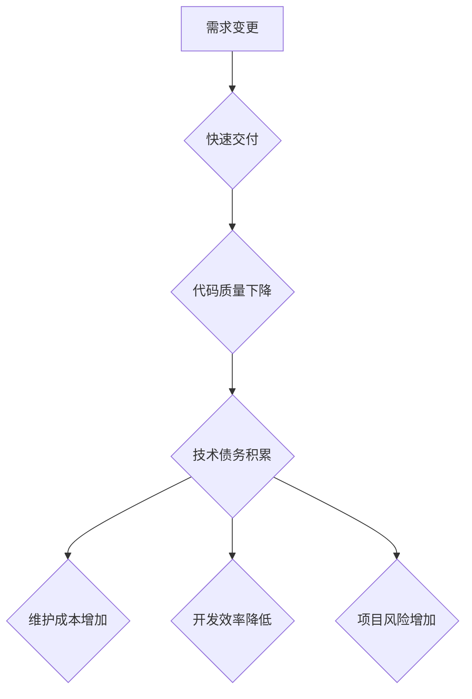

                 

## 程序员如何避免技术债务

> 关键词：技术债务、代码质量、软件架构、敏捷开发、持续集成

### 1. 背景介绍

在软件开发的世界里，技术债务是一个挥之不去的隐患。它就像一座沉睡的火山，看似平静，但一旦爆发，便会给项目带来巨大的灾难。技术债务是指为了快速交付软件而采取的短期解决方案，这些解决方案虽然能满足当前的需求，但往往会带来长期的维护成本和风险。

随着软件开发的复杂性不断增加，技术债务也日益成为一个严峻的挑战。程序员们在追求快速迭代和高效交付的过程中，往往会忽略代码质量和架构设计，最终导致技术债务的积累。

### 2. 核心概念与联系

技术债务的概念可以理解为在软件开发过程中，为了追求短期利益而牺牲长期价值的代价。它就像一个无形的负担，会随着时间的推移而加重，最终影响到项目的可维护性、可扩展性和安全性。

**技术债务的形成**

技术债务的形成是一个复杂的过程，通常涉及以下几个方面：

* **需求变化:** 软件需求的不断变化会导致代码的频繁修改，增加代码复杂度和维护成本。
* **时间压力:** 项目进度紧迫，程序员为了赶进度，往往会采用简陋的解决方案，忽略代码质量和架构设计。
* **技术选择:** 选择不合适的技术或工具，会导致代码难以维护和扩展。
* **团队协作:** 团队成员之间缺乏沟通和协作，导致代码风格不统一，难以理解和维护。

**技术债务的类型**

技术债务可以分为以下几种类型：

* **代码债务:** 代码结构混乱、逻辑冗余、缺乏注释等问题。
* **架构债务:** 架构设计不合理、模块化程度低、缺乏可扩展性等问题。
* **测试债务:** 测试覆盖率低、测试用例设计不完善等问题。
* **文档债务:** 文档不完整、文档更新滞后等问题。

**技术债务的危害**

技术债务的危害是显而易见的：

* **降低代码质量:** 技术债务会导致代码质量下降，增加代码错误的概率。
* **增加维护成本:** 技术债务会增加代码的维护成本，因为维护人员需要花费更多的时间和精力来理解和修复代码。
* **降低开发效率:** 技术债务会降低开发效率，因为开发人员需要花费更多的时间来解决代码问题。
* **增加项目风险:** 技术债务会增加项目风险，因为代码的稳定性和可靠性降低。

**Mermaid 流程图**



### 3. 核心算法原理 & 具体操作步骤

为了有效地管理技术债务，程序员需要掌握一些核心算法和技术，并将其应用到实际开发过程中。

**3.1 算法原理概述**

技术债务管理的核心算法可以概括为以下几个方面：

* **代码重构:** 通过分析和修改现有代码，提高代码质量和可读性。
* **架构演进:** 逐步改进软件架构，使其更加灵活、可扩展和可维护。
* **持续集成:** 通过自动化构建、测试和部署，确保代码质量和稳定性。
* **敏捷开发:** 通过迭代开发和持续反馈，快速响应需求变化，并及时解决技术债务。

**3.2 算法步骤详解**

**代码重构:**

1. **分析代码:** 识别代码中的问题，例如重复代码、复杂逻辑、难以理解的代码结构等。
2. **制定重构方案:** 根据代码分析结果，制定具体的重构方案，例如提取方法、合并类、重命名变量等。
3. **执行重构:** 按照重构方案，逐步修改代码，并进行测试验证。
4. **文档更新:** 更新代码注释和文档，以反映代码的修改。

**架构演进:**

1. **评估现有架构:** 分析现有架构的优缺点，识别架构中的瓶颈和问题。
2. **制定架构演进方案:** 根据架构评估结果，制定具体的架构演进方案，例如微服务化、云原生化等。
3. **逐步实施架构演进:** 按照架构演进方案，逐步修改系统架构，并进行测试验证。
4. **监控和调整:** 持续监控架构的性能和稳定性，并根据实际情况进行调整。

**持续集成:**

1. **设置自动化构建:** 使用构建工具自动构建代码，并生成可执行文件。
2. **设置自动化测试:** 使用测试工具自动执行测试用例，并生成测试报告。
3. **设置自动化部署:** 使用部署工具自动部署代码到测试环境和生产环境。
4. **持续监控:** 持续监控代码的构建、测试和部署状态，并及时解决问题。

**敏捷开发:**

1. **迭代开发:** 将项目划分为多个迭代周期，每个迭代周期完成一个可交付的功能模块。
2. **持续反馈:** 在每个迭代周期结束时，收集用户反馈，并根据反馈进行改进。
3. **团队协作:** 鼓励团队成员之间进行沟通和协作，共同解决问题。
4. **快速响应:** 快速响应需求变化，并及时解决技术债务。

**3.3 算法优缺点**

**代码重构:**

* **优点:** 可以提高代码质量和可读性，降低维护成本。
* **缺点:** 需要花费时间和精力，可能会影响项目进度。

**架构演进:**

* **优点:** 可以使系统更加灵活、可扩展和可维护。
* **缺点:** 需要进行大量的规划和设计，可能会带来风险。

**持续集成:**

* **优点:** 可以提高代码质量和稳定性，降低开发风险。
* **缺点:** 需要投入一定的成本和精力，需要团队成员具备一定的技能。

**敏捷开发:**

* **优点:** 可以快速响应需求变化，提高开发效率。
* **缺点:** 需要团队成员具备一定的协作能力和沟通能力。

**3.4 算法应用领域**

以上算法可以应用于各种软件开发领域，例如：

* **Web 开发:** 提高网站的性能、稳定性和可维护性。
* **移动应用开发:** 提高移动应用的性能、稳定性和用户体验。
* **企业级软件开发:** 提高企业级软件的可靠性和安全性。

### 4. 数学模型和公式 & 详细讲解 & 举例说明

技术债务的管理可以借助数学模型和公式进行量化分析和评估。

**4.1 数学模型构建**

我们可以构建一个简单的技术债务模型，将技术债务量化成一个数值，例如：

```
技术债务 = 代码复杂度 * 时间压力 * 技术风险
```

其中：

* 代码复杂度：可以根据代码行数、代码分支数、代码注释量等指标进行量化。
* 时间压力：可以根据项目进度、开发周期等指标进行量化。
* 技术风险：可以根据技术选型、技术成熟度等指标进行量化。

**4.2 公式推导过程**

这个模型的推导过程基于以下假设：

* 代码复杂度越高，技术债务越容易积累。
* 时间压力越大，程序员越容易采取简陋的解决方案，导致技术债务积累。
* 技术风险越高，技术债务的潜在危害越大。

**4.3 案例分析与讲解**

假设一个项目，代码复杂度为 10，时间压力为 5，技术风险为 3。根据公式，该项目的技术债务为：

```
技术债务 = 10 * 5 * 3 = 150
```

这个数值代表该项目的技术债务水平，数值越高，表示技术债务越严重。

### 5. 项目实践：代码实例和详细解释说明

为了更好地理解技术债务的管理，我们可以通过一个实际项目案例进行讲解。

**5.1 开发环境搭建**

我们使用 Java 语言和 Spring Boot 框架开发一个简单的电商平台。

**5.2 源代码详细实现**

我们先编写一个简单的商品管理模块，包含以下功能：

* 添加商品
* 查询商品
* 更新商品
* 删除商品

**5.3 代码解读与分析**

在开发过程中，为了快速交付功能，我们可能会采用一些简陋的解决方案，例如：

* 使用硬编码的方式存储商品信息，而不是使用数据库。
* 使用简单的字符串拼接的方式生成商品页面，而不是使用模板引擎。
* 缺乏单元测试，导致代码的稳定性和可靠性降低。

这些简陋的解决方案虽然能满足当前的需求，但会带来长期的维护成本和风险。

**5.4 运行结果展示**

我们运行代码，可以成功添加、查询、更新和删除商品。但是，由于代码质量问题，可能会出现以下问题：

* 商品信息存储不安全，容易被篡改。
* 商品页面生成效率低，用户体验差。
* 代码难以维护和扩展，需要花费大量时间和精力进行修改。

### 6. 实际应用场景

技术债务管理在实际应用场景中至关重要。

**6.1 案例分析**

例如，一个大型电商平台，每天处理数百万笔交易，如果技术债务积累过多，将会导致系统性能下降、稳定性降低，甚至出现宕机的情况，从而造成巨大的经济损失。

**6.2 未来应用展望**

随着软件开发的复杂性不断增加，技术债务管理将变得更加重要。未来，技术债务管理将会更加智能化、自动化，并与人工智能、机器学习等技术深度融合。

### 7. 工具和资源推荐

**7.1 学习资源推荐**

* 《代码简化》
* 《重构》
* 《敏捷软件开发》

**7.2 开发工具推荐**

* SonarQube
* JIRA
* Jenkins

**7.3 相关论文推荐**

* "Technical Debt: A Systematic Literature Review"
* "Managing Technical Debt in Agile Software Development"

### 8. 总结：未来发展趋势与挑战

**8.1 研究成果总结**

技术债务管理是一个不断发展和完善的领域。近年来，研究人员提出了许多新的技术和方法，例如：

* 代码质量自动评估工具
* 技术债务预测模型
* 技术债务管理流程

**8.2 未来发展趋势**

未来，技术债务管理将会更加智能化、自动化，并与人工智能、机器学习等技术深度融合。

**8.3 面临的挑战**

技术债务管理仍然面临一些挑战，例如：

* 如何量化技术债务
* 如何有效地管理技术债务
* 如何提高团队成员的技术债务意识

**8.4 研究展望**

未来，我们需要继续研究和探索新的技术和方法，以更好地管理技术债务，提高软件开发的质量和效率。

### 9. 附录：常见问题与解答

**9.1 技术债务和代码质量有什么关系？**

技术债务会降低代码质量。因为技术债务通常是由于为了快速交付而牺牲代码质量而产生的，会导致代码结构混乱、逻辑冗余、缺乏注释等问题。

**9.2 如何避免技术债务？**

* 编写高质量的代码
* 遵循良好的架构设计原则
* 进行持续集成和持续交付
* 采用敏捷开发方法

**9.3 如何解决技术债务？**

* 代码重构
* 架构演进
* 技术债务清偿计划


作者：禅与计算机程序设计艺术 / Zen and the Art of Computer Programming 
<end_of_turn>

