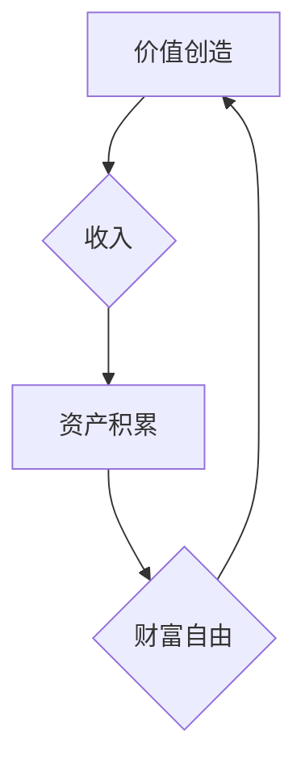

                 

## 程序员实现财富自由的秘诀

> 关键词：程序员、财富自由、技术栈、创业、投资、技能提升、个人品牌、高效学习

### 1. 背景介绍

在当今科技飞速发展的时代，程序员作为数字时代的基石，拥有着前所未有的机遇和挑战。随着软件需求的不断增长，程序员的职业前景一片光明，但想要真正实现财富自由，仅仅依靠薪资收入是不够的。程序员需要掌握更深层次的技能，拓展自己的视野，并善于利用自身的优势，才能在激烈的竞争中脱颖而出，最终实现财务上的独立和自由。

### 2. 核心概念与联系

程序员实现财富自由的核心概念在于 **“价值创造”** 和 **“资产积累”**。

* **价值创造:** 程序员可以通过开发高质量的软件产品、提供专业的技术服务、构建强大的技术平台等方式创造价值，并将其转化为收入。
* **资产积累:** 程序员可以通过投资、理财、创业等方式积累资产，使其不断增值，最终实现财富自由。

两者相互关联，形成一个良性循环。通过创造价值，程序员可以获得收入，并将其用于资产积累，从而进一步提升自身的价值创造能力。

**Mermaid 流程图:**



### 3. 核心算法原理 & 具体操作步骤

实现财富自由的“算法”并非一个具体的编程代码，而是指程序员需要掌握的技能组合和思维模式。

#### 3.1 算法原理概述

程序员实现财富自由的“算法”的核心原理在于：

* **持续学习:**  科技发展日新月异，程序员需要不断学习新技术、掌握新技能，才能保持竞争力。
* **价值导向:**  程序员需要专注于创造价值，开发有市场需求的软件产品或服务，才能获得可观的收入。
* **高效执行:**  程序员需要高效地执行任务，提高工作效率，才能在有限的时间内完成更多工作。
* **风险管理:**  程序员需要学会管理风险，避免过度投资或冒险，才能保障自身的财务安全。

#### 3.2 算法步骤详解

1. **明确目标:**  程序员需要明确自己的财富自由目标，例如想要实现多少收入、积累多少资产等。
2. **评估自身:**  程序员需要评估自身的技能、经验、资源等，确定自己的优势和劣势。
3. **选择方向:**  根据自身的评估结果，程序员可以选择不同的方向，例如自由职业、创业、投资等。
4. **学习技能:**  程序员需要学习与所选方向相关的技能，例如编程语言、项目管理、市场营销等。
5. **积累经验:**  程序员需要不断积累实践经验，提升自身的专业能力。
6. **建立网络:**  程序员需要建立人脉关系，拓展自己的资源和机会。
7. **管理风险:**  程序员需要学会管理风险，避免过度投资或冒险。
8. **持续优化:**  程序员需要不断优化自己的策略和方法，提高自身的效率和收益。

#### 3.3 算法优缺点

* **优点:**  程序员实现财富自由的“算法”具有灵活性和可定制性，可以根据自身的实际情况进行调整。
* **缺点:**  程序员实现财富自由需要付出大量的努力和时间，并面临着一定的风险。

#### 3.4 算法应用领域

程序员实现财富自由的“算法”适用于所有程序员，无论其工作经验、技术水平或职业目标。

### 4. 数学模型和公式 & 详细讲解 & 举例说明

实现财富自由是一个复杂的系统工程，可以利用数学模型和公式进行分析和预测。

#### 4.1 数学模型构建

我们可以构建一个简单的数学模型来描述程序员的财富积累过程：

**财富 = 收入 - 支出 + 投资收益**

其中：

* **收入:** 程序员的收入来源包括薪资、项目收入、投资收益等。
* **支出:** 程序员的支出包括生活开销、教育培训、投资成本等。
* **投资收益:** 程序员通过投资获得的收益，例如股票收益、基金收益、房产收益等。

#### 4.2 公式推导过程

我们可以通过对上述公式进行推导，得到程序员实现财富自由所需的条件：

**实现财富自由 = 收入 > 支出 + 投资收益**

这意味着程序员需要确保其收入大于支出和投资收益的总和，才能实现财富积累。

#### 4.3 案例分析与讲解

假设程序员的年收入为 20 万元，年支出为 10 万元，投资收益为 2 万元。

根据上述公式，程序员的年财富积累为 20 万 - 10 万 + 2 万 = 12 万元。

如果程序员希望在 10 年内实现财富自由，需要积累 1000 万元资产，则需要每年积累 1000 万 / 10 = 100 万元。

根据上述分析，程序员需要提高收入、降低支出或增加投资收益，才能实现财富自由的目标。

### 5. 项目实践：代码实例和详细解释说明

实现财富自由并非一蹴而就，需要程序员不断学习、实践和积累经验。以下是一个简单的项目实践案例，可以帮助程序员了解如何利用技术实现财富积累。

#### 5.1 开发环境搭建

* **操作系统:**  Windows、macOS 或 Linux
* **编程语言:**  Python
* **开发工具:**  VS Code、PyCharm 或 Sublime Text
* **库和框架:**  Flask、Django 或 FastAPI

#### 5.2 源代码详细实现

以下是一个简单的 Python 代码实例，演示如何使用 Flask 框架开发一个简单的博客网站：

```python
from flask import Flask, render_template

app = Flask(__name__)

@app.route('/')
def index():
    return render_template('index.html')

if __name__ == '__main__':
    app.run(debug=True)
```

#### 5.3 代码解读与分析

* **Flask:**  是一个轻量级的 Python Web 框架，用于开发 Web 应用。
* **render_template():**  函数用于渲染 HTML 模板。
* **index.html:**  是一个 HTML 文件，用于定义博客网站的首页内容。

#### 5.4 运行结果展示

运行上述代码后，程序员可以访问 http://127.0.0.1:5000/，查看博客网站的首页。

### 6. 实际应用场景

程序员可以将上述博客网站项目扩展为更复杂的应用，例如：

* **内容管理系统 (CMS):**  允许用户创建、编辑和发布博客文章、页面等内容。
* **社交平台:**  允许用户注册、登录、发布动态、评论等功能。
* **电商平台:**  允许用户浏览商品、下单、支付等功能。

通过开发这些应用，程序员可以获得收入，并积累财富。

### 6. 实际应用场景

程序员可以将上述博客网站项目扩展为更复杂的应用，例如：

* **内容管理系统 (CMS):**  允许用户创建、编辑和发布博客文章、页面等内容。
* **社交平台:**  允许用户注册、登录、发布动态、评论等功能。
* **电商平台:**  允许用户浏览商品、下单、支付等功能。

通过开发这些应用，程序员可以获得收入，并积累财富。

### 6.4 未来应用展望

随着人工智能、大数据、云计算等技术的不断发展，程序员将有机会开发出更具创新性和商业价值的应用，例如：

* **智能客服系统:**  利用自然语言处理技术，为用户提供智能化的客服服务。
* **个性化推荐系统:**  根据用户的行为数据，提供个性化的商品或内容推荐。
* **自动驾驶系统:**  利用机器学习技术，实现自动驾驶功能。

这些应用将为程序员带来更多的财富机遇。

### 7. 工具和资源推荐

#### 7.1 学习资源推荐

* **在线学习平台:**  Coursera、edX、Udemy
* **编程书籍:**  《Python编程从入门到实践》、《JavaScript高级程序设计》
* **技术博客:**  Hacker News、Medium、Stack Overflow

#### 7.2 开发工具推荐

* **代码编辑器:**  VS Code、PyCharm、Sublime Text
* **版本控制系统:**  Git
* **云平台:**  AWS、Azure、GCP

#### 7.3 相关论文推荐

* **深度学习:**  《ImageNet Classification with Deep Convolutional Neural Networks》
* **自然语言处理:**  《Attention Is All You Need》
* **机器学习:**  《Support Vector Machines》

### 8. 总结：未来发展趋势与挑战

#### 8.1 研究成果总结

程序员实现财富自由的“算法”是一个不断发展和完善的过程，需要程序员不断学习、实践和积累经验。

#### 8.2 未来发展趋势

未来，程序员实现财富自由的趋势将更加多元化，例如：

* **开源软件开发:**  参与开源项目，获得贡献奖励和商业机会。
* **区块链技术:**  开发基于区块链的应用，获得代币奖励和投资回报。
* **元宇宙:**  开发元宇宙应用，参与虚拟世界的建设和发展。

#### 8.3 面临的挑战

程序员实现财富自由也面临着一些挑战，例如：

* **技术更新迭代:**  需要不断学习新技术，才能保持竞争力。
* **市场竞争激烈:**  需要不断提升自身价值，才能脱颖而出。
* **风险管理:**  需要学会管理风险，避免过度投资或冒险。

#### 8.4 研究展望

未来，研究人员将继续探索程序员实现财富自由的更有效的方法，例如：

* **人工智能辅助开发:**  利用人工智能技术，提高程序员的开发效率。
* **个性化学习路径:**  根据程序员的个人情况，制定个性化的学习路径。
* **财富管理工具:**  开发专门为程序员设计的财富管理工具。

### 9. 附录：常见问题与解答

**Q1: 程序员如何才能实现财富自由？**

A1: 程序员可以通过持续学习、价值导向、高效执行和风险管理等方式实现财富自由。

**Q2: 程序员有哪些实现财富自由的方向？**

A2: 程序员可以选择自由职业、创业、投资等方向。

**Q3: 程序员需要掌握哪些技能才能实现财富自由？**

A3: 程序员需要掌握编程语言、项目管理、市场营销等技能。

**Q4: 程序员如何管理风险？**

A4: 程序员需要制定合理的投资计划，分散投资风险，避免过度投资或冒险。

**Q5: 程序员如何持续学习？**

A5: 程序员可以通过在线学习平台、编程书籍、技术博客等方式持续学习。


作者：禅与计算机程序设计艺术 / Zen and the Art of Computer Programming 
<end_of_turn>

