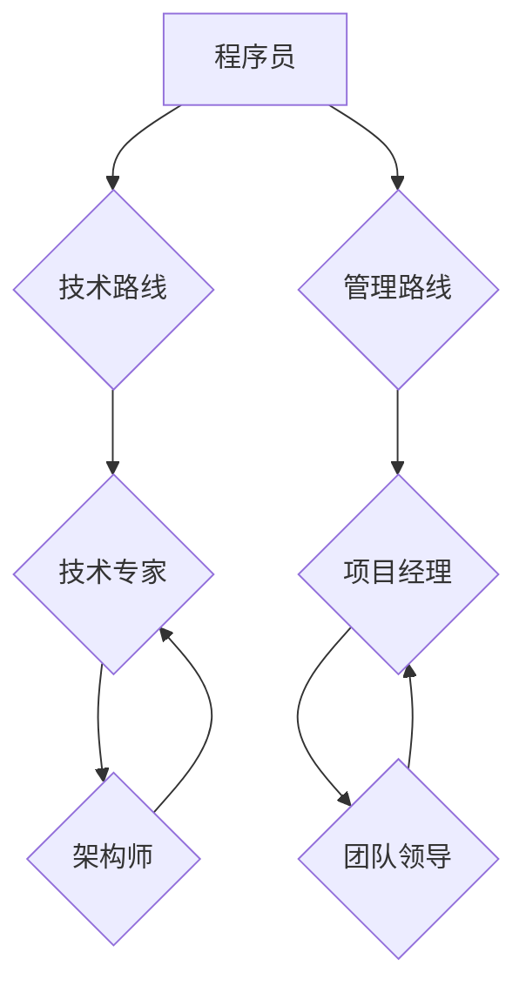

                 

## 程序员的职业规划：技术路线vs管理路线

> 关键词：程序员职业规划, 技术路线, 管理路线, 技术专家, 领导力, 职业发展,  软件架构, 项目管理

程序员，这个职业在现代社会中扮演着越来越重要的角色。随着科技的飞速发展，对程序员的需求也日益增长。然而，对于程序员来说，职业规划是一个至关重要的议题。如何选择合适的职业发展方向，才能在激烈的竞争中脱颖而出，实现个人价值？本文将探讨程序员的两种主要职业发展路线：技术路线和管理路线，并分析其各自的优缺点，帮助程序员做出更明智的职业选择。

## 1. 背景介绍

程序员的职业发展道路可以大致分为技术路线和管理路线两条主要路径。技术路线侧重于提升自身的技术能力，不断学习新技术，成为技术专家；而管理路线则侧重于领导和管理团队，负责项目规划、资源分配和团队协作。

近年来，随着软件开发模式的不断变化，对程序员的需求也发生了转变。除了传统的代码编写能力之外，程序员还需要具备更强的沟通能力、团队合作能力和解决问题的能力。因此，程序员的职业规划不再仅仅局限于技术领域，也需要考虑个人兴趣、能力和职业目标。

## 2. 核心概念与联系

### 2.1 技术路线

技术路线是指程序员专注于提升自身的技术能力，成为技术专家，并在技术领域不断深耕的职业发展路径。

**技术路线的特点：**

* **技术驱动：** 技术路线的核心是不断学习新技术，掌握最新的编程语言、框架和工具。
* **专业深度：** 技术路线强调专业知识的积累和深入理解，成为某个领域的专家。
* **个人成长：** 技术路线注重个人能力的提升，通过不断学习和实践，提升技术水平和解决问题的能力。

### 2.2 管理路线

管理路线是指程序员转而从事项目管理、团队领导等管理工作，负责项目规划、资源分配和团队协作的职业发展路径。

**管理路线的特点：**

* **领导力：** 管理路线需要具备领导能力，能够带领团队完成项目目标。
* **沟通能力：** 管理路线需要具备良好的沟通能力，能够与团队成员、客户和上级进行有效沟通。
* **战略思维：** 管理路线需要具备战略思维，能够制定项目计划、分配资源和评估风险。

**技术路线与管理路线的关系：**

技术路线和管理路线并非完全独立的，两者之间存在着一定的联系和交叉。

* **技术基础：** 管理路线需要一定的技术基础，才能更好地理解技术团队的工作内容和需求。
* **技术领导力：** 技术专家也可以成为技术领导者，带领团队开发和维护软件系统。
* **技术与管理的融合：** 随着软件开发模式的不断变化，技术和管理的融合趋势越来越明显，程序员需要具备一定的技术和管理能力，才能在未来的职业发展中保持竞争力。

**Mermaid 流程图：**



## 3. 核心算法原理 & 具体操作步骤

### 3.1 算法原理概述

算法是解决特定问题的一系列步骤或规则。程序员需要掌握各种算法原理，才能编写高效、可靠的代码。常见的算法类型包括排序算法、搜索算法、图算法等。

### 3.2 算法步骤详解

**举例：冒泡排序算法**

冒泡排序是一种简单而直观的排序算法，其原理是通过反复比较相邻元素，将较大的元素“冒泡”到排序后的末尾。

**步骤：**

1. 从数组的第一个元素开始，与相邻元素进行比较。
2. 如果相邻元素的顺序错误，则交换它们的顺序。
3. 重复步骤1和2，直到整个数组排序完成。

**代码示例（Python）：**

```python
def bubble_sort(arr):
  n = len(arr)
  for i in range(n):
    for j in range(0, n-i-1):
      if arr[j] > arr[j+1]:
        arr[j], arr[j+1] = arr[j+1], arr[j]
  return arr

# 测试代码
arr = [64, 34, 25, 12, 22, 11, 90]
sorted_arr = bubble_sort(arr)
print("排序后的数组:", sorted_arr)
```

### 3.3 算法优缺点

**冒泡排序的优缺点：**

* **优点：** 算法简单易懂，实现代码容易编写。
* **缺点：** 效率较低，时间复杂度为O(n^2)，不适合处理大型数据。

### 3.4 算法应用领域

冒泡排序算法虽然效率较低，但在某些特定场景下仍然可以应用，例如：

* **教育用途：** 用于讲解排序算法的基本原理。
* **小型数据排序：** 当数据量较小时，冒泡排序的效率可以接受。
* **稳定排序：** 冒泡排序是一种稳定的排序算法，可以保持原有顺序的相对位置。

## 4. 数学模型和公式 & 详细讲解 & 举例说明

### 4.1 数学模型构建

**时间复杂度模型：**

时间复杂度是衡量算法效率的重要指标，它描述了算法运行时间随输入数据大小变化的趋势。

**常见的时间复杂度：**

* **O(1)：** 常数时间复杂度，算法运行时间与输入数据大小无关。
* **O(log n)：** 对数时间复杂度，算法运行时间随输入数据大小的增加而增长缓慢。
* **O(n)：** 线性时间复杂度，算法运行时间与输入数据大小成正比。
* **O(n log n)：** 对数线性时间复杂度，例如快速排序算法。
* **O(n^2)：** 平方时间复杂度，例如冒泡排序算法。

### 4.2 公式推导过程

**冒泡排序的时间复杂度推导：**

* 外层循环执行n-1次。
* 内层循环在最坏情况下执行n-1次。
* 因此，总共执行了(n-1)*(n-1)次比较和交换操作。
* 时间复杂度为O(n^2)。

### 4.3 案例分析与讲解

**时间复杂度分析：**

* 对于输入数据量为1000的数组，冒泡排序的时间复杂度为O(1000^2) = O(1000000)。
* 对于输入数据量为10000的数组，冒泡排序的时间复杂度为O(10000^2) = O(100000000)。

可以看出，随着输入数据量的增加，冒泡排序的时间复杂度呈指数级增长，效率显著下降。

## 5. 项目实践：代码实例和详细解释说明

### 5.1 开发环境搭建

* **操作系统：** Windows、macOS、Linux
* **编程语言：** Python、Java、C++等
* **IDE：** PyCharm、Eclipse、VS Code等

### 5.2 源代码详细实现

**Python 代码示例（冒泡排序）：**

```python
def bubble_sort(arr):
  n = len(arr)
  for i in range(n):
    for j in range(0, n-i-1):
      if arr[j] > arr[j+1]:
        arr[j], arr[j+1] = arr[j+1], arr[j]
  return arr

# 测试代码
arr = [64, 34, 25, 12, 22, 11, 90]
sorted_arr = bubble_sort(arr)
print("排序后的数组:", sorted_arr)
```

### 5.3 代码解读与分析

* **函数定义：** `bubble_sort(arr)` 函数接受一个数组 `arr` 作为输入参数。
* **循环结构：** 使用两个嵌套循环实现冒泡排序算法。
* **比较和交换：** 比较相邻元素，如果顺序错误，则交换它们的顺序。
* **返回排序后的数组：** 函数返回排序后的数组 `sorted_arr`。

### 5.4 运行结果展示

```
排序后的数组: [11, 12, 22, 25, 34, 64, 90]
```

## 6. 实际应用场景

### 6.1 技术路线应用场景

* **软件开发工程师：** 负责编写和维护软件代码，需要具备扎实的编程基础和对特定技术领域的深入理解。
* **数据科学家：** 分析和处理海量数据，需要掌握数据挖掘、机器学习等算法和技术。
* **人工智能研究员：** 研究人工智能算法和模型，需要具备强大的数学和编程能力。

### 6.2 管理路线应用场景

* **项目经理：** 负责项目规划、资源分配和团队协作，需要具备良好的沟通能力和领导力。
* **产品经理：** 负责产品需求分析、设计和迭代，需要具备对用户需求的洞察力和市场趋势的把握。
* **技术架构师：** 负责软件系统的整体设计和架构，需要具备对技术领域的深厚理解和系统设计能力。

### 6.4 未来应用展望

随着科技的不断发展，程序员的职业发展道路将更加多元化和复杂化。

* **云计算和人工智能：** 云计算和人工智能将成为未来软件开发的重要趋势，程序员需要掌握相关的技术和知识。
* **跨领域融合：** 软件开发将与其他领域更加融合，例如生物信息学、金融科技等，程序员需要具备跨领域的知识和技能。
* **持续学习和成长：** 科技发展日新月异，程序员需要保持持续学习和成长的状态，才能在未来的职业道路上保持竞争力。

## 7. 工具和资源推荐

### 7.1 学习资源推荐

* **在线学习平台：** Coursera、edX、Udemy等
* **编程书籍：** 《代码的艺术》、《设计模式：复用面向对象软件的基础》等
* **技术博客和论坛：** CSDN、Stack Overflow等

### 7.2 开发工具推荐

* **代码编辑器：** VS Code、Sublime Text、Atom等
* **版本控制系统：** Git、GitHub等
* **调试工具：** GDB、PyCharm Debugger等

### 7.3 相关论文推荐

* **算法导论：** Thomas H. Cormen, Charles E. Leiserson, Ronald L. Rivest, Clifford Stein
* **设计模式：** Erich Gamma, Richard Helm, Ralph Johnson, John Vlissides

## 8. 总结：未来发展趋势与挑战

### 8.1 研究成果总结

本文探讨了程序员的两种主要职业发展路线：技术路线和管理路线，并分析了其各自的优缺点。

### 8.2 未来发展趋势

* 云计算和人工智能将成为未来软件开发的重要趋势。
* 软件开发将与其他领域更加融合。
* 程序员需要具备持续学习和成长的能力。

### 8.3 面临的挑战

* 科技发展日新月异，程序员需要不断学习新技术。
* 竞争日益激烈，程序员需要提升自身竞争力。
* 跨领域融合需要程序员具备更广泛的知识和技能。

### 8.4 研究展望

未来研究可以进一步探讨：

* 云计算和人工智能对程序员职业发展的影响。
* 跨领域融合对程序员技能需求的改变。
* 程序员职业发展路径的个性化定制。

## 9. 附录：常见问题与解答

**Q1：技术路线和管理路线哪个更好？**

**A1：** 没有绝对的好坏之分，选择哪条路线取决于个人的兴趣、能力和职业目标。

**Q2：如何选择合适的职业发展方向？**

**A2：** 可以根据自身兴趣、能力和职业目标进行选择，也可以咨询行业专家或进行职业测评。

**Q3：如何提升自身竞争力？**

**A3：** 持续学习新技术，提升专业技能，积累项目经验，拓展人脉关系。


作者：禅与计算机程序设计艺术 / Zen and the Art of Computer Programming 
<end_of_turn>

