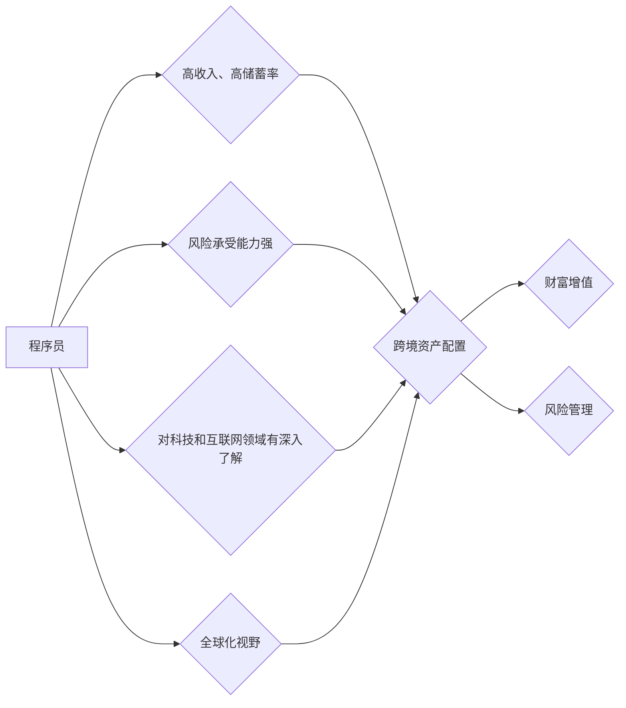

                 

## 程序员的跨境资产配置策略

> 关键词：跨境资产配置、程序员理财、加密货币、海外投资、税务规划、风险管理、分散投资

## 1. 背景介绍

在全球化加速发展的时代，程序员作为科技领域的领军人物，拥有着越来越高的收入水平和投资能力。然而，传统的国内资产配置策略往往难以满足程序员对财富增值和风险管理的双重需求。随着互联网技术的飞速发展，跨境投资逐渐成为程序员理财的新选择。

本文将从程序员的独特背景出发，探讨跨境资产配置的策略和方法，帮助程序员更好地管理和增值财富。

## 2. 核心概念与联系

### 2.1 跨境资产配置

跨境资产配置是指将资产分散投资于不同国家或地区的金融市场，以降低投资风险和提高投资收益。

### 2.2 程序员理财特点

程序员理财的特点主要体现在以下几个方面：

* **高收入、高储蓄率:** 程序员的收入水平普遍较高，并且具有较高的储蓄率。
* **风险承受能力强:** 程序员通常具有较强的风险承受能力，愿意承担一定的投资风险以追求更高的收益。
* **对科技和互联网领域有深入了解:** 程序员对科技和互联网领域有深入的了解，能够更好地把握投资机会。
* **全球化视野:** 程序员通常具有全球化的视野，愿意将投资范围扩展到海外市场。

### 2.3 跨境资产配置与程序员理财的联系

跨境资产配置可以有效满足程序员理财的特点，帮助他们实现财富增值和风险管理的目标。

**Mermaid 流程图:**



## 3. 核心算法原理 & 具体操作步骤

### 3.1 算法原理概述

跨境资产配置的核心算法原理是**分散投资**和**风险管理**。通过将资产分散投资于不同国家或地区的金融市场，可以降低单一市场风险，提高整体投资组合的稳定性。

### 3.2 算法步骤详解

1. **资产评估:** 评估程序员的资产状况、收入水平、风险承受能力和投资目标。
2. **风险偏好分析:** 根据程序员的风险偏好，确定合适的投资组合配置比例。
3. **市场调研:** 研究不同国家或地区的金融市场状况，选择具有投资潜力的市场。
4. **资产配置:** 根据风险偏好和市场调研结果，将资产配置到不同的投资标的，例如股票、债券、房地产、加密货币等。
5. **定期调整:** 定期评估投资组合的绩效，根据市场变化和个人需求进行调整。

### 3.3 算法优缺点

**优点:**

* **降低风险:** 分散投资可以有效降低单一市场风险。
* **提高收益:** 选择具有投资潜力的市场可以提高整体投资收益。
* **灵活多样:** 跨境资产配置可以根据个人需求灵活调整投资组合。

**缺点:**

* **复杂度高:** 跨境投资涉及多个国家或地区的法律法规和税务政策，操作复杂度较高。
* **信息获取困难:** 获取不同国家或地区的市场信息和投资数据较为困难。
* **汇率风险:** 跨境投资存在汇率风险，需要做好相应的风险管理。

### 3.4 算法应用领域

跨境资产配置的算法广泛应用于以下领域:

* **个人理财:** 程序员和其他高收入人群可以利用跨境资产配置策略来管理和增值财富。
* **机构投资:** 投资机构可以利用跨境资产配置策略来构建多元化的投资组合，降低整体风险。
* **财富管理:** 财富管理公司可以为客户提供跨境资产配置服务，帮助客户实现财富增值和风险管理的目标。

## 4. 数学模型和公式 & 详细讲解 & 举例说明

### 4.1 数学模型构建

**投资组合收益率模型:**

$$R_p = w_1R_1 + w_2R_2 + ... + w_nR_n$$

其中:

* $R_p$ 为投资组合收益率
* $w_i$ 为第 $i$ 个资产的权重
* $R_i$ 为第 $i$ 个资产的收益率

**风险度模型:**

$$σ_p = \sqrt{w_1^2σ_1^2 + w_2^2σ_2^2 + ... + w_n^2σ_n^2 + 2w_1w_2ρ_{12}σ_1σ_2 + ... + 2w_{n-1}w_nρ_{n-1,n}σ_{n-1}σ_n}$$

其中:

* $σ_p$ 为投资组合风险度
* $σ_i$ 为第 $i$ 个资产的标准差
* $ρ_{ij}$ 为第 $i$ 个资产和第 $j$ 个资产之间的相关系数

### 4.2 公式推导过程

以上公式的推导过程基于投资组合理论和统计学原理。

**投资组合收益率模型:**

投资组合收益率等于各个资产收益率的加权平均值，权重为每个资产在投资组合中的比例。

**风险度模型:**

投资组合风险度等于各个资产风险度的加权平均值，加权系数为每个资产在投资组合中的比例，并考虑各个资产之间的相关性。

### 4.3 案例分析与讲解

假设程序员A有100万元资金，计划进行跨境资产配置。

* 投资组合配置比例: 股票60%，债券20%，房地产10%，加密货币10%。
* 各个资产的预期收益率和风险度: 股票8%，标准差15%；债券4%，标准差5%；房地产6%，标准差10%；加密货币15%，标准差30%。
* 各个资产之间的相关系数: 股票与债券相关系数为-0.3，股票与房地产相关系数为0.2，股票与加密货币相关系数为0.1，其他资产之间的相关系数为0。

根据以上数据，可以利用公式计算程序员A投资组合的预期收益率和风险度。

## 5. 项目实践：代码实例和详细解释说明

### 5.1 开发环境搭建

* 操作系统: Windows/macOS/Linux
* 编程语言: Python
* 库依赖: pandas, numpy, matplotlib

### 5.2 源代码详细实现

```python
import pandas as pd
import numpy as np
import matplotlib.pyplot as plt

# 定义资产数据
assets = {
    '股票': {'收益率': 0.08, '风险度': 0.15},
    '债券': {'收益率': 0.04, '风险度': 0.05},
    '房地产': {'收益率': 0.06, '风险度': 0.10},
    '加密货币': {'收益率': 0.15, '风险度': 0.30},
}

# 定义投资组合配置比例
weights = {
    '股票': 0.6,
    '债券': 0.2,
    '房地产': 0.1,
    '加密货币': 0.1,
}

# 计算投资组合收益率
portfolio_return = np.sum([weights[asset] * assets[asset]['收益率'] for asset in assets])

# 计算投资组合风险度
portfolio_risk = np.sqrt(np.sum([weights[asset]**2 * assets[asset]['风险度']**2 for asset in assets]))

# 打印结果
print(f"投资组合收益率: {portfolio_return:.2%}")
print(f"投资组合风险度: {portfolio_risk:.2%}")

# 绘制投资组合收益率和风险度
plt.bar(assets.keys(), [assets[asset]['收益率'] for asset in assets], label='收益率')
plt.bar(assets.keys(), [assets[asset]['风险度'] for asset in assets], label='风险度', bottom=[assets[asset]['收益率'] for asset in assets])
plt.xlabel('资产')
plt.ylabel('收益率/风险度')
plt.legend()
plt.show()
```

### 5.3 代码解读与分析

以上代码实现了跨境资产配置的简单计算和可视化。

* 首先定义了资产数据和投资组合配置比例。
* 然后利用公式计算了投资组合收益率和风险度。
* 最后利用matplotlib库绘制了资产收益率和风险度的柱状图。

### 5.4 运行结果展示

运行代码后，程序会输出投资组合的收益率和风险度，并生成一个柱状图，展示各个资产的收益率和风险度。

## 6. 实际应用场景

### 6.1 程序员海外投资

程序员可以利用跨境资产配置策略，将部分资金投资于海外市场，例如美国、欧洲、亚洲等，以分散投资风险和追求更高的投资收益。

### 6.2 程序员加密货币投资

加密货币作为一种新兴的投资标的，具有较高的投资潜力，但也存在较大的风险。程序员可以利用跨境资产配置策略，将部分资金投资于加密货币，但需要做好风险管理。

### 6.3 程序员税务规划

跨境资产配置可以帮助程序员进行税务规划，例如利用海外税收优惠政策，降低税负。

### 6.4 未来应用展望

随着科技发展和全球化进程的加速，跨境资产配置将成为程序员理财的重要趋势。未来，跨境资产配置平台和工具将更加完善，程序员将能够更便捷地进行跨境投资。

## 7. 工具和资源推荐

### 7.1 学习资源推荐

* **书籍:** 《投资组合管理》、《金融市场与投资》、《跨境投资指南》
* **网站:** Investopedia, Seeking Alpha, Bloomberg
* **课程:** Coursera, edX, Udemy

### 7.2 开发工具推荐

* **编程语言:** Python, R
* **数据分析工具:** pandas, numpy, matplotlib
* **投资平台:** Robinhood, TD Ameritrade, Interactive Brokers

### 7.3 相关论文推荐

* **Efficient Frontier and Modern Portfolio Theory**
* **The Capital Asset Pricing Model**
* **International Portfolio Diversification**

## 8. 总结：未来发展趋势与挑战

### 8.1 研究成果总结

本文探讨了程序员跨境资产配置的策略和方法，介绍了核心算法原理、数学模型和代码实例，并分析了实际应用场景和未来发展趋势。

### 8.2 未来发展趋势

* **人工智能驱动的跨境资产配置:** 人工智能技术将被应用于跨境资产配置，帮助程序员进行更精准的投资决策。
* **区块链技术的应用:** 区块链技术将为跨境资产配置提供更安全、透明和高效的平台。
* **个性化跨境资产配置:** 随着数据分析技术的进步，跨境资产配置将更加个性化，满足不同程序员的投资需求。

### 8.3 面临的挑战

* **跨境监管复杂:** 跨境投资涉及多个国家或地区的法律法规和税务政策，监管复杂度较高。
* **信息获取困难:** 获取不同国家或地区的市场信息和投资数据较为困难。
* **汇率风险:** 跨境投资存在汇率风险，需要做好相应的风险管理。

### 8.4 研究展望

未来，我们将继续研究跨境资产配置的算法优化、风险管理策略和应用场景拓展，为程序员提供更有效的跨境投资解决方案。

## 9. 附录：常见问题与解答

**Q1: 跨境资产配置有哪些风险？**

**A1:** 跨境资产配置存在以下风险:

* **市场风险:** 不同国家或地区的市场波动性不同，投资组合可能受到市场风险的影响。
* **汇率风险:** 跨境投资存在汇率风险，汇率波动可能导致投资收益减少。
* **政治风险:** 政治不稳定可能影响投资环境，导致投资损失。
* **法律风险:** 跨境投资涉及多个国家或地区的法律法规，程序员需要了解相关法律风险。

**Q2: 如何进行跨境资产配置？**

**A2:** 程序员可以采取以下步骤进行跨境资产配置:

1. **评估自身情况:** 评估程序员的资产状况、收入水平、风险承受能力和投资目标。
2. **选择投资目标:** 选择具有投资潜力的海外市场，例如美国、欧洲、亚洲等。
3. **选择投资标的:** 选择合适的投资标的，例如股票、债券、房地产、加密货币等。
4. **制定投资组合:** 根据风险偏好和市场调研结果，制定合理的投资组合配置比例。
5. **选择投资平台:** 选择合适的跨境投资平台，例如Robinhood, TD Ameritrade, Interactive Brokers等。
6. **进行投资:** 通过投资平台进行跨境投资。
7. **定期调整:** 定期评估投资组合的绩效，根据市场变化和个人需求进行调整。

**Q3: 如何管理跨境资产配置风险？**

**A3:** 程序员可以采取以下措施管理跨境资产配置风险:

* **分散投资:** 将资产分散投资于不同国家或地区的金融市场，降低单一市场风险。
* **控制投资比例:** 控制投资比例，避免过度集中于单一资产或市场。
* **做好风险评估:** 了解不同国家或地区的市场风险和政治风险，做好风险评估。
* **选择合适的投资平台:** 选择信誉良好、监管严格的跨境投资平台。
* **定期调整:** 定期评估投资组合的绩效，根据市场变化和个人需求进行调整。


作者：禅与计算机程序设计艺术 / Zen and the Art of Computer Programming<end_of_turn>

