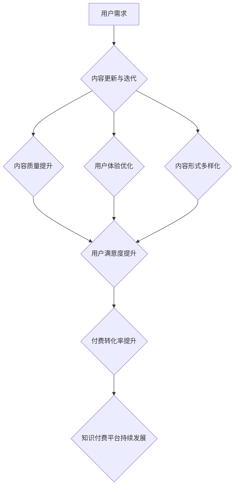

                 

## 程序员知识付费的内容更新与迭代策略

> 关键词：知识付费、程序员、内容更新、迭代策略、技术博客、在线课程、社区建设、用户反馈

## 1. 背景介绍

随着互联网的蓬勃发展和科技的日新月异，程序员的需求量持续增长，同时也催生了庞大的知识付费市场。程序员知识付费涵盖了广泛的领域，从基础编程语言到高级架构设计，从特定技术框架到软件开发最佳实践，应有尽有。

然而，知识付费市场竞争激烈，如何才能让内容保持新鲜感，吸引用户持续关注和付费，成为众多知识创作者面临的挑战。 

## 2. 核心概念与联系

**2.1 知识付费内容的生命周期**

知识付费内容的生命周期可以概括为以下几个阶段：

* **发布阶段:** 内容刚发布时，用户关注度最高，付费转化率也相对较高。
* **活跃阶段:** 用户对内容的学习和讨论活跃，内容更新频率较高，付费转化率保持稳定。
* **沉寂阶段:** 用户对内容的学习和讨论逐渐减少，内容更新频率降低，付费转化率下降。
* **淘汰阶段:** 内容过时，用户不再关注，付费转化率接近零。

**2.2 内容更新与迭代策略**

内容更新与迭代策略旨在延长知识付费内容的生命周期，保持用户活跃度和付费转化率。

**2.3 核心概念架构**



## 3. 核心算法原理 & 具体操作步骤

**3.1 算法原理概述**

内容更新与迭代算法的核心原理是根据用户反馈和市场趋势，不断优化和改进知识付费内容，使其保持与时俱进，满足用户需求。

**3.2 算法步骤详解**

1. **数据收集:** 收集用户对内容的反馈数据，包括评论、评分、学习进度、观看时长等。
2. **数据分析:** 对收集到的数据进行分析，识别用户需求、内容痛点和市场趋势。
3. **内容更新:** 根据数据分析结果，对内容进行更新和改进，包括添加新知识点、修改错误内容、优化学习路径等。
4. **迭代测试:** 将更新后的内容进行测试，收集用户反馈，并根据反馈进行进一步的优化。
5. **内容发布:** 将经过迭代测试的更新内容发布到平台，并进行推广和营销。

**3.3 算法优缺点**

* **优点:** 能够根据用户需求和市场趋势，不断优化和改进知识付费内容，提高用户满意度和付费转化率。
* **缺点:** 需要投入大量的人力和时间进行数据收集、分析和内容更新，并且需要不断迭代才能达到最佳效果。

**3.4 算法应用领域**

* 在线课程平台
* 技术博客
* 社区论坛
* 软件开发工具

## 4. 数学模型和公式 & 详细讲解 & 举例说明

**4.1 数学模型构建**

我们可以使用一个简单的数学模型来描述知识付费内容的生命周期：

$$
L(t) = L_0 * e^{-kt}
$$

其中：

* $L(t)$ 是内容在时间 $t$ 时的价值
* $L_0$ 是内容发布时的初始价值
* $k$ 是衰减系数，表示内容价值随时间的衰减速度
* $t$ 是时间

**4.2 公式推导过程**

该公式基于指数衰减模型，假设内容价值随着时间的推移呈指数衰减趋势。衰减系数 $k$ 可以通过历史数据进行估计，例如用户访问量、付费转化率等。

**4.3 案例分析与讲解**

假设一个在线课程发布时价值为 $L_0 = 100$，衰减系数 $k = 0.1$，则在一年后（$t = 1$）内容价值为：

$$
L(1) = 100 * e^{-0.1 * 1} \approx 90.48
$$

可见，一年后内容价值下降到原来的 90.48%。

## 5. 项目实践：代码实例和详细解释说明

**5.1 开发环境搭建**

* Python 3.x
* Jupyter Notebook

**5.2 源代码详细实现**

```python
import matplotlib.pyplot as plt
import numpy as np

# 设置初始价值和衰减系数
L0 = 100
k = 0.1

# 设置时间范围
t = np.linspace(0, 5, 100)

# 计算内容价值
L = L0 * np.exp(-k * t)

# 绘制曲线图
plt.plot(t, L)
plt.xlabel('时间 (年)')
plt.ylabel('内容价值')
plt.title('知识付费内容生命周期')
plt.show()
```

**5.3 代码解读与分析**

* 该代码使用 Python 的 NumPy 和 Matplotlib 库，模拟了知识付费内容的生命周期。
* `L0` 和 `k` 分别代表初始价值和衰减系数。
* `t` 是时间范围，从 0 到 5 年。
* `L` 是根据公式计算出的内容价值。
* 最后，代码绘制了内容价值随时间变化的曲线图。

**5.4 运行结果展示**

运行代码后，会生成一个曲线图，展示了知识付费内容价值随着时间的推移呈指数衰减的趋势。

## 6. 实际应用场景

**6.1 在线课程平台**

在线课程平台可以根据用户学习进度和反馈，对课程内容进行更新和迭代，例如添加新章节、修改错误内容、优化学习路径等。

**6.2 技术博客**

技术博客可以根据用户评论和阅读量，对文章内容进行更新和迭代，例如添加新案例、修改错误代码、优化文章结构等。

**6.3 社区论坛**

社区论坛可以根据用户讨论和提问，对知识库内容进行更新和迭代，例如添加新知识点、修改错误信息、优化搜索功能等。

**6.4 未来应用展望**

随着人工智能技术的不断发展，知识付费内容更新和迭代将更加智能化和自动化。例如，可以利用机器学习算法分析用户行为数据，自动生成个性化学习路径和内容推荐。

## 7. 工具和资源推荐

**7.1 学习资源推荐**

* **书籍:**
    * 《The Lean Startup》
    * 《Hooked》
    * 《Building a StoryBrand》
* **在线课程:**
    * Coursera: Data Science Specialization
    * Udemy: The Complete Web Development Bootcamp
    * edX: CS50's Introduction to Computer Science

**7.2 开发工具推荐**

* **内容管理系统 (CMS):** WordPress, Ghost, Drupal
* **在线学习平台:** Teachable, Thinkific, Kajabi
* **数据分析工具:** Google Analytics, Mixpanel, Amplitude

**7.3 相关论文推荐**

* **The Impact of Content Updates on User Engagement**
* **A Study on the Effectiveness of Content Iteration Strategies**
* **Personalized Content Recommendations for Knowledge Sharing Platforms**

## 8. 总结：未来发展趋势与挑战

**8.1 研究成果总结**

本文探讨了知识付费内容更新与迭代策略，并介绍了相关的数学模型、算法原理和实践案例。

**8.2 未来发展趋势**

* **人工智能驱动:** 利用人工智能技术，实现内容更新和迭代的自动化和智能化。
* **个性化定制:** 根据用户需求和学习风格，提供个性化的学习内容和路径。
* **沉浸式体验:** 利用虚拟现实 (VR) 和增强现实 (AR) 技术，打造更加沉浸式的学习体验。

**8.3 面临的挑战**

* **数据质量:** 需要收集高质量的用户反馈数据，才能有效地进行内容更新和迭代。
* **算法优化:** 需要不断优化算法模型，提高内容更新和迭代的效率和准确性。
* **用户粘性:** 需要不断创新内容形式和学习模式，提高用户粘性和付费转化率。

**8.4 研究展望**

未来，我们将继续研究知识付费内容更新与迭代的最佳实践，探索人工智能技术在内容更新和迭代领域的应用，并致力于打造更加优质、高效、个性化的知识付费平台。

## 9. 附录：常见问题与解答

**9.1 如何收集用户反馈数据？**

可以通过以下方式收集用户反馈数据：

* 在线问卷调查
* 用户评论和评分
* 学习进度和观看时长
* 社区论坛讨论

**9.2 如何分析用户反馈数据？**

可以使用数据分析工具，例如 Google Analytics、Mixpanel 和 Amplitude，对用户反馈数据进行分析，识别用户需求、内容痛点和市场趋势。

**9.3 如何进行内容更新和迭代？**

根据数据分析结果，对内容进行更新和改进，包括添加新知识点、修改错误内容、优化学习路径等。

**9.4 如何评估内容更新和迭代的效果？**

可以通过跟踪用户参与度、学习进度和付费转化率等指标，评估内容更新和迭代的效果。


作者：禅与计算机程序设计艺术 / Zen and the Art of Computer Programming 
<end_of_turn>

