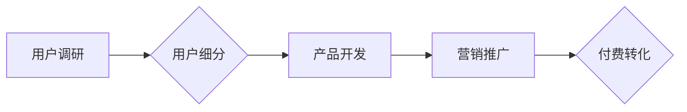

                 

## 程序员知识付费的用户细分与精准定位

> 关键词：程序员、知识付费、用户细分、精准定位、学习需求、付费意愿、市场趋势

### 1. 背景介绍

近年来，随着互联网技术的发展和普及，以及编程人才需求的不断增长，程序员知识付费市场呈现出蓬勃发展的态势。从在线课程、书籍、博客到线下培训，各种形式的知识付费内容层出不穷，为程序员提供学习和提升技能的平台。然而，在激烈的市场竞争中，如何精准定位目标用户，满足其个性化学习需求，并有效提升付费转化率，成为知识付费平台和内容创作者面临的共同挑战。

### 2. 核心概念与联系

**2.1 用户细分**

用户细分是指将目标用户群体根据其共同的特征和需求，划分为不同的细分市场。对于程序员知识付费市场而言，用户细分可以基于以下几个维度：

* **编程语言和技术栈:**  不同编程语言和技术栈的程序员，其学习需求和知识结构存在差异。例如，前端开发人员需要学习HTML、CSS、JavaScript等，而后端开发人员则需要掌握Java、Python、Node.js等。
* **工作经验和技能水平:**  初学者、中级程序员和高级工程师，其学习目标和知识深度不同。初学者需要掌握基础知识和技能，而经验丰富的程序员则更关注专业领域和高级技术。
* **学习目标和职业规划:**  程序员学习知识的动机和目标多样化，例如提升技能、转行、创业等。不同的学习目标对应着不同的知识需求和付费意愿。
* **学习方式和习惯:**  程序员的学习方式和习惯各不相同，有些人喜欢在线课程，有些人则更偏好书籍和博客。

**2.2 精准定位**

精准定位是指根据用户细分结果，针对不同的用户群体，提供个性化、差异化的知识付费产品和服务。精准定位的核心在于：

* **深入了解用户需求:** 通过用户调研、数据分析等方式，深入了解不同用户群体的学习目标、知识痛点、学习习惯等。
* **打造差异化产品:**  根据用户需求，开发针对性的课程、书籍、工具等知识付费产品，满足不同用户群体的个性化需求。
* **优化营销策略:**  根据用户细分特征，制定精准的营销策略，将产品推向目标用户群体，提高付费转化率。

**2.3 流程图**



### 3. 核心算法原理 & 具体操作步骤

**3.1 算法原理概述**

用户细分和精准定位的核心算法原理是基于数据分析和机器学习。通过收集用户行为数据、学习偏好数据、职业信息等，利用机器学习算法进行用户画像构建，并根据用户画像特征进行细分和精准定位。

**3.2 算法步骤详解**

1. **数据收集:** 收集用户行为数据、学习偏好数据、职业信息等，构建用户数据池。
2. **数据清洗和预处理:** 对收集到的数据进行清洗、转换和预处理，确保数据质量和格式一致性。
3. **特征提取:** 从用户数据中提取关键特征，例如编程语言偏好、学习时间、学习内容、职业信息等。
4. **用户画像构建:** 利用机器学习算法，如K-means聚类、决策树、神经网络等，对用户特征进行分析和聚类，构建用户画像。
5. **用户细分:** 根据用户画像特征，将用户群体划分为不同的细分市场。
6. **精准定位:**  针对不同的用户群体，开发个性化、差异化的知识付费产品和服务。

**3.3 算法优缺点**

* **优点:** 能够根据用户数据进行精准分析，实现用户细分和精准定位，提高付费转化率。
* **缺点:** 需要大量的数据支持，算法模型的构建和优化需要专业技术人员。

**3.4 算法应用领域**

* **教育培训:**  根据学生学习情况和兴趣，提供个性化学习方案和课程推荐。
* **电商平台:**  根据用户购买历史和浏览记录，推荐个性化商品和服务。
* **广告投放:**  根据用户兴趣和行为特征，精准投放广告，提高广告效果。

### 4. 数学模型和公式 & 详细讲解 & 举例说明

**4.1 数学模型构建**

用户细分和精准定位的数学模型通常基于聚类算法，例如K-means聚类算法。K-means算法的目标是将数据点划分为K个簇，使得每个数据点到其所属簇中心的距离最小。

**4.2 公式推导过程**

K-means算法的迭代过程如下：

1. **初始化:**  随机选择K个数据点作为初始簇中心。
2. **分配:**  将每个数据点分配到距离其最近的簇中心。
3. **更新:**  重新计算每个簇的中心点，作为新的簇中心。
4. **重复:**  重复步骤2和3，直到簇中心不再变化或达到最大迭代次数。

**4.3 案例分析与讲解**

假设我们有100个程序员的用户数据，其中包含编程语言偏好、学习时间、学习内容等特征。我们希望将这些用户划分为3个簇，即K=3。

1. **初始化:**  随机选择3个用户作为初始簇中心。
2. **分配:**  根据距离计算，将每个用户分配到距离其最近的簇中心。
3. **更新:**  重新计算每个簇的中心点，作为新的簇中心。
4. **重复:**  重复步骤2和3，直到簇中心不再变化。

最终，我们将得到3个用户簇，每个簇包含不同类型的程序员，例如：

* **簇1:**  初学者，主要学习基础编程语言和概念。
* **簇2:**  中级程序员，关注特定技术栈和项目开发。
* **簇3:**  高级工程师，关注架构设计、算法优化等高级技术。

### 5. 项目实践：代码实例和详细解释说明

**5.1 开发环境搭建**

* Python 3.x
* scikit-learn 库

**5.2 源代码详细实现**

```python
from sklearn.cluster import KMeans
import pandas as pd

# 加载用户数据
data = pd.read_csv('user_data.csv')

# 选择特征变量
features = ['programming_language', 'learning_time', 'learning_content']
X = data[features]

# 实例化KMeans模型
kmeans = KMeans(n_clusters=3, random_state=0)

# 训练模型
kmeans.fit(X)

# 获取聚类结果
labels = kmeans.labels_

# 将聚类结果添加到数据框中
data['cluster'] = labels

# 保存结果
data.to_csv('user_clusters.csv', index=False)
```

**5.3 代码解读与分析**

* 首先，我们加载用户数据，并选择需要进行聚类的特征变量。
* 然后，我们实例化KMeans模型，并设置聚类数量为3。
* 接着，我们训练模型，并将聚类结果存储在labels变量中。
* 最后，我们将聚类结果添加到数据框中，并保存结果文件。

**5.4 运行结果展示**

运行代码后，我们将得到一个包含用户数据和聚类结果的CSV文件。我们可以通过数据分析工具，例如Excel或Python的pandas库，来查看用户聚类结果，并进行进一步的分析和解读。

### 6. 实际应用场景

**6.1 在线学习平台**

* 根据用户学习历史和偏好，推荐个性化课程和学习路径。
* 为不同用户群体提供差异化的学习体验和服务。

**6.2 代码库和社区平台**

* 根据用户编程语言和技术栈偏好，推荐相关代码库和社区资源。
* 为不同用户群体提供针对性的技术支持和交流平台。

**6.3 职业发展平台**

* 根据用户技能水平和职业目标，推荐相关职位和培训机会。
* 为不同用户群体提供个性化的职业发展规划和指导。

**6.4 未来应用展望**

随着人工智能技术的不断发展，用户细分和精准定位将更加智能化和个性化。未来，我们可以期待：

* 基于深度学习算法，构建更精准的用户画像。
* 利用大数据分析，预测用户未来的学习需求和付费意愿。
* 开发更智能化的推荐系统，为用户提供更个性化的学习体验。

### 7. 工具和资源推荐

**7.1 学习资源推荐**

* **书籍:**
    * 《Python机器学习实战》
    * 《数据挖掘与数据分析》
* **在线课程:**
    * Coursera: 数据科学与机器学习
    * Udemy: Python机器学习

**7.2 开发工具推荐**

* **Python:**  数据分析和机器学习的常用语言。
* **scikit-learn:**  机器学习库，提供各种聚类算法。
* **pandas:**  数据分析和处理库。

**7.3 相关论文推荐**

* K-means Clustering Algorithm
* User Segmentation and Personalization in E-commerce

### 8. 总结：未来发展趋势与挑战

**8.1 研究成果总结**

用户细分和精准定位是程序员知识付费市场发展的重要趋势。通过数据分析和机器学习算法，我们可以实现对用户群体的精准分析和细分，并提供个性化、差异化的知识付费产品和服务。

**8.2 未来发展趋势**

未来，用户细分和精准定位将更加智能化和个性化。随着人工智能技术的不断发展，我们将看到：

* 基于深度学习算法，构建更精准的用户画像。
* 利用大数据分析，预测用户未来的学习需求和付费意愿。
* 开发更智能化的推荐系统，为用户提供更个性化的学习体验。

**8.3 面临的挑战**

* 数据质量和隐私保护:  用户数据质量和隐私保护是用户细分和精准定位的关键挑战。
* 算法模型的构建和优化:  需要专业技术人员进行算法模型的构建和优化，以确保模型的准确性和有效性。
* 用户体验和个性化:  需要不断提升用户体验，并提供更个性化的学习方案和服务。

**8.4 研究展望**

未来，我们将继续深入研究用户细分和精准定位的算法模型和技术，并探索更智能化、更个性化的知识付费模式，为程序员提供更优质的学习体验和服务。

### 9. 附录：常见问题与解答

**9.1 如何收集用户数据？**

可以通过以下方式收集用户数据:

* 用户注册信息
* 学习行为数据
* 课程评价和反馈
* 社区互动数据

**9.2 如何保证用户数据隐私？**

* 严格遵守数据隐私保护政策和法规。
* 对用户数据进行匿名化处理。
* 加强数据安全防护措施。

**9.3 如何选择合适的聚类算法？**

需要根据用户数据特点和业务需求选择合适的聚类算法。常见的聚类算法包括K-means、层次聚类、DBSCAN等。

**9.4 如何评估聚类结果的质量？**

可以通过以下指标评估聚类结果的质量:

* 簇内距离
* 簇间距离
* silhouette score


作者：禅与计算机程序设计艺术 / Zen and the Art of Computer Programming 
<end_of_turn>

