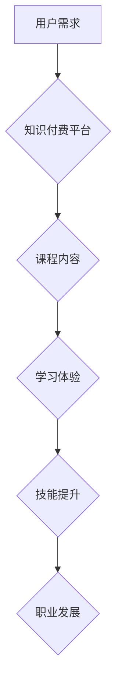

                 

## 程序员知识付费：打造体系化课程

> 关键词：知识付费、程序员、体系化课程、在线教育、技术技能、课程设计、市场营销

### 1. 背景介绍

近年来，随着互联网技术的发展和普及，知识付费行业蓬勃发展，成为一种新的经济模式。在这一趋势下，程序员知识付费也逐渐成为热门话题。程序员作为科技领域的核心力量，拥有高需求和高收入的职业前景，因此，他们对提升技术技能和获取专业知识的需求日益强烈。

传统教育模式的局限性，例如时间、地域、成本等因素，使得程序员难以获得高效便捷的学习机会。而知识付费平台则打破了这些限制，为程序员提供了一种灵活、高效、个性化的学习方式。

### 2. 核心概念与联系

**2.1 知识付费**

知识付费是指通过付费的方式获取知识、技能和服务的商业模式。它以知识为核心，以付费为驱动，以用户需求为导向，通过线上线下多种形式提供知识服务。

**2.2 程序员知识付费**

程序员知识付费是指程序员通过付费的方式获取编程技能、技术知识和行业经验的商业模式。它涵盖了各种形式的知识产品，例如在线课程、视频教程、电子书、代码库、技术博客等。

**2.3 体系化课程**

体系化课程是指按照一定的逻辑结构和知识体系，将相关知识点串联起来，形成一个完整的学习体系。它注重知识的深度和广度，并强调知识之间的相互关联和递进关系。

**2.4 在线教育平台**

在线教育平台是指提供在线学习资源和服务的平台，例如 Coursera、Udemy、Udacity 等。这些平台为知识付费提供了重要的技术支撑和传播渠道。

**Mermaid 流程图**

### 3. 核心算法原理 & 具体操作步骤

**3.1 算法原理概述**

在构建体系化课程时，需要采用合理的算法原理来组织和排列知识点，确保课程内容的逻辑性和完整性。常见的算法原理包括：

* **分层递进法:** 将知识点按照难度和关联性进行分层，从基础知识开始，逐步深入到高级知识。
* **主题模块化法:** 将课程内容按照主题进行划分，每个主题包含相关的知识点和学习任务。
* **案例驱动法:** 以实际案例为导向，将理论知识与实践应用相结合，提高学习的趣味性和实用性。

**3.2 算法步骤详解**

1. **需求分析:** 首先要明确目标用户的学习需求和目标，例如他们的编程基础、学习目标、时间安排等。
2. **知识点梳理:** 根据需求分析结果，梳理出相关的知识点，并确定知识点的层次结构和关联关系。
3. **课程结构设计:** 根据算法原理，将知识点按照一定的逻辑顺序排列，形成课程的整体结构。
4. **内容创作:** 根据课程结构，创作相应的学习内容，例如视频教程、文字讲解、代码示例等。
5. **测试与优化:** 在课程上线前，进行测试和优化，确保课程内容的准确性、完整性和易懂性。

**3.3 算法优缺点**

* **优点:** 能够有效地组织和排列知识点，提高课程的逻辑性和完整性，并根据用户需求进行个性化定制。
* **缺点:** 需要投入较多的时间和精力进行课程设计和内容创作，并且需要不断进行更新和优化。

**3.4 算法应用领域**

体系化课程的算法原理广泛应用于各种在线教育平台和课程开发领域，例如：

* **编程语言学习:** 构建 Python、Java、C++ 等编程语言的体系化课程。
* **软件开发:** 构建软件开发、数据库管理、网络安全等领域的体系化课程。
* **数据科学:** 构建数据分析、机器学习、深度学习等领域的体系化课程。

### 4. 数学模型和公式 & 详细讲解 & 举例说明

**4.1 数学模型构建**

在构建体系化课程时，可以采用数学模型来描述课程内容的结构和关系。例如，可以使用图论模型来表示知识点的层次结构和关联关系，可以使用树形结构来表示课程的学习路径。

**4.2 公式推导过程**

在课程设计过程中，可以利用数学公式来计算课程时长、学习难度、知识点之间的关联度等指标。例如，可以使用贝叶斯公式来计算不同知识点之间的相关性，可以使用时间复杂度公式来评估课程学习的效率。

**4.3 案例分析与讲解**

假设我们想要构建一个 Python 编程语言的体系化课程，我们可以使用以下数学模型来描述课程内容的结构：

* **知识点图:** 使用图论模型来表示 Python 编程语言的知识点，每个知识点是一个节点，知识点之间的关联关系用边表示。
* **学习路径树:** 使用树形结构来表示 Python 编程语言的学习路径，根节点是基础知识，分支节点是不同主题的知识点，叶子节点是具体的学习任务。

### 5. 项目实践：代码实例和详细解释说明

**5.1 开发环境搭建**

为了构建体系化课程，需要搭建相应的开发环境。常用的开发环境包括：

* **代码编辑器:** 例如 VS Code、Sublime Text 等。
* **版本控制系统:** 例如 Git、SVN 等。
* **在线教育平台:** 例如 Teachable、Thinkific 等。

**5.2 源代码详细实现**

在构建体系化课程时，需要编写相应的代码来实现课程的功能，例如：

* **课程内容管理:** 管理课程的知识点、学习任务、资源文件等。
* **用户管理:** 管理用户的注册、登录、学习进度等。
* **互动功能:** 提供课程评论、讨论、问答等互动功能。

**5.3 代码解读与分析**

需要对课程代码进行详细解读和分析，确保代码的正确性、安全性、可维护性等。

**5.4 运行结果展示**

需要对课程进行测试和运行，确保课程的功能正常运行，并根据测试结果进行优化和改进。

### 6. 实际应用场景

体系化课程在各个领域都有广泛的应用场景，例如：

* **企业培训:** 企业可以利用体系化课程来培训员工，提升员工的技能水平和工作效率。
* **个人学习:** 个人可以利用体系化课程来学习新的知识和技能，提升自身的竞争力。
* **教育机构:** 教育机构可以利用体系化课程来提供在线教育服务，扩大招生范围和教学覆盖面。

**6.4 未来应用展望**

随着人工智能、虚拟现实等技术的不断发展，体系化课程将更加智能化、个性化和互动化。未来，体系化课程将更加注重用户体验，提供更加沉浸式的学习体验。

### 7. 工具和资源推荐

**7.1 学习资源推荐**

* **在线课程平台:** Coursera、Udemy、Udacity 等。
* **技术博客:** Hacker News、Medium、Stack Overflow 等。
* **开源项目:** GitHub、GitLab 等。

**7.2 开发工具推荐**

* **代码编辑器:** VS Code、Sublime Text 等。
* **版本控制系统:** Git、SVN 等。
* **在线教育平台:** Teachable、Thinkific 等。

**7.3 相关论文推荐**

* **课程设计与开发:** "A Framework for Designing and Developing Online Courses"
* **知识图谱:** "Knowledge Graphs"
* **机器学习:** "Machine Learning"

### 8. 总结：未来发展趋势与挑战

**8.1 研究成果总结**

体系化课程的构建需要结合算法原理、数学模型、代码实现等多方面知识，并不断进行测试和优化。

**8.2 未来发展趋势**

未来，体系化课程将更加智能化、个性化和互动化，并更加注重用户体验。

**8.3 面临的挑战**

* **内容更新:** 随着技术的不断发展，课程内容需要不断更新和迭代。
* **用户体验:** 需要不断改进课程的用户体验，使其更加便捷、高效和有趣。
* **商业模式:** 需要探索更加可持续的商业模式，以支持课程的持续发展。

**8.4 研究展望**

未来，需要进一步研究体系化课程的构建方法、评估指标和商业模式，以推动体系化课程的发展和应用。

### 9. 附录：常见问题与解答

**9.1 如何选择合适的知识付费平台？**

需要根据自己的需求和目标选择合适的知识付费平台，例如：

* **平台规模:** 选择拥有大量用户和优质课程的平台。
* **课程质量:** 选择课程质量高、口碑好的平台。
* **价格体系:** 选择价格合理、性价比高的平台。

**9.2 如何评估体系化课程的质量？**

可以从以下几个方面评估体系化课程的质量：

* **课程内容:** 课程内容是否全面、准确、易懂？
* **学习体验:** 课程的学习体验是否良好？
* **师资力量:** 课程的授课老师是否具有丰富的经验和专业知识？
* **用户评价:** 课程的用户评价如何？

作者：禅与计算机程序设计艺术 / Zen and the Art of Computer Programming 
<end_of_turn>

