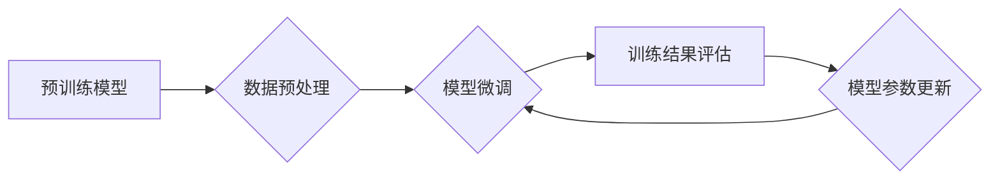

                 

## 第十四章：有监督微调 SFT 和聊天机器人

> 关键词：有监督微调，SFT，聊天机器人，自然语言处理，文本生成，预训练模型，参数调整

### 1. 背景介绍

近年来，深度学习在自然语言处理（NLP）领域取得了突破性进展，预训练语言模型（PLM）成为该领域的基石。这些模型，例如 BERT、GPT 和 T5，通过在海量文本数据上进行预训练，学习了丰富的语言表示和语法规则。然而，预训练模型通常需要针对特定下游任务进行微调才能达到最佳性能。

有监督微调（Supervised Fine-Tuning，SFT）是一种常用的微调方法，它利用标记数据来进一步训练预训练模型，使其能够更好地执行特定任务。例如，对于文本分类任务，我们可以使用标记好的文本数据对预训练模型进行微调，使其能够准确地识别文本的类别。

聊天机器人作为一种应用广泛的NLP应用，需要能够理解用户输入并生成自然流畅的回复。传统的聊天机器人通常依赖于规则或模板，难以应对复杂的用户交互。而基于预训练模型的聊天机器人，通过SFT微调，能够学习更丰富的语言知识和对话策略，从而提供更自然、更智能的对话体验。

### 2. 核心概念与联系

SFT微调的核心思想是利用标记数据来调整预训练模型的参数，使其在特定任务上表现更好。

**流程图：**



**核心概念：**

* **预训练模型:** 在海量文本数据上预先训练的语言模型，已经具备了基本的语言理解和生成能力。
* **标记数据:** 用于特定任务的训练数据，每个数据点都带有对应的标签或标注。
* **数据预处理:** 将标记数据转换为模型可理解的格式，例如词嵌入、句子编码等。
* **模型微调:** 使用标记数据对预训练模型进行训练，调整模型参数以提高特定任务的性能。
* **训练结果评估:** 使用验证集或测试集评估模型的性能，例如准确率、F1-score等。
* **模型参数更新:** 根据训练结果，更新模型参数以进一步提高性能。

### 3. 核心算法原理 & 具体操作步骤

#### 3.1  算法原理概述

SFT微调的核心是利用梯度下降算法来更新预训练模型的参数。

1. **初始化:** 将预训练模型的参数作为初始值。
2. **前向传播:** 将标记数据输入模型，得到模型的输出。
3. **损失函数:** 计算模型输出与真实标签之间的差异，使用损失函数衡量模型的错误程度。
4. **反向传播:** 计算损失函数对模型参数的梯度。
5. **参数更新:** 使用梯度下降算法更新模型参数，朝着降低损失函数的方向调整。

#### 3.2  算法步骤详解

1. **数据准备:** 收集并预处理标记数据，将其转换为模型可理解的格式。
2. **模型加载:** 加载预训练模型，将其参数作为初始值。
3. **模型微调:** 使用标记数据对模型进行训练，调整模型参数以降低损失函数。
4. **模型评估:** 使用验证集或测试集评估模型的性能，并根据评估结果调整训练参数。
5. **模型保存:** 保存训练好的模型参数。

#### 3.3  算法优缺点

**优点:**

* **性能提升:** SFT微调可以显著提升预训练模型在特定任务上的性能。
* **数据效率:** 相比于从头训练模型，SFT微调只需要少量标记数据即可达到较好的效果。
* **易于实现:** SFT微调的实现相对简单，可以使用现有的深度学习框架进行操作。

**缺点:**

* **过拟合风险:** 如果标记数据量不足，模型容易过拟合，在未见过的数据上表现不佳。
* **计算资源消耗:** 微调大型预训练模型需要大量的计算资源。
* **数据标注成本:** 标记数据需要人工标注，成本较高。

#### 3.4  算法应用领域

SFT微调广泛应用于各种NLP任务，例如：

* **文本分类:** 识别文本的类别，例如情感分析、主题分类等。
* **文本生成:** 生成自然流畅的文本，例如机器翻译、文本摘要等。
* **问答系统:** 回答用户提出的问题，例如搜索引擎、聊天机器人等。
* **对话系统:** 进行自然对话，例如虚拟助手、客服机器人等。

### 4. 数学模型和公式 & 详细讲解 & 举例说明

#### 4.1  数学模型构建

SFT微调的核心是使用一个损失函数来衡量模型预测结果与真实标签之间的差异。常用的损失函数包括交叉熵损失、平方损失等。

**交叉熵损失:**

$$
L_{CE} = -\sum_{i=1}^{N} y_i \log(\hat{y}_i)
$$

其中：

* $N$ 是样本数量。
* $y_i$ 是真实标签。
* $\hat{y}_i$ 是模型预测的概率。

**平方损失:**

$$
L_{MSE} = \frac{1}{N} \sum_{i=1}^{N} (y_i - \hat{y}_i)^2
$$

其中：

* $N$ 是样本数量。
* $y_i$ 是真实标签。
* $\hat{y}_i$ 是模型预测的值。

#### 4.2  公式推导过程

交叉熵损失的推导过程如下：

1. 假设模型输出一个概率分布 $p(y)$，其中 $y$ 是类别标签。
2. 真实标签为 $y_i$。
3. 交叉熵损失定义为真实分布与模型预测分布之间的差异，即：

$$
L_{CE} = -\sum_{i=1}^{N} y_i \log(p(y_i))
$$

#### 4.3  案例分析与讲解

假设我们有一个文本分类任务，需要将文本分类为正向情感或负向情感。我们可以使用预训练模型 BERT 进行 SFT 微调。

1. **数据准备:** 收集并预处理标记好的文本数据，每个数据点包含文本内容和情感标签（正向或负向）。
2. **模型加载:** 加载预训练的 BERT 模型。
3. **模型微调:** 使用标记数据对 BERT 模型进行训练，使用交叉熵损失函数来衡量模型性能。
4. **模型评估:** 使用验证集评估模型的性能，例如准确率、F1-score等。
5. **模型保存:** 保存训练好的 BERT 模型。

### 5. 项目实践：代码实例和详细解释说明

#### 5.1  开发环境搭建

* Python 3.7+
* PyTorch 或 TensorFlow
* CUDA 和 cuDNN (可选，用于GPU加速)

#### 5.2  源代码详细实现

```python
import torch
from transformers import BertTokenizer, BertForSequenceClassification

# 加载预训练模型和词典
model_name = "bert-base-uncased"
tokenizer = BertTokenizer.from_pretrained(model_name)
model = BertForSequenceClassification.from_pretrained(model_name, num_labels=2)

# 数据加载和预处理
# ...

# 定义训练函数
def train(model, train_loader, optimizer, criterion):
    model.train()
    for batch in train_loader:
        input_ids = batch["input_ids"].to(device)
        attention_mask = batch["attention_mask"].to(device)
        labels = batch["labels"].to(device)

        outputs = model(input_ids=input_ids, attention_mask=attention_mask, labels=labels)
        loss = outputs.loss

        optimizer.zero_grad()
        loss.backward()
        optimizer.step()

# 定义评估函数
def evaluate(model, eval_loader, criterion):
    model.eval()
    total_loss = 0
    for batch in eval_loader:
        input_ids = batch["input_ids"].to(device)
        attention_mask = batch["attention_mask"].to(device)
        labels = batch["labels"].to(device)

        outputs = model(input_ids=input_ids, attention_mask=attention_mask, labels=labels)
        loss = outputs.loss
        total_loss += loss.item()

    return total_loss / len(eval_loader)

# 训练和评估模型
# ...
```

#### 5.3  代码解读与分析

* 代码首先加载预训练模型和词典。
* 然后定义训练和评估函数，分别用于训练和评估模型性能。
* 训练函数使用梯度下降算法更新模型参数，评估函数计算模型在验证集上的损失值。
* 最后，训练和评估模型，并保存训练好的模型。

#### 5.4  运行结果展示

训练完成后，可以使用测试集评估模型的性能，例如准确率、F1-score等。

### 6. 实际应用场景

#### 6.1  聊天机器人

SFT微调可以用于训练更智能的聊天机器人，使其能够更好地理解用户意图并生成自然流畅的回复。例如，我们可以使用预训练模型 GPT-3 进行 SFT微调，使其能够进行更自然、更人性化的对话。

#### 6.2  文本分类

SFT微调可以用于训练文本分类模型，例如情感分析、主题分类等。例如，我们可以使用预训练模型 BERT 进行 SFT微调，使其能够准确地识别文本的情感倾向。

#### 6.3  问答系统

SFT微调可以用于训练问答系统，使其能够更准确地回答用户提出的问题。例如，我们可以使用预训练模型 RoBERTa 进行 SFT微调，使其能够更好地理解问题和找到相关的答案。

#### 6.4  未来应用展望

随着预训练模型的不断发展和SFT微调技术的进步，其应用场景将会更加广泛，例如：

* **个性化推荐:** 根据用户的喜好和行为，提供个性化的商品推荐。
* **自动写作:** 自动生成新闻报道、小说、诗歌等文本内容。
* **机器翻译:** 实现更高质量的机器翻译，突破语言障碍。
* **代码生成:** 自动生成代码，提高开发效率。

### 7. 工具和资源推荐

#### 7.1  学习资源推荐

* **书籍:**
    * 《深度学习》 by Ian Goodfellow, Yoshua Bengio, and Aaron Courville
    * 《自然语言处理》 by Dan Jurafsky and James H. Martin
* **在线课程:**
    * Coursera: Natural Language Processing Specialization
    * Stanford CS224N: Natural Language Processing with Deep Learning

#### 7.2  开发工具推荐

* **PyTorch:** https://pytorch.org/
* **TensorFlow:** https://www.tensorflow.org/
* **Hugging Face Transformers:** https://huggingface.co/transformers/

#### 7.3  相关论文推荐

* **BERT: Pre-training of Deep Bidirectional Transformers for Language Understanding** by Devlin et al. (2018)
* **GPT: Generative Pre-trained Transformer** by Radford et al. (2018)
* **T5: Text-to-Text Transfer Transformer** by Raffel et al. (2019)

### 8. 总结：未来发展趋势与挑战

#### 8.1  研究成果总结

SFT微调技术取得了显著的成果，在各种NLP任务上都取得了优异的性能。预训练模型的规模不断扩大，微调方法也更加 sophisticated，例如Prompt Engineering、Adapter Tuning等。

#### 8.2  未来发展趋势

* **更强大的预训练模型:** 预训练模型的规模和能力将继续提升，例如千亿参数甚至万亿参数的模型。
* **更有效的微调方法:** 研究更有效的微调方法，例如参数共享、知识蒸馏等，以降低微调成本和提高效率。
* **跨模态微调:** 将文本与其他模态（例如图像、音频）进行联合微调，构建更全面的理解模型。

#### 8.3  面临的挑战

* **数据标注成本:** 高质量的标记数据仍然是微调的关键，数据标注成本仍然较高。
* **模型可解释性:** 预训练模型的内部机制复杂，难以解释模型的决策过程，这限制了模型的应用场景。
* **公平性和偏见:** 预训练模型可能存在公平性和偏见问题，需要进行更深入的研究和解决措施。

#### 8.4  研究展望

未来，SFT微调技术将继续发展，推动NLP领域的进步。研究者将致力于开发更强大的预训练模型、更有效的微调方法、以及解决模型公平性和可解释性问题的方法。


### 9. 附录：常见问题与解答

**Q1: SFT微调和迁移学习有什么区别？**

**A1:** SFT微调是一种迁移学习的范式，它利用预训练模型的知识来完成特定任务。迁移学习更广泛的概念，包括SFT微调以及其他迁移学习方法，例如知识蒸馏、域自适应等。

**Q2: 如何选择合适的预训练模型？**

**A2:** 选择合适的预训练模型取决于具体的任务和数据特点。例如，对于文本分类任务，BERT和RoBERTa是不错的选择；对于文本生成任务，GPT-3和T5是更合适的选项。

**Q3: 如何评估SFT微调的效果？**

**A3:** 可以使用验证集或测试集评估SFT微调的效果，常用的评估指标包括准确率、F1-score、BLEU等。

**Q4: 如何解决SFT微调过拟合问题？**

**A4:** 可以使用正则化技术、数据增强、早停等方法来解决SFT微调过拟合问题。

**Q5: SFT微调需要多少计算资源？**

**A5:** SFT微调所需的计算资源取决于预训练模型的大小、数据量和训练时间等因素。一般来说，微调大型预训练模型需要大量的计算资源，例如GPU集群。


作者：禅与计算机程序设计艺术 / Zen and the Art of Computer Programming<end_of_turn>

