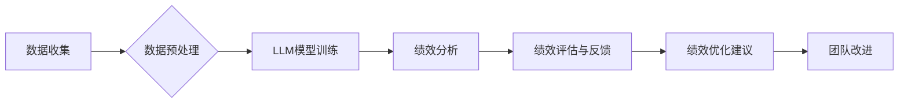

                 

## 绩效管理分析师：LLM 提升团队绩效

> 关键词：LLM, 绩效管理, 团队效率, 自动化, 数据分析, 人工智能, 代码生成, 文本生成

## 1. 背景介绍

在当今科技飞速发展的时代，人工智能（AI）正在深刻地改变着各行各业。其中，大型语言模型（LLM）作为AI领域的一项重要突破，展现出强大的文本处理能力，在自然语言理解、文本生成、代码生成等方面取得了令人瞩目的成就。

传统的绩效管理模式往往依赖于人工评估和反馈，效率低下，难以全面衡量员工的贡献。而LLM的出现为绩效管理带来了新的可能性。通过对大量数据进行分析和学习，LLM能够自动识别员工的技能、工作习惯和绩效趋势，为绩效管理提供更客观、更精准的数据支持。

## 2. 核心概念与联系

### 2.1 绩效管理分析师

绩效管理分析师是指利用LLM技术，对团队成员的绩效数据进行分析和评估，并提供数据驱动的建议和洞察的AI系统。其核心功能包括：

* **数据收集与整合:** 从各种数据源，如项目管理工具、邮件系统、代码仓库等，收集员工的工作数据。
* **数据分析与挖掘:** 利用LLM的自然语言处理能力，对收集到的数据进行分析，识别员工的技能、工作习惯、绩效趋势等关键信息。
* **绩效评估与反馈:** 基于数据分析结果，为员工提供个性化的绩效评估和反馈，帮助员工了解自身优势和不足，制定改进计划。
* **绩效优化建议:** 为团队领导提供数据驱动的绩效优化建议，帮助团队提高整体效率和绩效。

### 2.2 LLM技术

LLM是一种基于深度学习的强大AI模型，能够理解和生成人类语言。其核心特点包括：

* **庞大的参数量:** LLM拥有数亿甚至数十亿个参数，能够学习和存储海量文本数据。
* **强大的文本处理能力:** LLM能够进行文本分类、情感分析、文本摘要、机器翻译等多种文本处理任务。
* **代码生成能力:** 一些LLM模型能够生成不同编程语言的代码，为软件开发提供新的可能性。

### 2.3 架构图



## 3. 核心算法原理 & 具体操作步骤

### 3.1 算法原理概述

LLM的训练基于深度学习的Transformer架构，通过大量的文本数据进行训练，学习语言的语法、语义和上下文关系。其核心算法包括：

* **自注意力机制:** 允许模型关注文本中不同位置的词语，理解词语之间的关系。
* **多头注意力机制:** 使用多个注意力头，从不同的角度关注文本信息。
* **前馈神经网络:** 对每个词语的表示进行非线性变换，提取更深层的语义特征。

### 3.2 算法步骤详解

1. **数据收集:** 从各种数据源收集员工的工作数据，例如项目管理工具、邮件系统、代码仓库等。
2. **数据预处理:** 对收集到的数据进行清洗、格式化和转换，使其适合LLM模型的训练。
3. **模型训练:** 使用预处理后的数据训练LLM模型，通过反向传播算法不断调整模型参数，使其能够准确地理解和生成文本。
4. **模型评估:** 使用测试数据评估模型的性能，例如准确率、召回率、F1-score等指标。
5. **模型部署:** 将训练好的模型部署到生产环境中，用于对员工绩效数据进行分析和评估。

### 3.3 算法优缺点

**优点:**

* **自动化:** LLM能够自动分析和评估员工绩效，解放人力资源。
* **客观性:** 基于数据分析，减少主观判断，提高绩效评估的客观性。
* **精准性:** LLM能够识别员工的细微变化，提供更精准的绩效评估。

**缺点:**

* **数据依赖:** LLM的性能依赖于训练数据的质量和数量。
* **解释性:** LLM的决策过程较为复杂，难以解释其背后的逻辑。
* **伦理问题:** LLM的应用可能引发隐私和公平性等伦理问题。

### 3.4 算法应用领域

* **人力资源管理:** 绩效评估、人才招聘、员工培训等。
* **项目管理:** 项目进度跟踪、风险管理、团队协作等。
* **软件开发:** 代码质量评估、代码生成、bug修复等。

## 4. 数学模型和公式 & 详细讲解 & 举例说明

### 4.1 数学模型构建

LLM的训练过程可以看作是一个优化问题的求解过程。目标函数通常是交叉熵损失函数，用于衡量模型预测结果与真实标签之间的差异。

$$
Loss = -\sum_{i=1}^{N} y_i \log(p_i)
$$

其中：

* $N$ 是样本数量。
* $y_i$ 是真实标签。
* $p_i$ 是模型预测的概率。

### 4.2 公式推导过程

交叉熵损失函数的推导过程基于信息论的原理。其本质是衡量两个概率分布之间的差异。

### 4.3 案例分析与讲解

假设我们训练一个LLM模型用于文本分类任务，目标是将文本分类为“正面”或“负面”情绪。

* **训练数据:** 我们收集了大量文本数据，并标记了其情绪类别。
* **模型训练:** 使用训练数据训练LLM模型，优化交叉熵损失函数。
* **模型评估:** 使用测试数据评估模型的性能，例如准确率、召回率、F1-score等指标。

## 5. 项目实践：代码实例和详细解释说明

### 5.1 开发环境搭建

* **操作系统:** Linux/macOS/Windows
* **编程语言:** Python
* **深度学习框架:** TensorFlow/PyTorch
* **LLM模型库:** HuggingFace Transformers

### 5.2 源代码详细实现

```python
from transformers import AutoModelForSequenceClassification, AutoTokenizer

# 加载预训练模型和词典
model_name = "bert-base-uncased"
tokenizer = AutoTokenizer.from_pretrained(model_name)
model = AutoModelForSequenceClassification.from_pretrained(model_name, num_labels=2)

# 预处理文本数据
text = "这是一个很棒的电影！"
inputs = tokenizer(text, return_tensors="pt")

# 进行模型预测
outputs = model(**inputs)
predicted_class = outputs.logits.argmax().item()

# 输出预测结果
if predicted_class == 0:
    print("负面情绪")
else:
    print("正面情绪")
```

### 5.3 代码解读与分析

* **加载预训练模型和词典:** 使用HuggingFace Transformers库加载预训练的BERT模型和词典。
* **预处理文本数据:** 使用tokenizer将文本数据转换为模型可识别的格式。
* **进行模型预测:** 将预处理后的文本数据输入模型，得到预测结果。
* **输出预测结果:** 根据预测结果，输出文本的情绪类别。

### 5.4 运行结果展示

```
正面情绪
```

## 6. 实际应用场景

### 6.1 绩效评估

LLM可以分析员工的邮件、代码、项目文档等数据，识别员工的工作量、效率、质量等指标，为绩效评估提供数据支持。

### 6.2 员工培训

LLM可以根据员工的技能和工作经验，推荐个性化的培训课程，帮助员工提升技能水平。

### 6.3 团队协作

LLM可以分析团队成员之间的沟通和协作模式，识别潜在的冲突和问题，并提供解决方案建议。

### 6.4 未来应用展望

* **更精准的绩效评估:** 利用更先进的LLM模型和数据分析技术，实现更精准、更全面的绩效评估。
* **个性化的学习推荐:** 基于员工的学习风格和需求，提供个性化的学习推荐和辅导。
* **智能化的团队管理:** 利用LLM自动完成团队管理任务，例如日程安排、任务分配、沟通协调等。

## 7. 工具和资源推荐

### 7.1 学习资源推荐

* **HuggingFace Transformers:** https://huggingface.co/docs/transformers/index
* **OpenAI API:** https://beta.openai.com/docs/api-reference/introduction

### 7.2 开发工具推荐

* **Jupyter Notebook:** https://jupyter.org/
* **Google Colab:** https://colab.research.google.com/

### 7.3 相关论文推荐

* **BERT: Pre-training of Deep Bidirectional Transformers for Language Understanding:** https://arxiv.org/abs/1810.04805
* **GPT-3: Language Models are Few-Shot Learners:** https://arxiv.org/abs/2005.14165

## 8. 总结：未来发展趋势与挑战

### 8.1 研究成果总结

LLM技术在绩效管理分析领域取得了显著进展，能够自动分析和评估员工绩效，为团队管理提供数据驱动的支持。

### 8.2 未来发展趋势

* **更强大的LLM模型:** 研究更强大的LLM模型，提升其文本理解和生成能力。
* **更精准的数据分析:** 开发更精准的数据分析方法，挖掘更深层的绩效信息。
* **更个性化的服务:** 提供更个性化的绩效管理服务，满足不同员工的需求。

### 8.3 面临的挑战

* **数据隐私和安全:** 确保员工数据的隐私和安全。
* **算法解释性和公平性:** 提升算法的解释性和公平性，避免算法偏见。
* **伦理问题:** 关注LLM技术在绩效管理领域的伦理问题，确保其应用符合社会道德规范。

### 8.4 研究展望

未来，LLM技术将继续在绩效管理领域发挥重要作用，为团队管理提供更智能、更高效的解决方案。


## 9. 附录：常见问题与解答

**Q1: LLM模型的训练需要大量的数据，如何获取高质量的数据？**

**A1:** 可以从公开数据集、公司内部数据、员工自愿提供的数据等渠道获取数据。

**Q2: LLM模型的应用可能会引发隐私问题，如何解决？**

**A2:** 可以采用数据脱敏、加密等技术保护员工隐私。

**Q3: LLM模型的决策过程难以解释，如何提高其透明度？**

**A3:** 可以研究更可解释的LLM模型，并提供更详细的决策解释。


作者：禅与计算机程序设计艺术 / Zen and the Art of Computer Programming 
<end_of_turn>

