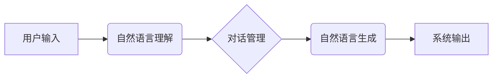

                 

## 自然语言处理在对话系统中的应用

> 关键词：自然语言处理，对话系统，机器学习，深度学习，BERT，GPT，情感分析，意图识别，文本生成

## 1. 背景介绍

随着人工智能技术的飞速发展，对话系统逐渐成为人们与计算机交互的重要方式。对话系统能够理解人类的自然语言，并以自然语言进行回复，从而提供更便捷、更人性化的服务体验。自然语言处理（NLP）作为对话系统核心技术之一，在理解和生成人类语言方面发挥着至关重要的作用。

传统对话系统主要依赖于基于规则的匹配机制，其局限性在于难以处理复杂、开放式的对话场景。而基于机器学习的对话系统则能够学习和理解语言的语义和上下文，从而实现更智能、更自然的对话交互。

## 2. 核心概念与联系

### 2.1 自然语言处理（NLP）

自然语言处理（NLP）是人工智能领域的一个重要分支，旨在使计算机能够理解、处理和生成人类语言。NLP技术涵盖了语言分析、语言建模、机器翻译、文本摘要等多个方面。

### 2.2 对话系统

对话系统是一种能够与人类进行自然语言交互的计算机系统。对话系统通常由以下几个模块组成：

* **自然语言理解（NLU）模块：**负责将用户输入的自然语言转换为机器可理解的格式，例如实体识别、意图识别、情感分析等。
* **对话管理（DM）模块：**负责管理对话流程，根据用户意图和上下文进行相应的回复。
* **自然语言生成（NLG）模块：**负责将机器生成的回复转换为自然语言，并以自然流畅的方式输出给用户。

### 2.3 核心概念关系



## 3. 核心算法原理 & 具体操作步骤

### 3.1 算法原理概述

在对话系统中，自然语言理解（NLU）模块是核心模块之一，其主要任务是理解用户输入的意图和实体。常用的NLU算法包括：

* **机器学习算法：**例如支持向量机（SVM）、决策树、随机森林等，通过训练数据学习语言模式，识别意图和实体。
* **深度学习算法：**例如循环神经网络（RNN）、长短期记忆网络（LSTM）、Transformer等，能够学习更深层的语言表示，提高意图识别和实体识别的准确率。

### 3.2 算法步骤详解

以意图识别为例，其具体操作步骤如下：

1. **数据预处理：**对用户输入进行清洗、分词、词性标注等预处理操作，使其符合算法的输入格式。
2. **特征提取：**提取文本特征，例如词频、词向量、语法结构等，用于描述文本内容。
3. **模型训练：**使用训练数据训练机器学习或深度学习模型，学习文本特征与意图之间的映射关系。
4. **模型预测：**将用户输入的文本作为输入，通过训练好的模型进行预测，识别用户的意图。

### 3.3 算法优缺点

**机器学习算法：**

* **优点：**相对简单易实现，训练速度较快。
* **缺点：**难以处理长文本，对训练数据依赖性强，泛化能力有限。

**深度学习算法：**

* **优点：**能够学习更深层的语言表示，对长文本处理能力强，泛化能力强。
* **缺点：**训练时间长，对计算资源要求高，需要大量训练数据。

### 3.4 算法应用领域

意图识别算法广泛应用于以下领域：

* **客服机器人：**识别用户咨询的意图，并提供相应的回复。
* **搜索引擎：**理解用户搜索的意图，并返回相关结果。
* **电商平台：**识别用户购物的意图，并推荐相关商品。

## 4. 数学模型和公式 & 详细讲解 & 举例说明

### 4.1 数学模型构建

在自然语言处理中，常用的数学模型包括：

* **词向量模型：**将单词映射到低维向量空间，捕捉单词之间的语义关系。例如Word2Vec、GloVe等模型。
* **序列模型：**用于处理序列数据，例如文本序列、语音序列等。例如RNN、LSTM、Transformer等模型。

### 4.2 公式推导过程

以Word2Vec模型为例，其目标是学习单词之间的语义相似度。Word2Vec模型使用神经网络结构，将单词映射到低维向量空间。

假设有一个词典V，包含N个单词。每个单词w∈V都对应一个词向量v<sub>w</sub>∈R<sup>d</sup>，其中d是词向量的维度。

Word2Vec模型使用负采样技术来训练词向量。对于给定的上下文词w<sub>c</sub>和目标词w<sub>t</sub>，模型的目标是最大化目标词在上下文词周围出现的概率，同时最小化其他词在上下文词周围出现的概率。

$$
\mathcal{L} = \sum_{w_c \in C} \sum_{w_t \in V} \log \sigma(v_{w_c}^T v_{w_t}) - \sum_{w_o \in V \setminus \{w_t\}} \log \sigma(-v_{w_c}^T v_{w_o})
$$

其中：

* $\mathcal{L}$是损失函数。
* $C$是上下文词的集合。
* $\sigma$是sigmoid函数。

### 4.3 案例分析与讲解

例如，对于上下文词“苹果”和目标词“香蕉”，Word2Vec模型会学习到“苹果”和“香蕉”之间的语义距离较远，因此模型会输出较小的概率值。

## 5. 项目实践：代码实例和详细解释说明

### 5.1 开发环境搭建

* Python 3.6+
* TensorFlow/PyTorch
* NLTK/SpaCy

### 5.2 源代码详细实现

```python
import tensorflow as tf

# 定义词嵌入层
embedding_layer = tf.keras.layers.Embedding(input_dim=vocab_size, output_dim=embedding_dim)

# 定义RNN层
rnn_layer = tf.keras.layers.LSTM(units=hidden_units)

# 定义全连接层
dense_layer = tf.keras.layers.Dense(units=num_classes, activation='softmax')

# 定义模型
model = tf.keras.Sequential([
    embedding_layer,
    rnn_layer,
    dense_layer
])

# 编译模型
model.compile(optimizer='adam', loss='sparse_categorical_crossentropy', metrics=['accuracy'])

# 训练模型
model.fit(x_train, y_train, epochs=10)
```

### 5.3 代码解读与分析

* 词嵌入层将单词映射到低维向量空间。
* RNN层用于处理文本序列，学习文本的上下文信息。
* 全连接层用于分类，将RNN层的输出映射到不同的意图类别。

### 5.4 运行结果展示

训练完成后，可以使用模型对新的文本进行预测，识别用户的意图。

## 6. 实际应用场景

### 6.1 智能客服

基于自然语言处理的对话系统可以作为智能客服，自动处理用户咨询，例如订单查询、退换货、产品信息等。

### 6.2 语音助手

语音助手可以理解用户的语音指令，并执行相应的操作，例如播放音乐、设置闹钟、发送短信等。

### 6.3 教育辅助

对话系统可以作为教育辅助工具，帮助学生学习知识，例如回答问题、提供练习题、进行知识问答等。

### 6.4 未来应用展望

随着人工智能技术的不断发展，对话系统将在更多领域得到应用，例如医疗诊断、金融理财、法律咨询等。

## 7. 工具和资源推荐

### 7.1 学习资源推荐

* **书籍：**
    * 《深度学习》
    * 《自然语言处理实战》
* **在线课程：**
    * Coursera: Natural Language Processing Specialization
    * edX: Artificial Intelligence

### 7.2 开发工具推荐

* **TensorFlow:** 开源深度学习框架
* **PyTorch:** 开源深度学习框架
* **NLTK:** 自然语言处理工具包
* **SpaCy:** 自然语言处理库

### 7.3 相关论文推荐

* **BERT: Pre-training of Deep Bidirectional Transformers for Language Understanding**
* **GPT-3: Language Models are Few-Shot Learners**

## 8. 总结：未来发展趋势与挑战

### 8.1 研究成果总结

近年来，自然语言处理领域取得了显著进展，对话系统也取得了长足发展。

### 8.2 未来发展趋势

* **更智能的对话系统：**能够理解更复杂、更开放式的对话场景，并提供更自然、更人性化的回复。
* **跨模态对话系统：**能够理解和生成多种模态信息，例如文本、图像、语音等。
* **个性化对话系统：**能够根据用户的个性化需求提供定制化的服务。

### 8.3 面临的挑战

* **数据标注问题：**高质量的训练数据是对话系统训练的关键，但数据标注成本高昂。
* **模型解释性问题：**深度学习模型的决策过程难以解释，这限制了对话系统的可信度和可控性。
* **伦理问题：**对话系统可能被用于恶意目的，例如传播虚假信息、进行网络欺诈等，需要关注对话系统的伦理问题。

### 8.4 研究展望

未来，对话系统将朝着更智能、更安全、更可靠的方向发展。需要进一步研究新的算法、新的模型架构，以及新的评估指标，以解决对话系统面临的挑战，并推动对话系统技术向更广阔的应用领域拓展。

## 9. 附录：常见问题与解答

### 9.1 如何选择合适的对话系统框架？

选择合适的对话系统框架取决于具体应用场景和需求。例如，对于简单的问答系统，可以使用基于规则的框架；对于复杂的对话场景，可以使用基于机器学习的框架。

### 9.2 如何进行对话系统的训练？

对话系统的训练需要大量的标注数据。可以使用人工标注或自动标注的方法获取训练数据。训练完成后，需要对模型进行评估，并根据评估结果进行调整。

### 9.3 如何解决对话系统中的错误回复问题？

对话系统中的错误回复可能是由于模型训练不足、数据质量问题、或用户输入不规范等原因造成的。可以采取以下措施解决错误回复问题：

* 提高模型训练质量，使用更多高质量的训练数据。
* 对用户输入进行更严格的清洗和预处理。
* 使用错误回复检测机制，及时发现和修正错误回复。


作者：禅与计算机程序设计艺术 / Zen and the Art of Computer Programming 
<end_of_turn>

