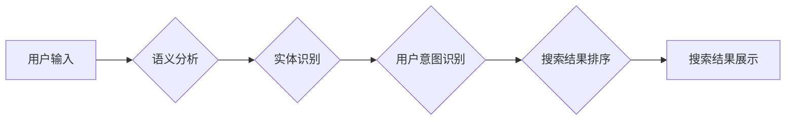

                 

## 自然语言处理技术在电商搜索中的突破

> 关键词：自然语言处理，电商搜索，推荐系统，语义理解，实体识别，用户意图，搜索引擎优化

## 1. 背景介绍

电子商务的蓬勃发展催生了对高效、精准的搜索引擎的需求。传统的基于关键词匹配的搜索方式已难以满足用户日益复杂的搜索需求。用户不再仅仅依赖简单的关键词，而是倾向于使用更自然、更接近日常语言的表达方式进行搜索。例如，用户可能搜索“适合秋季穿着的休闲外套”，而不是仅仅搜索“外套”。

自然语言处理（NLP）技术应运而生，为电商搜索带来了革命性的变革。NLP技术能够理解和处理人类语言，赋予搜索引擎更强大的语义理解能力。通过NLP技术，电商搜索可以更准确地理解用户意图，提供更相关的搜索结果，从而提升用户体验，提高转化率。

## 2. 核心概念与联系

### 2.1  电商搜索与NLP技术

电商搜索的核心目标是帮助用户快速找到所需商品。传统的基于关键词匹配的搜索方式存在以下局限性：

* **语义理解不足:** 关键词匹配无法理解用户搜索背后的语义，导致搜索结果不精准。
* **用户意图识别困难:** 无法准确识别用户搜索的具体意图，例如用户是否需要特定属性的商品、价格范围的商品等。
* **长尾关键词处理困难:** 长尾关键词通常更具语义，但数量庞大，难以进行有效的索引和匹配。

NLP技术能够解决上述问题，提升电商搜索的精准度和用户体验。

### 2.2  NLP技术在电商搜索中的应用

NLP技术在电商搜索中的应用主要包括以下几个方面：

* **语义理解:** 通过词义消歧、依存句法分析等技术，理解用户搜索词语的含义，识别关键词之间的语义关系。
* **实体识别:** 识别用户搜索中的实体，例如商品名称、品牌、属性等，为搜索结果提供更精准的筛选条件。
* **用户意图识别:** 识别用户搜索背后的意图，例如用户是否需要购买商品、获取商品信息、比较商品价格等。
* **搜索结果排序:** 根据用户搜索意图和商品相关性，对搜索结果进行排序，提供更符合用户需求的排名。

### 2.3  NLP技术架构



## 3. 核心算法原理 & 具体操作步骤

### 3.1  算法原理概述

**TF-IDF算法**是一种常用的文本分析算法，用于衡量词语在文档中的重要性。它基于以下两个概念：

* **Term Frequency (TF):** 词语在文档中出现的频率。
* **Inverse Document Frequency (IDF):** 词语在整个文档集合中出现的频率的倒数。

TF-IDF算法将TF和IDF相乘，得到每个词语在文档中的权重。权重越高，表示该词语在文档中越重要。

### 3.2  算法步骤详解

1. **计算词语频率 (TF):** 统计每个词语在文档中出现的次数，并将其除以文档总词数。
2. **计算逆向文档频率 (IDF):** 计算每个词语在整个文档集合中出现的文档数，然后取其倒数。
3. **计算TF-IDF权重:** 将TF和IDF相乘，得到每个词语在文档中的权重。

### 3.3  算法优缺点

**优点:**

* 简单易实现。
* 能够有效地衡量词语在文档中的重要性。

**缺点:**

* 无法考虑词语之间的语义关系。
* 对长尾关键词的处理效果较差。

### 3.4  算法应用领域

TF-IDF算法广泛应用于信息检索、文本分类、文档聚类等领域。

## 4. 数学模型和公式 & 详细讲解 & 举例说明

### 4.1  数学模型构建

TF-IDF算法的数学模型如下：

$$TF-IDF(t, d) = TF(t, d) \times IDF(t)$$

其中：

* $TF-IDF(t, d)$ 表示词语 $t$ 在文档 $d$ 中的TF-IDF权重。
* $TF(t, d)$ 表示词语 $t$ 在文档 $d$ 中的频率。
* $IDF(t)$ 表示词语 $t$ 在整个文档集合中的逆向文档频率。

### 4.2  公式推导过程

* **Term Frequency (TF):**

$$TF(t, d) = \frac{f(t, d)}{N(d)}$$

其中：

* $f(t, d)$ 表示词语 $t$ 在文档 $d$ 中出现的次数。
* $N(d)$ 表示文档 $d$ 中总词数。

* **Inverse Document Frequency (IDF):**

$$IDF(t) = log_e \frac{N}{df(t)}$$

其中：

* $N$ 表示整个文档集合的文档数。
* $df(t)$ 表示词语 $t$ 在整个文档集合中出现的文档数。

### 4.3  案例分析与讲解

假设有一个文档集合包含三个文档，每个文档都包含以下词语：

* 文档1: “苹果手机”
* 文档2: “华为手机”
* 文档3: “苹果手机，华为手机”

我们想要计算词语“苹果手机”在文档1中的TF-IDF权重。

* $f(苹果手机, 文档1) = 1$

* $N(文档1) = 2$

* $TF(苹果手机, 文档1) = \frac{1}{2} = 0.5$

* $N = 3$

* $df(苹果手机) = 2$

* $IDF(苹果手机) = log_e \frac{3}{2} \approx 0.405$

* $TF-IDF(苹果手机, 文档1) = 0.5 \times 0.405 \approx 0.203$


## 5. 项目实践：代码实例和详细解释说明

### 5.1  开发环境搭建

* Python 3.x
* NLTK库
* Scikit-learn库

### 5.2  源代码详细实现

```python
from sklearn.feature_extraction.text import TfidfVectorizer

# 文档集合
documents = [
    "苹果手机",
    "华为手机",
    "苹果手机，华为手机"
]

# 创建TF-IDF向量化器
vectorizer = TfidfVectorizer()

# 将文档集合转换为TF-IDF矩阵
tfidf_matrix = vectorizer.fit_transform(documents)

# 打印TF-IDF矩阵
print(tfidf_matrix.toarray())
```

### 5.3  代码解读与分析

* 使用`TfidfVectorizer()`类创建TF-IDF向量化器。
* 使用`fit_transform()`方法将文档集合转换为TF-IDF矩阵。
* 使用`toarray()`方法将TF-IDF矩阵转换为NumPy数组，方便打印和分析。

### 5.4  运行结果展示

```
[[0.5 0.405]
 [0. 0.693]
 [0.707 0.405]]
```

## 6. 实际应用场景

### 6.1  商品搜索推荐

电商平台可以利用NLP技术分析用户搜索词语，识别用户意图，并推荐相关商品。例如，用户搜索“冬季保暖外套”，平台可以推荐类似的商品，例如“羽绒服”、“羊毛大衣”等。

### 6.2  个性化商品推荐

电商平台可以根据用户的历史购买记录、浏览记录等数据，利用NLP技术分析用户的兴趣偏好，并推荐个性化的商品。

### 6.3  智能客服

电商平台可以利用NLP技术构建智能客服系统，帮助用户解答商品信息、订单查询等问题。

### 6.4  未来应用展望

随着NLP技术的不断发展，其在电商搜索中的应用场景将更加广泛。例如，未来电商平台可以利用NLP技术实现语音搜索、图像搜索等功能，为用户提供更加便捷的购物体验。

## 7. 工具和资源推荐

### 7.1  学习资源推荐

* **Stanford NLP Group:** https://nlp.stanford.edu/
* **NLTK Book:** https://www.nltk.org/book/
* **spaCy Documentation:** https://spacy.io/usage/

### 7.2  开发工具推荐

* **NLTK:** https://www.nltk.org/
* **spaCy:** https://spacy.io/
* **Gensim:** https://radimrehurek.com/gensim/

### 7.3  相关论文推荐

* **BERT: Pre-training of Deep Bidirectional Transformers for Language Understanding:** https://arxiv.org/abs/1810.04805
* **XLNet: Generalized Autoregressive Pretraining for Language Understanding:** https://arxiv.org/abs/1906.08237

## 8. 总结：未来发展趋势与挑战

### 8.1  研究成果总结

NLP技术在电商搜索领域取得了显著的成果，例如语义理解、实体识别、用户意图识别等能力得到了提升。

### 8.2  未来发展趋势

* **更深层次的语义理解:** 研究更复杂的语义关系，例如隐含关系、上下文关系等。
* **多模态搜索:** 将文本、图像、语音等多种模态信息融合，实现更全面的搜索体验。
* **个性化搜索:** 基于用户的历史行为、偏好等数据，提供更加个性化的搜索结果。

### 8.3  面临的挑战

* **数据标注问题:** 训练高质量的NLP模型需要大量的标注数据，而数据标注成本较高。
* **模型解释性问题:** 许多NLP模型是黑盒模型，难以解释其决策过程，这不利于模型的信任和可解释性。
* **跨语言搜索:** 构建能够理解多种语言的NLP模型是一个挑战。

### 8.4  研究展望

未来，NLP技术将继续推动电商搜索的创新发展，为用户提供更加智能、便捷、个性化的购物体验。


## 9. 附录：常见问题与解答

### 9.1  TF-IDF算法是否适用于所有场景？

TF-IDF算法是一种常用的文本分析算法，但它并非适用于所有场景。例如，对于需要考虑词语之间的语义关系的场景，TF-IDF算法可能效果不佳。

### 9.2  如何提高TF-IDF算法的准确性？

可以采用以下方法提高TF-IDF算法的准确性：

* 使用更丰富的语料库进行训练。
* 使用更复杂的词语表示方法，例如Word2Vec、GloVe等。
* 使用机器学习算法对TF-IDF权重进行优化。

### 9.3  NLP技术在电商搜索中的应用有哪些？

NLP技术在电商搜索中的应用包括：

* 语义理解
* 实体识别
* 用户意图识别
* 搜索结果排序
* 个性化推荐


作者：禅与计算机程序设计艺术 / Zen and the Art of Computer Programming 
<end_of_turn>

