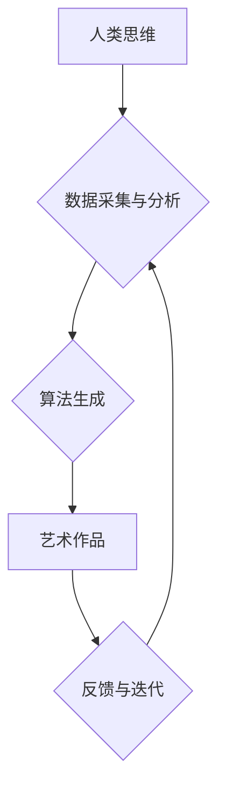

                 

## 艺术与科技的碰撞：人类计算激发创意灵感

> 关键词：人工智能、创意计算、人类计算、艺术生成、算法艺术、计算思维、艺术灵感、科技创新

### 1. 背景介绍

艺术与科技，看似截然不同的领域，却在不断交融，碰撞出令人惊叹的火花。从文艺复兴时期绘画的透视法到现代数字艺术的虚拟现实体验，科技始终为艺术创作提供了新的工具和可能性。而随着人工智能技术的飞速发展，艺术与科技的融合进入了全新的阶段。

人类计算，作为一种将人类的认知能力与计算能力相结合的全新模式，为艺术创作提供了前所未有的机遇。它打破了传统艺术创作的边界，赋予了算法新的意义，并激发了艺术家们对创意的全新探索。

### 2. 核心概念与联系

**2.1 人类计算**

人类计算是指利用人类的智慧、经验和创造力来辅助或替代传统计算方法，解决复杂问题和进行创新。它强调人类的参与和主导作用，将人类的认知能力融入到计算过程中，从而获得更具洞察力和创造力的结果。

**2.2 创意计算**

创意计算是指利用计算技术来激发和增强人类的创造力。它通过算法、数据分析和机器学习等手段，帮助艺术家们探索新的艺术形式、发现灵感和突破创作瓶颈。

**2.3 艺术生成**

艺术生成是指利用算法和数据来创作艺术作品。它可以从图像、音乐、文本等多种数据源中提取灵感，并通过算法生成新的艺术作品，展现出独特的风格和创意。

**2.4 流程图**



### 3. 核心算法原理 & 具体操作步骤

**3.1 算法原理概述**

人类计算与创意计算在艺术生成领域中，常用的算法包括：

* **生成对抗网络 (GAN):** GAN 由两个神经网络组成：生成器和鉴别器。生成器试图生成逼真的艺术作品，而鉴别器则试图区分真实作品和生成作品。两者在不断对抗中相互学习，最终生成出逼真的艺术作品。
* **变分自编码器 (VAE):** VAE 通过学习数据的潜在表示来生成新的数据。它可以将艺术作品编码成一个低维的潜在空间，然后解码生成新的艺术作品。
* **强化学习 (RL):** RL 通过奖励机制来训练算法。在艺术生成领域，可以利用用户反馈来训练算法，使其生成更符合用户喜好的艺术作品。

**3.2 算法步骤详解**

以 GAN 为例，其具体操作步骤如下：

1. **初始化生成器和鉴别器:** 随机初始化两个神经网络的参数。
2. **训练鉴别器:** 使用真实艺术作品和随机噪声生成的伪造作品训练鉴别器，使其能够区分真实作品和伪造作品。
3. **训练生成器:** 使用鉴别器对生成的伪造作品进行评估，并根据评估结果更新生成器的参数，使其生成更逼真的作品。
4. **重复步骤 2 和 3:** 持续训练鉴别器和生成器，直到生成器能够生成与真实作品难以区分的艺术作品。

**3.3 算法优缺点**

* **优点:**

    * 可以生成逼真的艺术作品，展现出独特的风格和创意。
    * 可以探索新的艺术形式，突破传统创作的边界。
    * 可以自动化艺术创作流程，提高效率。

* **缺点:**

    * 算法训练需要大量的数据和计算资源。
    * 生成的艺术作品可能缺乏情感和内涵。
    * 算法生成的艺术作品可能存在版权争议。

**3.4 算法应用领域**

* **数字艺术创作:** 生成逼真的图像、音乐、视频等艺术作品。
* **游戏设计:** 生成游戏场景、角色、道具等。
* **电影特效:** 生成逼真的视觉效果。
* **广告设计:** 生成吸引人的广告创意。

### 4. 数学模型和公式 & 详细讲解 & 举例说明

**4.1 数学模型构建**

在艺术生成领域，常用的数学模型包括：

* **概率分布模型:** 用于描述艺术作品的特征和风格。例如，可以使用高斯分布模型来描述图像的色彩分布。
* **神经网络模型:** 用于学习艺术作品的复杂关系和模式。例如，可以使用卷积神经网络 (CNN) 来学习图像的特征。

**4.2 公式推导过程**

以 GAN 为例，其损失函数可以表示为：

$$
L_{GAN} = L_{D} + L_{G}
$$

其中：

* $L_{D}$ 是鉴别器的损失函数，用于衡量鉴别器区分真实作品和伪造作品的能力。
* $L_{G}$ 是生成器的损失函数，用于衡量生成器生成的作品逼真程度。

**4.3 案例分析与讲解**

使用 GAN 生成艺术作品的例子有很多，例如：

* **DeepDream:** 使用 CNN 生成具有梦幻般效果的图像。
* **StyleGAN:** 生成具有特定风格的图像，例如肖像画、风景画等。

### 5. 项目实践：代码实例和详细解释说明

**5.1 开发环境搭建**

* Python 3.x
* TensorFlow 或 PyTorch 深度学习框架
* CUDA 和 cuDNN (可选，用于 GPU 加速)

**5.2 源代码详细实现**

```python
# 导入必要的库
import tensorflow as tf

# 定义生成器网络
def generator(z):
    # ...

# 定义鉴别器网络
def discriminator(x):
    # ...

# 定义损失函数
def loss_function(real_output, fake_output):
    # ...

# 定义训练循环
def train_step(images):
    # ...

# 训练模型
for epoch in range(num_epochs):
    for batch in dataset:
        train_step(batch)

```

**5.3 代码解读与分析**

* 生成器网络负责生成伪造的艺术作品。
* 鉴别器网络负责区分真实作品和伪造作品。
* 损失函数用于衡量鉴别器和生成器的性能。
* 训练循环用于迭代训练模型。

**5.4 运行结果展示**

训练完成后，可以使用生成器网络生成新的艺术作品。

### 6. 实际应用场景

* **艺术创作辅助工具:** 帮助艺术家们探索新的艺术形式、发现灵感和突破创作瓶颈。
* **个性化艺术作品生成:** 根据用户的喜好和需求生成个性化的艺术作品。
* **艺术教育:** 用于艺术教育，帮助学生们理解艺术创作的原理和方法。

**6.4 未来应用展望**

* **更逼真的艺术生成:** 通过改进算法和训练方法，生成更逼真的艺术作品。
* **更丰富的艺术形式:** 探索新的艺术形式，例如三维艺术、交互式艺术等。
* **艺术与科技的深度融合:** 将人工智能技术与其他科技领域融合，例如虚拟现实、增强现实等，创造更沉浸式的艺术体验。

### 7. 工具和资源推荐

**7.1 学习资源推荐**

* **书籍:**

    * 《深度学习》
    * 《生成对抗网络》

* **在线课程:**

    * Coursera: 深度学习
    * Udacity: 计算机视觉

**7.2 开发工具推荐**

* **TensorFlow:** 开源深度学习框架
* **PyTorch:** 开源深度学习框架
* **Keras:** 高级深度学习API

**7.3 相关论文推荐**

* **Generative Adversarial Networks**
* **DeepDream Generator**
* **StyleGAN**

### 8. 总结：未来发展趋势与挑战

**8.1 研究成果总结**

人类计算与创意计算在艺术生成领域取得了显著的成果，能够生成逼真的艺术作品，并探索新的艺术形式。

**8.2 未来发展趋势**

未来，艺术生成领域将朝着以下方向发展：

* 更逼真的艺术生成
* 更丰富的艺术形式
* 艺术与科技的深度融合

**8.3 面临的挑战**

* 算法的复杂性和训练成本
* 艺术作品的版权争议
* 人工智能伦理问题

**8.4 研究展望**

未来研究将重点关注以下方面：

* 开发更有效的算法和训练方法
* 解决艺术作品的版权争议
* 探索人工智能伦理问题


### 9. 附录：常见问题与解答

**9.1 如何选择合适的算法？**

选择合适的算法取决于具体的应用场景和需求。例如，如果需要生成逼真的图像，可以使用 GAN；如果需要生成具有特定风格的图像，可以使用 StyleGAN。

**9.2 如何训练艺术生成模型？**

训练艺术生成模型需要大量的训练数据和计算资源。可以使用现有的开源框架，例如 TensorFlow 或 PyTorch，来训练模型。

**9.3 艺术生成作品的版权归属？**

艺术生成作品的版权归属是一个复杂的问题，目前还没有统一的法律规定。

作者：禅与计算机程序设计艺术 / Zen and the Art of Computer Programming 


<end_of_turn>

