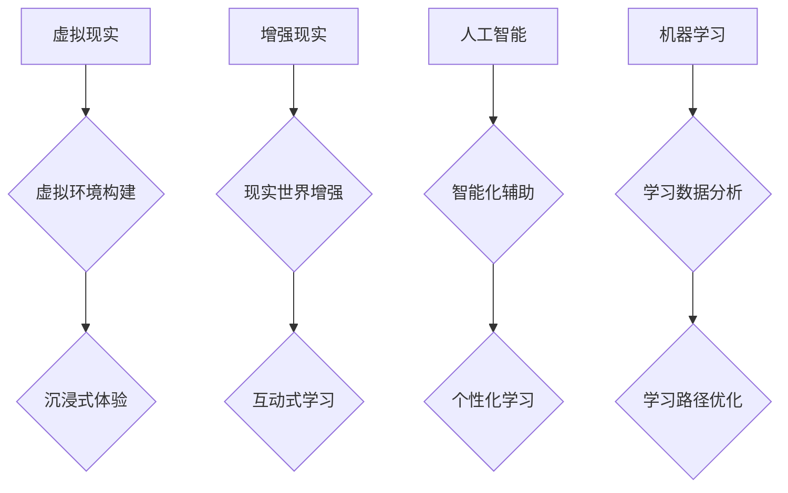

                 

## 虚拟教育平台:全球脑时代的知识获取渠道

> 关键词：虚拟教育平台、全球脑、知识获取、人工智能、机器学习、个性化学习、沉浸式体验、元宇宙

## 1. 背景介绍

随着科技的飞速发展，人工智能、机器学习、元宇宙等新兴技术不断涌现，深刻地改变着人们的生活方式和学习模式。传统教育模式面临着越来越多的挑战，如何更好地满足人们个性化、高效、便捷的学习需求成为一个亟待解决的问题。虚拟教育平台作为一种新兴的教育模式，凭借其沉浸式体验、个性化学习和智能化辅助等优势，逐渐成为全球脑时代知识获取的重要渠道。

### 1.1 全球脑时代背景

“全球脑”的概念是指人类智慧和信息网络的深度融合，通过人工智能、大数据、云计算等技术的驱动，构建一个全球性的智慧网络，实现人类知识和智慧的共享和协同。在这个时代，信息爆炸、知识更新速度加快，传统的教育模式难以适应快速变化的社会需求。

### 1.2 虚拟教育平台的优势

虚拟教育平台利用虚拟现实、增强现实、人工智能等技术，构建一个虚拟的学习环境，为用户提供沉浸式、互动式的学习体验。其优势主要体现在以下几个方面：

* **个性化学习:** 虚拟教育平台可以根据用户的学习进度、兴趣和能力，定制个性化的学习路径和内容，提高学习效率和兴趣。
* **沉浸式体验:** 通过虚拟现实技术，用户可以身临其境地体验学习内容，增强学习的趣味性和记忆性。
* **智能化辅助:** 虚拟教育平台可以利用人工智能技术，为用户提供智能化的学习辅导、知识问答和学习评估等服务，提高学习效果。
* **时间和空间的自由:** 用户可以随时随地进行学习，不受时间和空间的限制。

## 2. 核心概念与联系

虚拟教育平台的核心概念包括虚拟现实、增强现实、人工智能、机器学习、个性化学习、沉浸式体验等。这些概念相互关联，共同构成了虚拟教育平台的架构。

**Mermaid 流程图:**



## 3. 核心算法原理 & 具体操作步骤

### 3.1 算法原理概述

虚拟教育平台的核心算法主要包括：

* **虚拟环境构建算法:** 用于根据学习内容和用户需求，构建虚拟的学习环境，包括场景设计、虚拟角色创建、交互机制设计等。
* **沉浸式体验算法:** 用于通过虚拟现实技术，模拟真实世界的感官体验，增强用户的学习兴趣和记忆。
* **智能化辅助算法:** 用于利用人工智能技术，为用户提供个性化的学习辅导、知识问答和学习评估等服务。
* **个性化学习算法:** 用于根据用户的学习进度、兴趣和能力，定制个性化的学习路径和内容。

### 3.2 算法步骤详解

**虚拟环境构建算法:**

1. **需求分析:** 首先需要对学习内容和用户需求进行分析，确定虚拟环境的主题、场景、角色等。
2. **场景设计:** 根据需求分析结果，设计虚拟环境的场景布局、物体模型、光照效果等。
3. **虚拟角色创建:** 创建虚拟角色，赋予其相应的形象、性格、行为模式等。
4. **交互机制设计:** 设计用户与虚拟环境、虚拟角色的交互机制，例如语音识别、手势识别、虚拟键盘等。

**沉浸式体验算法:**

1. **感官模拟:** 利用虚拟现实技术，模拟用户的视觉、听觉、触觉等感官体验。
2. **环境动态变化:** 使虚拟环境根据用户的行为和学习进度进行动态变化，增强用户的参与感和沉浸感。
3. **虚拟角色互动:** 设计虚拟角色与用户进行互动，例如对话、任务分配、情感表达等。

**智能化辅助算法:**

1. **知识库构建:** 建立一个包含大量知识和技能的知识库。
2. **知识检索:** 利用自然语言处理技术，帮助用户检索相关知识。
3. **个性化辅导:** 根据用户的学习进度和能力，提供个性化的学习辅导和建议。
4. **学习评估:** 利用机器学习算法，对用户的学习情况进行评估，并提供相应的反馈和改进建议。

**个性化学习算法:**

1. **用户建模:** 建立用户的学习模型，包括学习风格、兴趣、能力等。
2. **学习路径规划:** 根据用户的学习模型，规划个性化的学习路径。
3. **内容推荐:** 推荐与用户学习目标和兴趣相关的学习内容。
4. **学习进度跟踪:** 跟踪用户的学习进度，并及时调整学习路径和内容。

### 3.3 算法优缺点

**优点:**

* **提高学习效率:** 个性化学习和智能化辅助可以帮助用户更高效地学习。
* **增强学习兴趣:** 沉浸式体验和互动式学习可以增强用户的学习兴趣。
* **满足个性化需求:** 虚拟教育平台可以满足不同用户的个性化学习需求。

**缺点:**

* **技术门槛高:** 构建虚拟教育平台需要掌握虚拟现实、增强现实、人工智能等多种技术。
* **成本较高:** 虚拟教育平台的开发和维护成本较高。
* **内容质量问题:** 虚拟教育平台的内容质量需要得到保证。

### 3.4 算法应用领域

虚拟教育平台的算法可以应用于各个领域的教育，例如：

* **K12教育:** 提供个性化学习、沉浸式体验的课堂教学。
* **高等教育:** 提供在线课程、虚拟实验室、远程实习等服务。
* **职业培训:** 提供技能培训、职业指导、在线考试等服务。
* **终身教育:** 提供兴趣学习、知识更新、技能提升等服务。

## 4. 数学模型和公式 & 详细讲解 & 举例说明

### 4.1 数学模型构建

虚拟教育平台的个性化学习算法可以基于用户的学习数据构建数学模型，例如：

* **用户学习能力模型:** 可以使用贝叶斯网络、决策树等算法构建用户学习能力模型，预测用户的学习进度和能力水平。
* **用户学习兴趣模型:** 可以使用聚类算法、推荐系统等算法构建用户学习兴趣模型，推荐与用户兴趣相关的学习内容。

### 4.2 公式推导过程

**用户学习能力模型:**

假设用户 $u$ 的学习能力为 $C_u$，学习内容 $i$ 的难度为 $D_i$，用户 $u$ 对内容 $i$ 的学习效果为 $E_{ui}$。可以建立以下数学模型：

$$E_{ui} = f(C_u, D_i)$$

其中，$f$ 为一个函数，表示用户学习能力和内容难度之间的关系。

**用户学习兴趣模型:**

假设用户 $u$ 对内容 $i$ 的兴趣为 $I_{ui}$，用户 $u$ 的学习历史数据为 $H_u$。可以建立以下数学模型：

$$I_{ui} = g(H_u, i)$$

其中，$g$ 为一个函数，表示用户学习历史数据和内容之间的关系。

### 4.3 案例分析与讲解

**案例:**

假设有一个虚拟教育平台，提供编程课程。平台可以根据用户的学习能力和兴趣，推荐相应的编程语言和课程内容。

**分析:**

* **学习能力模型:** 平台可以根据用户的学习进度、考试成绩等数据，构建用户的学习能力模型，预测用户的编程能力水平。
* **学习兴趣模型:** 平台可以根据用户的学习历史数据、浏览记录等数据，构建用户的学习兴趣模型，推荐与用户兴趣相关的编程语言和课程内容。

**讲解:**

通过构建这些数学模型，虚拟教育平台可以为用户提供个性化的学习建议，提高学习效率和兴趣。

## 5. 项目实践：代码实例和详细解释说明

### 5.1 开发环境搭建

虚拟教育平台的开发环境需要包含以下软件：

* **虚拟现实开发工具:** 例如Unity、Unreal Engine等。
* **增强现实开发工具:** 例如ARKit、ARCore等。
* **人工智能开发框架:** 例如TensorFlow、PyTorch等。
* **数据库管理系统:** 例如MySQL、MongoDB等。

### 5.2 源代码详细实现

由于篇幅限制，这里只提供一个简单的代码示例，用于演示虚拟环境构建算法的实现。

```python
# 虚拟环境构建算法示例

# 场景定义
scene = {
    "name": "教室",
    "objects": [
        {"name": "桌子", "position": (0, 0, 0)},
        {"name": "椅子", "position": (1, 0, 0)},
        {"name": "黑板", "position": (0, 0, 1)}
    ]
}

# 虚拟角色定义
character = {
    "name": "老师",
    "appearance": "中年男性",
    "behavior": "讲解课程内容"
}

# 构建虚拟环境
def build_virtual_environment(scene, character):
    # ... (代码实现虚拟环境的构建)

# 运行虚拟环境
build_virtual_environment(scene, character)
```

### 5.3 代码解读与分析

这段代码定义了虚拟环境的场景和虚拟角色，并调用了 `build_virtual_environment` 函数构建虚拟环境。

### 5.4 运行结果展示

运行这段代码后，将生成一个简单的虚拟教室场景，包含桌子、椅子和黑板等物体，以及一个名为“老师”的虚拟角色。

## 6. 实际应用场景

虚拟教育平台在各个领域的应用场景非常广泛，例如：

### 6.1 K12教育

* **沉浸式课堂:** 利用虚拟现实技术，将学生带入到不同的场景中，例如古代埃及、太空探索等，增强学习的趣味性和记忆性。
* **个性化学习:** 根据学生的学习进度和能力，定制个性化的学习路径和内容，提高学习效率。
* **远程教育:** 为学生提供远程学习的机会，打破地域限制，实现教育资源的共享。

### 6.2 高等教育

* **虚拟实验室:** 提供虚拟的实验室环境，让学生进行实验操作，无需担心安全和成本问题。
* **远程实习:** 为学生提供远程实习的机会，帮助他们积累实践经验。
* **在线课程:** 提供高质量的在线课程，满足学生多样化的学习需求。

### 6.3 职业培训

* **技能培训:** 提供针对不同职业的技能培训，例如编程、设计、营销等。
* **职业指导:** 为求职者提供职业规划和指导服务。
* **在线考试:** 提供在线考试平台，方便企业进行员工技能评估。

### 6.4 未来应用展望

随着人工智能、虚拟现实、增强现实等技术的不断发展，虚拟教育平台将更加智能化、个性化、沉浸式。未来，虚拟教育平台将可能实现以下应用场景：

* **虚拟导师:** 利用人工智能技术，为学生提供个性化的学习辅导和指导，就像真人导师一样。
* **虚拟社交学习:** 利用虚拟现实技术，创造一个虚拟的学习社区，让学生可以与其他学生和老师进行互动学习。
* **跨文化教育:** 利用虚拟现实技术，让学生可以体验不同的文化环境，学习不同的语言和知识。

## 7. 工具和资源推荐

### 7.1 学习资源推荐

* **Coursera:** 提供各种在线课程，包括虚拟现实、增强现实、人工智能等。
* **edX:** 提供来自世界知名大学的在线课程，包括虚拟教育平台相关的课程。
* **Udacity:** 提供针对人工智能、虚拟现实等领域的职业培训课程。

### 7.2 开发工具推荐

* **Unity:** 专业的虚拟现实开发工具，支持多种平台开发。
* **Unreal Engine:** 强大的游戏引擎，也可以用于虚拟教育平台的开发。
* **A-Frame:** 基于Web技术的虚拟现实开发框架，易于学习和使用。

### 7.3 相关论文推荐

* **Virtual Reality in Education: A Review of the Literature**
* **The Impact of Augmented Reality on Learning**
* **Personalized Learning with Artificial Intelligence**

## 8. 总结：未来发展趋势与挑战

### 8.1 研究成果总结

虚拟教育平台作为一种新兴的教育模式，在全球脑时代具有重要的发展潜力。通过虚拟现实、增强现实、人工智能等技术的应用，虚拟教育平台可以提供更加个性化、沉浸式、智能化的学习体验，满足人们多样化的学习需求。

### 8.2 未来发展趋势

虚拟教育平台的未来发展趋势主要包括：

* **更加智能化:** 利用人工智能技术，实现虚拟教育平台的智能化辅助、个性化学习、自动评估等功能。
* **更加沉浸式:** 利用虚拟现实、增强现实等技术，构建更加逼真的虚拟学习环境，增强用户的学习兴趣和参与度。
* **更加个性化:** 根据用户的学习风格、兴趣、能力等特点，定制个性化的学习路径和内容，提高学习效率。
* **更加开放:** 打破平台的壁垒，实现虚拟教育资源的共享和协同，构建一个全球性的虚拟教育生态系统。

### 8.3 面临的挑战

虚拟教育平台的发展也面临着一些挑战：

* **技术难题:** 虚拟现实、增强现实、人工智能等技术的应用需要克服一些技术难题，例如设备成本高、内容制作难度大、数据安全等问题。
* **内容质量问题:** 虚拟教育平台的内容质量需要得到保证，需要开发高质量、丰富多彩的虚拟学习内容。
* **教育理念转变:** 虚拟教育平台的应用需要改变传统的教育理念，需要教师和学生适应新的学习模式。

### 8.4 研究展望

未来，虚拟教育平台的研究将继续深入，探索虚拟教育的更多应用场景，解决虚拟教育平台面临的挑战，为全球脑时代的人类智慧发展贡献力量。

## 9. 附录：常见问题与解答

**常见问题:**

* **虚拟教育平台的成本高吗？**

**解答:** 虚拟教育平台的成本取决于平台的规模、功能和技术复杂度。目前，一些开源的虚拟教育平台可以降低开发成本。

* **虚拟教育平台是否可以替代传统的教育模式？**

**解答:** 虚拟教育平台可以作为一种补充传统的教育模式，为学生提供更加灵活、个性化的学习机会。

* **虚拟教育平台对学生的学习效果有什么影响？**

**解答:** 研究表明，虚拟教育平台可以提高学生的学习效率和兴趣，但具体效果取决于平台的设计、内容和学生的学习态度。


作者：禅与计算机程序设计艺术 / Zen and the Art of Computer Programming 
<end_of_turn>

