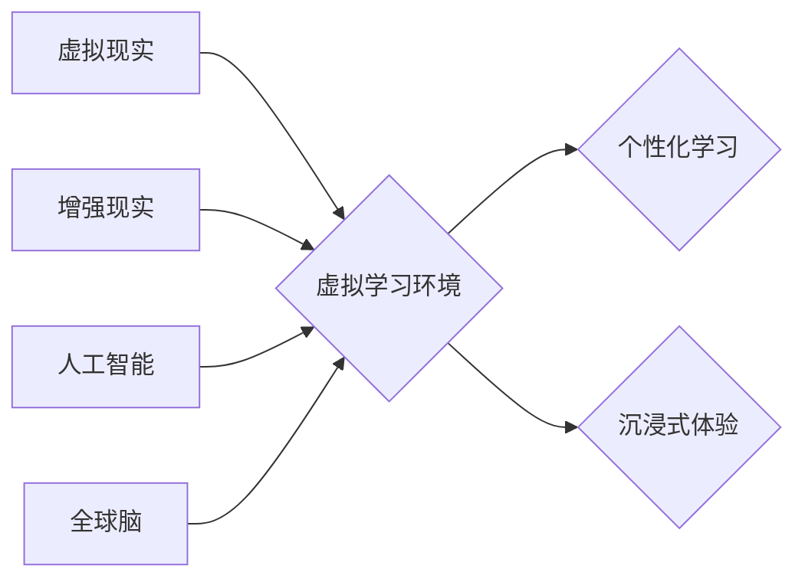

                 

## 虚拟教育：全球脑时代下的学习新方式

> 关键词：虚拟现实、增强现实、全球脑、人工智能、个性化学习、沉浸式教育、元宇宙

### 1. 背景介绍

随着科技的飞速发展，人工智能、虚拟现实（VR）、增强现实（AR）等技术的不断突破，教育领域也迎来了前所未有的变革。传统的课堂教学模式面临着越来越多的挑战，人们对更加灵活、个性化、沉浸式的学习体验的需求日益增长。虚拟教育作为一种新兴的教育模式，正逐渐成为未来教育发展的重要趋势。

全球脑时代即将到来，人类意识将与人工智能和网络深度融合。在这个时代，虚拟教育将发挥更加重要的作用，它将打破时空限制，提供更加丰富的学习资源和互动体验，帮助人们实现个性化、高效的学习目标。

### 2. 核心概念与联系

虚拟教育的核心概念是利用虚拟现实、增强现实等技术构建一个虚拟的学习环境，让学生能够身临其境地体验学习内容。它与全球脑时代密切相关，因为全球脑的实现将使得虚拟教育更加真实、智能和个性化。

**核心概念原理和架构：**



**核心概念联系：**

* **虚拟现实（VR）：** 通过头戴式设备，创造一个沉浸式的虚拟世界，让学生能够身临其境地体验学习内容。
* **增强现实（AR）：** 通过手机、平板电脑等设备，将虚拟内容叠加到现实世界中，增强现实世界的学习体验。
* **人工智能（AI）：** 利用AI技术，实现虚拟学习环境的智能化，例如个性化学习路径推荐、智能辅导、自动评估等。
* **全球脑：** 人类意识与人工智能和网络深度融合，虚拟教育将更加智能、个性化和高效。

### 3. 核心算法原理 & 具体操作步骤

虚拟教育的核心算法主要包括：

* **虚拟环境构建算法：** 用于构建虚拟学习环境，包括场景设计、3D模型渲染、物理模拟等。
* **用户交互算法：** 用于处理用户的动作和指令，例如手势识别、语音识别、眼动追踪等。
* **个性化学习算法：** 用于根据用户的学习进度、兴趣和能力，推荐个性化的学习内容和学习路径。

**3.1 算法原理概述**

虚拟环境构建算法通常基于图形学和游戏引擎技术，利用3D建模、纹理贴图、光照计算等技术，构建逼真的虚拟场景。用户交互算法则利用计算机视觉、自然语言处理等技术，识别用户的动作和指令，并将其转化为虚拟环境中的操作。个性化学习算法则基于机器学习和数据分析技术，分析用户的学习数据，推荐个性化的学习内容和学习路径。

**3.2 算法步骤详解**

* **虚拟环境构建算法：**
    1. 确定虚拟场景的主题和目标。
    2. 设计场景的布局和结构。
    3. 创建3D模型，并添加纹理贴图和材质。
    4. 设置场景的光照、阴影和天气效果。
    5. 编写脚本，实现场景的交互和动画效果。
* **用户交互算法：**
    1. 收集用户的输入数据，例如手势、语音、眼动等。
    2. 对输入数据进行预处理和特征提取。
    3. 利用机器学习模型，识别用户的意图和动作。
    4. 将识别的意图和动作转化为虚拟环境中的操作指令。
* **个性化学习算法：**
    1. 收集用户的学习数据，例如学习进度、学习时间、学习偏好等。
    2. 利用机器学习模型，分析用户的学习数据，构建用户的学习模型。
    3. 根据用户的学习模型，推荐个性化的学习内容和学习路径。
    4. 动态调整学习内容和学习路径，根据用户的学习反馈进行优化。

**3.3 算法优缺点**

* **虚拟环境构建算法：**
    * 优点：能够构建逼真的虚拟场景，提供沉浸式的学习体验。
    * 缺点：需要强大的计算资源，开发成本较高。
* **用户交互算法：**
    * 优点：能够实现更加自然的用户交互，提高学习的趣味性和参与度。
    * 缺点：识别精度和鲁棒性还有待提高。
* **个性化学习算法：**
    * 优点：能够根据用户的学习特点，提供个性化的学习体验，提高学习效率。
    * 缺点：需要大量的学习数据进行训练，算法的复杂度较高。

**3.4 算法应用领域**

虚拟教育的算法应用领域非常广泛，包括：

* **K-12教育：** 构建虚拟课堂、模拟实验、提供沉浸式学习体验。
* **高等教育：** 提供虚拟实验室、远程课堂、个性化学习路径。
* **职业培训：** 提供虚拟模拟场景，进行职业技能培训。
* **语言学习：** 提供虚拟语言环境，进行沉浸式语言学习。

### 4. 数学模型和公式 & 详细讲解 & 举例说明

虚拟教育中，数学模型和公式在算法设计、性能评估和数据分析等方面发挥着重要作用。

**4.1 数学模型构建**

虚拟环境构建算法通常基于图形学和游戏引擎技术，可以使用数学模型来描述场景的几何形状、材质属性、光照效果等。例如，可以使用向量和矩阵来描述3D模型的变换和旋转，可以使用光线追踪算法来模拟光线在场景中的传播和反射。

**4.2 公式推导过程**

用户交互算法中，可以使用概率统计模型来预测用户的行为，例如贝叶斯网络、隐马尔可夫模型等。这些模型需要根据用户的历史数据进行训练，并使用数学公式来计算用户的行为概率。

个性化学习算法中，可以使用机器学习模型来分析用户的学习数据，例如决策树、支持向量机、神经网络等。这些模型需要使用数学公式来描述学习过程，并根据用户的学习反馈进行参数调整。

**4.3 案例分析与讲解**

例如，在虚拟课堂中，可以使用数学模型来计算学生与虚拟老师之间的距离，并根据距离调整虚拟老师的语音音量和肢体语言。

### 5. 项目实践：代码实例和详细解释说明

**5.1 开发环境搭建**

虚拟教育项目开发通常需要使用以下开发环境：

* **操作系统：** Windows、macOS、Linux
* **编程语言：** C++、Python、Java
* **游戏引擎：** Unity、Unreal Engine
* **虚拟现实平台：** Oculus、HTC Vive、SteamVR

**5.2 源代码详细实现**

以下是一个简单的虚拟课堂代码示例，使用Python和Pygame库实现：

```python
import pygame

# 初始化 Pygame
pygame.init()

# 设置窗口大小
screen_width = 800
screen_height = 600
screen = pygame.display.set_mode((screen_width, screen_height))

# 设置标题
pygame.display.set_caption("虚拟课堂")

# 加载虚拟老师图像
teacher_image = pygame.image.load("teacher.png")

# 设置虚拟老师初始位置
teacher_x = 100
teacher_y = 100

# 游戏循环
running = True
while running:
    # 处理事件
    for event in pygame.event.get():
        if event.type == pygame.QUIT:
            running = False

    # 更新虚拟老师位置
    keys = pygame.key.get_pressed()
    if keys[pygame.K_LEFT]:
        teacher_x -= 5
    if keys[pygame.K_RIGHT]:
        teacher_x += 5
    if keys[pygame.K_UP]:
        teacher_y -= 5
    if keys[pygame.K_DOWN]:
        teacher_y += 5

    # 绘制虚拟老师
    screen.blit(teacher_image, (teacher_x, teacher_y))

    # 更新显示
    pygame.display.flip()

# 退出 Pygame
pygame.quit()
```

**5.3 代码解读与分析**

这段代码实现了一个简单的虚拟课堂，其中虚拟老师是一个静态的图像。

* 使用Pygame库初始化游戏窗口和加载图像。
* 使用游戏循环处理事件和更新虚拟老师的位置。
* 使用键盘输入控制虚拟老师的移动。
* 使用blit函数将虚拟老师图像绘制到屏幕上。

**5.4 运行结果展示**

运行这段代码后，将会出现一个窗口，其中包含一个虚拟老师图像。可以使用键盘控制虚拟老师的移动。

### 6. 实际应用场景

虚拟教育已经开始在各个领域得到应用，例如：

* **远程医疗教育：** 虚拟手术模拟、远程诊断培训。
* **工业技能培训：** 虚拟工厂模拟、操作机器设备培训。
* **艺术与设计教育：** 虚拟美术馆、虚拟设计工作室。

**6.4 未来应用展望**

随着虚拟现实、增强现实和人工智能技术的不断发展，虚拟教育将更加普及和智能化。未来，虚拟教育将能够提供更加逼真的、个性化的、沉浸式的学习体验，并应用于更多领域。

### 7. 工具和资源推荐

**7.1 学习资源推荐**

* **Coursera：** 提供虚拟现实和增强现实相关的课程。
* **edX：** 提供人工智能和机器学习相关的课程。
* **Udacity：** 提供虚拟现实开发相关的课程。

**7.2 开发工具推荐**

* **Unity：** 跨平台游戏引擎，支持虚拟现实和增强现实开发。
* **Unreal Engine：** 高端游戏引擎，支持虚拟现实和增强现实开发。
* **A-Frame：** 基于Web技术的虚拟现实开发框架。

**7.3 相关论文推荐**

* **Virtual Reality in Education: A Systematic Review**
* **The Impact of Augmented Reality on Learning**
* **Personalized Learning with Artificial Intelligence**

### 8. 总结：未来发展趋势与挑战

**8.1 研究成果总结**

虚拟教育已经取得了显著的成果，例如：

* 虚拟现实和增强现实技术能够提供更加沉浸式的学习体验。
* 人工智能技术能够实现虚拟学习环境的智能化，提供个性化的学习路径和智能辅导。

**8.2 未来发展趋势**

未来，虚拟教育将朝着以下方向发展：

* **更加逼真的虚拟环境：** 利用更先进的图形学技术和传感器技术，构建更加逼真的虚拟环境。
* **更加智能的学习体验：** 利用人工智能技术，实现更加个性化的学习路径推荐、智能辅导和自动评估。
* **更加广泛的应用场景：** 将虚拟教育应用于更多领域，例如远程医疗教育、工业技能培训、艺术与设计教育等。

**8.3 面临的挑战**

虚拟教育也面临着一些挑战：

* **技术成本高：** 构建虚拟学习环境和开发虚拟教育软件需要大量的技术资源和资金投入。
* **内容开发难度大：** 需要开发高质量的虚拟学习内容，并将其与现实世界相结合。
* **用户体验问题：** 需要解决虚拟现实和增强现实设备带来的眩晕、疲劳等问题。

**8.4 研究展望**

未来，需要进一步研究虚拟教育的教学效果、用户体验和社会影响，并探索虚拟教育与其他教育模式的融合发展。

### 9. 附录：常见问题与解答

**常见问题：**

* **虚拟教育和传统教育相比有什么优势？**

虚拟教育能够提供更加灵活、个性化、沉浸式的学习体验，打破时空限制，并能够利用人工智能技术实现智能化学习。

* **虚拟教育有哪些应用场景？**

虚拟教育可以应用于K-12教育、高等教育、职业培训、语言学习等各个领域。

* **如何参与虚拟教育？**

可以通过在线学习平台、虚拟现实设备或增强现实设备参与虚拟教育。

**解答：**

* 虚拟教育的优势在于其灵活性和个性化程度。它可以根据用户的学习进度、兴趣和能力，提供定制化的学习内容和学习路径。此外，虚拟教育还可以利用人工智能技术，实现智能化学习，例如个性化学习建议、智能辅导和自动评估。
* 虚拟教育的应用场景非常广泛，包括但不限于：远程医疗教育、工业技能培训、艺术与设计教育、语言学习等。
* 参与虚拟教育的方式有很多，例如：通过在线学习平台，例如Coursera、edX等；通过虚拟现实设备，例如Oculus、HTC Vive等；通过增强现实设备，例如手机、平板电脑等。


作者：禅与计算机程序设计艺术 / Zen and the Art of Computer Programming 
<end_of_turn>

