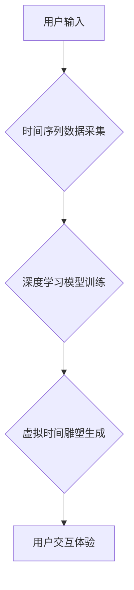

                 

## 虚拟时间雕塑：AI创作的时间感知艺术

> 关键词：人工智能、时间感知、艺术创作、虚拟现实、深度学习、时间序列分析

## 1. 背景介绍

时间，是构成我们现实世界最基本的元素之一。它赋予事物变化和发展，塑造着我们对世界的感知和理解。然而，在数字世界中，时间往往被视为一种线性、不可逆的流逝。我们习惯于以时间轴的形式来记录和呈现信息，但这种方式却无法完全捕捉到时间的多样性和复杂性。

近年来，人工智能技术的发展为我们提供了新的视角和工具，让我们能够以更深刻的方式探索时间。深度学习算法能够从海量的时间序列数据中学习出隐藏的模式和规律，从而赋予机器对时间感知的能力。这为艺术创作领域带来了全新的可能性，让我们能够利用人工智能技术，创作出具有时间感知的艺术作品。

## 2. 核心概念与联系

**2.1 时间感知艺术**

时间感知艺术是指那些能够捕捉、表达和体验时间流逝的艺术形式。它不仅仅是记录时间，更重要的是通过各种媒介和技巧，展现时间对艺术作品的影响和作用。例如，电影通过剪辑和镜头语言，展现时间流逝的快慢和变化；音乐通过节奏和旋律，表达时间的情绪和韵律；而数字艺术则可以利用动画、交互和动态效果，创造出更具沉浸性和参与感的时空体验。

**2.2 人工智能与时间感知**

人工智能，特别是深度学习算法，为时间感知艺术的发展提供了强大的技术支撑。深度学习模型能够从海量的时间序列数据中学习出时间模式和规律，从而赋予机器对时间感知的能力。例如，我们可以训练一个深度学习模型，使其能够识别出音乐中的节奏变化，并根据这些变化生成新的音乐片段；或者训练一个模型，使其能够分析视频中的动作序列，并根据这些序列生成新的动画效果。

**2.3 虚拟时间雕塑**

虚拟时间雕塑是一种利用人工智能技术创作时间感知艺术的新形式。它将时间作为艺术创作的核心元素，通过虚拟现实技术和交互式体验，让观众能够沉浸在艺术家构建的时间空间中，感受时间流逝的韵律和变化。

**2.4 架构图**



## 3. 核心算法原理 & 具体操作步骤

**3.1 算法原理概述**

虚拟时间雕塑的核心算法原理是基于深度学习和时间序列分析。首先，我们需要收集大量的相关时间序列数据，例如音乐、视频、文本等。然后，利用深度学习模型，例如循环神经网络（RNN）或长短期记忆网络（LSTM），从这些数据中学习出时间模式和规律。最后，根据学习到的模式，生成新的虚拟时间雕塑作品。

**3.2 算法步骤详解**

1. **数据采集和预处理:** 收集各种类型的时间序列数据，例如音乐、视频、文本等。对数据进行预处理，例如归一化、降维等，使其适合深度学习模型的训练。
2. **模型选择和训练:** 选择合适的深度学习模型，例如RNN或LSTM，并根据收集到的数据进行训练。训练过程需要大量的计算资源和时间，通常需要使用GPU加速。
3. **时间模式提取:** 训练好的深度学习模型能够从时间序列数据中提取出隐藏的模式和规律。这些模式可以是音乐中的节奏变化、视频中的动作序列、文本中的情感变化等。
4. **虚拟时间雕塑生成:** 根据提取出的时间模式，利用虚拟现实技术和交互式体验，生成新的虚拟时间雕塑作品。作品可以是动态的、交互的、沉浸式的，可以让人们体验到时间流逝的韵律和变化。

**3.3 算法优缺点**

**优点:**

* 可以生成具有时间感知的艺术作品，展现时间流逝的韵律和变化。
* 可以利用海量的时间序列数据，学习出隐藏的模式和规律。
* 可以创造出新的艺术形式，拓展艺术创作的边界。

**缺点:**

* 需要大量的计算资源和时间进行训练。
* 算法的复杂性较高，需要专业的技术人员进行开发和维护。
* 生成的作品可能缺乏艺术家的个人情感和表达。

**3.4 算法应用领域**

* 艺术创作：生成具有时间感知的艺术作品，例如虚拟时间雕塑、动态音乐、交互式视频等。
* 教育教学：利用虚拟时间雕塑，帮助人们更好地理解时间概念和时间流逝的规律。
* 游戏开发：创造出更具沉浸性和参与感的虚拟游戏世界，例如时间旅行游戏、历史模拟游戏等。
* 科学研究：利用时间序列分析，研究时间相关的现象和规律，例如气候变化、生物进化等。

## 4. 数学模型和公式 & 详细讲解 & 举例说明

**4.1 数学模型构建**

虚拟时间雕塑的数学模型主要基于时间序列分析和深度学习算法。时间序列分析利用数学公式和统计方法，分析时间序列数据的规律和趋势。深度学习算法则利用神经网络结构，学习时间序列数据的复杂模式和关系。

**4.2 公式推导过程**

深度学习模型的训练过程涉及到大量的数学公式，例如梯度下降算法、激活函数、损失函数等。这些公式的推导过程较为复杂，需要一定的数学基础和机器学习知识。

**4.3 案例分析与讲解**

例如，我们可以使用LSTM网络来预测音乐的下一个音符。LSTM网络是一个特殊的RNN网络，能够学习长期的依赖关系。训练过程中，我们输入一段音乐序列，并让LSTM网络预测下一个音符。通过不断调整网络参数，使预测结果与实际音符越接近。

$$
\text{预测音符} = f(W_1 \cdot \text{输入序列} + b_1)
$$

其中，$W_1$和$b_1$是LSTM网络的参数，$f$是激活函数。

## 5. 项目实践：代码实例和详细解释说明

**5.1 开发环境搭建**

虚拟时间雕塑的开发环境需要包含以下软件：

* Python编程语言
* 深度学习框架，例如TensorFlow或PyTorch
* 虚拟现实开发工具，例如Unity或Unreal Engine

**5.2 源代码详细实现**

由于篇幅限制，这里只提供一个简单的代码示例，展示如何使用Python和TensorFlow来训练一个简单的RNN模型，用于预测音乐序列。

```python
import tensorflow as tf

# 定义RNN模型
model = tf.keras.models.Sequential([
  tf.keras.layers.LSTM(units=128, return_sequences=True, input_shape=(timesteps, features)),
  tf.keras.layers.LSTM(units=64),
  tf.keras.layers.Dense(units=num_classes)
])

# 编译模型
model.compile(optimizer='adam',
              loss='sparse_categorical_crossentropy',
              metrics=['accuracy'])

# 训练模型
model.fit(x_train, y_train, epochs=10)
```

**5.3 代码解读与分析**

这段代码定义了一个简单的RNN模型，并使用TensorFlow框架进行训练。模型包含两个LSTM层和一个全连接层。LSTM层用于学习时间序列数据中的隐藏模式，全连接层用于预测下一个音符。

**5.4 运行结果展示**

训练完成后，我们可以使用训练好的模型来预测新的音乐序列。预测结果可以作为虚拟时间雕塑作品的一部分，例如生成新的音乐片段或控制虚拟人物的动作。

## 6. 实际应用场景

**6.1 艺术创作**

虚拟时间雕塑可以被艺术家用来创作具有时间感知的艺术作品。例如，艺术家可以利用虚拟时间雕塑来表现时间的流逝、记忆的碎片化、历史的变迁等主题。

**6.2 教育教学**

虚拟时间雕塑可以被用于教育教学，帮助人们更好地理解时间概念和时间流逝的规律。例如，可以利用虚拟时间雕塑来模拟历史事件的发生，让学生身临其境地体验历史的变迁。

**6.3 游戏开发**

虚拟时间雕塑可以被用于游戏开发，创造出更具沉浸性和参与感的虚拟游戏世界。例如，可以利用虚拟时间雕塑来实现时间旅行游戏，让玩家穿越不同的历史时期。

**6.4 未来应用展望**

随着人工智能技术的不断发展，虚拟时间雕塑的应用场景将会更加广泛。例如，可以利用虚拟时间雕塑来创作沉浸式的虚拟现实体验，让人们能够身临其境地感受时间流逝的韵律和变化。

## 7. 工具和资源推荐

**7.1 学习资源推荐**

* 深度学习课程：Coursera、edX、Udacity等平台提供丰富的深度学习课程。
* TensorFlow官方文档：https://www.tensorflow.org/
* PyTorch官方文档：https://pytorch.org/

**7.2 开发工具推荐**

* Unity：https://unity.com/
* Unreal Engine：https://www.unrealengine.com/

**7.3 相关论文推荐**

* Recurrent Neural Networks for Sequence Learning: https://arxiv.org/abs/1409.2329
* Long Short-Term Memory: https://arxiv.org/abs/1409.2329

## 8. 总结：未来发展趋势与挑战

**8.1 研究成果总结**

虚拟时间雕塑是人工智能技术与艺术创作的结合，它为我们提供了新的视角和工具，让我们能够以更深刻的方式探索时间。

**8.2 未来发展趋势**

未来，虚拟时间雕塑将会朝着以下几个方向发展：

* 更具沉浸性和交互性的体验：利用虚拟现实技术和增强现实技术，创造出更具沉浸性和交互性的虚拟时间雕塑作品。
* 更丰富的艺术表达：探索新的艺术形式和表达方式，例如利用人工智能生成音乐、绘画、舞蹈等艺术作品。
* 更广泛的应用场景：虚拟时间雕塑将会应用于更多领域，例如教育、医疗、商业等。

**8.3 面临的挑战**

虚拟时间雕塑的发展也面临着一些挑战：

* 算法的复杂性：虚拟时间雕塑的算法较为复杂，需要专业的技术人员进行开发和维护。
* 数据的获取和标注：训练虚拟时间雕塑模型需要大量的标注数据，这需要大量的成本和时间。
* 艺术价值的评估：虚拟时间雕塑的艺术价值如何评估，是一个值得探讨的问题。

**8.4 研究展望**

未来，我们需要继续探索虚拟时间雕塑的算法、技术和艺术价值，使其能够更好地服务于人类社会。


## 9. 附录：常见问题与解答

**9.1 如何训练虚拟时间雕塑模型？**

训练虚拟时间雕塑模型需要收集大量的相关时间序列数据，例如音乐、视频、文本等。然后，利用深度学习框架，例如TensorFlow或PyTorch，训练一个合适的深度学习模型，例如RNN或LSTM。

**9.2 如何评估虚拟时间雕塑的艺术价值？**

虚拟时间雕塑的艺术价值是一个复杂的问题，目前还没有一个统一的评估标准。可以参考传统的艺术评估标准，例如美学、情感表达、创意性等，也可以结合虚拟时间雕塑的独特特性，例如时间感知、交互性等，进行评估。

**9.3 虚拟时间雕塑的未来发展趋势是什么？**

虚拟时间雕塑的未来发展趋势是更加沉浸性和交互性，应用场景更加广泛，艺术表达更加丰富。


作者：禅与计算机程序设计艺术 / Zen and the Art of Computer Programming 
<end_of_turn>

