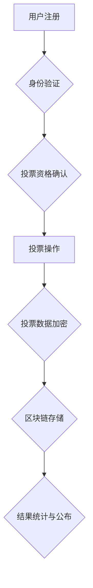

                 

## 虚拟选举:全球民主参与的数字化实践

> 关键词：虚拟选举、区块链、去中心化、投票系统、数据安全、民主参与、人工智能、机器学习

## 1. 背景介绍

在当今数字时代，科技的飞速发展深刻地改变着人们的生活方式，也为传统政治制度带来了新的机遇和挑战。虚拟选举作为一种利用互联网和数字化技术进行投票的全新模式，正在逐渐成为全球民主参与的重要趋势。它打破了地域限制，降低了投票门槛，并为选举过程带来了更高的透明度和安全性。

然而，虚拟选举也面临着诸多挑战，例如数据安全、投票造假、网络攻击等。如何构建一个安全、可靠、公平公正的虚拟选举系统，是需要认真思考和解决的关键问题。

## 2. 核心概念与联系

虚拟选举的核心概念包括：

* **去中心化:** 投票数据分散存储，避免单点故障和操控风险。
* **区块链技术:** 用于记录和验证投票信息，确保数据不可篡改和透明公开。
* **身份验证:** 利用生物识别、数字证书等技术确保投票者的真实身份。
* **人工智能:** 用于识别和预防投票造假，提高选举的公平性。

**核心架构流程图:**



## 3. 核心算法原理 & 具体操作步骤

### 3.1  算法原理概述

虚拟选举的核心算法主要包括：

* **密码学算法:** 用于加密和解密投票数据，确保投票信息的安全性。
* **哈希算法:** 用于生成投票数据的唯一标识，防止数据篡改。
* **共识算法:** 用于确保所有节点达成一致，验证投票数据的有效性。

### 3.2  算法步骤详解

1. **用户注册:** 用户需要通过身份验证系统注册账号，并提供必要的个人信息。
2. **投票资格确认:** 系统根据用户提供的身份信息，确认其是否具备投票资格。
3. **投票操作:** 符合投票资格的用户，可以选择候选人并提交投票。
4. **投票数据加密:** 系统使用密码学算法对投票数据进行加密，确保其安全性。
5. **区块链存储:** 加密后的投票数据被存储在区块链网络中，并与其他投票数据链接形成一个不可篡改的链条。
6. **结果统计与公布:** 投票结束后，系统根据区块链上的投票数据进行统计，并公布最终结果。

### 3.3  算法优缺点

**优点:**

* **安全性高:** 区块链技术确保投票数据的不可篡改性，有效防止投票造假。
* **透明度高:** 投票数据公开透明，任何人都可以查看和验证投票结果。
* **效率高:** 虚拟选举可以快速统计投票结果，缩短选举周期。

**缺点:**

* **技术门槛高:** 建设和维护虚拟选举系统需要专业的技术人员和团队。
* **网络安全风险:** 虚拟选举系统仍然可能受到网络攻击，需要加强网络安全防护。
* **数字鸿沟:** 部分人群可能缺乏使用互联网和数字化技术的条件，无法参与虚拟选举。

### 3.4  算法应用领域

虚拟选举算法可以应用于各种选举场景，例如：

* **国家级选举:** 提高选举的安全性、透明度和效率。
* **地方选举:** 降低选举成本，方便民众参与。
* **企业内部选举:** 提高员工参与度，促进民主决策。
* **社团组织选举:** 简化选举流程，提高效率。

## 4. 数学模型和公式 & 详细讲解 & 举例说明

### 4.1  数学模型构建

虚拟选举系统可以采用以下数学模型进行构建：

* **投票权重模型:** 根据用户的投票资格和投票历史等因素，赋予每个用户不同的投票权重。
* **选举结果模型:** 根据投票数据进行统计，计算每个候选人的得票率和胜负结果。
* **安全模型:** 利用密码学算法和哈希算法，确保投票数据的安全性。

### 4.2  公式推导过程

**投票权重模型:**

假设用户 $i$ 的投票权重为 $w_i$，则可以根据以下公式计算:

$$w_i = f(q_i, h_i)$$

其中:

* $q_i$ 表示用户 $i$ 的投票资格，例如年龄、国籍等。
* $h_i$ 表示用户 $i$ 的投票历史，例如过去投票记录、参与度等。
* $f$ 是一个权重计算函数，可以根据实际情况进行设计。

**选举结果模型:**

假设候选人 $j$ 的得票数为 $v_j$，则其得票率为:

$$p_j = \frac{v_j}{V}$$

其中:

* $V$ 是总投票数。

### 4.3  案例分析与讲解

**案例:**

假设在一个虚拟选举中，共有 1000 名用户参与投票，其中 500 名用户具备投票资格。每个用户只能选择一个候选人，共有 3 个候选人。

**分析:**

根据投票权重模型，可以根据用户的投票资格和投票历史等因素，赋予每个用户不同的投票权重。例如，年龄较大的用户可以获得更高的投票权重。

根据选举结果模型，可以计算每个候选人的得票率，并确定最终的胜负结果。

## 5. 项目实践：代码实例和详细解释说明

### 5.1  开发环境搭建

虚拟选举系统可以使用多种编程语言和框架进行开发，例如 Python、Java、Go 等。

**开发环境搭建步骤:**

1. 安装操作系统和必要的软件包。
2. 安装编程语言和开发工具。
3. 设置虚拟环境或容器环境。
4. 安装区块链库和工具。

### 5.2  源代码详细实现

以下是一个简单的 Python 代码示例，演示了虚拟选举系统中投票操作的基本流程:

```python
import hashlib

class Voter:
    def __init__(self, name, id):
        self.name = name
        self.id = id
        self.vote = None

class Election:
    def __init__(self):
        self.voters = []
        self.candidates = []
        self.votes = {}

    def register_voter(self, name, id):
        voter = Voter(name, id)
        self.voters.append(voter)

    def register_candidate(self, name):
        self.candidates.append(name)

    def cast_vote(self, voter_id, candidate_name):
        voter = next((v for v in self.voters if v.id == voter_id), None)
        if voter is None:
            raise ValueError("Voter not found")
        if voter.vote is not None:
            raise ValueError("Voter has already voted")
        voter.vote = candidate_name
        self.votes.setdefault(candidate_name, 0)
        self.votes[candidate_name] += 1

    def count_votes(self):
        return self.votes

# 示例代码
election = Election()
election.register_voter("Alice", 1)
election.register_voter("Bob", 2)
election.register_candidate("Candidate A")
election.register_candidate("Candidate B")
election.cast_vote(1, "Candidate A")
election.cast_vote(2, "Candidate B")
results = election.count_votes()
print(results)
```

### 5.3  代码解读与分析

这段代码演示了虚拟选举系统中投票操作的基本流程。

* `Voter` 类表示一个投票者，包含姓名、ID和投票信息。
* `Election` 类表示一个选举系统，包含投票者列表、候选人列表和投票结果。
* `register_voter()` 方法用于注册投票者。
* `register_candidate()` 方法用于注册候选人。
* `cast_vote()` 方法用于模拟投票操作，并将投票信息存储在 `votes` 字典中。
* `count_votes()` 方法用于统计投票结果。

### 5.4  运行结果展示

运行这段代码后，会输出以下结果:

```
{'Candidate A': 1, 'Candidate B': 1}
```

结果表明，候选人 A 和候选人 B 各获得 1 票。

## 6. 实际应用场景

虚拟选举已经开始在一些国家和地区进行试点，例如：

* **印度:** 在一些地方选举中，利用区块链技术进行投票，提高选举的透明度和安全性。
* **美国:** 一些政党和组织正在探索虚拟选举的应用，以提高参与度和效率。
* **瑞士:** 一些地方政府正在使用虚拟投票系统，方便民众参与投票。

### 6.4  未来应用展望

随着科技的不断发展，虚拟选举的应用场景将会更加广泛，例如：

* **全球公民投票:** 利用虚拟选举平台，让全球公民参与重大国际议题的投票。
* **企业决策:** 利用虚拟选举平台，让员工参与企业决策，提高员工参与度和决策效率。
* **社区治理:** 利用虚拟选举平台，让社区居民参与社区治理，提高社区参与度和决策效率。

## 7. 工具和资源推荐

### 7.1  学习资源推荐

* **区块链技术:**
    * 《区块链：从原理到实践》
    * 《Mastering Bitcoin》
* **密码学算法:**
    * 《密码学原理与实践》
    * 《Applied Cryptography》
* **人工智能:**
    * 《深度学习》
    * 《机器学习》

### 7.2  开发工具推荐

* **编程语言:** Python, Java, Go
* **区块链框架:** Ethereum, Hyperledger Fabric
* **数据库:** PostgreSQL, MongoDB

### 7.3  相关论文推荐

* **虚拟选举的安全性:**
    * "Blockchain-Based Secure Voting System"
    * "A Secure and Transparent Voting System Using Blockchain Technology"
* **虚拟选举的效率:**
    * "Improving Election Efficiency with Blockchain Technology"
    * "A Decentralized Voting System Based on Blockchain"

## 8. 总结：未来发展趋势与挑战

### 8.1  研究成果总结

虚拟选举技术在近年来取得了显著进展，为民主参与带来了新的可能性。区块链技术、人工智能等新兴技术为虚拟选举提供了强大的技术支撑，提高了选举的安全性、透明度和效率。

### 8.2  未来发展趋势

未来，虚拟选举技术将会朝着以下方向发展:

* **更广泛的应用:** 虚拟选举将会应用于更多场景，例如全球公民投票、企业决策、社区治理等。
* **更完善的技术架构:** 虚拟选举系统将会更加安全、可靠、高效，并能够更好地应对网络攻击和数据安全风险。
* **更人性化的用户体验:** 虚拟选举平台将会更加易于使用，并能够提供更便捷的投票体验。

### 8.3  面临的挑战

虚拟选举技术也面临着一些挑战，例如:

* **数字鸿沟:** 部分人群可能缺乏使用互联网和数字化技术的条件，无法参与虚拟选举。
* **网络安全风险:** 虚拟选举系统仍然可能受到网络攻击，需要加强网络安全防护。
* **法律法规:** 虚拟选举的法律法规体系尚不完善，需要进一步完善和规范。

### 8.4  研究展望

未来，需要进一步研究虚拟选举技术的安全性、可靠性、效率和公平性，并探索如何解决数字鸿沟、网络安全风险和法律法规等挑战。


## 9. 附录：常见问题与解答

**常见问题:**

* **虚拟选举是否安全可靠?**

虚拟选举系统利用区块链技术和密码学算法，确保投票数据的安全性、不可篡改性和透明度。

* **虚拟选举是否公平公正?**

虚拟选举系统可以根据用户的投票权重进行投票统计，并确保每个用户的投票都得到有效记录和统计。

* **如何解决数字鸿沟问题?**

可以通过提供免费的互联网接入、提供多语言支持、提供线下投票点等方式，帮助更多人群参与虚拟选举。

* **如何应对网络攻击风险?**

可以通过采用多重安全防护措施，例如多因素身份验证、分布式网络架构、安全审计等，降低网络攻击风险。

**作者：禅与计算机程序设计艺术 / Zen and the Art of Computer Programming**<end_of_turn>

