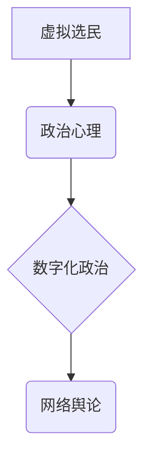

                 

## 虚拟选民行为学:全球公民参与的数字化政治心理研究

> 关键词：虚拟选民、政治心理、数字化政治、行为模型、算法分析、数据挖掘、网络舆论、公民参与、人工智能

## 1. 背景介绍

随着互联网和移动技术的飞速发展，数字化正在深刻地改变着人们的生活方式，政治参与也不例外。虚拟选民，即通过网络平台参与政治活动和表达政治观点的公民，已成为一种重要的政治参与方式。他们的行为模式、认知结构和决策机制与传统选民存在着显著差异，这为政治研究和实践带来了新的挑战和机遇。

传统政治心理学研究主要关注线下环境下的选民行为，而虚拟选民行为则更加复杂，受多种因素影响，例如网络环境、信息传播、群体心理等。研究虚拟选民行为学，对于理解当代政治生态、预测选举结果、促进公民参与、维护网络政治秩序具有重要意义。

## 2. 核心概念与联系

**2.1 虚拟选民的概念**

虚拟选民是指通过互联网、社交媒体等网络平台参与政治活动和表达政治观点的公民。他们利用网络进行政治信息获取、政治讨论、政治组织和政治行动，参与政治决策和社会治理。

**2.2 核心概念关系**

* **虚拟选民:**  网络平台参与政治活动的公民
* **政治心理:**  公民在政治活动中所表现出的认知、情感、态度和行为
* **数字化政治:**  利用互联网和数字技术进行政治活动和表达政治观点
* **网络舆论:**  通过网络平台传播和形成的公众意见和观点

**2.3 核心概念架构**



**2.3 核心概念关系**

虚拟选民的行为受其政治心理的影响，而数字化政治环境则塑造和影响着他们的政治心理。网络舆论是虚拟选民政治参与的重要组成部分，它反映了虚拟选民的政治态度和观点，也影响着他们的政治行为。

## 3. 核心算法原理 & 具体操作步骤

**3.1 算法原理概述**

虚拟选民行为分析算法主要利用数据挖掘和机器学习技术，从海量网络数据中提取特征，构建虚拟选民行为模型，预测他们的政治态度、投票意向和参与行为。常见的算法包括：

* **聚类算法:** 将虚拟选民根据其行为特征进行分类，识别不同类型的虚拟选民群体。
* **分类算法:** 根据虚拟选民的历史行为数据，预测他们未来的政治行为，例如投票选择。
* **关联规则挖掘:** 发现虚拟选民行为之间的关联关系，例如哪些信息源会影响他们的政治态度。

**3.2 算法步骤详解**

1. **数据收集:** 收集虚拟选民在网络平台上的行为数据，例如浏览记录、点赞、评论、转发等。
2. **数据预处理:** 清洗和转换数据，去除噪声和重复数据，将数据格式化为算法可处理的形式。
3. **特征提取:** 从原始数据中提取虚拟选民的行为特征，例如政治话题关注度、信息来源偏好、表达情感倾向等。
4. **模型构建:** 选择合适的算法，根据提取的特征构建虚拟选民行为模型。
5. **模型评估:** 使用测试数据评估模型的准确性和有效性，并进行模型调优。
6. **预测分析:** 利用训练好的模型预测虚拟选民未来的政治行为，并进行分析和解读。

**3.3 算法优缺点**

* **优点:** 可以从海量数据中发现隐藏的模式，提高对虚拟选民行为的理解和预测能力。
* **缺点:** 数据质量和算法选择对结果影响较大，存在算法偏差和隐私安全问题。

**3.4 算法应用领域**

* **政治竞选:** 分析虚拟选民的政治态度和投票意向，制定精准的竞选策略。
* **舆情监测:** 监测网络舆论的变化趋势，及时发现潜在的政治风险。
* **政策制定:** 了解虚拟选民的政治需求和诉求，为政策制定提供参考。

## 4. 数学模型和公式 & 详细讲解 & 举例说明

**4.1 数学模型构建**

虚拟选民行为模型可以构建为一个多变量回归模型，其中虚拟选民的行为变量（例如投票意向）作为因变量，其政治心理特征、网络环境特征、社会经济特征等作为自变量。

**4.2 公式推导过程**

假设虚拟选民的投票意向为Y，其政治心理特征为X1，网络环境特征为X2，社会经济特征为X3，则模型可以表示为：

$$Y = \beta_0 + \beta_1X_1 + \beta_2X_2 + \beta_3X_3 + \epsilon$$

其中：

* $\beta_0$ 为截距项
* $\beta_1$, $\beta_2$, $\beta_3$ 为自变量的回归系数
* $\epsilon$ 为随机误差项

通过最小二乘法等方法，可以估计回归系数，构建虚拟选民行为模型。

**4.3 案例分析与讲解**

例如，我们可以研究虚拟选民对特定政策的支持程度，并分析其与政治心理特征、网络环境特征、社会经济特征之间的关系。

* 政治心理特征：例如政治倾向、价值观、认知偏见等。
* 网络环境特征：例如信息来源、社交网络关系、网络舆论环境等。
* 社会经济特征：例如年龄、性别、收入、教育水平等。

通过收集和分析相关数据，我们可以构建一个多变量回归模型，预测虚拟选民对特定政策的支持程度，并分析其与不同特征之间的关系。

## 5. 项目实践：代码实例和详细解释说明

**5.1 开发环境搭建**

* 操作系统：Windows/macOS/Linux
* 编程语言：Python
* 数据分析库：Pandas, NumPy, Scikit-learn
* 可视化库：Matplotlib, Seaborn

**5.2 源代码详细实现**

```python
import pandas as pd
from sklearn.linear_model import LogisticRegression

# 数据加载
data = pd.read_csv('virtual_voter_data.csv')

# 特征选择
features = ['political_leaning', 'information_source', 'income', 'education']
X = data[features]
y = data['voting_intention']

# 模型训练
model = LogisticRegression()
model.fit(X, y)

# 模型预测
predictions = model.predict(X_new)

# 模型评估
accuracy = model.score(X, y)
print(f'模型准确率: {accuracy}')
```

**5.3 代码解读与分析**

* 代码首先加载虚拟选民数据，并选择相关的特征和目标变量。
* 然后使用逻辑回归模型训练虚拟选民行为模型。
* 模型训练完成后，可以使用模型预测新的虚拟选民的行为。
* 最后，评估模型的准确率，并进行分析和解读。

**5.4 运行结果展示**

运行结果将显示模型的准确率，以及预测结果。

## 6. 实际应用场景

**6.1 政治竞选**

虚拟选民行为分析可以帮助政党和候选人了解虚拟选民的政治态度和投票意向，制定精准的竞选策略。例如，可以根据虚拟选民的政治倾向，针对性地推送竞选信息，提高信息传播效率。

**6.2 舆情监测**

虚拟选民行为分析可以帮助政府和社会组织监测网络舆论的变化趋势，及时发现潜在的政治风险。例如，可以监测虚拟选民对特定事件的反应，预警社会情绪的变化。

**6.3 政策制定**

虚拟选民行为分析可以帮助政策制定者了解虚拟选民的政治需求和诉求，为政策制定提供参考。例如，可以分析虚拟选民对特定政策的支持程度，调整政策内容和实施方案。

**6.4 未来应用展望**

随着人工智能技术的不断发展，虚拟选民行为分析将更加精准和智能化。未来，虚拟选民行为分析可以应用于更广泛的领域，例如：

* **政治参与度提升:** 通过分析虚拟选民的行为模式，设计更有效的政治参与机制，提高公民的政治参与度。
* **政治风险防控:** 利用虚拟选民行为分析技术，预测和防控政治风险，维护社会稳定。
* **个性化政治服务:** 根据虚拟选民的个性化需求，提供更加精准和有效的政治服务。

## 7. 工具和资源推荐

**7.1 学习资源推荐**

* **书籍:**
    * 《数据挖掘:概念与技术》
    * 《机器学习》
    * 《网络舆情分析》
* **在线课程:**
    * Coursera: 数据挖掘与机器学习
    * edX: 网络舆情分析
* **网站:**
    * Kaggle: 数据科学竞赛平台
    * Towards Data Science: 数据科学博客平台

**7.2 开发工具推荐**

* **Python:** 数据分析和机器学习编程语言
* **Jupyter Notebook:** 数据分析和可视化工具
* **Pandas:** 数据处理和分析库
* **Scikit-learn:** 机器学习库
* **Matplotlib:** 数据可视化库

**7.3 相关论文推荐**

* **"The Impact of Social Media on Political Participation"**
* **"Predicting Voter Behavior Using Social Media Data"**
* **"A Survey of Online Political Discourse Analysis"**

## 8. 总结：未来发展趋势与挑战

**8.1 研究成果总结**

虚拟选民行为学研究取得了显著进展，构建了多种虚拟选民行为模型，并应用于政治竞选、舆情监测、政策制定等领域。

**8.2 未来发展趋势**

* **模型更加精准:** 利用更先进的机器学习算法和数据分析技术，构建更加精准的虚拟选民行为模型。
* **跨平台分析:** 将不同平台的虚拟选民数据整合分析，获得更全面的洞察。
* **个性化服务:** 根据虚拟选民的个性化需求，提供更加精准和有效的政治服务。

**8.3 面临的挑战**

* **数据质量:** 虚拟选民数据往往存在噪声和偏差，需要进行有效的数据清洗和处理。
* **算法偏差:** 算法本身可能存在偏差，导致预测结果不准确。
* **隐私安全:** 虚拟选民数据涉及个人隐私，需要采取有效措施保护数据安全。

**8.4 研究展望**

虚拟选民行为学研究是一个充满挑战和机遇的领域，未来将继续深入探索虚拟选民的行为模式、认知结构和决策机制，为政治参与、社会治理和民主发展提供新的理论和实践依据。

## 9. 附录：常见问题与解答

* **Q1: 虚拟选民行为分析是否会侵犯公民隐私？**

* **A1:** 虚拟选民行为分析需要遵循数据隐私保护原则，避免收集和使用敏感个人信息。

* **Q2: 虚拟选民行为分析的预测结果是否绝对准确？**

* **A2:** 虚拟选民行为分析的预测结果仅供参考，存在一定的误差范围。

* **Q3: 虚拟选民行为分析技术可以应用于哪些领域？**

* **A3:** 虚拟选民行为分析技术可以应用于政治竞选、舆情监测、政策制定、政治参与度提升等领域。


作者：禅与计算机程序设计艺术 / Zen and the Art of Computer Programming 
<end_of_turn>

