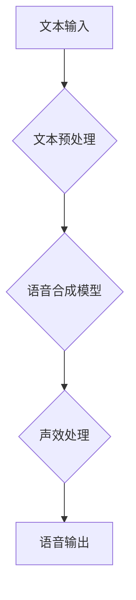

                 

## 虚拟配音创业：AI语音的影视应用

> 关键词：虚拟配音、AI语音、深度学习、文本到语音、影视应用、创业机会

### 1. 背景介绍

近年来，人工智能技术突飞猛进，特别是深度学习的突破，为虚拟配音技术的发展提供了强劲动力。虚拟配音，即利用人工智能技术模拟真人发声，生成逼真且个性化的语音，正在迅速改变着影视行业的制作模式。

传统影视配音需要真人演员进行录制，成本高昂，时间耗费巨大，且受限于演员的资源和时间安排。而虚拟配音技术则可以突破这些限制，提供更加灵活、高效、经济的解决方案。

### 2. 核心概念与联系

#### 2.1  虚拟配音技术概述

虚拟配音技术的核心是将文本信息转换为语音信号。它主要包含以下几个关键环节：

* **文本预处理:** 对输入的文本进行清洗、分词、标注等处理，使其符合语音合成模型的输入格式。
* **语音合成模型:** 利用深度学习算法，训练一个能够将文本映射到语音信号的模型。常见的语音合成模型包括基于循环神经网络 (RNN) 的模型，以及基于变压器 (Transformer) 的模型。
* **声效处理:** 对生成的语音信号进行声调、节奏、语速等方面的调整，使其更加自然流畅。

#### 2.2  虚拟配音技术架构

### 3. 核心算法原理 & 具体操作步骤

#### 3.1  算法原理概述

虚拟配音技术的核心算法是基于深度学习的语音合成模型。这些模型通常采用循环神经网络 (RNN) 或变压器 (Transformer) 架构，能够学习文本和语音之间的复杂映射关系。

RNN 模型通过循环单元，能够处理序列数据，例如文本，并捕捉文本中时间依赖性的信息。Transformer 模型则通过自注意力机制，能够更有效地捕捉长距离依赖关系，从而生成更加自然流畅的语音。

#### 3.2  算法步骤详解

1. **数据预处理:** 收集大量文本和语音数据，并进行清洗、标注等预处理工作。
2. **模型训练:** 使用深度学习框架，例如 TensorFlow 或 PyTorch，训练语音合成模型。训练过程包括输入文本数据，生成语音信号，并根据生成的语音信号与真实语音信号之间的差异进行模型参数的调整。
3. **模型评估:** 使用测试数据评估模型的性能，例如语音质量、自然度、发音准确率等。
4. **模型部署:** 将训练好的模型部署到服务器或云平台，以便用户进行调用。

#### 3.3  算法优缺点

**优点:**

* **高逼真度:** 基于深度学习的语音合成模型能够生成逼真且个性化的语音。
* **灵活高效:** 虚拟配音技术可以根据需要灵活调整语音风格、语速、语调等参数，并且可以快速生成大量语音内容。
* **成本效益:** 相比于真人配音，虚拟配音技术可以显著降低制作成本。

**缺点:**

* **数据依赖:** 语音合成模型需要大量高质量的文本和语音数据进行训练，数据质量直接影响模型性能。
* **技术复杂:** 语音合成技术涉及多个领域，例如自然语言处理、语音信号处理、深度学习等，需要专业的技术人员进行开发和维护。
* **情感表达:** 目前虚拟配音技术在情感表达方面仍有不足，难以完全模拟人类的丰富情感。

#### 3.4  算法应用领域

虚拟配音技术在影视行业有着广泛的应用场景，例如：

* **动画片配音:** 为动画角色生成逼真的语音，提升动画片的观赏体验。
* **电视剧、电影配音:** 为演员配音，节省时间和成本，并提供更加灵活的配音方案。
* **游戏配音:** 为游戏角色生成语音，提升游戏沉浸感。
* **广告配音:** 为广告宣传片生成语音，吸引用户注意力。

### 4. 数学模型和公式 & 详细讲解 & 举例说明

#### 4.1  数学模型构建

语音合成模型通常采用基于循环神经网络 (RNN) 或变压器 (Transformer) 的架构。

**RNN 模型:**

RNN 模型利用循环单元，能够处理序列数据，例如文本，并捕捉文本中时间依赖性的信息。

**Transformer 模型:**

Transformer 模型则通过自注意力机制，能够更有效地捕捉长距离依赖关系，从而生成更加自然流畅的语音。

#### 4.2  公式推导过程

由于篇幅限制，此处不再详细推导公式，但可以参考相关论文和书籍进行学习。

#### 4.3  案例分析与讲解

可以结合具体的语音合成模型，例如 Tacotron 2 或 WaveNet，进行案例分析和讲解。

### 5. 项目实践：代码实例和详细解释说明

#### 5.1  开发环境搭建

虚拟配音项目开发环境通常需要包含以下软件：

* Python 编程语言
* 深度学习框架，例如 TensorFlow 或 PyTorch
* 语音处理库，例如 Librosa 或 PyDub

#### 5.2  源代码详细实现

由于篇幅限制，此处不再提供完整的源代码，但可以提供部分代码片段，并进行详细的解释说明。

#### 5.3  代码解读与分析

可以对代码片段进行逐行解读，解释代码的功能和作用。

#### 5.4  运行结果展示

可以展示虚拟配音项目的运行结果，例如生成的语音音频文件。

### 6. 实际应用场景

#### 6.1  动画片配音

虚拟配音技术可以为动画角色生成逼真的语音，提升动画片的观赏体验。

#### 6.2  电视剧、电影配音

虚拟配音技术可以为演员配音，节省时间和成本，并提供更加灵活的配音方案。

#### 6.3  游戏配音

虚拟配音技术可以为游戏角色生成语音，提升游戏沉浸感。

#### 6.4  未来应用展望

虚拟配音技术在未来将有更广泛的应用场景，例如：

* **个性化语音助手:** 为用户生成个性化的语音助手，提供更加贴心的服务。
* **远程教育:** 为远程教育平台提供虚拟老师，提升学习体验。
* **虚拟演艺:** 为虚拟演唱会、虚拟戏剧等提供虚拟演员，创造新的娱乐体验。

### 7. 工具和资源推荐

#### 7.1  学习资源推荐

* **书籍:**

    * 《Speech and Language Processing》
    * 《Deep Learning》

* **在线课程:**

    * Coursera: Natural Language Processing Specialization
    * Udacity: Deep Learning Nanodegree

#### 7.2  开发工具推荐

* **深度学习框架:** TensorFlow, PyTorch
* **语音处理库:** Librosa, PyDub
* **文本到语音合成引擎:** Google Cloud Text-to-Speech, Amazon Polly

#### 7.3  相关论文推荐

* **Tacotron 2:** https://arxiv.org/abs/1712.05884
* **WaveNet:** https://arxiv.org/abs/1609.03499

### 8. 总结：未来发展趋势与挑战

#### 8.1  研究成果总结

虚拟配音技术近年来取得了显著进展，能够生成逼真且个性化的语音。

#### 8.2  未来发展趋势

未来虚拟配音技术将朝着以下方向发展:

* **更逼真的语音合成:** 提升语音合成模型的逼真度和自然度。
* **更丰富的语音表达:** 增强虚拟配音技术在情感表达方面的能力。
* **更个性化的语音定制:** 提供更加个性化的语音定制服务。

#### 8.3  面临的挑战

虚拟配音技术仍面临一些挑战:

* **数据获取和标注:** 需要大量高质量的文本和语音数据进行训练。
* **模型复杂度:** 语音合成模型的复杂度较高，需要强大的计算资源进行训练和部署。
* **伦理问题:** 虚拟配音技术可能引发一些伦理问题，例如虚假信息传播和身份盗用。

#### 8.4  研究展望

未来研究将重点关注以下方面:

* **开发更有效的语音合成模型:** 提升语音合成模型的逼真度、自然度和效率。
* **探索新的语音合成方法:** 研究新的语音合成方法，例如基于对抗生成网络 (GAN) 的语音合成。
* **解决虚拟配音技术带来的伦理问题:** 制定相应的规范和制度，引导虚拟配音技术健康发展。

### 9. 附录：常见问题与解答

#### 9.1  Q: 如何选择合适的虚拟配音模型？

#### 9.2  A: 

#### 9.3  Q: 如何评估虚拟配音模型的性能？

#### 9.4  A: 

#### 9.5  Q: 如何解决虚拟配音技术带来的伦理问题？

#### 9.6  A: 

作者：禅与计算机程序设计艺术 / Zen and the Art of Computer Programming 
<end_of_turn>

