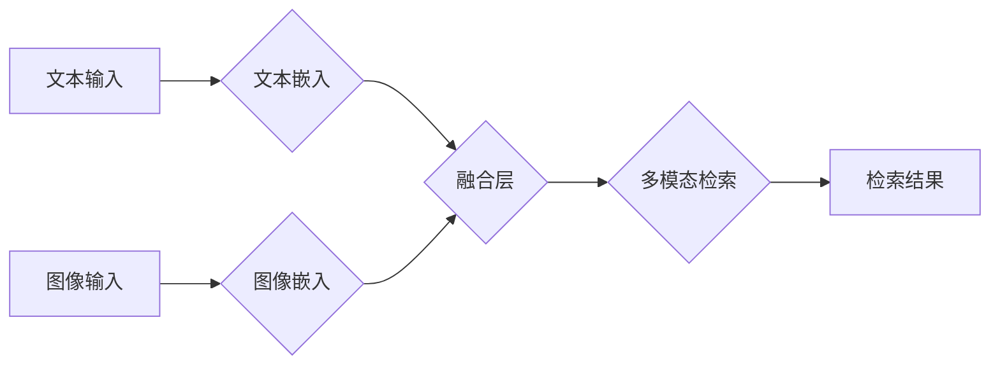

                 

## 融合AI大模型的多模态搜索技术

> 关键词：多模态搜索、AI大模型、文本检索、图像检索、视频检索、融合技术、BERT、CLIP

### 1. 背景介绍

随着互联网信息爆炸式增长，信息获取和处理面临着前所未有的挑战。传统的基于文本的搜索引擎在处理多类型信息时显得力不从心。多模态搜索技术应运而生，旨在突破单一文本检索的局限性，通过融合文本、图像、音频、视频等多种数据类型，实现更精准、更智能的信息检索。

近年来，深度学习技术的飞速发展，特别是 Transformer 架构的出现，为多模态搜索技术带来了新的机遇。基于 Transformer 的大语言模型 (LLM) 和多模态模型 (MMT) 能够有效地学习和理解不同模态之间的语义关系，为多模态搜索提供了强大的技术支撑。

### 2. 核心概念与联系

多模态搜索的核心在于将不同模态的信息融合在一起，构建一个统一的语义表示空间。

**2.1 核心概念**

* **多模态数据:** 指包含多种数据类型的信息，例如文本、图像、音频、视频等。
* **模态嵌入:** 将不同模态的数据映射到一个低维向量空间，称为模态嵌入。
* **跨模态关联:** 学习不同模态之间的语义关系，例如图像与文本之间的关联。
* **多模态融合:** 将不同模态的嵌入信息融合在一起，构建一个统一的语义表示。

**2.2 架构图**



### 3. 核心算法原理 & 具体操作步骤

**3.1 算法原理概述**

多模态搜索算法通常包括以下步骤：

1. **模态预处理:** 对不同模态的数据进行预处理，例如文本分词、图像裁剪、音频降噪等。
2. **模态嵌入:** 使用预训练的模型或专门设计的模型，将不同模态的数据映射到一个低维向量空间。
3. **跨模态关联学习:** 使用注意力机制、匹配网络等技术，学习不同模态之间的语义关系。
4. **多模态融合:** 将不同模态的嵌入信息融合在一起，构建一个统一的语义表示。
5. **检索:** 使用融合后的语义表示，进行检索，返回与查询最相关的结果。

**3.2 算法步骤详解**

1. **文本预处理:** 对文本数据进行分词、去停用词、词干提取等处理，生成文本特征向量。
2. **图像预处理:** 对图像数据进行尺寸调整、颜色空间转换、特征提取等处理，生成图像特征向量。
3. **文本嵌入:** 使用预训练的语言模型，例如 BERT，将文本特征向量映射到一个低维向量空间。
4. **图像嵌入:** 使用预训练的图像模型，例如 ResNet，将图像特征向量映射到一个低维向量空间。
5. **跨模态关联学习:** 使用注意力机制，学习文本和图像之间的语义关联，生成一个跨模态关联向量。
6. **多模态融合:** 将文本嵌入向量、图像嵌入向量和跨模态关联向量进行融合，生成一个统一的多模态语义表示。
7. **检索:** 使用融合后的多模态语义表示，与数据库中的多模态数据进行匹配，返回与查询最相关的结果。

**3.3 算法优缺点**

* **优点:**
    * 能够处理多种数据类型，提高检索的准确性和完整性。
    * 能够学习不同模态之间的语义关系，理解用户意图。
    * 能够提供更丰富的检索结果，例如文本、图像、视频等。
* **缺点:**
    * 算法复杂度较高，需要大量的计算资源。
    * 需要大量的多模态数据进行训练，数据标注成本较高。
    * 跨模态关联学习仍然是一个挑战，需要进一步的研究。

**3.4 算法应用领域**

* **电商搜索:** 结合商品图像、文本描述、用户评论等信息，提高商品搜索的准确性和用户体验。
* **图像检索:** 根据文本描述检索相关的图像，例如搜索“夕阳下的海滩”图片。
* **视频检索:** 根据文本描述或关键词检索相关的视频片段，例如搜索“2023年世界杯决赛”视频。
* **医疗诊断:** 结合患者病历、医学影像等信息，辅助医生进行诊断。
* **教育教学:** 结合文本、图像、视频等信息，提供更丰富的学习资源。

### 4. 数学模型和公式 & 详细讲解 & 举例说明

**4.1 数学模型构建**

多模态搜索的数学模型通常基于以下假设：

* 不同模态的数据可以表示为向量空间中的点。
* 不同模态之间的语义关系可以表示为向量之间的相似度。
* 检索的目标是找到与查询向量最相似的多模态数据点。

**4.2 公式推导过程**

假设文本数据为 $T = \{t_1, t_2, ..., t_n\}$, 图像数据为 $I = \{i_1, i_2, ..., i_m\}$, 查询文本为 $q$, 查询图像为 $v$.

* 文本嵌入: $t_i \rightarrow e_i \in R^d$
* 图像嵌入: $i_j \rightarrow f_j \in R^d$
* 文本-图像关联: $e_i \cdot f_j$
* 多模态融合: $h = \text{concat}(e_q, f_v, \text{sim}(e_q, f_v))$
* 检索: $score(h, e_i, f_j) = h \cdot \text{concat}(e_i, f_j)$

其中，$e_i$ 和 $f_j$ 分别是文本 $t_i$ 和图像 $i_j$ 的嵌入向量，$d$ 是嵌入向量的维度，$\text{sim}(e_q, f_v)$ 是文本 $q$ 和图像 $v$ 之间的关联度，$h$ 是融合后的多模态语义表示，$\text{concat}$ 是向量拼接操作，$score$ 是检索得分函数。

**4.3 案例分析与讲解**

例如，用户查询 “一只白色的猫在草地上玩耍”。

* 文本嵌入: 将 “一只白色的猫在草地上玩耍” 转换为文本嵌入向量 $e_q$.
* 图像嵌入: 将与查询相关的图像转换为图像嵌入向量 $f_v$.
* 文本-图像关联: 计算 $e_q$ 和 $f_v$ 之间的关联度，例如使用余弦相似度。
* 多模态融合: 将 $e_q$, $f_v$ 和关联度 $\text{sim}(e_q, f_v)$ 拼接成融合向量 $h$.
* 检索: 将 $h$ 与数据库中的所有多模态数据进行匹配，返回与 $h$ 最相似的结果。

### 5. 项目实践：代码实例和详细解释说明

**5.1 开发环境搭建**

* Python 3.7+
* PyTorch 1.7+
* CUDA 10.2+
* torchvision
* transformers

**5.2 源代码详细实现**

```python
import torch
from transformers import CLIPProcessor, CLIPModel

# 加载预训练模型
model_name = "openai/clip-vit-base-patch32"
processor = CLIPProcessor.from_pretrained(model_name)
model = CLIPModel.from_pretrained(model_name)

# 文本和图像预处理
text = "一只白色的猫在草地上玩耍"
image = ... # 加载图像数据

inputs = processor(text, images=image, return_tensors="pt")

# 模型推理
with torch.no_grad():
    outputs = model(**inputs)

# 获取文本和图像的嵌入向量
text_embedding = outputs.text_features
image_embedding = outputs.image_features

# 计算文本和图像之间的关联度
similarity = torch.cosine_similarity(text_embedding, image_embedding)

# 打印关联度
print(similarity)
```

**5.3 代码解读与分析**

* 使用 `transformers` 库加载预训练的 CLIP 模型。
* 使用 `CLIPProcessor` 对文本和图像进行预处理。
* 使用 `CLIPModel` 进行模型推理，获取文本和图像的嵌入向量。
* 使用 `torch.cosine_similarity` 计算文本和图像之间的关联度。

**5.4 运行结果展示**

运行代码后，会输出文本和图像之间的关联度，数值范围在 0 到 1 之间，数值越高表示关联度越高。

### 6. 实际应用场景

**6.1 商业场景**

* **电商搜索:** 结合商品图像、文本描述、用户评论等信息，提高商品搜索的准确性和用户体验。例如，用户搜索 “红色长款外套”，系统可以返回与 “红色” 和 “长款外套” 相关的商品图像和文本信息。
* **旅游搜索:** 结合旅游景点图像、文本描述、用户评价等信息，帮助用户找到心仪的旅游目的地。例如，用户搜索 “海边度假”，系统可以返回与 “海滩”、“酒店”、“水上活动” 相关的图像和文本信息。

**6.2 社会场景**

* **新闻搜索:** 结合新闻文本、图像、视频等信息，提供更全面的新闻报道。例如，用户搜索 “世界杯决赛”，系统可以返回与 “比赛现场”、“球员表现”、“赛果分析” 相关的文本、图像和视频信息。
* **教育搜索:** 结合教材文本、图像、视频等信息，提供更丰富的学习资源。例如，用户搜索 “细胞结构”，系统可以返回与 “细胞图”、“细胞功能” 相关的文本、图像和视频信息。

**6.3 未来应用展望**

随着 AI 技术的不断发展，多模态搜索技术将有更广泛的应用场景：

* **智能客服:** 使用多模态信息理解用户需求，提供更精准的客服服务。
* **医疗诊断辅助:** 结合患者病历、医学影像等信息，辅助医生进行更准确的诊断。
* **个性化推荐:** 根据用户的多模态数据，提供更个性化的商品、服务和内容推荐。

### 7. 工具和资源推荐

**7.1 学习资源推荐**

* **书籍:**
    * 《深度学习》 - Ian Goodfellow, Yoshua Bengio, Aaron Courville
    * 《自然语言处理》 - Dan Jurafsky, James H. Martin
* **课程:**
    * Stanford CS231n: Convolutional Neural Networks for Visual Recognition
    * DeepLearning.AI: Natural Language Processing Specialization

**7.2 开发工具推荐**

* **框架:** PyTorch, TensorFlow
* **库:** transformers, torchvision, opencv-python

**7.3 相关论文推荐**

* **CLIP:** Learning Transferable Visual Models with Natural Language Supervision
* **BERT:** Pre-training of Deep Bidirectional Transformers for Language Understanding
* **DALL-E:** DALL-E: Creating Images from Text

### 8. 总结：未来发展趋势与挑战

**8.1 研究成果总结**

近年来，多模态搜索技术取得了显著进展，特别是基于 Transformer 的大语言模型和多模态模型的出现，为多模态搜索提供了强大的技术支撑。

**8.2 未来发展趋势**

* **更强大的模型:** 继续探索更强大的多模态模型，例如融合更多模态数据、提高模型参数量、使用更先进的架构设计。
* **更有效的训练方法:** 研究更有效的训练方法，例如自监督学习、迁移学习、联邦学习等，降低模型训练成本和数据标注成本。
* **更个性化的搜索体验:** 基于用户的多模态数据，提供更个性化的搜索体验，例如个性化推荐、多模态交互等。

**8.3 面临的挑战**

* **跨模态关联学习:** 跨模态关联学习仍然是一个挑战，需要进一步的研究和探索。
* **数据标注成本:** 多模态数据的标注成本较高，需要开发更有效的标注方法和工具。
* **模型解释性:** 多模态模型的解释性较差，需要研究更有效的模型解释方法。

**8.4 研究展望**

未来，多模态搜索技术将继续朝着更智能、更个性化、更普适的方向发展，为人们提供更便捷、更丰富的搜索体验。


### 9. 附录：常见问题与解答

**9.1 如何选择合适的多模态模型？**

选择合适的多模态模型需要根据具体的应用场景和数据特点进行选择。例如，对于文本和图像的搜索，可以考虑使用 CLIP 模型；对于文本、图像和音频的搜索，可以考虑使用更复杂的模型，例如 ALIGN 模型。

**9.2 如何进行多模态数据的标注？**

多模态数据的标注需要结合具体的应用场景和模型需求进行设计。例如，对于文本和图像的搜索，可以进行文本描述标注、图像标签标注等；对于文本和音频的搜索，可以进行文本转录标注、音频标签标注等。

**9.3 如何评估多模态搜索的性能？**

多模态搜索的性能可以评估指标包括：

* **准确率:** 返回结果中与查询相关的正确结果的比例。
* **召回率:** 返回所有相关结果中被检索到的结果的比例。
* **F1-score:** 准确率和召回率的 harmonic mean。
* **用户满意度:** 用户对检索结果的满意度。


作者：禅与计算机程序设计艺术 / Zen and the Art of Computer Programming<end_of_turn>

