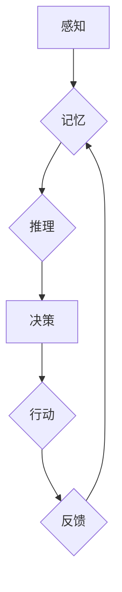

                 

## 认知科学与人工智能：模拟人类学习的尝试

> 关键词：认知科学、人工智能、机器学习、深度学习、神经网络、模拟学习、知识表示、推理

## 1. 背景介绍

人工智能（AI）的发展日新月异，从早期规则驱动的系统到如今的深度学习模型，AI已经取得了令人瞩目的成就。然而，与人类智能相比，AI仍然存在着许多局限性，例如缺乏真正的理解能力、泛化能力不足以及对新知识的学习能力有限。

认知科学致力于理解人类思维、学习和决策的过程，它为构建更智能的人工智能系统提供了宝贵的启示。模拟人类学习机制，让AI能够像人类一样从经验中学习、理解和应用知识，是人工智能领域一个重要的研究方向。

## 2. 核心概念与联系

### 2.1 认知科学与人工智能的联系

认知科学和人工智能在本质上都试图理解智能的本质，并试图构建能够表现出智能行为的系统。认知科学从生物学、心理学、神经科学等多个学科出发，研究人类认知过程的机制和原理，而人工智能则致力于利用计算机技术模拟和实现这些认知过程。

两者之间的联系可以从以下几个方面理解：

* **共同目标:** 认知科学和人工智能都旨在理解和模拟智能行为。
* **相互借鉴:** 认知科学的研究成果为人工智能提供了理论基础和启发，而人工智能的实践应用也推动了认知科学研究的进展。
* **交叉融合:** 近年来，认知科学和人工智能领域出现了越来越多的交叉研究，例如基于认知科学原理的机器学习算法、模拟人类决策过程的人工智能系统等。

### 2.2 人类学习机制

人类学习是一个复杂的过程，涉及感知、记忆、推理、语言理解等多个认知功能。

* **感知:** 通过感官接收信息，构建对世界的理解。
* **记忆:** 将信息存储和检索，形成知识库。
* **推理:** 从已知信息中推导出新的知识和结论。
* **语言理解:** 理解和生成语言，进行交流和知识获取。

### 2.3 人工智能学习模型

人工智能学习模型试图模拟人类学习机制，从数据中学习知识和规律。常见的学习模型包括：

* **监督学习:** 在已标记的数据集上训练模型，学习输入与输出之间的映射关系。
* **无监督学习:** 在未标记的数据集上训练模型，发现数据中的潜在结构和规律。
* **强化学习:** 通过与环境交互，学习最优的策略以获得最大奖励。

**Mermaid 流程图**



## 3. 核心算法原理 & 具体操作步骤

### 3.1 算法原理概述

深度学习算法是模拟人类大脑神经网络结构的一种机器学习算法。它由多层神经元组成，每层神经元之间通过连接权重进行信息传递。通过训练，深度学习模型可以学习到复杂的特征表示和决策规则。

### 3.2 算法步骤详解

1. **数据预处理:** 将原始数据转换为深度学习模型可以理解的格式，例如归一化、编码等。
2. **网络结构设计:** 根据任务需求设计深度学习模型的网络结构，包括神经元数量、层数、激活函数等。
3. **参数初始化:** 为网络中的连接权重赋予初始值。
4. **前向传播:** 将输入数据通过网络层层传递，最终得到输出结果。
5. **损失函数计算:** 计算模型输出与真实值的差异，即损失值。
6. **反向传播:** 根据损失值，调整网络连接权重，使模型输出更接近真实值。
7. **迭代训练:** 重复前向传播和反向传播过程，直到模型达到预设的性能指标。

### 3.3 算法优缺点

**优点:**

* **强大的学习能力:** 可以学习到复杂的特征表示和决策规则。
* **泛化能力强:** 可以应用于多种不同的任务和领域。
* **不断进步:** 随着算法和硬件的不断发展，深度学习模型的性能也在不断提升。

**缺点:**

* **数据依赖性强:** 需要大量的训练数据才能达到良好的性能。
* **训练时间长:** 训练深度学习模型需要消耗大量的计算资源和时间。
* **可解释性差:** 深度学习模型的决策过程难以理解和解释。

### 3.4 算法应用领域

深度学习算法已广泛应用于各个领域，例如：

* **计算机视觉:** 图像识别、物体检测、图像分割等。
* **自然语言处理:** 文本分类、机器翻译、语音识别等。
* **推荐系统:** 商品推荐、内容推荐等。
* **医疗诊断:** 疾病诊断、影像分析等。

## 4. 数学模型和公式 & 详细讲解 & 举例说明

### 4.1 数学模型构建

深度学习模型的核心是神经网络，它由多个层级的神经元组成。每个神经元接收来自前一层神经元的输入信号，并通过激活函数进行处理，输出到下一层神经元。

**神经元模型:**

$$
y = f(w^T x + b)
$$

其中：

* $y$ 是神经元的输出值。
* $x$ 是输入信号向量。
* $w$ 是连接权重向量。
* $b$ 是偏置项。
* $f$ 是激活函数。

### 4.2 公式推导过程

深度学习模型的训练过程是通过反向传播算法来实现的。反向传播算法的核心是计算损失函数对模型参数的梯度，并根据梯度更新模型参数。

**损失函数:**

$$
L = \frac{1}{N} \sum_{i=1}^{N} (y_i - \hat{y}_i)^2
$$

其中：

* $L$ 是损失函数值。
* $N$ 是样本数量。
* $y_i$ 是真实值。
* $\hat{y}_i$ 是模型预测值。

**梯度下降算法:**

$$
\theta = \theta - \alpha \nabla L(\theta)
$$

其中：

* $\theta$ 是模型参数。
* $\alpha$ 是学习率。
* $\nabla L(\theta)$ 是损失函数对模型参数的梯度。

### 4.3 案例分析与讲解

**举例说明:**

假设我们训练一个深度学习模型来识别猫和狗的图片。

* **输入数据:** 猫和狗的图片。
* **输出结果:** 猫或狗的类别标签。
* **损失函数:** 均方误差函数。
* **梯度下降算法:** 使用随机梯度下降算法来更新模型参数。

通过训练，模型可以学习到猫和狗的特征，并能够准确地识别出图片中的猫和狗。

## 5. 项目实践：代码实例和详细解释说明

### 5.1 开发环境搭建

* **操作系统:** Ubuntu 18.04
* **编程语言:** Python 3.6
* **深度学习框架:** TensorFlow 2.0

### 5.2 源代码详细实现

```python
import tensorflow as tf

# 定义模型结构
model = tf.keras.models.Sequential([
    tf.keras.layers.Conv2D(32, (3, 3), activation='relu', input_shape=(28, 28, 1)),
    tf.keras.layers.MaxPooling2D((2, 2)),
    tf.keras.layers.Conv2D(64, (3, 3), activation='relu'),
    tf.keras.layers.MaxPooling2D((2, 2)),
    tf.keras.layers.Flatten(),
    tf.keras.layers.Dense(10, activation='softmax')
])

# 编译模型
model.compile(optimizer='adam',
              loss='sparse_categorical_crossentropy',
              metrics=['accuracy'])

# 加载数据集
(x_train, y_train), (x_test, y_test) = tf.keras.datasets.mnist.load_data()

# 数据预处理
x_train = x_train.astype('float32') / 255.0
x_test = x_test.astype('float32') / 255.0
x_train = x_train.reshape((x_train.shape[0], 28, 28, 1))
x_test = x_test.reshape((x_test.shape[0], 28, 28, 1))

# 训练模型
model.fit(x_train, y_train, epochs=5)

# 评估模型
loss, accuracy = model.evaluate(x_test, y_test)
print('Test loss:', loss)
print('Test accuracy:', accuracy)
```

### 5.3 代码解读与分析

* **模型结构:** 代码定义了一个简单的卷积神经网络模型，包含两层卷积层、两层池化层、一层全连接层和一层输出层。
* **模型编译:** 使用 Adam 优化器、均方误差损失函数和准确率指标来编译模型。
* **数据加载:** 使用 MNIST 数据集作为训练数据。
* **数据预处理:** 将数据归一化到 0 到 1 之间，并将其转换为适合模型输入的格式。
* **模型训练:** 使用 `model.fit()` 函数训练模型，训练 5 个 epochs。
* **模型评估:** 使用 `model.evaluate()` 函数评估模型在测试集上的性能。

### 5.4 运行结果展示

运行代码后，会输出模型在测试集上的损失值和准确率。

## 6. 实际应用场景

### 6.1 图像识别

深度学习算法在图像识别领域取得了突破性的进展，例如：

* **人脸识别:** 用于解锁手机、身份验证等。
* **物体检测:** 用于自动驾驶、安防监控等。
* **图像分类:** 用于医学影像诊断、产品分类等。

### 6.2 自然语言处理

深度学习算法在自然语言处理领域也取得了显著的成果，例如：

* **机器翻译:** 将一种语言翻译成另一种语言。
* **文本摘要:** 自动生成文本的摘要。
* **情感分析:** 分析文本的情感倾向。

### 6.3 其他应用场景

* **推荐系统:** 根据用户的历史行为推荐商品或内容。
* **语音识别:** 将语音转换为文本。
* **医疗诊断:** 辅助医生进行疾病诊断。

### 6.4 未来应用展望

随着深度学习算法的不断发展，其应用场景将会更加广泛，例如：

* **个性化教育:** 根据学生的学习情况提供个性化的学习方案。
* **智能客服:** 提供更加智能和人性化的客服服务。
* **自动写作:** 自动生成新闻报道、小说等文本。

## 7. 工具和资源推荐

### 7.1 学习资源推荐

* **书籍:**
    * 深度学习 (Deep Learning) - Ian Goodfellow, Yoshua Bengio, Aaron Courville
    * 人工智能：一种现代方法 (Artificial Intelligence: A Modern Approach) - Stuart Russell, Peter Norvig
* **在线课程:**
    * Coursera: 深度学习 Specialization
    * Udacity: 深度学习 Nanodegree
    * fast.ai: 深度学习课程

### 7.2 开发工具推荐

* **深度学习框架:** TensorFlow, PyTorch, Keras
* **编程语言:** Python
* **云计算平台:** Google Cloud Platform, Amazon Web Services, Microsoft Azure

### 7.3 相关论文推荐

* **AlexNet: ImageNet Classification with Deep Convolutional Neural Networks** - Alex Krizhevsky, Ilya Sutskever, Geoffrey E. Hinton
* **Deep Residual Learning for Image Recognition** - Kaiming He, Xiangyu Zhang, Shaoqing Ren, Jian Sun
* **Attention Is All You Need** - Ashish Vaswani, Noam Shazeer, Niki Parmar, Jakob Uszkoreit, Llion Jones, Aidan N Gomez, Łukasz Kaiser, Illia Polosukhin

## 8. 总结：未来发展趋势与挑战

### 8.1 研究成果总结

近年来，深度学习算法取得了令人瞩目的成就，在图像识别、自然语言处理等领域取得了突破性的进展。

### 8.2 未来发展趋势

* **模型更深、更复杂:** 研究更深层次、更复杂的深度学习模型，以提高模型的学习能力和泛化能力。
* **数据更丰富、更多样:** 探索新的数据来源，收集更丰富、更多样化的训练数据，以提高模型的鲁棒性和泛化能力。
* **算法更高效、更可解释:** 研究更高效的深度学习算法，并提高模型的可解释性，使其决策过程更加透明。
* **边缘计算:** 将深度学习模型部署到边缘设备上，实现更快速的推理速度和更低的延迟。

### 8.3 面临的挑战

* **数据隐私和安全:** 深度学习模型需要大量的训练数据，如何保护数据隐私和安全是一个重要的挑战。
* **模型可解释性:** 深度学习模型的决策过程难以理解，如何提高模型的可解释性是一个重要的研究方向。
* **算法偏见:** 深度学习模型可能存在算法偏见，如何消除算法偏见是一个重要的社会问题。

### 8.4 研究展望

未来，深度学习技术将继续发展，并在更多领域发挥重要作用。研究人员将继续探索新的算法、新的模型和新的应用场景，推动人工智能技术的发展。

## 9. 附录：常见问题与解答

**Q1: 深度学习和机器学习有什么区别？**

**A1:** 深度学习是机器学习的一种子集，它使用多层神经网络来学习复杂的特征表示。

**Q2: 如何选择合适的深度学习框架？**

**A2:** TensorFlow 和 PyTorch 是两个最流行的深度学习框架，选择哪个框架取决于具体的应用场景和个人喜好。

**Q3: 如何评估深度学习模型的性能？**

**A3:** 使用准确率、召回率、F1-score 等指标来评估深度学习模型的性能。

**作者：禅与计算机程序设计艺术 / Zen and the Art of Computer Programming**<end_of_turn>

