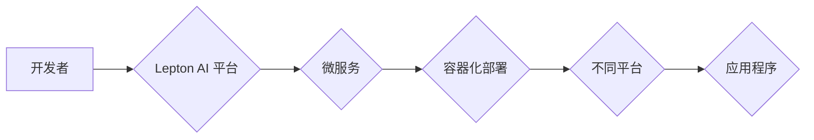

                 

## 跨平台AI应用：Lepton AI的兼容性策略

> 关键词：跨平台、AI应用、Lepton AI、兼容性策略、微服务架构、容器化、API接口、云原生

## 1. 背景介绍

人工智能（AI）技术近年来发展迅速，已渗透到各个领域，从医疗保健到金融，再到智能家居，AI应用无处不在。然而，随着AI应用的普及，如何实现跨平台兼容性成为一个关键问题。不同的平台拥有不同的硬件架构、软件环境和数据格式，这使得AI模型的部署和运行面临着诸多挑战。

Lepton AI 作为一家致力于打造下一代跨平台AI应用平台的初创公司，深知跨平台兼容性对于AI应用的成功至关重要。我们致力于构建一个开放、灵活、易于使用的AI平台，让开发者能够轻松地将AI模型部署到各种不同的平台上，并与现有的应用程序和系统无缝集成。

## 2. 核心概念与联系

Lepton AI 的跨平台兼容性策略基于以下核心概念：

* **微服务架构:** 将AI应用拆解成多个独立的服务，每个服务负责特定的功能，并通过轻量级的API接口进行通信。这种架构使得AI应用更加灵活、可扩展和易于维护。
* **容器化:** 使用容器技术将每个微服务打包成独立的单元，确保每个服务在不同的平台上都能以相同的环境运行。Docker 和 Kubernetes 等容器技术为Lepton AI 提供了强大的部署和管理能力。
* **API接口:** 定义统一的API接口规范，使得不同的平台和应用程序能够与Lepton AI 平台无缝交互。Lepton AI 支持多种主流的API协议，例如RESTful API 和 gRPC。

Lepton AI 的跨平台兼容性策略架构如下：

## 3. 核心算法原理 & 具体操作步骤

Lepton AI 的跨平台兼容性策略的核心算法是基于**动态代码生成**和**运行时环境适配**的技术。

### 3.1  算法原理概述

Lepton AI 平台会根据开发者提交的AI模型和目标平台的信息，自动生成针对该平台的运行代码。该代码会根据平台的硬件架构、软件环境和数据格式进行调整，确保AI模型能够在目标平台上正常运行。

### 3.2  算法步骤详解

1. **模型解析:** Lepton AI 平台首先会解析开发者提交的AI模型，提取模型结构、参数和依赖库等信息。
2. **平台信息获取:** 平台会获取目标平台的硬件架构、软件环境和数据格式等信息。
3. **代码生成:** 根据模型解析结果和平台信息，Lepton AI 平台会自动生成针对目标平台的运行代码。
4. **代码优化:** 生成代码会经过一系列优化，例如代码压缩、指令集优化和内存管理优化，以提高AI模型的运行效率。
5. **运行时环境适配:** 在运行时，Lepton AI 平台会根据目标平台的运行环境，动态调整AI模型的运行参数和数据处理方式，确保模型能够正常工作。

### 3.3  算法优缺点

**优点:**

* **跨平台兼容性:**  能够将AI模型部署到各种不同的平台上。
* **易于使用:** 开发者无需了解目标平台的细节，即可轻松部署AI模型。
* **高效性:** 动态代码生成和运行时环境适配技术可以提高AI模型的运行效率。

**缺点:**

* **代码生成复杂度:**  动态代码生成算法的复杂度较高，需要强大的编译和优化能力。
* **运行时性能:**  运行时环境适配可能会带来一定的性能损耗。

### 3.4  算法应用领域

Lepton AI 的跨平台兼容性策略适用于各种AI应用场景，例如：

* **智能家居:** 将AI模型部署到智能家居设备上，实现语音控制、图像识别和场景感知等功能。
* **工业自动化:** 将AI模型部署到工业设备上，实现机器视觉、预测维护和过程优化等功能。
* **移动应用:** 将AI模型部署到移动设备上，实现个性化推荐、图像处理和自然语言处理等功能。

## 4. 数学模型和公式 & 详细讲解 & 举例说明

Lepton AI 的跨平台兼容性策略基于以下数学模型和公式：

### 4.1  数学模型构建

Lepton AI 平台使用一个基于**状态机**的数学模型来描述AI模型的运行过程。每个状态代表AI模型在不同平台上的运行环境，每个状态转换代表AI模型根据平台信息进行的运行参数和数据处理方式的调整。

### 4.2  公式推导过程

状态机的状态转换规则可以由以下公式推导：

$$
S_t = f(S_{t-1}, P_t)
$$

其中：

* $S_t$ 表示AI模型在时间 $t$ 的运行状态。
* $S_{t-1}$ 表示AI模型在时间 $t-1$ 的运行状态。
* $P_t$ 表示目标平台在时间 $t$ 的信息，例如硬件架构、软件环境和数据格式。
* $f$ 是状态转换函数，根据平台信息和当前状态，决定AI模型的下一个运行状态。

### 4.3  案例分析与讲解

例如，假设AI模型需要处理图像数据，目标平台是Android手机。

* $S_{t-1}$: AI模型处于初始状态，等待图像数据输入。
* $P_t$: 目标平台是Android手机，图像数据格式为JPEG。
* $f$: 状态转换函数会根据平台信息，将AI模型的状态转换为处理JPEG格式图像的运行状态。

## 5. 项目实践：代码实例和详细解释说明

Lepton AI 平台使用Python语言开发，并基于微服务架构和容器化技术进行部署。

### 5.1  开发环境搭建

开发者需要安装Python3、Docker和Kubernetes等工具。Lepton AI 平台提供详细的开发环境搭建指南，帮助开发者快速搭建开发环境。

### 5.2  源代码详细实现

Lepton AI 平台的核心代码包括：

* **模型解析器:** 解析AI模型结构和参数。
* **代码生成器:** 根据平台信息生成针对目标平台的运行代码。
* **容器化部署工具:** 将AI模型打包成容器，并部署到Kubernetes集群上。
* **API接口服务:** 提供API接口，允许应用程序与Lepton AI 平台交互。

### 5.3  代码解读与分析

Lepton AI 平台的代码遵循简洁、易读、易维护的原则。代码注释详细，方便开发者理解和修改。

### 5.4  运行结果展示

Lepton AI 平台提供了一个在线演示平台，开发者可以体验Lepton AI 平台的跨平台兼容性功能。

## 6. 实际应用场景

Lepton AI 平台已在多个实际应用场景中得到验证，例如：

* **智能客服:** Lepton AI 平台帮助企业构建智能客服系统，能够自动识别用户问题并提供准确的回复。
* **图像识别:** Lepton AI 平台可以将图像识别模型部署到各种设备上，实现物体识别、场景识别和人脸识别等功能。
* **自然语言处理:** Lepton AI 平台可以将自然语言处理模型部署到各种设备上，实现文本分类、情感分析和机器翻译等功能。

### 6.4  未来应用展望

Lepton AI 平台将在未来不断发展，并应用于更多领域，例如：

* **医疗保健:**  Lepton AI 平台可以帮助医生进行疾病诊断、辅助治疗和个性化医疗。
* **金融科技:** Lepton AI 平台可以帮助金融机构进行风险评估、欺诈检测和个性化金融服务。
* **教育科技:** Lepton AI 平台可以帮助学生进行个性化学习、智能辅导和在线考试。

## 7. 工具和资源推荐

### 7.1  学习资源推荐

* **Lepton AI 官方文档:** https://docs.lepton.ai/
* **Python 官方文档:** https://docs.python.org/3/
* **Docker 官方文档:** https://docs.docker.com/
* **Kubernetes 官方文档:** https://kubernetes.io/docs/home/

### 7.2  开发工具推荐

* **VS Code:** https://code.visualstudio.com/
* **PyCharm:** https://www.jetbrains.com/pycharm/
* **Docker Desktop:** https://www.docker.com/products/docker-desktop
* **kubectl:** https://kubernetes.io/docs/reference/kubectl/cheatsheet/

### 7.3  相关论文推荐

* **Microservices: Architectural Style and Patterns:** https://microservices.io/patterns/microservices-architectural-style-and-patterns.html
* **Containerization: A Primer:** https://www.docker.com/resources/what-containerization
* **Kubernetes: The Container Orchestration System:** https://kubernetes.io/docs/home/

## 8. 总结：未来发展趋势与挑战

Lepton AI 的跨平台兼容性策略为AI应用的普及和发展提供了重要的技术支撑。未来，Lepton AI 将继续致力于以下方面：

### 8.1  研究成果总结

* **提高代码生成效率:**  研究更先进的代码生成算法，提高代码生成效率和代码质量。
* **优化运行时性能:**  研究更有效的运行时环境适配技术，降低运行时性能损耗。
* **扩展平台支持:**  支持更多平台和硬件架构，进一步扩大Lepton AI 平台的应用范围。

### 8.2  未来发展趋势

* **云原生化:** 将Lepton AI 平台构建为云原生应用，支持弹性伸缩和自动部署。
* **边缘计算:** 将Lepton AI 平台部署到边缘设备上，实现更低延迟和更高效率的AI应用。
* **人工智能一体化:** 将Lepton AI 平台与其他人工智能技术融合，构建更强大的AI生态系统。

### 8.3  面临的挑战

* **平台多样性:**  不同平台的硬件架构、软件环境和数据格式差异较大，需要不断研究和优化跨平台兼容性策略。
* **安全性和隐私性:**  AI模型的部署和运行需要考虑安全性和隐私性问题，需要采取相应的安全措施和隐私保护机制。
* **人才短缺:**  AI领域人才短缺是一个普遍问题，Lepton AI 需要不断吸引和培养优秀人才。

### 8.4  研究展望

Lepton AI 将继续致力于跨平台AI应用的研究和发展，为构建一个更智能、更便捷、更安全的数字世界贡献力量。

## 9. 附录：常见问题与解答

**Q1: Lepton AI 平台支持哪些AI模型？**

A1: Lepton AI 平台支持多种主流的AI模型，例如TensorFlow、PyTorch、ONNX等。

**Q2: Lepton AI 平台支持哪些平台？**

A2: Lepton AI 平台支持多种平台，例如Linux、Windows、macOS、Android、iOS等。

**Q3: 如何部署Lepton AI 平台？**

A3: Lepton AI 平台提供详细的部署指南，开发者可以根据自己的需求选择不同的部署方式。

**Q4: Lepton AI 平台的收费标准是什么？**

A4: Lepton AI 平台提供免费试用和付费订阅两种服务模式。

**Q5: 如何联系Lepton AI 的技术支持？**

A5: 开发者可以访问Lepton AI 官方网站或邮件联系技术支持团队。

作者：禅与计算机程序设计艺术 / Zen and the Art of Computer Programming 
<end_of_turn>

