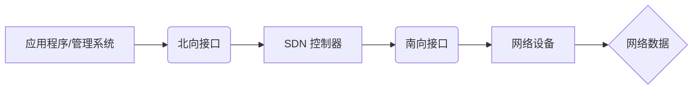

                 

## 软件定义网络（SDN）：网络架构的革新

> 关键词：软件定义网络（SDN）、网络虚拟化、网络编程、流量控制、网络安全、OpenFlow、控制器、数据平面、控制平面

## 1. 背景介绍

传统的网络架构以硬件设备为主导，网络功能和配置都嵌入在设备中，难以灵活调整和管理。随着网络规模的不断扩大和应用需求的多样化，传统的网络架构面临着诸多挑战：

* **缺乏灵活性:**  传统的网络设备配置需要人工干预，修改和部署过程繁琐且耗时，难以满足快速变化的业务需求。
* **管理复杂性:**  庞大的网络设备数量和复杂的网络拓扑结构导致网络管理难度大，难以实现全局的网络视图和统一的管理。
* **安全隐患:**  传统的网络安全机制主要依赖于设备级的安全策略，难以应对复杂的网络攻击和威胁。

为了解决这些问题，软件定义网络（Software-Defined Networking，SDN）应运而生。SDN是一种全新的网络架构，将网络控制逻辑从硬件设备中分离出来，集中管理在软件控制器中。

## 2. 核心概念与联系

SDN的核心概念是将网络控制平面和数据平面分离。

* **控制平面:**  负责网络的全局决策和配置，例如路由、流量控制和安全策略。SDN控制器位于控制平面上，它通过北向接口与应用程序和管理系统交互，通过南向接口与网络设备通信。
* **数据平面:**  负责网络数据转发，由交换机、路由器等网络设备组成。SDN网络设备通过OpenFlow协议与控制器通信，执行控制器的指令进行数据转发。

SDN架构的优势在于：

* **集中化管理:**  控制器可以统一管理整个网络，简化网络管理和配置。
* **灵活性和可编程性:**  网络功能可以通过软件定义和配置，实现快速部署和灵活调整。
* **网络虚拟化:**  SDN支持网络虚拟化，可以创建多个逻辑网络，隔离不同应用和用户。
* **增强安全性:**  SDN可以实现全局的网络安全策略，提高网络安全防护能力。

**SDN 架构流程图**



## 3. 核心算法原理 & 具体操作步骤

### 3.1  算法原理概述

SDN网络的控制逻辑主要基于流表（Flow Table）算法。流表是一种数据结构，用于存储网络流量匹配规则和相应的转发动作。

SDN控制器通过分析网络流量和应用需求，生成相应的流表规则，并下发到网络设备。网络设备根据流表规则进行数据转发，实现网络功能的实现。

### 3.2  算法步骤详解

1. **流量采集:**  SDN控制器通过网络设备收集网络流量信息，例如源地址、目的地址、协议类型等。
2. **流量分析:**  控制器对采集到的流量进行分析，识别流量模式和应用需求。
3. **流表规则生成:**  根据流量分析结果，控制器生成相应的流表规则，定义流量匹配条件和转发动作。
4. **流表规则下发:**  控制器将生成的流表规则下发到网络设备。
5. **数据转发:**  网络设备根据流表规则进行数据转发，将匹配的流量按照规则指定的动作进行处理。

### 3.3  算法优缺点

**优点:**

* **灵活性和可编程性:**  流表规则可以根据需求灵活定义，实现网络功能的定制化配置。
* **高效性和可扩展性:**  流表算法可以实现高速数据转发，并支持网络规模的扩展。

**缺点:**

* **规则管理复杂性:**  随着网络规模和应用需求的增加，流表规则的管理和维护会变得越来越复杂。
* **安全风险:**  流表规则的错误配置或攻击可能会导致网络安全漏洞。

### 3.4  算法应用领域

SDN流表算法广泛应用于以下领域:

* **网络虚拟化:**  创建和管理虚拟网络，隔离不同应用和用户。
* **网络安全:**  实现全局的网络安全策略，防御网络攻击和威胁。
* **流量控制:**  根据应用需求和网络带宽，控制流量转发和优先级。
* **网络服务质量:**  保证关键应用的网络服务质量，例如低延迟和高带宽。

## 4. 数学模型和公式 & 详细讲解 & 举例说明

### 4.1  数学模型构建

SDN网络的流量控制可以建模为一个队列系统。

* **队列:**  网络设备上的交换机端口可以看作是一个队列，用于存储等待转发的流量数据包。
* **服务率:**  交换机端口的转发速率，表示每单位时间可以处理的数据包数量。
* **到达率:**  流量数据包到达交换机端口的速率。

### 4.2  公式推导过程

流量控制的目标是保证网络稳定运行，避免队列过长导致丢包和网络拥塞。

常用的流量控制算法包括：

* **Token Bucket Algorithm:**  

   该算法使用一个令牌桶来限制流量，每个时间单位可以生成一定数量的令牌，流量数据包需要消耗令牌才能转发。

   令牌桶算法的数学模型如下:

   $$
   \text{Token Generation Rate} = r
   $$
   $$
   \text{Token Bucket Size} = b
   $$
   $$
   \text{Packet Rate} = \min(r, b)
   $$

   其中:

   * $r$ 是令牌生成速率。
   * $b$ 是令牌桶大小。
   * $\text{Packet Rate}$ 是允许的流量数据包转发速率。

* **Leaky Bucket Algorithm:**  

   该算法使用一个漏斗来限制流量，流量数据包进入漏斗后，按照漏斗的漏出速率逐个转发。

   漏斗算法的数学模型如下:

   $$
   \text{Leak Rate} = l
   $$
   $$
   \text{Packet Queue Size} = q
   $$
   $$
   \text{Packet Rate} = \min(l, q)
   $$

   其中:

   * $l$ 是漏斗的漏出速率。
   * $q$ 是流量数据包的队列长度。
   * $\text{Packet Rate}$ 是允许的流量数据包转发速率。

### 4.3  案例分析与讲解

**案例:**  假设一个网络设备的交换机端口的转发速率为 10Gbps，到达率为 8Gbps。

* **Token Bucket Algorithm:**  如果令牌生成速率为 8Gbps，令牌桶大小为 10Gbps，则允许的流量数据包转发速率为 8Gbps。
* **Leaky Bucket Algorithm:**  如果漏斗的漏出速率为 8Gbps，流量数据包的队列长度为 10Gbps，则允许的流量数据包转发速率为 8Gbps。

## 5. 项目实践：代码实例和详细解释说明

### 5.1  开发环境搭建

SDN网络开发环境通常包括以下组件:

* **SDN控制器:**  OpenDaylight, ONOS, Floodlight 等。
* **网络设备:**  支持OpenFlow协议的交换机或路由器。
* **编程语言:**  Python, Java, C++ 等。

### 5.2  源代码详细实现

以下是一个简单的Python代码示例，演示如何使用OpenFlow协议控制网络设备的流量转发:

```python
from pox.core import core
import pox.openflow.libopenflow_01 as of

class MyController(object):
    def __init__(self):
        self.listenports = []

    def _handle_ConnectionUp(self, event):
        self.listenports = event.port.ports

    def _handle_PacketIn(self, event):
        msg = of.ofp_packet_in(data=event.parsed)
        match = of.ofp_match(in_port=event.port)
        action = of.ofp_action_output(port=of.OFPP_CONTROLLER)
        actions = [action]
        out = of.ofp_flow_mod(match=match, actions=actions)
        event.connection.send(out)

def launch():
    core.openflow.addListeners(MyController())

```

### 5.3  代码解读与分析

* **MyController类:**  定义了一个SDN控制器类，用于处理网络事件。
* **_handle_ConnectionUp方法:**  当网络设备连接上时，获取设备的端口信息。
* **_handle_PacketIn方法:**  当收到网络数据包时，匹配数据包的端口信息，并将数据包转发到控制器。
* **launch方法:**  启动SDN控制器。

### 5.4  运行结果展示

运行上述代码后，SDN控制器将监听网络设备的流量，并将所有数据包转发到控制器。

## 6. 实际应用场景

SDN技术在各个领域都有广泛的应用场景:

### 6.1  数据中心网络

SDN可以简化数据中心网络管理，提高网络资源利用率，实现自动化部署和故障恢复。

### 6.2  云计算网络

SDN可以为云计算平台提供灵活的网络资源分配和管理，支持虚拟机和容器的快速部署和迁移。

### 6.3  物联网网络

SDN可以为物联网网络提供高效的流量控制和安全保障，支持海量设备的连接和数据传输。

### 6.4  未来应用展望

SDN技术还在不断发展，未来将有更多新的应用场景出现，例如:

* **网络切片:**  SDN可以实现网络资源的细粒度划分，为不同应用提供隔离的网络环境。
* **网络自动化:**  SDN可以与人工智能技术结合，实现网络的自动化管理和优化。
* **边缘计算:**  SDN可以为边缘计算提供灵活的网络连接和资源分配，支持边缘计算应用的快速部署和扩展。

## 7. 工具和资源推荐

### 7.1  学习资源推荐

* **OpenFlow规范:**  https://openflow.org/
* **OpenDaylight项目:**  https://www.opendaylight.org/
* **ONOS项目:**  https://onosproject.org/
* **Floodlight项目:**  https://floodlight.org/

### 7.2  开发工具推荐

* **Pox:**  https://pox.readthedocs.io/
* **Ryu:**  https://ryu.readthedocs.io/
* **Mininet:**  https://mininet.org/

### 7.3  相关论文推荐

* **Software-Defined Networking: A Comprehensive Survey**
* **OpenFlow: Enabling Innovation in Campus Networks**
* **SDN for the Enterprise: A Practical Guide**

## 8. 总结：未来发展趋势与挑战

### 8.1  研究成果总结

SDN技术已经取得了显著的成果，为网络架构带来了革命性的变革。SDN的灵活性和可编程性，为网络管理、安全和服务质量提供了新的解决方案。

### 8.2  未来发展趋势

SDN技术未来将朝着以下方向发展:

* **网络虚拟化:**  SDN将与虚拟化技术更加紧密地结合，实现更灵活和高效的网络资源管理。
* **人工智能:**  SDN将与人工智能技术结合，实现网络的自动化管理和优化。
* **边缘计算:**  SDN将为边缘计算提供灵活的网络连接和资源分配，支持边缘计算应用的快速部署和扩展。

### 8.3  面临的挑战

SDN技术也面临着一些挑战:

* **安全风险:**  SDN的集中化控制可能会增加网络安全风险，需要加强安全防护措施。
* **标准化问题:**  SDN标准化工作仍在进行中，不同厂商的SDN产品之间存在兼容性问题。
* **管理复杂性:**  随着网络规模的扩大，SDN控制器管理的复杂性也会增加。

### 8.4  研究展望

未来SDN技术的研究方向包括:

* **提高SDN安全性和可靠性:**  研究新的安全机制和容错机制，保障SDN网络的安全性和可靠性。
* **促进SDN标准化:**  推动SDN标准的制定和推广，实现不同厂商产品之间的互操作性。
* **开发更智能的SDN控制器:**  研究基于人工智能的SDN控制器，实现网络的自动化管理和优化。

## 9. 附录：常见问题与解答

**常见问题:**

* **SDN和传统网络架构有什么区别?**

   SDN将网络控制逻辑从硬件设备中分离出来，集中管理在软件控制器中，而传统网络架构则将控制逻辑嵌入在设备中。

* **SDN有哪些优势?**

   SDN具有灵活性和可编程性、集中化管理、网络虚拟化和增强安全性等优势。

* **SDN有哪些应用场景?**

   SDN应用于数据中心网络、云计算网络、物联网网络等领域。

**解答:**

* **SDN和传统网络架构的区别:**  SDN将网络控制逻辑从硬件设备中分离出来，集中管理在软件控制器中，而传统网络架构则将控制逻辑嵌入在设备中。

* **SDN的优势:**  SDN具有灵活性和可编程性、集中化管理、网络虚拟化和增强安全性等优势。

* **SDN的应用场景:**  SDN应用于数据中心网络、云计算网络、物联网网络等领域。


作者：禅与计算机程序设计艺术 / Zen and the Art of Computer Programming<end_of_turn>

