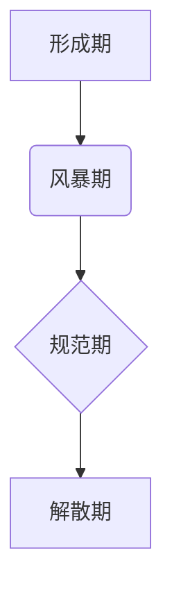

                 

## 运用福格模型培养团队良习惯

> 关键词：福格模型、团队文化、团队协作、软件开发、高效工作

### 1. 背景介绍

在当今快速发展的科技领域，团队合作已成为软件开发和创新不可或缺的一部分。高效的团队协作能够显著提高项目效率、产品质量和团队士气。然而，建立和维护一个高效协作的团队并非易事，需要团队成员之间建立良好的沟通、信任和共同目标意识。

福格模型（Tuckman's Stages of Group Development）是一个描述团队发展阶段的经典模型，它将团队发展过程分为四个阶段：形成期、风暴期、规范期和解散期。了解团队发展阶段的特性，能够帮助团队领导者更好地引导团队成员，促进团队协作和高效运作。

### 2. 核心概念与联系

福格模型的核心概念是团队发展是一个循序渐进的过程，每个阶段都有其独特的特点和挑战。

**福格模型流程图:**

**核心概念与联系:**

* **形成期:** 团队成员刚开始组建，彼此陌生，需要建立信任和了解。在这个阶段，团队成员通常比较谨慎，缺乏明确的目标和方向。
* **风暴期:** 团队成员开始积极参与讨论，表达自己的观点和想法，但同时也可能出现冲突和分歧。在这个阶段，团队需要明确目标和规则，建立有效的沟通机制。
* **规范期:** 团队成员逐渐建立起信任和默契，明确了目标和工作方式，团队运作效率提高。在这个阶段，团队需要不断优化工作流程，提升团队协作能力。
* **解散期:** 团队完成目标，解散或进入下一个阶段。在这个阶段，团队需要总结经验教训，做好知识传承和资源整合工作。

### 3. 核心算法原理 & 具体操作步骤

福格模型本身不是一个算法，而是一个描述团队发展阶段的模型。

**3.1 算法原理概述:**

福格模型的原理是基于团队发展是一个自然过程，每个阶段都有其独特的特点和挑战。通过了解每个阶段的特点，团队领导者可以采取相应的措施，引导团队成员顺利完成每个阶段，最终形成一个高效协作的团队。

**3.2 算法步骤详解:**

1. **识别团队发展阶段:** 通过观察团队成员的行为和互动，识别团队处于哪个阶段。
2. **了解阶段特点:** 了解每个阶段的特点，以及团队成员可能面临的挑战。
3. **采取相应措施:** 根据团队发展阶段的特点，采取相应的措施，引导团队成员顺利完成每个阶段。
4. **持续评估和调整:** 定期评估团队发展情况，根据实际情况调整策略和措施。

**3.3 算法优缺点:**

* **优点:** 
    * 模型简单易懂，易于应用。
    * 可以帮助团队领导者更好地理解团队发展过程。
    * 提供了指导团队发展方向的框架。
* **缺点:** 
    * 模型过于简化，不能完全反映团队发展的复杂性。
    * 每个团队的发展速度和阶段特征可能有所不同。
    * 模型不能解决所有团队问题。

**3.4 算法应用领域:**

福格模型广泛应用于团队管理、组织发展、项目管理等领域。

### 4. 数学模型和公式 & 详细讲解 & 举例说明

福格模型本身不包含数学模型和公式。

### 5. 项目实践：代码实例和详细解释说明

福格模型是一个描述团队发展阶段的模型，不涉及代码实例。

### 6. 实际应用场景

福格模型可以应用于各种团队，例如软件开发团队、营销团队、研究团队等。

**6.1 软件开发团队:**

在软件开发过程中，团队成员需要经历不同的阶段，例如需求分析、设计、编码、测试、部署等。福格模型可以帮助团队领导者了解每个阶段的特点，并采取相应的措施，例如在形成期加强团队成员之间的沟通和了解，在风暴期引导团队成员积极参与讨论，并解决冲突，在规范期建立有效的沟通机制和工作流程，在解散期总结经验教训，做好知识传承和资源整合工作。

**6.2 营销团队:**

营销团队需要进行市场调研、制定营销策略、执行营销活动等工作。福格模型可以帮助团队领导者了解每个阶段的特点，并采取相应的措施，例如在形成期明确团队目标和职责，在风暴期激发团队成员的创意和想法，在规范期建立有效的合作机制，在解散期总结营销活动的效果，并进行改进。

**6.3 研究团队:**

研究团队需要进行文献调研、实验设计、数据分析等工作。福格模型可以帮助团队领导者了解每个阶段的特点，并采取相应的措施，例如在形成期建立团队成员之间的信任和合作关系，在风暴期鼓励团队成员提出不同的观点和想法，在规范期建立有效的沟通和协作机制，在解散期总结研究成果，并进行推广。

**6.4 未来应用展望:**

随着团队合作在各个领域的日益重要，福格模型将继续被广泛应用于团队管理、组织发展、项目管理等领域。未来，福格模型可以与其他模型和工具结合，例如人工智能、数据分析等，进一步提高团队协作效率和效果。

### 7. 工具和资源推荐

**7.1 学习资源推荐:**

* Tuckman's Stages of Group Development: https://en.wikipedia.org/wiki/Tuckman%27s_stages_of_group_development
* The Five Stages of Team Development: https://www.mindtools.com/pages/article/newLDR_82.htm

**7.2 开发工具推荐:**

* 团队协作工具：Slack、Microsoft Teams、Zoom
* 项目管理工具：Jira、Trello、Asana

**7.3 相关论文推荐:**

* Tuckman, B. W. (1965). Developmental sequence in small groups. Psychological Bulletin, 63(6), 384-399.

### 8. 总结：未来发展趋势与挑战

**8.1 研究成果总结:**

福格模型为团队发展提供了重要的理论框架，帮助团队领导者更好地理解团队发展过程，并采取相应的措施，促进团队协作和高效运作。

**8.2 未来发展趋势:**

未来，福格模型将继续被完善和发展，例如结合人工智能、数据分析等技术，更加精准地预测团队发展趋势，并提供个性化的指导建议。

**8.3 面临的挑战:**

福格模型的应用也面临一些挑战，例如团队发展过程的复杂性，每个团队的特征差异较大，模型难以完全覆盖所有情况。

**8.4 研究展望:**

未来研究可以关注以下方面：

* 结合人工智能和数据分析技术，更加精准地预测团队发展趋势，并提供个性化的指导建议。
* 研究不同类型团队的福格模型应用，例如跨文化团队、虚拟团队等。
* 探索福格模型与其他团队发展模型的结合，构建更加完善的团队发展理论框架。

### 9. 附录：常见问题与解答

**9.1 团队发展速度如何？**

团队发展速度因团队规模、成员经验、项目复杂度等因素而异，一般来说，每个阶段的持续时间可能从几周到几个月不等。

**9.2 如何应对团队冲突？**

团队冲突是不可避免的，团队领导者需要采取积极措施，例如：

* 营造开放、包容的沟通氛围。
* 鼓励团队成员积极表达自己的观点和想法。
* 帮助团队成员理解彼此的立场和需求。
* 寻找共同目标和解决方案。

**9.3 如何促进团队成员之间的信任？**

* 建立团队共同目标和价值观。
* 鼓励团队成员互相帮助和支持。
* 营造公平、公正的团队氛围。
* 定期进行团队建设活动，增进团队成员之间的了解和感情。

作者：禅与计算机程序设计艺术 / Zen and the Art of Computer Programming 
<end_of_turn>

