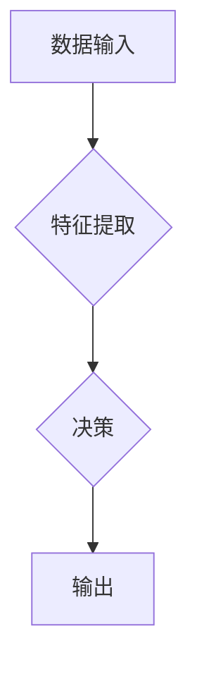

                 

## 进化时代：人工智能的未来

> 关键词：人工智能、深度学习、进化算法、自然语言处理、计算机视觉、机器学习、未来趋势

### 1. 背景介绍

人工智能（AI）正以惊人的速度发展，从简单的规则系统演变为能够学习、适应和解决复杂问题的智能系统。深度学习的兴起，特别是卷积神经网络和循环神经网络的突破，为人工智能带来了前所未有的进步。如今，人工智能已经渗透到我们的日常生活，从智能手机的语音助手到自动驾驶汽车，无处不在。

然而，人工智能的发展还处于早期阶段，面临着许多挑战。例如，现有的 AI 系统仍然缺乏人类的通用智能，难以理解和处理复杂的概念和情境。此外，人工智能的伦理问题也日益受到关注，例如算法偏见、数据隐私和工作岗位替代等。

### 2. 核心概念与联系

人工智能的核心概念是模拟人类智能的行为。这包括学习、推理、决策、感知和语言理解等能力。

**人工智能的架构通常包括以下几个部分：**

* **数据输入层：**接收来自外部环境的数据，例如图像、文本、音频等。
* **特征提取层：**从数据中提取有用的特征，例如图像中的边缘、文本中的关键词等。
* **决策层：**根据提取的特征进行决策，例如识别图像中的物体、翻译文本、生成文本等。
* **输出层：**将决策结果输出到外部环境，例如显示识别结果、生成翻译文本等。

**人工智能的进化过程可以概括为以下几个阶段：**

1. **规则式人工智能：**早期的人工智能系统主要基于预先定义的规则，例如专家系统。
2. **机器学习：**机器学习算法能够从数据中学习，无需明确的编程规则。
3. **深度学习：**深度学习算法使用多层神经网络，能够学习更复杂的特征和模式。

**Mermaid 流程图：**



### 3. 核心算法原理 & 具体操作步骤

#### 3.1  算法原理概述

深度学习算法的核心是多层神经网络。神经网络由许多相互连接的神经元组成，每个神经元接收来自其他神经元的输入，并根据权重进行计算，输出到下一个神经元。通过训练，神经网络能够学习到数据的特征和模式，从而实现预测、分类、识别等任务。

#### 3.2  算法步骤详解

**深度学习算法的训练过程通常包括以下步骤：**

1. **数据预处理：**将原始数据转换为深度学习算法可以处理的格式，例如归一化、编码等。
2. **网络结构设计：**根据任务需求设计神经网络的结构，包括神经元的数量、连接方式等。
3. **参数初始化：**为神经网络的参数（权重和偏置）赋初值。
4. **前向传播：**将输入数据通过神经网络进行计算，得到输出结果。
5. **损失函数计算：**比较输出结果与真实值之间的差异，计算损失函数的值。
6. **反向传播：**根据损失函数的梯度，调整神经网络的参数，使损失函数最小化。
7. **迭代训练：**重复前向传播、损失函数计算和反向传播的过程，直到损失函数收敛。

#### 3.3  算法优缺点

**深度学习算法的优点：**

* **学习能力强：**能够学习到复杂的数据特征和模式。
* **泛化能力好：**能够对未知数据进行准确预测。
* **应用范围广：**可以应用于图像识别、自然语言处理、语音识别等多个领域。

**深度学习算法的缺点：**

* **数据依赖性强：**需要大量的训练数据才能达到良好的性能。
* **训练时间长：**训练深度学习模型需要大量的计算资源和时间。
* **可解释性差：**深度学习模型的决策过程难以理解。

#### 3.4  算法应用领域

深度学习算法已广泛应用于以下领域：

* **计算机视觉：**图像识别、物体检测、图像分割、人脸识别等。
* **自然语言处理：**文本分类、情感分析、机器翻译、文本生成等。
* **语音识别：**语音转文本、语音助手等。
* **推荐系统：**商品推荐、内容推荐等。
* **医疗诊断：**疾病诊断、影像分析等。

### 4. 数学模型和公式 & 详细讲解 & 举例说明

#### 4.1  数学模型构建

深度学习算法的核心是神经网络，其数学模型可以表示为一系列的矩阵运算。

**神经网络的激活函数：**

激活函数用于将神经元的输入转换为输出，常用的激活函数包括 sigmoid 函数、ReLU 函数、tanh 函数等。

**sigmoid 函数：**

$$
f(x) = \frac{1}{1 + e^{-x}}
$$

**ReLU 函数：**

$$
f(x) = max(0, x)
$$

**损失函数：**

损失函数用于衡量模型预测结果与真实值的差异，常用的损失函数包括均方误差、交叉熵等。

**均方误差：**

$$
L = \frac{1}{n} \sum_{i=1}^{n} (y_i - \hat{y}_i)^2
$$

其中，$y_i$ 是真实值，$\hat{y}_i$ 是预测值，$n$ 是样本数量。

#### 4.2  公式推导过程

反向传播算法用于更新神经网络的参数，其核心思想是通过计算梯度来调整参数，使损失函数最小化。

**梯度下降算法：**

$$
\theta = \theta - \alpha \nabla L(\theta)
$$

其中，$\theta$ 是参数，$\alpha$ 是学习率，$\nabla L(\theta)$ 是损失函数的梯度。

#### 4.3  案例分析与讲解

**图像识别案例：**

假设我们训练一个深度学习模型用于识别猫和狗的图像。

1. **数据预处理：**将猫和狗的图像数据预处理，例如裁剪、缩放、归一化等。
2. **网络结构设计：**设计一个卷积神经网络，例如 AlexNet 或 VGGNet。
3. **参数初始化：**为神经网络的参数赋初值。
4. **前向传播：**将图像数据输入到神经网络，得到输出结果。
5. **损失函数计算：**比较输出结果与真实标签之间的差异，计算损失函数的值。
6. **反向传播：**根据损失函数的梯度，更新神经网络的参数。
7. **迭代训练：**重复前向传播、损失函数计算和反向传播的过程，直到损失函数收敛。

经过训练，深度学习模型能够识别猫和狗的图像，并输出相应的类别标签。

### 5. 项目实践：代码实例和详细解释说明

#### 5.1  开发环境搭建

**开发环境：**

* 操作系统：Windows、macOS 或 Linux
* Python 版本：3.6 或更高版本
* 深度学习框架：TensorFlow、PyTorch 或 Keras

**安装依赖：**

```bash
pip install tensorflow
```

#### 5.2  源代码详细实现

**使用 TensorFlow 实现一个简单的图像分类模型：**

```python
import tensorflow as tf

# 定义模型结构
model = tf.keras.models.Sequential([
    tf.keras.layers.Conv2D(32, (3, 3), activation='relu', input_shape=(28, 28, 1)),
    tf.keras.layers.MaxPooling2D((2, 2)),
    tf.keras.layers.Conv2D(64, (3, 3), activation='relu'),
    tf.keras.layers.MaxPooling2D((2, 2)),
    tf.keras.layers.Flatten(),
    tf.keras.layers.Dense(10, activation='softmax')
])

# 编译模型
model.compile(optimizer='adam',
              loss='sparse_categorical_crossentropy',
              metrics=['accuracy'])

# 训练模型
model.fit(x_train, y_train, epochs=5)

# 评估模型
loss, accuracy = model.evaluate(x_test, y_test)
print('Test loss:', loss)
print('Test accuracy:', accuracy)
```

#### 5.3  代码解读与分析

* **模型结构：**该代码定义了一个简单的卷积神经网络，包含两个卷积层、两个最大池化层、一个全连接层和一个输出层。
* **激活函数：**使用 ReLU 激活函数，可以提高模型的学习能力。
* **损失函数：**使用 sparse_categorical_crossentropy 损失函数，适用于多分类问题。
* **优化器：**使用 Adam 优化器，可以快速收敛。
* **训练过程：**使用 model.fit() 函数训练模型，epochs 参数指定训练轮数。
* **评估过程：**使用 model.evaluate() 函数评估模型的性能。

#### 5.4  运行结果展示

训练完成后，可以将模型应用于新的图像数据进行分类。

### 6. 实际应用场景

#### 6.1  医疗诊断

深度学习算法可以用于辅助医生进行疾病诊断，例如识别肺部肿瘤、乳腺癌等。

#### 6.2  金融风险评估

深度学习算法可以用于评估金融风险，例如识别欺诈交易、预测股票价格等。

#### 6.3  自动驾驶

深度学习算法可以用于自动驾驶汽车的感知和决策，例如识别道路标志、预测行人轨迹等。

#### 6.4  未来应用展望

随着人工智能技术的不断发展，其应用场景将更加广泛，例如：

* **个性化教育：**根据学生的学习情况提供个性化的学习方案。
* **智能客服：**提供更加智能和人性化的客服服务。
* **科学研究：**加速科学研究的进程，例如药物研发、材料科学等。

### 7. 工具和资源推荐

#### 7.1  学习资源推荐

* **在线课程：**Coursera、edX、Udacity 等平台提供深度学习相关的在线课程。
* **书籍：**《深度学习》、《动手学深度学习》等书籍。
* **博客和论坛：**机器之心、AI 算法等博客和论坛提供深度学习相关的资讯和讨论。

#### 7.2  开发工具推荐

* **深度学习框架：**TensorFlow、PyTorch、Keras 等。
* **编程语言：**Python。
* **数据处理工具：**Pandas、NumPy 等。

#### 7.3  相关论文推荐

* **《ImageNet Classification with Deep Convolutional Neural Networks》**
* **《Deep Residual Learning for Image Recognition》**
* **《Attention Is All You Need》**

### 8. 总结：未来发展趋势与挑战

#### 8.1  研究成果总结

近年来，深度学习算法取得了显著的进展，在图像识别、自然语言处理、语音识别等领域取得了突破性成果。

#### 8.2  未来发展趋势

* **模型规模和复杂度提升：**未来深度学习模型将更加庞大，包含更多的参数和层数。
* **算法效率提升：**研究人员将继续探索更加高效的深度学习算法，例如模型压缩、知识蒸馏等。
* **跨模态学习：**深度学习模型将能够学习多种模态的数据，例如图像、文本、音频等。
* **可解释性增强：**研究人员将致力于提高深度学习模型的可解释性，使模型的决策过程更加透明。

#### 8.3  面临的挑战

* **数据隐私和安全：**深度学习算法需要大量的训练数据，如何保护数据隐私和安全是一个重要的挑战。
* **算法偏见：**深度学习算法可能存在算法偏见，导致不公平的结果。
* **伦理问题：**人工智能的应用引发了许多伦理问题，例如工作岗位替代、人工智能的控制等。

#### 8.4  研究展望

未来，人工智能研究将继续朝着更加智能、安全、可解释的方向发展。

### 9. 附录：常见问题与解答

**常见问题：**

* **什么是深度学习？**

深度学习是一种机器学习的子领域，它使用多层神经网络来学习数据特征和模式。

* **深度学习算法有哪些？**

常见的深度学习算法包括卷积神经网络、循环神经网络、生成对抗网络等。

* **如何训练深度学习模型？**

训练深度学习模型需要准备训练数据、设计模型结构、选择优化器和损失函数，然后使用训练数据训练模型。

* **深度学习的应用场景有哪些？**

深度学习的应用场景非常广泛，例如图像识别、自然语言处理、语音识别、推荐系统等。

**作者：禅与计算机程序设计艺术 / Zen and the Art of Computer Programming**


<end_of_turn>

