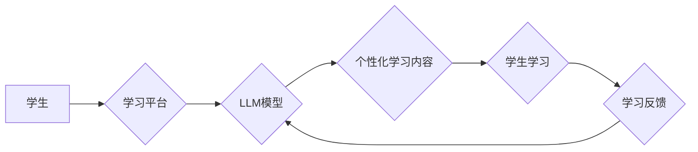

                 

## 远程教育与 LLM：打破地理限制的学习

> 关键词：远程教育、LLM、大语言模型、人工智能、个性化学习、教育科技、未来教育

### 1. 背景介绍

教育一直是人类社会进步的基石，而远程教育作为一种灵活、便捷的学习方式，近年来发展迅速。随着人工智能技术的飞速发展，特别是大语言模型（LLM）的出现，远程教育迎来了新的机遇和挑战。LLM 拥有强大的文本生成、理解和翻译能力，为个性化学习、智能辅导和跨语言教育提供了前所未有的可能性。

传统的远程教育模式主要依赖于在线课程、视频讲座和论坛讨论等静态资源，缺乏个性化和互动性。而 LLM 可以通过分析学生的学习行为、知识点掌握情况和学习风格，提供定制化的学习内容、练习题和反馈，从而提升学习效率和效果。

### 2. 核心概念与联系

**2.1 远程教育**

远程教育是指利用现代信息技术，跨越时空距离，实现师生之间教学互动和学习资源共享的一种教育模式。它包括多种形式，如在线课程、视频点播、网络研讨会、虚拟现实教学等。

**2.2 大语言模型 (LLM)**

大语言模型是一种基于深度学习的强大人工智能模型，能够理解和生成人类语言。它通过训练海量文本数据，学习语言的语法、语义和上下文关系，从而具备强大的文本生成、翻译、摘要、问答和对话等能力。

**2.3 核心概念联系**

LLM 可以为远程教育提供以下关键功能：

* **个性化学习路径:** 根据学生的学习进度、知识点掌握情况和学习风格，LLM 可以自动生成个性化的学习路径和内容推荐，帮助学生更高效地掌握知识。
* **智能辅导和答疑:** LLM 可以理解学生的学习问题，并提供准确的解答和指导，就像一位虚拟的老师一样，随时随地解答学生的疑问。
* **跨语言教育:** LLM 能够进行多语言翻译，打破语言障碍，实现跨语言的教育资源共享和教学互动。
* **互动式学习体验:** LLM 可以与学生进行自然语言对话，提供更生动、更具互动性的学习体验，提升学生的学习兴趣和参与度。

**Mermaid 流程图**



### 3. 核心算法原理 & 具体操作步骤

**3.1 算法原理概述**

LLM 的核心算法是基于 Transformer 架构的深度神经网络。Transformer 模型通过自注意力机制，能够捕捉文本序列中长距离依赖关系，从而实现更准确的语言理解和生成。

**3.2 算法步骤详解**

1. **数据预处理:** 将文本数据进行清洗、分词、标记等预处理操作，使其能够被模型理解。
2. **模型训练:** 使用大量的文本数据训练 Transformer 模型，通过反向传播算法不断调整模型参数，使其能够生成更准确的文本。
3. **模型评估:** 使用测试数据评估模型的性能，例如准确率、困惑度等指标。
4. **模型部署:** 将训练好的模型部署到服务器或云平台，供用户使用。

**3.3 算法优缺点**

**优点:**

* 强大的文本理解和生成能力
* 能够捕捉长距离依赖关系
* 可用于多种自然语言处理任务

**缺点:**

* 训练成本高
* 模型参数量大
* 容易受到训练数据偏差的影响

**3.4 算法应用领域**

LLM 广泛应用于自然语言处理领域，例如：

* 机器翻译
* 文本摘要
* 问答系统
* 对话机器人
* 代码生成

### 4. 数学模型和公式 & 详细讲解 & 举例说明

**4.1 数学模型构建**

Transformer 模型的核心是自注意力机制，其数学模型可以表示为：

$$
Attention(Q, K, V) = \frac{exp(Q \cdot K^T / \sqrt{d_k})}{exp(Q \cdot K^T / \sqrt{d_k})} \cdot V
$$

其中：

* $Q$：查询矩阵
* $K$：键矩阵
* $V$：值矩阵
* $d_k$：键向量的维度

**4.2 公式推导过程**

自注意力机制通过计算查询向量 $Q$ 与键向量 $K$ 的点积，并将其归一化，从而得到每个键向量的重要性权重。然后，将这些权重与值向量 $V$ 进行加权求和，得到最终的注意力输出。

**4.3 案例分析与讲解**

假设我们有一个句子 "我爱学习编程"，将其转换为词向量表示，并分别得到查询向量 $Q$、键向量 $K$ 和值向量 $V$。

通过计算 $Q$ 与 $K$ 的点积，并将其归一化，我们可以得到每个词向量的重要性权重。例如，"学习" 和 "编程" 的权重可能较高，因为它们与 "我爱" 的关系更紧密。

然后，将这些权重与 $V$ 进行加权求和，我们可以得到一个新的向量表示，它包含了句子中每个词的语义信息和它们之间的关系。

### 5. 项目实践：代码实例和详细解释说明

**5.1 开发环境搭建**

* Python 3.7+
* TensorFlow 或 PyTorch 深度学习框架
* CUDA 和 cuDNN (可选，用于 GPU 加速)

**5.2 源代码详细实现**

```python
import tensorflow as tf

# 定义 Transformer 模型
class Transformer(tf.keras.Model):
    def __init__(self, vocab_size, embedding_dim, num_heads, num_layers):
        super(Transformer, self).__init__()
        self.embedding = tf.keras.layers.Embedding(vocab_size, embedding_dim)
        self.transformer_layers = [
            tf.keras.layers.MultiHeadAttention(num_heads=num_heads, key_dim=embedding_dim)
            for _ in range(num_layers)
        ]
        self.dense = tf.keras.layers.Dense(vocab_size)

    def call(self, inputs):
        # ... (代码实现 Transformer 模型的 forward pass)

# 训练模型
model = Transformer(vocab_size=..., embedding_dim=..., num_heads=..., num_layers=...)
model.compile(optimizer='adam', loss='sparse_categorical_crossentropy', metrics=['accuracy'])
model.fit(train_data, train_labels, epochs=10)

```

**5.3 代码解读与分析**

* `Transformer` 类定义了 Transformer 模型的结构。
* `embedding` 层将词向量化。
* `transformer_layers` 列表包含多个 `MultiHeadAttention` 层，用于实现自注意力机制。
* `dense` 层用于输出预测结果。
* `call` 方法实现 Transformer 模型的 forward pass。

**5.4 运行结果展示**

训练完成后，可以使用测试数据评估模型的性能，例如准确率、困惑度等指标。

### 6. 实际应用场景

**6.1 个性化学习路径**

LLM 可以根据学生的学习进度、知识点掌握情况和学习风格，自动生成个性化的学习路径和内容推荐，帮助学生更高效地掌握知识。例如，一个学生在数学方面表现较弱，LLM 可以推荐一些针对数学基础的学习资源，并根据学生的学习情况调整学习难度。

**6.2 智能辅导和答疑**

LLM 可以理解学生的学习问题，并提供准确的解答和指导，就像一位虚拟的老师一样，随时随地解答学生的疑问。例如，学生在阅读课文时遇到不懂的问题，可以向 LLM 提问，LLM 可以根据课文内容和相关知识库提供解释和解答。

**6.3 跨语言教育**

LLM 能够进行多语言翻译，打破语言障碍，实现跨语言的教育资源共享和教学互动。例如，一个学生可以使用母语学习英语课程，LLM 可以帮助学生理解英语文本和进行英语对话。

**6.4 未来应用展望**

LLM 在远程教育领域的应用前景广阔，未来可能出现以下应用场景：

* **智能化的学习助手:** LLM 可以成为学生的个性化学习助手，提供定制化的学习建议、练习题和反馈。
* **沉浸式的虚拟课堂:** LLM 可以与虚拟现实技术结合，打造沉浸式的虚拟课堂，提供更生动、更具互动性的学习体验。
* **个性化的教育内容创作:** LLM 可以帮助教师创作个性化的教育内容，例如生成针对不同学生水平的学习材料。

### 7. 工具和资源推荐

**7.1 学习资源推荐**

* **斯坦福大学 CS224N 自然语言处理课程:** https://web.stanford.edu/class/cs224n/
* **Hugging Face Transformers 库:** https://huggingface.co/docs/transformers/index

**7.2 开发工具推荐**

* **TensorFlow:** https://www.tensorflow.org/
* **PyTorch:** https://pytorch.org/

**7.3 相关论文推荐**

* **Attention Is All You Need:** https://arxiv.org/abs/1706.03762
* **BERT: Pre-training of Deep Bidirectional Transformers for Language Understanding:** https://arxiv.org/abs/1810.04805

### 8. 总结：未来发展趋势与挑战

**8.1 研究成果总结**

LLM 在远程教育领域的应用取得了显著进展，为个性化学习、智能辅导和跨语言教育提供了新的可能性。

**8.2 未来发展趋势**

* **模型规模和性能的提升:** 未来 LLM 模型的规模和性能将继续提升，能够处理更复杂的任务和提供更精准的学习建议。
* **多模态学习:** LLM 将与其他模态数据，例如图像、音频和视频，进行融合，提供更丰富的学习体验。
* **伦理和安全问题:** 随着 LLM 在教育领域的应用越来越广泛，伦理和安全问题也需要得到重视，例如数据隐私保护、算法偏见和模型滥用等。

**8.3 面临的挑战**

* **数据获取和标注:** LLM 的训练需要大量的文本数据，而高质量的标注数据成本较高。
* **模型解释性和可信度:** LLM 的决策过程往往是复杂的，难以解释，这可能会影响用户的信任度。
* **公平性和包容性:** LLM 可能会受到训练数据偏差的影响，导致对不同群体的不公平对待。

**8.4 研究展望**

未来研究将重点关注以下几个方面：

* 开发更有效的训练方法和数据标注技术。
* 提高 LLM 的模型解释性和可信度。
* 确保 LLM 在教育领域的应用公平、安全和可持续。

### 9. 附录：常见问题与解答

**9.1 如何选择合适的 LLM 模型？**

选择合适的 LLM 模型需要根据具体的应用场景和需求进行考虑。例如，对于需要处理大量文本数据的任务，可以选择参数量更大的模型；对于需要实时响应的任务，可以选择模型推理速度更快的模型。

**9.2 如何评估 LLM 模型的性能？**

LLM 模型的性能可以评估多种指标，例如准确率、困惑度、BLEU 分数等。

**9.3 如何解决 LLM 模型的偏见问题？**

解决 LLM 模型的偏见问题需要从多个方面入手，例如使用更公平的训练数据、开发偏见检测和缓解技术、制定伦理规范等。


作者：禅与计算机程序设计艺术 / Zen and the Art of Computer Programming 
<end_of_turn>

