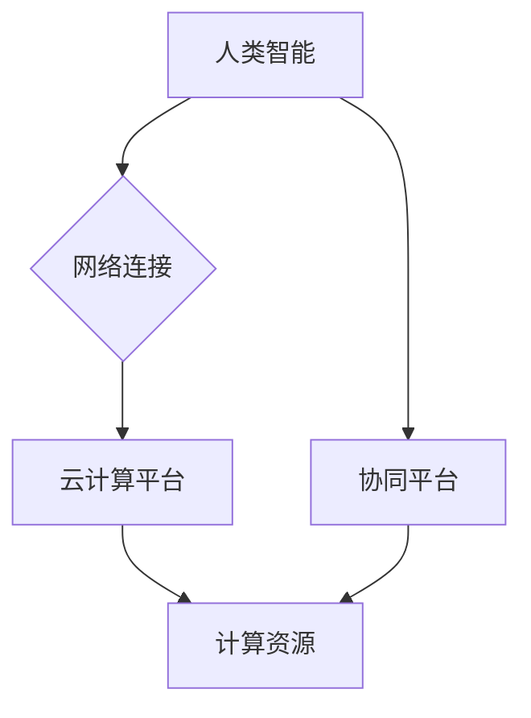

                 

## 连接全球智慧：人类计算的全球影响力

> 关键词：人类计算、分布式计算、协同智能、云计算、大数据、人工智能、全球化

### 1. 背景介绍

人类文明的进步离不开智慧的积累和传播。从古至今，人类一直在寻找更有效的方式来连接智慧，共同解决问题，创造价值。随着信息技术的飞速发展，特别是互联网和云计算的兴起，人类计算的概念应运而生，并正在深刻地改变着我们生活和工作的方式。

人类计算是指利用互联网和云计算平台，将人类的智慧和计算能力进行连接和协同，从而实现超越单一智能的更高效、更智能的计算模式。它打破了传统计算模式的局限性，将人类的创造力、洞察力和经验与机器的计算能力相结合，形成一个全新的计算生态系统。

### 2. 核心概念与联系

#### 2.1  人类计算的构成要素

人类计算的核心要素包括：

* **人类智能:** 包括人类的认知能力、创造力、洞察力和经验等。
* **计算能力:** 包括机器的计算速度、存储容量和处理能力等。
* **网络连接:** 通过互联网和云计算平台，将人类和计算资源连接起来。
* **协同平台:** 提供人类和机器交互、协作和共享信息的平台。

#### 2.2  人类计算的架构



**图 1：人类计算架构**

从图 1 可以看出，人类计算的架构主要由以下几个部分组成：

* **人类智能:** 人类通过网络连接，将自己的智慧和经验输入到协同平台。
* **网络连接:** 互联网和云计算平台为人类和计算资源提供了连接通道。
* **云计算平台:** 提供计算资源、存储空间和数据处理能力。
* **计算资源:** 包括服务器、存储设备、网络设备等。
* **协同平台:** 提供人类和机器交互、协作和共享信息的平台。

### 3. 核心算法原理 & 具体操作步骤

#### 3.1  算法原理概述

人类计算的核心算法原理是基于**分布式计算**和**协同智能**。

* **分布式计算:** 将计算任务分解成多个子任务，并分别分配给不同的计算节点进行处理，最终将结果汇总在一起。
* **协同智能:** 利用人类和机器的优势，将人类的智慧和机器的计算能力进行结合，实现超越单一智能的更高效、更智能的计算模式。

#### 3.2  算法步骤详解

1. **任务分解:** 将需要解决的问题分解成多个子任务，每个子任务可以由不同的计算节点处理。
2. **资源分配:** 根据子任务的特点和计算节点的资源情况，将子任务分配给合适的计算节点。
3. **数据处理:** 计算节点根据分配的任务，对数据进行处理和计算。
4. **结果汇总:** 计算节点将处理结果发送回协同平台，平台对所有结果进行汇总和分析。
5. **反馈和优化:** 根据计算结果和平台分析，对任务分解、资源分配和算法参数进行优化，提高计算效率和准确性。

#### 3.3  算法优缺点

**优点:**

* **高效率:** 利用分布式计算，可以大幅提高计算速度和处理能力。
* **高可靠性:** 即使部分计算节点出现故障，其他节点仍然可以继续工作，保证计算任务的完成。
* **可扩展性强:** 可以根据需要增加计算节点，轻松扩展计算能力。
* **智能化:** 通过协同智能，可以实现超越单一智能的更高效、更智能的计算模式。

**缺点:**

* **复杂性:** 分布式计算和协同智能的实现需要复杂的算法和技术架构。
* **数据安全:** 数据在网络传输和存储过程中需要保证安全。
* **协调难度:** 需要有效的机制来协调不同计算节点之间的工作。

#### 3.4  算法应用领域

人类计算的算法应用领域非常广泛，包括：

* **科学研究:** 药物研发、材料科学、天体物理学等领域。
* **金融领域:** 风险评估、欺诈检测、投资决策等。
* **医疗领域:** 疾病诊断、个性化治疗、医疗影像分析等。
* **教育领域:** 个性化学习、智能辅导、在线教育平台等。
* **社会治理:** 交通管理、环境监测、公共安全等。

### 4. 数学模型和公式 & 详细讲解 & 举例说明

#### 4.1  数学模型构建

人类计算的数学模型可以基于**图论**和**网络科学**。

* **图论:** 将人类和计算资源表示为图中的节点，将它们之间的连接表示为图中的边。
* **网络科学:** 研究网络的结构、功能和演化规律。

#### 4.2  公式推导过程

* **节点度:** 表示节点连接的边的数量，可以用来衡量节点的重要性。
* **聚类系数:** 表示节点邻居之间的连接程度，可以用来衡量网络的紧密程度。
* **路径长度:** 表示两个节点之间边的数量，可以用来衡量网络的连通性。

#### 4.3  案例分析与讲解

例如，在社交网络中，我们可以使用图论模型来分析用户之间的关系。节点代表用户，边代表用户之间的连接。通过计算节点度、聚类系数和路径长度，我们可以了解用户的社交圈、兴趣爱好和信息传播路径。

### 5. 项目实践：代码实例和详细解释说明

#### 5.1  开发环境搭建

* 操作系统: Linux
* 编程语言: Python
* 工具: Jupyter Notebook, TensorFlow, PyTorch

#### 5.2  源代码详细实现

```python
# 人工智能模型训练代码示例

import tensorflow as tf

# 定义模型结构
model = tf.keras.models.Sequential([
  tf.keras.layers.Dense(64, activation='relu', input_shape=(10,)),
  tf.keras.layers.Dense(10, activation='softmax')
])

# 编译模型
model.compile(optimizer='adam',
              loss='sparse_categorical_crossentropy',
              metrics=['accuracy'])

# 训练模型
model.fit(x_train, y_train, epochs=10)

# 评估模型
loss, accuracy = model.evaluate(x_test, y_test)
print('Loss:', loss)
print('Accuracy:', accuracy)
```

#### 5.3  代码解读与分析

* 该代码示例展示了使用 TensorFlow 库训练一个简单的多层感知机模型。
* 模型输入层有 10 个神经元，输出层有 10 个神经元，中间层有 64 个神经元。
* 使用 Adam 优化器、交叉熵损失函数和准确率作为评估指标。
* 模型训练了 10 个 epochs，并使用测试集评估模型性能。

#### 5.4  运行结果展示

运行结果会显示训练过程中的损失值和准确率，以及测试集上的损失值和准确率。

### 6. 实际应用场景

#### 6.1  医疗诊断

人类计算可以帮助医生更快、更准确地诊断疾病。例如，可以利用机器学习算法分析患者的病历、影像数据和基因信息，辅助医生做出诊断。

#### 6.2  药物研发

人类计算可以加速药物研发过程。例如，可以利用机器学习算法分析大量的药物分子数据，预测药物的活性，并筛选出潜在的候选药物。

#### 6.3  金融风险管理

人类计算可以帮助金融机构更好地管理风险。例如，可以利用机器学习算法分析市场数据、交易记录和客户行为，识别潜在的风险，并采取相应的措施。

#### 6.4  未来应用展望

人类计算的应用前景广阔，未来将应用于更多领域，例如：

* **个性化教育:** 根据学生的学习情况和兴趣爱好，提供个性化的学习方案。
* **智能制造:** 利用机器学习算法优化生产流程，提高生产效率和产品质量。
* **智慧城市:** 利用传感器数据和机器学习算法，提高城市管理效率和居民生活质量。

### 7. 工具和资源推荐

#### 7.1  学习资源推荐

* **Coursera:** 提供各种人工智能和机器学习课程。
* **edX:** 提供各种计算机科学和数据科学课程。
* **Udacity:** 提供各种人工智能和数据科学项目。

#### 7.2  开发工具推荐

* **TensorFlow:** 开源深度学习框架。
* **PyTorch:** 开源深度学习框架。
* **Jupyter Notebook:** 用于编写和运行代码的交互式笔记本。

#### 7.3  相关论文推荐

* **Attention Is All You Need:** https://arxiv.org/abs/1706.03762
* **Deep Learning:** https://www.deeplearningbook.org/

### 8. 总结：未来发展趋势与挑战

#### 8.1  研究成果总结

人类计算是一个新兴的领域，近年来取得了显著进展。

* **算法和模型:** 开发了各种新的算法和模型，例如深度学习、强化学习和图神经网络。
* **平台和工具:** 建立了各种人类计算平台和工具，例如云计算平台、协同平台和开发工具。
* **应用场景:** 人类计算已应用于多个领域，取得了显著的成果。

#### 8.2  未来发展趋势

* **更智能的算法:** 开发更智能、更强大的算法，例如通用人工智能和自学习算法。
* **更强大的计算能力:** 利用量子计算、光计算等新兴技术，提升计算能力。
* **更广泛的应用:** 将人类计算应用于更多领域，例如医疗、教育、金融、交通等。

#### 8.3  面临的挑战

* **数据安全:** 保护人类计算过程中产生的数据安全。
* **算法透明度:** 提高人类计算算法的透明度和可解释性。
* **伦理问题:** 解决人类计算带来的伦理问题，例如算法偏见和就业影响。

#### 8.4  研究展望

未来，人类计算将继续发展，并对人类社会产生深远的影响。我们需要加强对人类计算的理论研究和技术开发，并积极应对其带来的挑战，以确保人类计算的健康发展。

### 9. 附录：常见问题与解答

#### 9.1  什么是人类计算？

人类计算是指利用互联网和云计算平台，将人类的智慧和计算能力进行连接和协同，从而实现超越单一智能的更高效、更智能的计算模式。

#### 9.2  人类计算有哪些优势？

人类计算的优势包括：高效率、高可靠性、可扩展性强和智能化。

#### 9.3  人类计算有哪些应用场景？

人类计算已应用于多个领域，例如医疗诊断、药物研发、金融风险管理等。

#### 9.4  人类计算有哪些挑战？

人类计算面临的挑战包括数据安全、算法透明度和伦理问题。

#### 9.5  未来人类计算的发展趋势是什么？

未来，人类计算将更加智能、更加强大，并应用于更多领域。


作者：禅与计算机程序设计艺术 / Zen and the Art of Computer Programming 
<end_of_turn>

