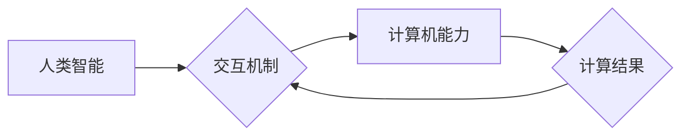

                 

## 释放人类创造力的源泉：人类计算的魅力

> 关键词：人类计算、协同智能、人工智能、计算模型、认知科学、未来趋势

### 1. 背景介绍

在人工智能（AI）蓬勃发展的时代，我们常常被机器学习、深度学习等技术所吸引。然而，在追求算法效率和模型精度的同时，我们是否曾想过，人类本身也是一种强大的计算引擎？人类拥有独特的认知能力、创造力以及对复杂问题的理解能力，这些都是传统人工智能难以企及的。

人类计算的概念正是基于这一认识，它强调人类与计算机的协同合作，将人类的智慧与机器的计算能力相结合，以实现超越单一智能的全新计算模式。

近年来，随着计算能力的提升和数据量的爆炸式增长，人类计算逐渐成为一个备受关注的领域。它在科学研究、艺术创作、决策分析等多个领域展现出巨大的潜力，并为释放人类创造力的源泉提供了新的思路。

### 2. 核心概念与联系

人类计算的核心概念是将人类的智慧融入到计算过程中，通过人类与计算机的交互和协作，共同解决复杂问题。

**2.1 人类计算的要素**

* **人类智能:** 包括人类的认知能力、创造力、判断力、经验和直觉等。
* **计算机能力:** 包括计算机的计算速度、存储容量、数据处理能力等。
* **交互机制:**  指人类与计算机之间进行信息交换和协作的机制，例如用户界面、自然语言处理、虚拟现实等。

**2.2 人类计算的架构**



**2.3 人类计算的优势**

* **解决复杂问题:** 人类拥有对复杂问题的理解能力和解决问题的能力，可以帮助计算机更好地理解和处理复杂场景。
* **增强创造力:** 人类与计算机的协作可以激发创造力，产生新的想法和解决方案。
* **提高决策质量:** 人类可以根据经验和直觉进行判断，帮助计算机做出更合理的决策。

### 3. 核心算法原理 & 具体操作步骤

人类计算的核心算法原理是将人类的智慧融入到计算模型中，通过设计合适的交互机制和算法，实现人类与计算机的协同工作。

**3.1 算法原理概述**

人类计算算法通常基于以下几个核心原则：

* **分层计算:** 将复杂问题分解成多个子问题，由人类和计算机分别负责处理。
* **迭代优化:** 通过不断迭代和反馈，逐步完善计算结果。
* **知识共享:** 人类和计算机之间共享知识和经验，共同学习和进步。

**3.2 算法步骤详解**

1. **问题分解:** 将复杂问题分解成多个子问题，确定哪些子问题适合由人类处理，哪些子问题适合由计算机处理。
2. **交互设计:** 设计合适的交互机制，方便人类与计算机进行信息交换和协作。
3. **算法实现:** 根据具体问题和交互机制，设计相应的算法，实现人类与计算机的协同计算。
4. **结果反馈:** 将计算结果反馈给人类，并根据人类的反馈进行迭代优化。

**3.3 算法优缺点**

**优点:**

* 可以解决传统人工智能难以处理的复杂问题。
* 可以增强创造力和提高决策质量。
* 可以更好地利用人类的智慧和经验。

**缺点:**

* 需要设计复杂的交互机制和算法。
* 人类参与计算可能会带来主观性和不确定性。
* 需要大量的计算资源和数据支持。

**3.4 算法应用领域**

* **科学研究:** 协助科学家进行数据分析、模型构建和实验设计。
* **艺术创作:** 帮助艺术家进行创意灵感激发、作品创作和风格探索。
* **决策分析:** 提供决策支持，帮助企业和政府做出更合理的决策。
* **教育培训:** 辅助教师进行教学和学生学习，提供个性化学习体验。

### 4. 数学模型和公式 & 详细讲解 & 举例说明

人类计算可以借助数学模型和公式来描述和分析其工作机制。

**4.1 数学模型构建**

我们可以用一个简单的数学模型来描述人类与计算机协同计算的过程：

*  **H(x):** 表示人类对输入数据x的处理结果。
*  **C(x):** 表示计算机对输入数据x的处理结果。
*  **F(H(x), C(x)):** 表示人类和计算机协同处理后的最终结果。

**4.2 公式推导过程**

我们可以推导出以下公式：

$$F(H(x), C(x)) = \alpha * H(x) + (1-\alpha) * C(x)$$

其中，α是一个权重系数，表示人类和计算机贡献的比例。

**4.3 案例分析与讲解**

例如，在进行图像识别任务时，人类可以提供图像的语义信息，而计算机可以提供图像特征的提取结果。通过将人类和计算机的处理结果进行融合，可以得到更准确的图像识别结果。

### 5. 项目实践：代码实例和详细解释说明

为了更好地理解人类计算的原理和应用，我们可以通过一个简单的项目实践来进行演示。

**5.1 开发环境搭建**

* Python 3.x
* TensorFlow 或 PyTorch 等深度学习框架
* Jupyter Notebook 或其他代码编辑器

**5.2 源代码详细实现**

```python
import tensorflow as tf

# 定义一个简单的图像分类模型
model = tf.keras.models.Sequential([
  tf.keras.layers.Conv2D(32, (3, 3), activation='relu', input_shape=(28, 28, 1)),
  tf.keras.layers.MaxPooling2D((2, 2)),
  tf.keras.layers.Flatten(),
  tf.keras.layers.Dense(10, activation='softmax')
])

# 加载 MNIST 数据集
(x_train, y_train), (x_test, y_test) = tf.keras.datasets.mnist.load_data()

# 训练模型
model.compile(optimizer='adam',
              loss='sparse_categorical_crossentropy',
              metrics=['accuracy'])
model.fit(x_train, y_train, epochs=5)

# 评估模型
loss, accuracy = model.evaluate(x_test, y_test)
print('Test loss:', loss)
print('Test accuracy:', accuracy)
```

**5.3 代码解读与分析**

这段代码定义了一个简单的图像分类模型，并使用 MNIST 数据集进行训练和评估。

**5.4 运行结果展示**

运行代码后，可以得到模型的训练和测试结果，包括损失值和准确率。

### 6. 实际应用场景

人类计算在多个实际应用场景中展现出巨大的潜力。

**6.1 科学研究**

* **药物研发:** 人类可以提供对疾病的理解和药物作用机制的知识，而计算机可以进行大规模的分子模拟和数据分析，加速药物研发过程。
* **气候模型:** 人类可以提供对气候变化的理解和预测模型的构建，而计算机可以进行复杂的数值模拟和数据分析，提高气候模型的精度。

**6.2 艺术创作**

* **音乐创作:** 人类可以提供音乐的旋律、节奏和情感，而计算机可以生成不同的音乐片段和组合，帮助艺术家创作出新的音乐作品。
* **绘画创作:** 人类可以提供绘画的构图、色彩和主题，而计算机可以生成不同的绘画风格和效果，帮助艺术家创作出更具创意的绘画作品。

**6.3 决策分析**

* **金融投资:** 人类可以提供对市场趋势和投资策略的理解，而计算机可以进行大规模的数据分析和风险评估，帮助投资者做出更明智的投资决策。
* **城市规划:** 人类可以提供对城市发展和居民需求的理解，而计算机可以进行城市模拟和优化，帮助规划者设计更合理的城市规划方案。

**6.4 未来应用展望**

随着人工智能技术的不断发展，人类计算将在更多领域得到应用，例如：

* **个性化教育:** 根据学生的学习风格和需求，提供个性化的学习内容和教学方法。
* **医疗诊断:** 辅助医生进行疾病诊断，提高诊断准确率。
* **自动驾驶:** 人类提供驾驶经验和决策判断，而计算机负责车辆控制和路径规划。

### 7. 工具和资源推荐

**7.1 学习资源推荐**

* **书籍:**
    * 《人类计算：人工智能与人类智慧的协同》
    * 《认知计算：从大脑到机器》
* **在线课程:**
    * Coursera: 人工智能与人类计算
    * edX: 人工智能与认知科学

**7.2 开发工具推荐**

* **Python:** 广泛应用于人工智能和数据科学领域。
* **TensorFlow:** 开源深度学习框架，提供丰富的工具和资源。
* **PyTorch:** 开源深度学习框架，以其灵活性和易用性而闻名。

**7.3 相关论文推荐**

* **《人类计算：人工智能与人类智慧的协同》**
* **《认知计算：从大脑到机器》**

### 8. 总结：未来发展趋势与挑战

**8.1 研究成果总结**

人类计算是一个新兴的领域，近年来取得了显著的进展。

* **算法和模型:** 开发了多种新的人类计算算法和模型，例如协同学习、人类-在-回路学习等。
* **交互机制:** 设计了更加自然和直观的交互机制，例如自然语言处理、虚拟现实等。
* **应用场景:** 在科学研究、艺术创作、决策分析等多个领域取得了成功应用。

**8.2 未来发展趋势**

* **更智能的交互机制:** 开发更加智能和自然的交互机制，例如情感识别、意图理解等。
* **更强大的计算能力:** 利用云计算、量子计算等新兴技术，提升人类计算的计算能力。
* **更广泛的应用场景:** 将人类计算应用到更多领域，例如医疗、教育、娱乐等。

**8.3 面临的挑战**

* **算法设计:** 设计更加高效和鲁棒的人类计算算法仍然是一个挑战。
* **数据安全:** 人类计算涉及大量个人数据，数据安全和隐私保护是一个重要问题。
* **伦理问题:** 人类计算可能会带来一些伦理问题，例如算法偏见、责任归属等。

**8.4 研究展望**

未来，人类计算将继续朝着更加智能、高效、安全的方向发展，并为人类社会带来更多福祉。


### 9. 附录：常见问题与解答

**9.1 什么是人类计算？**

人类计算是指将人类的智慧与计算机的计算能力相结合，共同解决复杂问题的计算模式。

**9.2 人类计算有哪些优势？**

人类计算可以解决传统人工智能难以处理的复杂问题，增强创造力和提高决策质量。

**9.3 人类计算有哪些应用场景？**

人类计算在科学研究、艺术创作、决策分析等多个领域都有应用。

**9.4 人类计算面临哪些挑战？**

人类计算面临算法设计、数据安全和伦理问题等挑战。


作者：禅与计算机程序设计艺术 / Zen and the Art of Computer Programming 
<end_of_turn>

