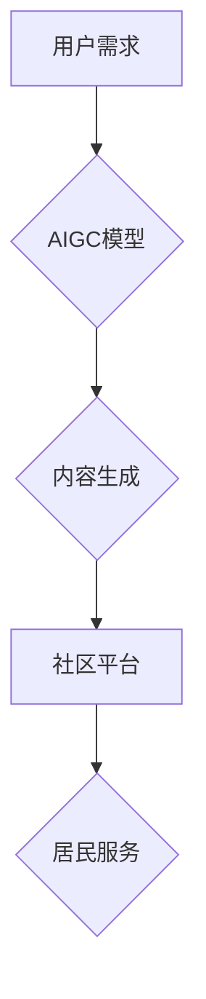

                 

## AIGC助力智慧社区建设

> 关键词：AIGC, 智慧社区, 人工智能, 自然语言处理, 图像识别, 物联网, 数据分析, 智能服务

## 1. 背景介绍

随着城市化进程的加速和居民生活水平的不断提高，人们对社区生活品质的需求也日益增长。智慧社区作为一种新型的社区模式，以信息化、智能化、数字化为核心，旨在通过科技手段提升社区管理水平、服务质量和居民生活体验。

人工智能（AI）作为新一代信息技术的重要组成部分，正在深刻地改变着各行各业，包括社区建设。其中，AIGC（人工智能生成内容）技术凭借其强大的内容生成能力，为智慧社区建设提供了新的机遇和可能性。

## 2. 核心概念与联系

**2.1 智慧社区的概念**

智慧社区是指利用物联网、云计算、大数据、人工智能等新一代信息技术，对社区进行智能化改造，实现社区资源共享、信息互联、服务便捷、生活智能化，从而提升社区管理水平、服务质量和居民生活品质的社区模式。

**2.2 AIGC的概念**

AIGC是指利用人工智能技术，让机器能够自动生成各种类型的文本、图像、音频、视频等内容，并能够根据用户需求进行定制化生成。

**2.3 核心概念联系**

AIGC技术可以为智慧社区建设提供以下方面的支持：

* **智能化社区服务:** AIGC可以帮助社区自动生成居民服务信息、生活指南、社区活动预告等内容，提高服务效率和便捷性。
* **个性化社区体验:** AIGC可以根据居民的兴趣爱好、生活习惯等信息，生成个性化的社区推荐、生活建议等内容，提升居民生活体验。
* **高效的社区管理:** AIGC可以帮助社区自动处理居民投诉、建议等信息，提高社区管理效率和服务质量。

**2.4 核心架构**



## 3. 核心算法原理 & 具体操作步骤

**3.1 算法原理概述**

AIGC的核心算法主要包括自然语言处理（NLP）、计算机视觉（CV）、深度学习等技术。

* **自然语言处理（NLP）:** 用于理解和生成人类语言，例如文本摘要、机器翻译、对话系统等。
* **计算机视觉（CV）:** 用于理解和处理图像和视频，例如图像识别、物体检测、场景理解等。
* **深度学习:** 一种机器学习方法，通过多层神经网络学习数据特征，实现更复杂的模式识别和预测。

**3.2 算法步骤详解**

AIGC内容生成过程一般包括以下步骤：

1. **数据采集和预处理:** 收集相关数据，并进行清洗、格式化等预处理工作。
2. **模型训练:** 利用深度学习算法，对数据进行训练，构建AIGC模型。
3. **内容生成:** 根据用户需求，输入相应的提示信息，让AIGC模型生成目标内容。
4. **内容评估和优化:** 对生成的内容进行评估，并根据评估结果进行优化，不断提升内容质量。

**3.3 算法优缺点**

**优点:**

* **自动化生成:** 可以自动生成大量内容，节省人力成本。
* **个性化定制:** 可以根据用户需求进行定制化生成，满足个性化需求。
* **内容丰富多样:** 可以生成各种类型的文本、图像、音频、视频等内容。

**缺点:**

* **内容质量:** 生成内容的质量可能不如人类创作的内容。
* **伦理问题:** AIGC内容的生成可能涉及到版权、隐私等伦理问题。
* **技术门槛:** AIGC技术开发需要一定的技术门槛。

**3.4 算法应用领域**

AIGC技术在智慧社区建设中的应用领域非常广泛，例如：

* **社区新闻资讯:** 自动生成社区新闻、活动预告等内容。
* **社区生活服务:** 提供智能问答、预约服务、生活缴费等服务。
* **社区安全管理:** 利用图像识别技术，实现人脸识别、车辆识别等功能。
* **社区环境监测:** 利用传感器数据，监测社区环境质量，及时发现问题。

## 4. 数学模型和公式 & 详细讲解 & 举例说明

**4.1 数学模型构建**

AIGC模型通常基于深度学习架构，例如Transformer、GPT等。这些模型通过多层神经网络学习数据特征，并利用注意力机制捕捉文本中的关键信息。

**4.2 公式推导过程**

深度学习模型的训练过程涉及到大量的数学公式，例如损失函数、梯度下降算法等。这些公式的推导过程较为复杂，需要一定的数学基础。

**4.3 案例分析与讲解**

例如，在文本生成任务中，可以使用GPT模型生成社区新闻文章。GPT模型通过学习大量的新闻文本数据，学习到文本的语法规则、语义关系等知识。当用户输入社区活动信息时，GPT模型可以根据学习到的知识，自动生成一篇新闻文章。

## 5. 项目实践：代码实例和详细解释说明

**5.1 开发环境搭建**

AIGC项目开发通常需要使用Python语言和相关的深度学习框架，例如TensorFlow、PyTorch等。

**5.2 源代码详细实现**

由于篇幅限制，这里只提供一个简单的文本生成代码示例：

```python
from transformers import pipeline

generator = pipeline("text-generation", model="gpt2")

text = "社区举办了"
output = generator(text, max_length=100, num_return_sequences=3)

for i in range(len(output)):
    print(f"生成结果{i+1}: {output[i]['generated_text']}")
```

**5.3 代码解读与分析**

这段代码使用HuggingFace的Transformers库，加载了GPT-2模型，并使用pipeline函数创建了一个文本生成器。

* `pipeline("text-generation", model="gpt2")`: 创建一个文本生成器，使用GPT-2模型。
* `generator(text, max_length=100, num_return_sequences=3)`: 使用文本生成器生成文本，输入文本为"社区举办了"，最大长度为100个词，生成3个不同的结果。

**5.4 运行结果展示**

运行这段代码后，会输出3个不同的社区活动描述。

## 6. 实际应用场景

**6.1 社区新闻资讯**

AIGC可以自动生成社区新闻、活动预告等内容，并根据居民的兴趣爱好进行个性化推送。

**6.2 社区生活服务**

AIGC可以提供智能问答、预约服务、生活缴费等服务，提高社区服务效率和便捷性。

**6.3 社区安全管理**

AIGC可以利用图像识别技术，实现人脸识别、车辆识别等功能，提高社区安全管理水平。

**6.4 未来应用展望**

随着AIGC技术的不断发展，未来将在智慧社区建设中发挥更重要的作用，例如：

* **智能社区管家:** AIGC可以扮演社区管理者的角色，自动处理居民投诉、建议等信息，并提供个性化的生活服务。
* **社区社交平台:** AIGC可以帮助社区居民建立更紧密的联系，例如自动生成社区活动邀请、组织线上线下活动等。
* **智慧医疗服务:** AIGC可以帮助社区居民获得更便捷的医疗服务，例如自动生成健康咨询、预约医生等。

## 7. 工具和资源推荐

**7.1 学习资源推荐**

* **书籍:**
    * 《深度学习》
    * 《自然语言处理》
* **在线课程:**
    * Coursera: 深度学习
    * edX: 自然语言处理
* **开源项目:**
    * TensorFlow
    * PyTorch
    * HuggingFace Transformers

**7.2 开发工具推荐**

* **Python:** 
* **Jupyter Notebook:** 用于代码编写和调试
* **Git:** 用于代码版本控制

**7.3 相关论文推荐**

* **Attention Is All You Need**
* **BERT: Pre-training of Deep Bidirectional Transformers for Language Understanding**
* **GPT-3: Language Models are Few-Shot Learners**

## 8. 总结：未来发展趋势与挑战

**8.1 研究成果总结**

AIGC技术在智慧社区建设领域取得了显著的成果，例如：

* 自动生成社区新闻、活动预告等内容
* 提供智能问答、预约服务等生活服务
* 实现人脸识别、车辆识别等安全管理功能

**8.2 未来发展趋势**

未来AIGC技术将朝着以下方向发展：

* **更强大的生成能力:** 模型将能够生成更复杂、更具创意的内容。
* **更精准的个性化定制:** 模型将能够更精准地理解用户的需求，生成更符合用户偏好的内容。
* **更广泛的应用场景:** AIGC技术将应用于更多智慧社区建设领域。

**8.3 面临的挑战**

AIGC技术也面临着一些挑战：

* **内容质量:** 生成内容的质量仍然需要提高，避免生成虚假信息、低质量内容。
* **伦理问题:** AIGC内容的生成可能涉及到版权、隐私等伦理问题，需要制定相应的规范和制度。
* **技术门槛:** AIGC技术开发需要一定的技术门槛，需要加强人才培养和技术普及。

**8.4 研究展望**

未来研究将重点关注以下方面：

* **提升AIGC内容质量:** 研究更有效的训练方法和评估指标，提高生成内容的真实性、准确性和原创性。
* **解决AIGC伦理问题:** 研究AIGC内容的版权、隐私等伦理问题，制定相应的规范和制度，确保AIGC技术安全、可持续发展。
* **降低AIGC技术门槛:** 开发更易于使用的AIGC工具和平台，促进AIGC技术的普及应用。

## 9. 附录：常见问题与解答

**9.1 如何评估AIGC内容质量？**

AIGC内容质量的评估可以从以下几个方面进行：

* **准确性:** 内容是否准确无误，是否符合事实。
* **完整性:** 内容是否全面，是否涵盖了所有必要的信息。
* **流畅性:** 内容是否流畅自然，是否易于理解。
* **原创性:** 内容是否原创，是否避免了抄袭。

**9.2 AIGC技术有哪些伦理问题？**

AIGC技术的应用可能涉及到以下伦理问题：

* **版权问题:** AIGC生成的文本、图像等内容是否侵犯了原作者的版权。
* **隐私问题:** AIGC模型在训练过程中是否使用了居民的个人隐私数据，是否保护了居民的隐私权。
* **偏见问题:** AIGC模型是否存在偏见，是否会生成歧视性内容。

**9.3 如何解决AIGC伦理问题？**

解决AIGC伦理问题需要多方共同努力，例如：

* 制定相应的法律法规和规范，明确AIGC技术的应用范围和伦理边界。
* 加强AIGC模型的开发和训练过程的监管，避免模型生成歧视性内容。
* 加强对AIGC技术的科普宣传，提高公众对AIGC伦理问题的认识。


作者：禅与计算机程序设计艺术 / Zen and the Art of Computer Programming 
<end_of_turn>

