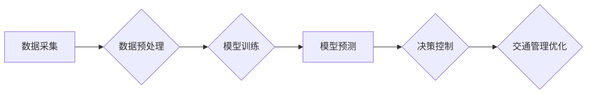

                 

## AIGC助力智能交通管理

> 关键词：AIGC, 智能交通, 交通管理, 预测模型, 优化算法, 数据分析, 深度学习, 自然语言处理

## 1. 背景介绍

随着全球人口的快速增长和城市化的进程不断加速，交通拥堵、交通事故、环境污染等问题日益突出。传统交通管理模式难以有效应对这些挑战，迫切需要引入新的技术手段进行革新。近年来，人工智能（AI）技术发展迅速，特别是生成式人工智能（AIGC）的兴起，为智能交通管理提供了新的思路和解决方案。

AIGC是指能够生成新内容的AI模型，例如文本、图像、音频、视频等。它能够利用海量数据进行训练，学习人类的创作模式，并生成具有创造性和实用性的内容。在智能交通管理领域，AIGC可以应用于多个方面，例如交通流量预测、交通事故预警、智能导航、自动驾驶等，有效提升交通效率、安全性、舒适度。

## 2. 核心概念与联系

### 2.1 智能交通管理概述

智能交通管理是指利用先进的传感器、通信技术、数据分析和人工智能等技术手段，对交通系统进行实时监测、分析和控制，以优化交通流量、提高道路安全、降低交通拥堵和环境污染。

### 2.2 AIGC在智能交通管理中的应用

AIGC在智能交通管理中的应用主要体现在以下几个方面：

* **交通流量预测:** 利用历史交通数据、实时路况信息和天气预报等数据，训练AIGC模型进行交通流量预测，为交通管理部门提供决策依据，优化交通信号灯控制、道路拥堵缓解等。
* **交通事故预警:** 通过分析车辆行驶轨迹、驾驶行为、路况信息等数据，训练AIGC模型识别潜在的交通事故风险，及时发出预警，降低事故发生率。
* **智能导航:** 基于实时路况信息、交通流量预测和车辆位置数据，AIGC模型可以为驾驶员提供个性化导航路线，避免拥堵路段，提高导航效率。
* **自动驾驶:** AIGC模型可以用于自动驾驶系统的决策控制，例如识别道路标志、障碍物、行人等，并做出相应的驾驶动作，实现无人驾驶车辆的自动行驶。

### 2.3 AIGC与智能交通管理的架构



## 3. 核心算法原理 & 具体操作步骤

### 3.1 算法原理概述

AIGC在智能交通管理中的应用主要依赖于以下核心算法：

* **深度学习:** 深度学习算法能够从海量数据中学习复杂的模式和关系，适用于交通流量预测、交通事故预警等任务。
* **自然语言处理:** 自然语言处理算法能够理解和处理人类语言，适用于智能导航、自动驾驶等任务。
* **强化学习:** 强化学习算法能够通过与环境交互学习最优策略，适用于自动驾驶等任务。

### 3.2 算法步骤详解

以交通流量预测为例，AIGC模型的具体操作步骤如下：

1. **数据采集:** 收集历史交通数据、实时路况信息、天气预报等数据。
2. **数据预处理:** 对采集到的数据进行清洗、转换、特征提取等处理，使其适合模型训练。
3. **模型训练:** 利用深度学习算法，训练AIGC模型，使其能够从历史数据中学习交通流量变化规律。
4. **模型预测:** 将实时路况信息、天气预报等数据输入到训练好的模型中，预测未来交通流量。
5. **决策控制:** 根据预测结果，对交通信号灯控制、道路拥堵缓解等进行优化调整。

### 3.3 算法优缺点

**优点:**

* 能够处理海量数据，学习复杂的交通模式。
* 预测精度高，能够提供更准确的交通流量预测结果。
* 可持续学习和优化，随着数据积累，模型性能不断提升。

**缺点:**

* 需要大量的训练数据，数据质量对模型性能影响较大。
* 模型训练过程复杂，需要专业的技术人员进行操作。
* 对计算资源要求较高，需要强大的计算能力进行训练和预测。

### 3.4 算法应用领域

AIGC算法在智能交通管理领域具有广泛的应用前景，例如：

* 交通流量预测和优化
* 交通事故预警和预防
* 智能导航和路线规划
* 自动驾驶系统开发
* 交通安全监控和管理
* 城市规划和交通政策制定

## 4. 数学模型和公式 & 详细讲解 & 举例说明

### 4.1 数学模型构建

交通流量预测模型通常采用时间序列模型，例如ARIMA模型、LSTM模型等。

**ARIMA模型:** ARIMA模型是一种经典的时间序列模型，它通过对历史数据进行分析，建立时间序列的预测模型。ARIMA模型包含三个参数：p、d、q，分别代表自回归阶数、差分阶数和滑动平均阶数。

**LSTM模型:** LSTM模型是一种深度学习算法，它能够学习时间序列中长期的依赖关系，适用于预测复杂的时间序列数据，例如交通流量。

### 4.2 公式推导过程

ARIMA模型的预测公式如下：

$$y_t = c + \phi_1 y_{t-1} + \phi_2 y_{t-2} + ... + \phi_p y_{t-p} + \theta_1 \epsilon_{t-1} + \theta_2 \epsilon_{t-2} + ... + \theta_q \epsilon_{t-q} + \epsilon_t$$

其中：

* $y_t$ 表示时间t的预测值
* $c$ 表示截距项
* $\phi_i$ 表示自回归系数
* $y_{t-i}$ 表示时间t-i的实际值
* $\theta_i$ 表示滑动平均系数
* $\epsilon_{t-i}$ 表示时间t-i的误差项
* $\epsilon_t$ 表示时间t的误差项

### 4.3 案例分析与讲解

假设我们想要预测某条道路的未来交通流量，我们可以使用ARIMA模型进行预测。首先，我们需要收集该道路的历史交通流量数据，然后对数据进行分析，确定ARIMA模型的参数p、d、q。最后，将确定好的参数代入ARIMA模型的预测公式，即可得到未来交通流量的预测结果。

## 5. 项目实践：代码实例和详细解释说明

### 5.1 开发环境搭建

为了实现AIGC在智能交通管理中的应用，我们需要搭建一个合适的开发环境。常用的开发环境包括：

* **Python:** Python是一种流行的编程语言，拥有丰富的机器学习和深度学习库，例如TensorFlow、PyTorch等。
* **Jupyter Notebook:** Jupyter Notebook是一种交互式编程环境，方便进行代码编写、调试和可视化分析。
* **云计算平台:** 云计算平台，例如AWS、Azure、GCP等，可以提供强大的计算资源和存储空间，支持大规模数据处理和模型训练。

### 5.2 源代码详细实现

以下是一个使用Python和TensorFlow库实现交通流量预测的简单代码示例：

```python
import tensorflow as tf
from tensorflow.keras.models import Sequential
from tensorflow.keras.layers import LSTM, Dense

# 准备数据
# ...

# 定义模型
model = Sequential()
model.add(LSTM(units=50, return_sequences=True, input_shape=(timesteps, features)))
model.add(LSTM(units=50))
model.add(Dense(units=1))

# 编译模型
model.compile(loss='mean_squared_error', optimizer='adam')

# 训练模型
model.fit(X_train, y_train, epochs=100, batch_size=32)

# 预测未来交通流量
predictions = model.predict(X_test)
```

### 5.3 代码解读与分析

这段代码首先定义了一个LSTM模型，该模型包含两个LSTM层和一个Dense层。LSTM层用于学习时间序列数据中的长期依赖关系，Dense层用于输出预测结果。然后，代码使用训练数据训练模型，并使用测试数据进行预测。

### 5.4 运行结果展示

训练完成后，我们可以使用测试数据评估模型的性能，例如计算均方误差（MSE）等指标。

## 6. 实际应用场景

### 6.1 交通流量预测

AIGC模型可以用于预测城市道路、高速公路等交通路段的未来交通流量，为交通管理部门提供决策依据，例如优化交通信号灯控制、调整道路限速、引导车辆避开拥堵路段等。

### 6.2 交通事故预警

AIGC模型可以分析车辆行驶轨迹、驾驶行为、路况信息等数据，识别潜在的交通事故风险，及时发出预警，提醒驾驶员注意安全，降低事故发生率。

### 6.3 智能导航

AIGC模型可以根据实时路况信息、交通流量预测和车辆位置数据，为驾驶员提供个性化导航路线，避免拥堵路段，提高导航效率。

### 6.4 未来应用展望

随着AIGC技术的不断发展，其在智能交通管理领域的应用将更加广泛和深入，例如：

* **自动驾驶:** AIGC模型可以用于自动驾驶系统的决策控制，实现无人驾驶车辆的自动行驶。
* **智能交通信号灯控制:** AIGC模型可以根据实时路况信息，智能调整交通信号灯的绿灯时间，优化交通流量。
* **城市交通规划:** AIGC模型可以用于城市交通规划，预测未来交通需求，优化道路布局和交通设施建设。

## 7. 工具和资源推荐

### 7.1 学习资源推荐

* **书籍:**
    * 《深度学习》
    * 《机器学习》
    * 《自然语言处理》
* **在线课程:**
    * Coursera
    * edX
    * Udacity

### 7.2 开发工具推荐

* **Python:** Python是一种流行的编程语言，拥有丰富的机器学习和深度学习库。
* **TensorFlow:** TensorFlow是一个开源的机器学习框架，支持多种深度学习算法。
* **PyTorch:** PyTorch是一个开源的深度学习框架，以其灵活性和易用性而闻名。
* **Jupyter Notebook:** Jupyter Notebook是一种交互式编程环境，方便进行代码编写、调试和可视化分析。

### 7.3 相关论文推荐

* **交通流量预测:**
    * "Traffic Flow Prediction Using Deep Learning"
    * "A Novel LSTM-Based Model for Traffic Flow Forecasting"
* **交通事故预警:**
    * "Predicting Traffic Accidents Using Machine Learning"
    * "A Deep Learning Approach to Traffic Accident Prediction"
* **智能导航:**
    * "Deep Reinforcement Learning for Autonomous Navigation"
    * "End-to-End Learning for Autonomous Driving"

## 8. 总结：未来发展趋势与挑战

### 8.1 研究成果总结

AIGC技术在智能交通管理领域取得了显著的成果，例如交通流量预测、交通事故预警、智能导航等应用取得了较好的效果。

### 8.2 未来发展趋势

未来，AIGC技术在智能交通管理领域的应用将更加广泛和深入，例如：

* **更精准的预测:** 利用更先进的算法和更丰富的传感器数据，实现更精准的交通流量预测。
* **更智能的决策:** 基于AIGC模型的决策控制，实现更智能的交通信号灯控制、道路限速调整等。
* **更安全的出行:** 利用AIGC技术，开发更安全的自动驾驶系统，降低交通事故发生率。

### 8.3 面临的挑战

AIGC技术在智能交通管理领域的应用也面临一些挑战，例如：

* **数据质量:** AIGC模型的性能依赖于数据质量，需要收集和处理高质量的数据。
* **模型解释性:** AIGC模型的决策过程往往难以解释，需要提高模型的解释性，增强用户信任。
* **伦理问题:** AIGC技术在智能交通管理领域的应用可能引发一些伦理问题，例如数据隐私、算法偏见等，需要进行深入研究和探讨。

### 8.4 研究展望

未来，需要继续加强AIGC技术在智能交通管理领域的应用研究，解决上述挑战，推动AIGC技术在智能交通管理领域的健康发展。

## 9. 附录：常见问题与解答

### 9.1 如何选择合适的AIGC模型？

选择合适的AIGC模型需要根据具体应用场景和数据特点进行选择。例如，对于交通流量预测，LSTM模型是一种常用的选择；对于交通事故预警，CNN模型可以用于图像识别和分析。

### 9.2 如何评估AIGC模型的性能？

AIGC模型的性能可以通过多种指标进行评估，例如均方误差（MSE）、平均绝对误差（MAE）、R-squared等。

### 9.3 如何解决AIGC模型的过拟合问题？

过拟合是指模型在训练数据上表现良好，但在测试数据上表现较差。解决过拟合问题的方法包括：

* 增加训练数据量
* 使用正则化技术
* 使用交叉验证

### 9.4 如何提高AIGC模型的解释性？

提高AIGC模型的解释性可以通过以下方法：

* 使用可解释的机器学习算法
* 使用可视化技术分析模型决策过程
* 使用人工解释模型决策结果


作者：禅与计算机程序设计艺术 / Zen and the Art of Computer Programming 
<end_of_turn>

