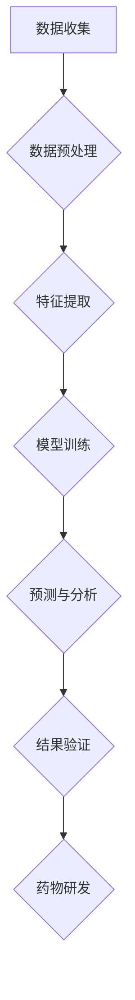

                 

## AI在新药研发中的应用：从靶点发现到临床试验

> 关键词：人工智能、新药研发、靶点发现、药物设计、临床试验、机器学习、深度学习、自然语言处理

## 1. 背景介绍

新药研发是一个漫长而复杂的流程，通常需要花费十年时间和数十亿美元的投资。传统的新药研发模式依赖于大量的实验和临床试验，效率低下，成本高昂。近年来，人工智能（AI）技术在各个领域取得了突破性进展，为新药研发带来了新的希望。AI算法能够快速分析海量数据，识别潜在的靶点和药物候选物，加速药物设计和开发流程，降低研发成本，提高研发效率。

## 2. 核心概念与联系

**2.1 核心概念**

* **靶点发现:** 靶点是指药物作用的分子或生物通路，是药物研发的重要起点。
* **药物设计:** 根据靶点信息，设计具有特定生物活性的药物分子。
* **虚拟筛选:** 利用计算机模拟筛选大量的化合物库，寻找具有潜在生物活性的化合物。
* **临床试验:** 对药物进行安全性、有效性和剂量等方面的评估，最终确定药物是否可以上市。

**2.2 AI在药物研发中的应用**

AI技术可以应用于新药研发各个环节，包括靶点发现、药物设计、虚拟筛选、临床试验等。

**2.3 AI应用架构**



## 3. 核心算法原理 & 具体操作步骤

**3.1 算法原理概述**

AI在药物研发中的应用主要依赖于以下几种算法：

* **机器学习:** 利用算法从数据中学习规律，预测药物的活性或毒性。
* **深度学习:** 利用多层神经网络，学习更复杂的特征，提高预测精度。
* **自然语言处理:** 分析生物医学文献，提取相关信息，辅助靶点发现和药物设计。

**3.2 算法步骤详解**

1. **数据收集:** 收集相关数据，例如蛋白质结构、药物活性数据、生物医学文献等。
2. **数据预处理:** 对数据进行清洗、转换、特征工程等处理，使其适合算法训练。
3. **模型训练:** 选择合适的算法，利用训练数据训练模型，学习药物研发相关的规律。
4. **模型评估:** 利用测试数据评估模型的性能，例如准确率、召回率等。
5. **模型部署:** 将训练好的模型部署到实际应用场景中，例如药物虚拟筛选、临床试验预测等。

**3.3 算法优缺点**

* **优点:** 能够快速分析海量数据，提高效率和精度；能够发现传统方法难以发现的规律；能够降低研发成本。
* **缺点:** 需要大量的训练数据；算法解释性较差；容易受到数据质量的影响。

**3.4 算法应用领域**

* **靶点发现:** 利用机器学习和深度学习算法，从蛋白质结构、基因表达数据等中识别潜在的靶点。
* **药物设计:** 利用机器学习和深度学习算法，设计具有特定生物活性的药物分子。
* **虚拟筛选:** 利用机器学习和深度学习算法，从大量的化合物库中筛选出具有潜在生物活性的化合物。
* **临床试验预测:** 利用机器学习和深度学习算法，预测临床试验的结果，提高临床试验的效率和成功率。

## 4. 数学模型和公式 & 详细讲解 & 举例说明

**4.1 数学模型构建**

在药物研发中，常用的数学模型包括：

* **结构-活性关系 (SAR) 模型:** 描述药物分子结构与生物活性之间的关系。
* **动力学模型:** 描述药物在体内代谢和分布的规律。
* **毒性模型:** 描述药物的毒性作用机制。

**4.2 公式推导过程**

例如，SAR模型可以使用线性回归或支持向量机等算法构建。

**线性回归模型:**

$$
y = \beta_0 + \beta_1x_1 + \beta_2x_2 + ... + \beta_nx_n + \epsilon
$$

其中：

* $y$ 是药物活性
* $x_1, x_2, ..., x_n$ 是药物分子结构的特征
* $\beta_0, \beta_1, \beta_2, ..., \beta_n$ 是模型参数
* $\epsilon$ 是误差项

**4.3 案例分析与讲解**

利用SAR模型，可以预测新的药物分子活性。例如，如果我们已经建立了一个SAR模型，并知道一个新药物分子的结构特征，我们可以利用这个模型预测该药物分子的活性。

## 5. 项目实践：代码实例和详细解释说明

**5.1 开发环境搭建**

* Python 3.x
* TensorFlow 或 PyTorch
* Scikit-learn
* Jupyter Notebook

**5.2 源代码详细实现**

```python
# 导入必要的库
import pandas as pd
from sklearn.model_selection import train_test_split
from sklearn.linear_model import LinearRegression
from sklearn.metrics import mean_squared_error

# 加载数据
data = pd.read_csv('drug_data.csv')

# 分割数据
X = data[['feature1', 'feature2', 'feature3']]
y = data['activity']
X_train, X_test, y_train, y_test = train_test_split(X, y, test_size=0.2)

# 训练模型
model = LinearRegression()
model.fit(X_train, y_train)

# 预测结果
y_pred = model.predict(X_test)

# 评估模型
mse = mean_squared_error(y_test, y_pred)
print('Mean Squared Error:', mse)
```

**5.3 代码解读与分析**

* 首先，导入必要的库。
* 然后，加载数据并分割成训练集和测试集。
* 接着，训练线性回归模型。
* 最后，使用训练好的模型预测测试集结果，并评估模型性能。

**5.4 运行结果展示**

运行代码后，会输出模型的均方误差值。

## 6. 实际应用场景

**6.1 靶点发现**

AI可以分析蛋白质结构、基因表达数据等，识别潜在的靶点。例如，DeepMind的AlphaFold2可以预测蛋白质的三维结构，帮助科学家发现新的药物靶点。

**6.2 药物设计**

AI可以根据靶点信息，设计具有特定生物活性的药物分子。例如，Atomwise使用AI技术设计了针对埃博拉病毒的药物候选物。

**6.3 虚拟筛选**

AI可以从大量的化合物库中筛选出具有潜在生物活性的化合物。例如，Exscientia使用AI技术设计了针对癌症的药物候选物。

**6.4 未来应用展望**

* **个性化药物:** 基于患者的基因信息和生活方式，设计个性化的药物方案。
* **疾病预测:** 利用AI分析患者的健康数据，预测疾病风险。
* **药物安全性评估:** 利用AI评估药物的安全性，降低药物不良反应的风险。

## 7. 工具和资源推荐

**7.1 学习资源推荐**

* **书籍:**
    * Deep Learning for Drug Discovery
    * Artificial Intelligence in Drug Discovery
* **在线课程:**
    * Coursera: Machine Learning for Drug Discovery
    * edX: Artificial Intelligence for Drug Discovery

**7.2 开发工具推荐**

* **TensorFlow:** 开源深度学习框架
* **PyTorch:** 开源深度学习框架
* **Scikit-learn:** 机器学习库

**7.3 相关论文推荐**

* **AlphaFold: A Heuristic Algorithm for Protein Structure Prediction**
* **Atomwise: Using Deep Learning to Discover New Drugs**
* **Exscientia: AI-Powered Drug Discovery**

## 8. 总结：未来发展趋势与挑战

**8.1 研究成果总结**

AI技术在药物研发领域取得了显著进展，加速了药物发现和开发流程，降低了研发成本，提高了研发效率。

**8.2 未来发展趋势**

* **模型精度提升:** 开发更准确、更可靠的AI模型。
* **数据共享与开放:** 促进数据共享和开放，加速AI技术的发展。
* **跨学科合作:** 加强跨学科合作，将AI技术与其他学科结合，探索新的药物研发模式。

**8.3 面临的挑战**

* **数据质量:** AI模型的性能依赖于数据质量，需要高质量的数据支持。
* **算法解释性:** 许多AI算法的解释性较差，难以理解模型的决策过程。
* **伦理问题:** AI技术在药物研发中的应用需要考虑伦理问题，例如数据隐私、算法偏见等。

**8.4 研究展望**

未来，AI技术将在药物研发领域发挥越来越重要的作用，推动药物研发进入一个新的时代。


## 9. 附录：常见问题与解答

**9.1 如何选择合适的AI算法？**

选择合适的AI算法取决于具体的应用场景和数据特点。例如，对于结构-活性关系预测，线性回归或支持向量机等算法效果较好。

**9.2 如何评估AI模型的性能？**

常用的评估指标包括准确率、召回率、F1-score、均方误差等。

**9.3 如何解决数据质量问题？**

数据质量问题可以通过数据清洗、数据预处理、数据增强等方法解决。


作者：禅与计算机程序设计艺术 / Zen and the Art of Computer Programming 
<end_of_turn>

