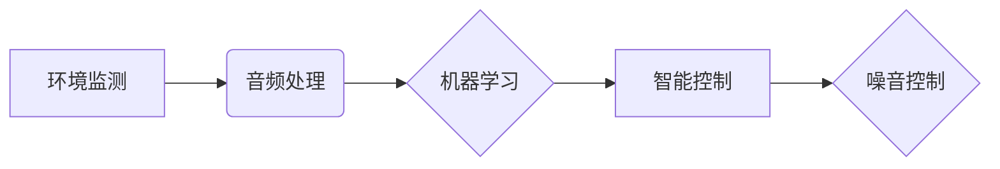

                 

## AI在智能噪音控制中的应用：改善生活质量

> 关键词：人工智能、噪音控制、机器学习、深度学习、环境监测、音频处理、智能家居

## 1. 背景介绍

噪音污染已成为全球性难题，对人类健康、生活质量和环境造成严重影响。传统噪音控制方法主要依靠物理隔音和降噪技术，但这些方法往往成本高、效果有限，难以适应复杂环境的变化。随着人工智能技术的快速发展，AI在智能噪音控制领域展现出巨大的潜力，为解决噪音污染问题提供了一种全新的解决方案。

### 1.1 噪音污染现状与危害

现代社会，各种机械设备、交通工具、建筑施工等活动产生的噪音污染日益严重。长期暴露在高噪音环境中，会对人类听力、心血管系统、神经系统等造成损害，引发耳鸣、失眠、焦虑、抑郁等问题，甚至增加患心血管疾病的风险。

### 1.2 传统噪音控制方法的局限性

传统的噪音控制方法主要包括以下几种：

* **物理隔音:** 通过隔音材料、结构设计等方式阻隔噪音传播，例如使用隔音窗、隔音门等。
* **降噪技术:** 利用反向声波、消声材料等技术降低噪音强度，例如使用降噪耳机、消声板等。

这些方法虽然有一定的效果，但存在以下局限性：

* **成本高:** 物理隔音和降噪技术往往需要投入大量资金，难以普及。
* **效果有限:** 无法完全消除噪音，只能降低噪音强度，且效果受环境因素影响较大。
* **缺乏智能化:** 无法根据实际情况动态调整噪音控制策略。

## 2. 核心概念与联系

AI在智能噪音控制中的应用，主要基于以下核心概念：

* **环境监测:** 利用传感器收集噪音数据，实时监测噪音水平。
* **音频处理:** 对收集到的噪音数据进行分析和处理，识别噪音类型、来源和强度。
* **机器学习:** 利用机器学习算法，建立噪音控制模型，预测噪音变化趋势，并制定相应的控制策略。
* **智能控制:** 根据模型预测结果，自动调节噪音控制设备，实现智能化噪音控制。

**核心概念架构图:**



## 3. 核心算法原理 & 具体操作步骤

### 3.1 算法原理概述

在智能噪音控制中，常用的机器学习算法包括：

* **回归算法:** 用于预测噪音水平，例如线性回归、支持向量回归等。
* **分类算法:** 用于识别噪音类型，例如决策树、随机森林、支持向量机等。
* **聚类算法:** 用于将噪音数据进行分组，例如K-means聚类、DBSCAN聚类等。

这些算法通过训练数据，学习噪音与各种因素之间的关系，从而实现对噪音的预测、识别和控制。

### 3.2 算法步骤详解

以预测噪音水平为例，使用线性回归算法的具体操作步骤如下：

1. **数据收集:** 收集历史噪音数据，包括时间、地点、噪音强度等信息。
2. **数据预处理:** 对收集到的数据进行清洗、转换、归一化等处理，使其适合模型训练。
3. **模型训练:** 使用线性回归算法，训练模型，学习噪音与其他因素之间的关系。
4. **模型评估:** 使用测试数据评估模型的预测精度，并进行模型调优。
5. **模型部署:** 将训练好的模型部署到实际应用环境中，用于预测未来噪音水平。

### 3.3 算法优缺点

**优点:**

* **准确性高:** 机器学习算法能够学习复杂的关系，实现对噪音的精准预测和识别。
* **智能化:** 可以根据实际情况动态调整噪音控制策略，实现智能化控制。
* **可扩展性强:** 可以根据需要扩展算法模型，适应不同的噪音控制场景。

**缺点:**

* **数据依赖:** 机器学习算法需要大量训练数据，数据质量直接影响模型性能。
* **计算复杂度高:** 训练复杂的机器学习模型需要大量的计算资源。
* **解释性差:** 一些机器学习算法的决策过程难以解释，难以理解模型的内部机制。

### 3.4 算法应用领域

AI在智能噪音控制领域的应用场景广泛，包括：

* **智能家居:** 利用AI算法，实现智能家居设备的噪音控制，例如自动调节空调噪音、关闭噪音源等。
* **交通运输:** 利用AI算法，监测交通噪音，优化交通规划，降低交通噪音污染。
* **工业生产:** 利用AI算法，监测工业设备噪音，预测设备故障，降低噪音污染。
* **环境监测:** 利用AI算法，监测环境噪音，评估噪音污染程度，制定噪音控制政策。

## 4. 数学模型和公式 & 详细讲解 & 举例说明

### 4.1 数学模型构建

在智能噪音控制中，常用的数学模型包括：

* **线性回归模型:** 用于预测噪音水平，假设噪音与其他因素之间存在线性关系。
* **支持向量机模型:** 用于识别噪音类型，通过寻找最佳超平面将不同类型噪音数据分开。
* **神经网络模型:** 用于复杂噪音控制任务，例如语音识别、音乐生成等，能够学习复杂的非线性关系。

### 4.2 公式推导过程

以线性回归模型为例，其目标是找到最佳的回归系数，使得模型预测的噪音水平与实际噪音水平之间的误差最小。

**线性回归模型公式:**

$$y = \beta_0 + \beta_1x_1 + \beta_2x_2 + ... + \beta_nx_n + \epsilon$$

其中：

* $y$ 是预测的噪音水平
* $x_1, x_2, ..., x_n$ 是影响噪音水平的因素
* $\beta_0, \beta_1, \beta_2, ..., \beta_n$ 是回归系数
* $\epsilon$ 是误差项

**最小二乘法:**

为了找到最佳的回归系数，可以使用最小二乘法，其目标是最小化模型预测值与实际值之间的平方误差。

$$J(\beta) = \sum_{i=1}^{n}(y_i - \hat{y}_i)^2$$

其中：

* $J(\beta)$ 是误差函数
* $y_i$ 是实际噪音水平
* $\hat{y}_i$ 是模型预测的噪音水平

通过求解误差函数的最小值，可以得到最佳的回归系数。

### 4.3 案例分析与讲解

假设我们想要预测某个城市的噪音水平，影响因素包括人口密度、交通流量、工业生产规模等。我们可以收集历史数据，训练线性回归模型，并使用模型预测未来噪音水平。

例如，如果模型预测未来人口密度增加，交通流量增加，工业生产规模增加，那么模型会预测噪音水平也会增加。

## 5. 项目实践：代码实例和详细解释说明

### 5.1 开发环境搭建

为了实现智能噪音控制项目，需要搭建以下开发环境：

* **操作系统:** Linux、Windows、macOS 等
* **编程语言:** Python、C++ 等
* **机器学习库:** TensorFlow、PyTorch 等
* **音频处理库:** Librosa、PyAudio 等
* **传感器接口:** 根据实际情况选择合适的传感器接口

### 5.2 源代码详细实现

以下是一个使用Python和Librosa库实现的简单噪音检测程序示例：

```python
import librosa
import numpy as np

def detect_noise(audio_file):
    # 读取音频文件
    y, sr = librosa.load(audio_file)

    # 计算音频能量
    energy = np.mean(y**2)

    # 设置噪音阈值
    threshold = 0.5

    # 判断是否为噪音
    if energy > threshold:
        return True
    else:
        return False

# 示例用法
audio_file = "noise.wav"
if detect_noise(audio_file):
    print("检测到噪音!")
else:
    print("没有检测到噪音.")
```

### 5.3 代码解读与分析

* `librosa.load(audio_file)`: 读取音频文件，并返回音频信号和采样率。
* `np.mean(y**2)`: 计算音频能量，即音频信号的平方和的平均值。
* `threshold`: 设置噪音阈值，当音频能量超过阈值时，则判断为噪音。
* `if energy > threshold:`: 判断音频能量是否超过阈值，并返回True或False。

### 5.4 运行结果展示

运行上述代码，如果音频文件包含噪音，则会输出“检测到噪音!”，否则会输出“没有检测到噪音。”

## 6. 实际应用场景

### 6.1 智能家居

AI可以帮助智能家居设备实现更智能的噪音控制，例如：

* **自动调节空调噪音:** 根据房间温度和人员活动情况，自动调节空调风速，降低噪音。
* **关闭噪音源:** 当检测到噪音超过一定阈值时，自动关闭噪音源，例如电视、音乐播放器等。
* **个性化噪音控制:** 根据用户的喜好，定制不同的噪音控制方案。

### 6.2 交通运输

AI可以帮助优化交通规划，降低交通噪音污染，例如：

* **智能交通信号灯:** 根据实时交通流量，动态调整信号灯时间，减少车辆等待时间和鸣笛次数。
* **噪音地图:** 利用AI算法，构建城市噪音地图，识别噪音污染严重的区域，并制定相应的控制措施。
* **电动交通工具推广:** 推广使用电动交通工具，减少燃油汽车产生的噪音污染。

### 6.3 工业生产

AI可以帮助工业生产企业降低噪音污染，例如：

* **设备故障预测:** 利用AI算法，预测设备故障，及时进行维护，避免设备噪音过大。
* **噪音源识别:** 利用AI算法，识别噪音源，并采取措施降低噪音。
* **智能生产调度:** 利用AI算法，优化生产调度，减少设备运行时间，降低噪音污染。

### 6.4 未来应用展望

随着人工智能技术的不断发展，AI在智能噪音控制领域的应用将更加广泛和深入，例如：

* **个性化噪音控制:** 根据用户的喜好和需求，提供更加个性化的噪音控制方案。
* **主动噪音控制:** 利用AI算法，主动预测和控制噪音，避免噪音产生。
* **跨领域协同:** 将AI技术与其他领域技术结合，例如环境监测、城市规划等，实现更加全面的噪音控制。

## 7. 工具和资源推荐

### 7.1 学习资源推荐

* **在线课程:** Coursera、edX、Udacity 等平台提供人工智能、机器学习、音频处理等方面的在线课程。
* **书籍:** 《深度学习》、《机器学习实战》、《音频信号处理》等书籍。
* **开源项目:** TensorFlow、PyTorch、Librosa 等开源项目提供丰富的代码和文档资源。

### 7.2 开发工具推荐

* **编程语言:** Python、C++ 等
* **机器学习库:** TensorFlow、PyTorch、Scikit-learn 等
* **音频处理库:** Librosa、PyAudio、SoundFile 等
* **传感器接口:** 根据实际情况选择合适的传感器接口

### 7.3 相关论文推荐

* **“Deep Learning for Noise Reduction”**
* **“A Survey on Machine Learning for Noise Control”**
* **“Acoustic Event Detection Using Deep Neural Networks”**

## 8. 总结：未来发展趋势与挑战

### 8.1 研究成果总结

AI在智能噪音控制领域取得了显著成果，例如：

* **准确的噪音预测:** 机器学习算法能够准确预测噪音水平，为噪音控制提供决策依据。
* **智能的噪音识别:** AI算法能够识别不同类型的噪音，并采取针对性的控制措施。
* **个性化的噪音控制:** AI可以根据用户的喜好和需求，提供个性化的噪音控制方案。

### 8.2 未来发展趋势

未来，AI在智能噪音控制领域的应用将更加广泛和深入，例如：

* **主动噪音控制:** 利用AI算法，主动预测和控制噪音，避免噪音产生。
* **跨领域协同:** 将AI技术与其他领域技术结合，例如环境监测、城市规划等，实现更加全面的噪音控制。
* **边缘计算:** 将AI模型部署到边缘设备，实现实时噪音控制。

### 8.3 面临的挑战

AI在智能噪音控制领域也面临一些挑战，例如：

* **数据质量:** 机器学习算法需要大量高质量的数据进行训练，而噪音数据往往难以收集和标注。
* **计算资源:** 训练复杂的AI模型需要大量的计算资源，这对于一些小型企业或个人开发者来说是一个挑战。
* **解释性:** 一些AI算法的决策过程难以解释，难以理解模型的内部机制。

### 8.4 研究展望

未来，需要进一步研究以下问题：

* 如何提高噪音数据的质量和可用性。
* 如何降低AI模型的训练成本和计算复杂度。
* 如何提高AI模型的解释性和可信度。


## 9. 附录：常见问题与解答

### 9.1 如何选择合适的AI算法？

选择合适的AI算法取决于具体的应用场景和数据特点。例如，对于预测噪音水平的任务，可以使用线性回归模型；对于识别噪音类型的任务，可以使用支持向量机模型。

### 9.2 如何评估AI模型的性能？

可以使用准确率、召回率、F1-score等指标评估AI模型的性能。

### 9.3 如何部署AI模型？

可以使用云平台、边缘设备等方式部署AI模型。

### 9.4 如何解决数据质量问题？

可以通过数据清洗、数据增强等方法提高数据质量。

### 9.5 如何降低AI模型的训练成本？

可以使用模型压缩、模型剪枝等方法降低模型的训练成本。


作者：禅与计算机程序设计艺术 / Zen and the Art of Computer Programming 
<end_of_turn>

