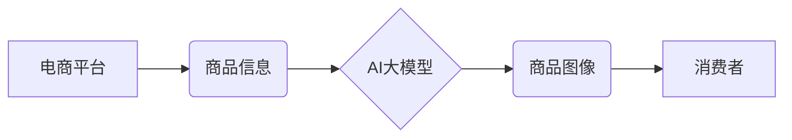

                 

## AI大模型在电商平台商品图像生成与编辑中的应用

> 关键词：AI大模型、商品图像生成、图像编辑、电商平台、深度学习、GAN、Diffusion Model

## 1. 背景介绍

随着电商平台的蓬勃发展，高质量的商品图像已成为吸引消费者、提升转化率的关键因素。传统商品图像拍摄方式成本高、效率低，难以满足电商平台对海量商品图像的需求。而AI大模型的出现为电商平台商品图像生成与编辑提供了全新的解决方案。

AI大模型，特别是基于深度学习的生成模型，能够学习海量图像数据，并生成逼真的、高质量的商品图像。这些模型可以根据文本描述生成商品图像，也可以对现有图像进行编辑和增强，例如改变背景、添加特效、调整颜色等。

## 2. 核心概念与联系

### 2.1  核心概念

* **AI大模型:** 指的是参数量巨大、训练数据海量、具备强大泛化能力的深度学习模型。
* **商品图像生成:** 利用AI大模型根据文本描述或其他输入信息生成新的商品图像。
* **图像编辑:** 利用AI大模型对现有图像进行修改和增强，例如调整颜色、添加特效、更换背景等。
* **深度学习:** 一种机器学习方法，通过多层神经网络模拟人类大脑的学习过程。
* **生成对抗网络 (GAN):** 一种由生成器和鉴别器组成的深度学习模型，通过对抗训练生成逼真的图像。
* **扩散模型 (Diffusion Model):** 一种基于概率的图像生成模型，通过逐步添加噪声和去除噪声来生成图像。

### 2.2  架构关系



## 3. 核心算法原理 & 具体操作步骤

### 3.1  算法原理概述

商品图像生成与编辑主要依赖于以下两种核心算法：

* **生成对抗网络 (GAN):** GAN由两个网络组成：生成器和鉴别器。生成器负责生成图像，鉴别器负责判断图像是否为真实图像。两者通过对抗训练，生成器不断生成更逼真的图像，鉴别器不断提高识别真实图像的能力。
* **扩散模型 (Diffusion Model):** 扩散模型通过逐步添加噪声到图像中，最终生成纯噪声图像。然后，训练一个解码器网络，从纯噪声图像中逐步去除噪声，最终生成清晰的图像。

### 3.2  算法步骤详解

#### 3.2.1  GAN 算法步骤

1. **初始化生成器和鉴别器网络:** 使用随机初始化生成器和鉴别器网络的参数。
2. **训练鉴别器:** 使用真实图像和生成器生成的图像作为输入，训练鉴别器网络，使其能够区分真实图像和生成图像。
3. **训练生成器:** 使用鉴别器网络的反馈信息，训练生成器网络，使其能够生成更逼真的图像，以欺骗鉴别器。
4. **重复步骤2和3:** 持续训练生成器和鉴别器网络，直到生成器能够生成与真实图像几乎 indistinguishable 的图像。

#### 3.2.2  扩散模型算法步骤

1. **前向扩散:** 将真实图像逐步添加噪声，最终生成纯噪声图像。
2. **训练解码器:** 使用纯噪声图像和对应的真实图像作为输入，训练解码器网络，使其能够从纯噪声图像中逐步去除噪声，最终生成清晰的图像。
3. **生成图像:** 使用训练好的解码器网络，从纯噪声图像中逐步去除噪声，生成新的图像。

### 3.3  算法优缺点

#### 3.3.1  GAN 算法

* **优点:** 可以生成逼真的、高质量的图像。
* **缺点:** 训练过程复杂，容易陷入局部最优解，生成图像可能存在模式重复等问题。

#### 3.3.2  扩散模型

* **优点:** 训练过程相对稳定，生成图像质量高，能够生成多样化的图像。
* **缺点:** 训练时间较长，计算资源需求较高。

### 3.4  算法应用领域

* **商品图像生成:** 根据文本描述生成商品图像，例如服装、电子产品、家居用品等。
* **图像编辑:** 对现有图像进行修改和增强，例如更换背景、添加特效、调整颜色等。
* **图像修复:** 修复损坏的图像，例如去除瑕疵、恢复细节等。
* **图像风格迁移:** 将图像转换为不同的艺术风格。

## 4. 数学模型和公式 & 详细讲解 & 举例说明

### 4.1  数学模型构建

#### 4.1.1  GAN 模型

GAN 模型由两个网络组成：生成器 (G) 和鉴别器 (D)。

* **生成器 (G):** 接收噪声向量 z 作为输入，输出生成图像 x。
* **鉴别器 (D):** 接收图像 x 作为输入，输出判断图像是否为真实图像的概率 p(x)。

#### 4.1.2  扩散模型

扩散模型通过逐步添加噪声到图像中，最终生成纯噪声图像。然后，训练一个解码器网络，从纯噪声图像中逐步去除噪声，最终生成清晰的图像。

### 4.2  公式推导过程

#### 4.2.1  GAN 模型

* **生成器损失函数:**

$$
L_G(G, D) = E_{z \sim p_z(z)}[ -log(D(G(z))) ]
$$

* **鉴别器损失函数:**

$$
L_D(D, G) = E_{x \sim p_{data}(x)}[ -log(D(x)) ] + E_{z \sim p_z(z)}[ -log(1 - D(G(z))) ]
$$

#### 4.2.2  扩散模型

扩散模型的训练目标是最小化从纯噪声图像到真实图像的重建误差。

### 4.3  案例分析与讲解

#### 4.3.1  GAN 模型案例

使用 GAN 模型生成逼真的猫图像。

#### 4.3.2  扩散模型案例

使用扩散模型修复损坏的图像，例如去除图像中的瑕疵。

## 5. 项目实践：代码实例和详细解释说明

### 5.1  开发环境搭建

* **操作系统:** Ubuntu 20.04
* **编程语言:** Python 3.8
* **深度学习框架:** PyTorch 1.10
* **GPU:** NVIDIA GeForce RTX 3090

### 5.2  源代码详细实现

```python
# 生成器网络
class Generator(nn.Module):
    def __init__(self):
        super(Generator, self).__init__()
        # ...

    def forward(self, z):
        # ...

# 鉴别器网络
class Discriminator(nn.Module):
    def __init__(self):
        super(Discriminator, self).__init__()
        # ...

    def forward(self, x):
        # ...

# 训练循环
for epoch in range(num_epochs):
    for batch_idx, (data, _) in enumerate(train_loader):
        # ...
```

### 5.3  代码解读与分析

* **生成器网络:** 负责生成图像，接收噪声向量作为输入，输出生成图像。
* **鉴别器网络:** 负责判断图像是否为真实图像，接收图像作为输入，输出判断概率。
* **训练循环:** 训练生成器和鉴别器网络，通过对抗训练，生成器不断生成更逼真的图像，鉴别器不断提高识别真实图像的能力。

### 5.4  运行结果展示

* **生成图像:** 展示生成器生成的图像，例如服装、电子产品、家居用品等。
* **图像编辑:** 展示对现有图像进行编辑和增强后的结果，例如更换背景、添加特效、调整颜色等。

## 6. 实际应用场景

### 6.1  电商平台商品展示

* **自动生成商品图像:** 根据商品信息自动生成商品图像，例如服装、电子产品、家居用品等。
* **个性化商品展示:** 根据用户的喜好和购买历史，生成个性化的商品图像，提高用户体验。
* **虚拟试衣间:** 利用 AI 大模型生成虚拟试衣间，用户可以虚拟试穿衣服，选择合适的款式和尺寸。

### 6.2  电商平台营销推广

* **生成创意广告:** 利用 AI 大模型生成创意广告，吸引用户的注意力，提高广告转化率。
* **生成产品演示视频:** 利用 AI 大模型生成产品演示视频，展示产品的功能和特点，提升用户购买意愿。
* **生成产品推荐图文:** 利用 AI 大模型生成产品推荐图文，推荐用户可能感兴趣的商品，提高用户购买率。

### 6.3  其他应用场景

* **游戏开发:** 生成游戏场景、角色、道具等。
* **电影制作:** 生成电影特效、角色动画等。
* **医疗诊断:** 生成医学图像，辅助医生诊断疾病。

### 6.4  未来应用展望

随着 AI 大模型技术的不断发展，其在电商平台商品图像生成与编辑领域的应用将更加广泛和深入。未来，AI 大模型将能够生成更加逼真、多样化的商品图像，并提供更加个性化的商品展示和营销推广服务。

## 7. 工具和资源推荐

### 7.1  学习资源推荐

* **书籍:**
    * 《深度学习》
    * 《Generative Deep Learning》
* **在线课程:**
    * Coursera: Deep Learning Specialization
    * Udacity: Deep Learning Nanodegree

### 7.2  开发工具推荐

* **深度学习框架:** PyTorch, TensorFlow
* **图像处理库:** OpenCV, Pillow
* **云计算平台:** AWS, Google Cloud, Azure

### 7.3  相关论文推荐

* **Generative Adversarial Networks**
* **Diffusion Models Beat GANs on Image Synthesis**

## 8. 总结：未来发展趋势与挑战

### 8.1  研究成果总结

AI 大模型在电商平台商品图像生成与编辑领域取得了显著成果，能够生成逼真的、高质量的商品图像，并提供更加个性化的商品展示和营销推广服务。

### 8.2  未来发展趋势

* **模型性能提升:** 继续提高 AI 大模型的生成图像质量和多样性。
* **应用场景拓展:** 将 AI 大模型应用到更多电商平台场景，例如商品推荐、虚拟试衣间等。
* **个性化定制:** 根据用户的喜好和需求，生成更加个性化的商品图像。

### 8.3  面临的挑战

* **数据获取和标注:** 训练高质量的 AI 大模型需要海量图像数据，数据获取和标注成本较高。
* **模型训练效率:** 训练大型 AI 大模型需要大量的计算资源和时间。
* **伦理问题:** AI 大模型生成的图像可能存在虚假信息和版权问题，需要关注伦理问题。

### 8.4  研究展望

未来，AI 大模型在电商平台商品图像生成与编辑领域将继续发展，并带来更加创新和颠覆性的应用。


## 9. 附录：常见问题与解答

* **Q1: AI 大模型生成的图像是否真实？**

A1: AI 大模型生成的图像虽然逼真，但并非真实拍摄的图像。它们是根据训练数据学习到的模式和规律生成的。

* **Q2: 如何评估 AI 大模型生成的图像质量？**

A2: 可以使用多种指标评估 AI 大模型生成的图像质量，例如 PSNR、SSIM、FID 等。

* **Q3: AI 大模型的应用场景有哪些？**

A3: AI 大模型的应用场景非常广泛，例如图像生成、图像编辑、图像修复、图像风格迁移等。

* **Q4: 如何学习 AI 大模型相关知识？**

A4: 可以阅读相关书籍、在线课程、论文等学习 AI 大模型相关知识。

作者：禅与计算机程序设计艺术 / Zen and the Art of Computer Programming 


<end_of_turn>

