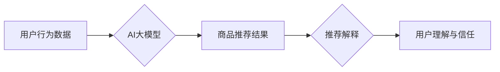

                 

## AI大模型在电商平台商品推荐解释中的应用

> 关键词：AI大模型、商品推荐、推荐解释、自然语言处理、深度学习、用户行为分析、电商平台

## 1. 背景介绍

在当今数据爆炸的时代，电商平台面临着海量商品和用户数据，如何精准推荐用户感兴趣的商品，提升用户体验和转化率成为关键挑战。传统的基于规则或协同过滤的推荐算法，往往难以捕捉用户细微需求和商品复杂特征，导致推荐结果缺乏个性化和可解释性。

近年来，随着深度学习技术的飞速发展，AI大模型在推荐系统领域展现出巨大潜力。其强大的学习能力和泛化能力，能够从海量数据中挖掘用户偏好和商品关联，生成更精准、更个性化的推荐结果。然而，AI大模型的“黑箱”特性也带来了一系列挑战，用户难以理解推荐结果背后的逻辑，导致信任度下降。

因此，如何结合AI大模型的强大推荐能力和推荐解释的可解释性，构建用户信任的推荐系统，成为当前研究热点。

## 2. 核心概念与联系

### 2.1  AI大模型

AI大模型是指在海量数据上训练的深度学习模型，拥有强大的泛化能力和学习能力，能够处理复杂的任务，例如自然语言处理、图像识别、语音合成等。

### 2.2  商品推荐

商品推荐是指根据用户的历史行为、偏好和上下文信息，预测用户可能感兴趣的商品，并将其推荐给用户。

### 2.3  推荐解释

推荐解释是指对推荐结果进行解释，让用户理解推荐背后的逻辑，增强用户信任和满意度。

**核心概念与联系流程图**



## 3. 核心算法原理 & 具体操作步骤

### 3.1  算法原理概述

推荐解释算法旨在揭示AI大模型推荐结果背后的逻辑，使其可理解。常用的推荐解释算法包括：

* **LIME (Local Interpretable Model-agnostic Explanations):** 基于局部线性模型解释AI模型的决策边界。
* **SHAP (SHapley Additive exPlanations):** 基于合作博弈论，分配每个特征对推荐结果的影响权重。
* **Attention机制:** 通过学习模型对输入特征的关注程度，解释模型决策过程中的重要特征。

### 3.2  算法步骤详解

以LIME算法为例，其步骤如下：

1. **选择样本:** 从推荐结果中选择一个需要解释的样本。
2. **构建局部模型:** 在样本附近构建一个局部线性模型，例如线性回归模型。
3. **解释模型:** 使用局部模型解释样本被推荐的原因，例如哪些特征对推荐结果影响较大。

### 3.3  算法优缺点

| 算法 | 优点 | 缺点 |
|---|---|---|
| LIME | 易于理解，可解释性强 | 局部解释，可能无法反映全局趋势 |
| SHAP | 全局解释，更准确 | 计算复杂度高 |
| Attention机制 | 突出重要特征，可视化解释 | 需要模型支持 |

### 3.4  算法应用领域

推荐解释算法广泛应用于电商平台、金融领域、医疗诊断等场景，例如：

* **电商平台:** 解释商品推荐理由，提升用户信任和转化率。
* **金融领域:** 解释贷款审批结果，提高用户透明度和公平性。
* **医疗诊断:** 解释疾病诊断结果，帮助医生和患者理解诊断依据。

## 4. 数学模型和公式 & 详细讲解 & 举例说明

### 4.1  数学模型构建

LIME算法的核心是构建一个局部线性模型，其数学模型可以表示为：

$$
f(x) = w_0 + \sum_{i=1}^{n} w_i x_i
$$

其中：

* $f(x)$ 是目标模型的预测结果。
* $x = (x_1, x_2, ..., x_n)$ 是输入特征向量。
* $w_0$ 是截距项。
* $w_i$ 是第 $i$ 个特征的权重。

### 4.2  公式推导过程

LIME算法通过最小化目标模型和局部线性模型之间的差异，来学习局部线性模型的参数。具体推导过程如下：

1. **定义损失函数:** 使用平方误差作为损失函数，衡量目标模型和局部线性模型之间的差异。

$$
L(w) = \sum_{i=1}^{m} (f(x_i) - \hat{f}(x_i))^2
$$

其中：

* $m$ 是样本数量。
* $f(x_i)$ 是目标模型对第 $i$ 个样本的预测结果。
* $\hat{f}(x_i)$ 是局部线性模型对第 $i$ 个样本的预测结果。

2. **求解参数:** 使用梯度下降算法最小化损失函数，得到局部线性模型的参数 $w$。

### 4.3  案例分析与讲解

假设我们有一个电商平台，目标是推荐用户可能感兴趣的商品。

* **目标模型:** 使用AI大模型对用户历史行为和商品特征进行预测，生成商品推荐结果。
* **局部线性模型:** 使用LIME算法构建一个局部线性模型，解释目标模型对某个特定用户的推荐结果。

例如，对于某个用户，目标模型推荐了一款手机。使用LIME算法可以解释，该用户被推荐这款手机的原因可能是：

* 用户过去购买过类似的手机。
* 用户浏览过这款手机的详情页。
* 用户关注了这款手机的品牌。

## 5. 项目实践：代码实例和详细解释说明

### 5.1  开发环境搭建

* Python 3.6+
* TensorFlow/PyTorch
* scikit-learn
* LIME/SHAP库

### 5.2  源代码详细实现

```python
# 使用LIME解释商品推荐结果
from lime import lime_tabular
import pandas as pd

# 加载目标模型和用户数据
model = ... # 加载AI大模型
user_data = pd.read_csv('user_data.csv')

# 选择需要解释的样本
user_id = 123
user_data = user_data[user_data['user_id'] == user_id]

# 使用LIME解释模型
explainer = lime_tabular.LimeTabularExplainer(
    data=user_data,
    feature_names=user_data.columns,
    mode='classification'
)
explanation = explainer.explain_instance(
    user_data.iloc[0],
    model.predict,
    num_features=5
)

# 可视化解释结果
explanation.as_list()
explanation.as_dataframe()
```

### 5.3  代码解读与分析

* 加载目标模型和用户数据。
* 选择需要解释的样本。
* 使用LIME算法构建局部线性模型，解释模型对样本的预测结果。
* 可视化解释结果，例如显示特征重要性排序。

### 5.4  运行结果展示

运行结果将显示出哪些特征对该用户的商品推荐结果影响最大，例如用户购买历史、浏览记录、评分等。

## 6. 实际应用场景

### 6.1  电商平台商品推荐

* 解释推荐理由，提升用户信任和转化率。
* 帮助用户发现新商品，提高用户体验。
* 提供个性化推荐，满足用户多样化需求。

### 6.2  金融领域贷款审批

* 解释贷款审批结果，提高用户透明度和公平性。
* 帮助用户了解贷款条件，提高贷款申请成功率。
* 识别潜在风险，降低贷款风险。

### 6.3  医疗诊断

* 解释疾病诊断结果，帮助医生和患者理解诊断依据。
* 提高诊断准确率，降低误诊率。
* 辅助医生制定治疗方案，提高治疗效果。

### 6.4  未来应用展望

随着AI技术的不断发展，推荐解释技术将应用于更多领域，例如：

* 教育领域：解释学习推荐结果，帮助学生个性化学习。
* 人力资源领域：解释招聘推荐结果，提高招聘效率和公平性。
* 政府服务领域：解释公共服务推荐结果，提高服务效率和用户满意度。

## 7. 工具和资源推荐

### 7.1  学习资源推荐

* **书籍:**

    * "Interpretable Machine Learning" by Christoph Molnar
    * "The Hundred-Page Machine Learning Book" by Andriy Burkov

* **在线课程:**

    * Coursera: "Machine Learning" by Andrew Ng
    * edX: "Artificial Intelligence" by Columbia University

### 7.2  开发工具推荐

* **LIME:** https://github.com/marcotcr/lime
* **SHAP:** https://github.com/slundberg/shap
* **TensorFlow:** https://www.tensorflow.org/
* **PyTorch:** https://pytorch.org/

### 7.3  相关论文推荐

* "Local Interpretable Model-agnostic Explanations" by Marco Tulio Ribeiro, Sameer Singh, and Carlos Guestrin
* "SHAP: A Unified Approach to Interpreting Model Predictions" by Scott Lundberg and Su-In Lee

## 8. 总结：未来发展趋势与挑战

### 8.1  研究成果总结

AI大模型在电商平台商品推荐领域取得了显著成果，但推荐解释技术仍处于发展初期。

### 8.2  未来发展趋势

* **更准确、更可解释的算法:** 研究更准确、更可解释的推荐解释算法，例如基于图神经网络的解释方法。
* **多模态解释:** 将文本、图像、音频等多模态信息融合到推荐解释中，提供更丰富的解释内容。
* **交互式解释:** 开发交互式推荐解释系统，让用户可以动态调整解释视角，深入理解推荐结果。

### 8.3  面临的挑战

* **算法复杂度:** 一些推荐解释算法计算复杂度高，难以应用于大规模数据场景。
* **解释结果的可信度:** 推荐解释结果的准确性和可靠性需要进一步验证。
* **用户理解:** 如何将复杂的解释结果转化为用户易于理解的语言，仍然是一个挑战。

### 8.4  研究展望

未来，推荐解释技术将与AI大模型深度融合，构建更智能、更可信的推荐系统，为用户提供更个性化、更透明的推荐体验。

## 9. 附录：常见问题与解答

* **Q: 为什么需要推荐解释？**

A: 推荐解释可以帮助用户理解推荐结果背后的逻辑，增强用户信任和满意度。

* **Q: 推荐解释算法有哪些？**

A: 常用的推荐解释算法包括LIME、SHAP和Attention机制等。

* **Q: 如何选择合适的推荐解释算法？**

A: 选择合适的推荐解释算法需要根据具体应用场景和数据特点进行选择。

* **Q: 推荐解释技术面临哪些挑战？**

A: 推荐解释技术面临算法复杂度、解释结果可信度和用户理解等挑战。


作者：禅与计算机程序设计艺术 / Zen and the Art of Computer Programming 
<end_of_turn>

