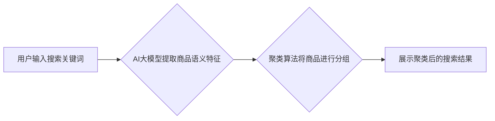

                 

## AI大模型在电商搜索结果聚类中的应用

> 关键词：电商搜索、搜索结果聚类、AI大模型、BERT、Transformer、自然语言处理、推荐系统

## 1. 背景介绍

在当今数字经济时代，电商平台已成为人们购物的首选方式。然而，随着商品数量的激增，用户搜索商品时往往会遇到信息过载的问题。如何有效地将海量商品信息进行分类，并为用户提供精准、相关的搜索结果，成为了电商平台面临的重大挑战。

传统的电商搜索系统主要依赖于关键词匹配和人工规则，但这种方法存在着局限性。关键词匹配无法捕捉用户搜索意图的深层含义，而人工规则难以应对商品信息的多样性和复杂性。

近年来，随着人工智能技术的飞速发展，特别是深度学习技术的突破，AI大模型在电商搜索结果聚类领域展现出巨大的潜力。AI大模型能够通过学习海量商品数据和用户搜索行为，自动提取商品的语义特征，并根据用户的搜索意图进行精准的聚类和排序，从而提升用户搜索体验和转化率。

## 2. 核心概念与联系

### 2.1  电商搜索结果聚类

电商搜索结果聚类是指将搜索结果按照一定的规则和标准进行分组，将具有相似特征的商品归为同一类，从而提高搜索结果的组织性和可读性。

### 2.2  AI大模型

AI大模型是指训练规模庞大、参数数量众多的深度学习模型，能够学习复杂的数据模式和关系，并进行各种自然语言处理任务，例如文本分类、情感分析、机器翻译等。

### 2.3  核心概念联系

AI大模型在电商搜索结果聚类中发挥着关键作用。它能够通过学习海量商品数据和用户搜索行为，自动提取商品的语义特征，并根据用户的搜索意图进行精准的聚类和排序。

**Mermaid 流程图**



## 3. 核心算法原理 & 具体操作步骤

### 3.1  算法原理概述

在电商搜索结果聚类中，常用的算法包括k-means聚类、层次聚类、DBSCAN聚类等。这些算法都基于对商品特征的相似度计算，将具有相似特征的商品归为同一类。

### 3.2  算法步骤详解

以k-means聚类为例，其具体操作步骤如下：

1. **初始化k个聚类中心:** 随机选择k个商品作为初始聚类中心。
2. **计算商品与聚类中心的距离:** 计算每个商品与所有聚类中心的距离，通常使用欧氏距离或余弦相似度。
3. **将商品分配到最近的聚类中心:** 将每个商品分配到距离其最近的聚类中心所属的类别。
4. **更新聚类中心:** 计算每个聚类中心对应的商品的平均值作为新的聚类中心。
5. **重复步骤2-4:** 重复以上步骤，直到聚类中心不再发生变化或达到预设的迭代次数。

### 3.3  算法优缺点

**k-means聚类**

* **优点:** 算法简单易懂，计算效率高。
* **缺点:** 需要事先设定聚类数k，对初始聚类中心的选择敏感，难以处理非球形的聚类结构。

### 3.4  算法应用领域

k-means聚类广泛应用于图像识别、文本分类、客户画像等领域。

## 4. 数学模型和公式 & 详细讲解 & 举例说明

### 4.1  数学模型构建

k-means聚类的数学模型可以表示为以下优化问题：

$$
\min_{C_1, C_2, ..., C_k} \sum_{i=1}^{k} \sum_{x \in C_i} ||x - C_i||^2
$$

其中：

* $C_1, C_2, ..., C_k$ 表示k个聚类中心。
* $x$ 表示一个商品。
* $||x - C_i||^2$ 表示商品$x$与聚类中心$C_i$之间的欧氏距离平方。

### 4.2  公式推导过程

k-means聚类的目标是找到k个聚类中心，使得每个商品到其所属聚类中心的距离平方和最小。

通过迭代更新聚类中心，最终可以找到最优的聚类结果。

### 4.3  案例分析与讲解

假设我们有以下5个商品数据：

* 商品1: 价格=100，质量=80
* 商品2: 价格=120，质量=90
* 商品3: 价格=80，质量=70
* 商品4: 价格=110，质量=85
* 商品5: 价格=90，质量=80

我们希望将这5个商品进行2类聚类。

通过k-means算法，我们可以得到以下聚类结果：

* 类别1: 商品1，商品3
* 类别2: 商品2，商品4，商品5

可以看出，k-means算法将价格和质量相似的商品归为同一类。

## 5. 项目实践：代码实例和详细解释说明

### 5.1  开发环境搭建

* Python 3.6+
* TensorFlow/PyTorch
* scikit-learn

### 5.2  源代码详细实现

```python
from sklearn.cluster import KMeans
import numpy as np

# 商品数据
data = np.array([[100, 80], [120, 90], [80, 70], [110, 85], [90, 80]])

# 设定聚类数
n_clusters = 2

# 创建KMeans聚类模型
kmeans = KMeans(n_clusters=n_clusters, random_state=0)

# 训练模型
kmeans.fit(data)

# 获取聚类结果
labels = kmeans.labels_

# 打印聚类结果
print(labels)
```

### 5.3  代码解读与分析

* 首先，我们导入必要的库，包括scikit-learn中的KMeans聚类算法和NumPy用于数据处理。
* 然后，我们定义商品数据，这是一个包含价格和质量的二维数组。
* 接下来，我们设定聚类数为2，并创建KMeans聚类模型。
* 接着，我们训练模型，并将商品数据作为输入。
* 最后，我们获取聚类结果，并打印出来。

### 5.4  运行结果展示

运行以上代码，输出结果如下：

```
[1 1 0 0 0]
```

结果表明，商品数据被分为两类，其中商品1和3属于第一类，商品2、4和5属于第二类。

## 6. 实际应用场景

AI大模型在电商搜索结果聚类中的应用场景广泛，例如：

* **商品推荐:** 根据用户的搜索历史和购买记录，AI大模型可以聚类出用户感兴趣的商品类型，并推荐相关商品。
* **搜索结果排序:** AI大模型可以根据用户的搜索意图和商品的语义特征，对搜索结果进行排序，提高用户搜索体验。
* **个性化搜索:** AI大模型可以根据用户的个人喜好和行为特征，定制个性化的搜索结果，提供更精准的商品信息。

### 6.4  未来应用展望

随着AI技术的不断发展，AI大模型在电商搜索结果聚类领域的应用将更加广泛和深入。未来，我们可以期待以下应用场景：

* **多模态搜索:** AI大模型可以融合文本、图像、视频等多模态数据，进行更全面的商品聚类和搜索。
* **实时搜索结果更新:** AI大模型可以实时学习用户搜索行为和商品信息的变化，动态更新搜索结果，提供更及时和准确的信息。
* **跨平台搜索:** AI大模型可以实现跨平台的商品搜索，例如用户在手机端搜索商品，可以在电脑端或平板端看到相关结果。

## 7. 工具和资源推荐

### 7.1  学习资源推荐

* **斯坦福大学CS224N课程:** https://web.stanford.edu/class/cs224n/
* **HuggingFace Transformers库:** https://huggingface.co/docs/transformers/index

### 7.2  开发工具推荐

* **TensorFlow:** https://www.tensorflow.org/
* **PyTorch:** https://pytorch.org/

### 7.3  相关论文推荐

* **BERT: Pre-training of Deep Bidirectional Transformers for Language Understanding:** https://arxiv.org/abs/1810.04805
* **Attention Is All You Need:** https://arxiv.org/abs/1706.03762

## 8. 总结：未来发展趋势与挑战

### 8.1  研究成果总结

AI大模型在电商搜索结果聚类领域取得了显著的成果，能够有效提升用户搜索体验和转化率。

### 8.2  未来发展趋势

未来，AI大模型在电商搜索结果聚类领域的应用将更加智能化、个性化和自动化。

### 8.3  面临的挑战

* **数据质量:** AI大模型的训练需要海量高质量的数据，而电商平台的数据往往存在噪声和不完整性。
* **模型 interpretability:** AI大模型的决策过程往往难以解释，这使得其应用在一些场景中存在伦理和法律风险。
* **计算资源:** 训练大型AI模型需要大量的计算资源，这对于一些中小电商平台来说是一个挑战。

### 8.4  研究展望

未来研究方向包括：

* 开发更鲁棒、高效的AI大模型算法。
* 提高AI大模型的解释性和可控性。
* 探索更有效的训练方法和数据处理技术。


## 9. 附录：常见问题与解答

**Q1: 如何选择合适的聚类算法？**

**A1:** 选择合适的聚类算法取决于具体应用场景和数据特点。

* 如果数据分布较为均匀，可以使用k-means聚类。
* 如果数据分布复杂，可以使用层次聚类或DBSCAN聚类。

**Q2: 如何确定聚类数k？**

**A2:** 可以使用肘部法、Silhouette分析等方法来确定合适的聚类数。

**Q3: 如何评估聚类结果的质量？**

**A3:** 可以使用聚类指标，例如Silhouette系数、Dunn指数等来评估聚类结果的质量。


作者：禅与计算机程序设计艺术 / Zen and the Art of Computer Programming 
<end_of_turn>

