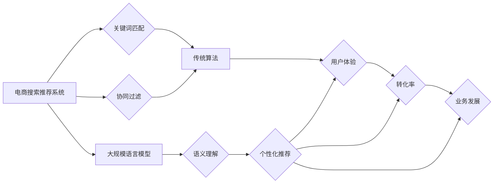

                 

## AI大模型赋能电商搜索推荐的业务创新思维导图应用实践

> 关键词：AI大模型、电商搜索、推荐系统、思维导图、业务创新、自然语言处理、深度学习

## 1. 背景介绍

随着电商行业的蓬勃发展，用户对商品搜索和推荐的需求日益增长。传统的基于关键词匹配和协同过滤的搜索推荐算法已难以满足用户个性化、精准化的需求。而近年来，大规模语言模型（LLM）的快速发展为电商搜索推荐带来了新的机遇。

LLM 拥有强大的文本理解和生成能力，能够理解用户搜索意图，挖掘商品之间的语义关联，并生成更精准、更个性化的推荐结果。将 LLM 应用于电商搜索推荐，可以有效提升用户体验，提高转化率，促进电商业务发展。

## 2. 核心概念与联系

### 2.1  电商搜索推荐系统

电商搜索推荐系统是电商平台的核心功能之一，旨在帮助用户快速找到所需商品，并提供个性化的商品推荐。传统的电商搜索推荐系统主要基于以下两种算法：

* **关键词匹配:** 根据用户输入的关键词，从商品数据库中匹配出相关的商品。
* **协同过滤:** 根据用户的历史购买行为和其他用户的相似行为，推荐用户可能感兴趣的商品。

### 2.2  大规模语言模型（LLM）

大规模语言模型（LLM）是一种基于深度学习的强大人工智能模型，通过训练海量文本数据，学习语言的语法、语义和上下文关系。LLM 能够执行多种自然语言处理任务，例如文本生成、文本分类、机器翻译、问答系统等。

### 2.3  思维导图

思维导图是一种以中心主题为核心的图形化思维工具，通过分支结构清晰地展现概念之间的关系和层次。思维导图可以帮助我们理清思路，梳理知识，并进行创意思考。

**核心概念与架构**



## 3. 核心算法原理 & 具体操作步骤

### 3.1  算法原理概述

将 LLM 应用于电商搜索推荐，主要通过以下步骤实现：

1. **语义理解:** 利用 LLM 对用户搜索词进行语义理解，提取关键词、用户意图和相关概念。
2. **商品语义表示:** 利用 LLM 对商品信息进行语义表示，例如商品标题、描述、属性等，构建商品的语义向量。
3. **推荐模型训练:** 基于语义理解和商品语义表示，训练推荐模型，例如基于 Transformer 的推荐模型，以预测用户对商品的兴趣。
4. **个性化推荐:** 根据用户的搜索历史、浏览记录、购买行为等信息，以及训练好的推荐模型，生成个性化的商品推荐结果。

### 3.2  算法步骤详解

1. **数据预处理:** 收集用户搜索词、商品信息、用户行为数据等，进行清洗、格式化和向量化处理。
2. **LLM fine-tuning:** 利用预训练的 LLM 模型，对电商搜索推荐相关的特定数据集进行 fine-tuning，提升模型在语义理解和商品语义表示方面的性能。
3. **推荐模型构建:** 选择合适的推荐模型架构，例如 Transformer、BERT 等，并根据电商搜索推荐的特点进行调整和优化。
4. **模型训练:** 利用训练数据，训练推荐模型，并进行模型评估和调参。
5. **推荐结果生成:** 将用户搜索词输入到训练好的推荐模型中，获取商品推荐结果，并进行排序和展示。

### 3.3  算法优缺点

**优点:**

* **语义理解能力强:** LLM 能够理解用户搜索意图，挖掘商品之间的语义关联，提供更精准的推荐结果。
* **个性化推荐:** 基于用户的历史行为和偏好，生成个性化的商品推荐，提升用户体验。
* **持续学习:** LLM 可以持续学习新的数据，不断优化推荐效果。

**缺点:**

* **计算资源消耗大:** LLM 的训练和推理需要大量的计算资源。
* **数据依赖性强:** LLM 的性能取决于训练数据的质量和数量。
* **可解释性差:** LLM 的决策过程较为复杂，难以解释推荐结果背后的逻辑。

### 3.4  算法应用领域

LLM 应用于电商搜索推荐，可以应用于以下场景：

* **商品搜索:** 理解用户搜索意图，提供更精准的商品搜索结果。
* **个性化推荐:** 根据用户的兴趣和偏好，推荐个性化的商品。
* **商品分类:** 利用 LLM 对商品进行语义分类，提高商品分类的准确率。
* **商品描述生成:** 利用 LLM 自动生成商品描述，提升商品信息质量。

## 4. 数学模型和公式 & 详细讲解 & 举例说明

### 4.1  数学模型构建

在电商搜索推荐系统中，可以使用基于 Transformer 的推荐模型，例如 BERT 或 RoBERTa，构建数学模型。

Transformer 模型的核心是注意力机制，能够捕捉文本序列中不同词语之间的关系，并赋予每个词语不同的权重。

### 4.2  公式推导过程

Transformer 模型的注意力机制公式如下：

$$
Attention(Q, K, V) = softmax(\frac{QK^T}{\sqrt{d_k}})V
$$

其中：

* $Q$：查询矩阵
* $K$：键矩阵
* $V$：值矩阵
* $d_k$：键向量的维度
* $softmax$：softmax 函数

### 4.3  案例分析与讲解

假设用户搜索了关键词 "运动鞋"，模型会将 "运动鞋" 作为查询向量 $Q$，并将商品信息作为键向量 $K$ 和值向量 $V$。

通过注意力机制，模型会计算出每个商品与 "运动鞋" 之间的相关性，并赋予每个商品不同的权重。

最终，模型会根据商品的权重，生成一个排序后的商品推荐列表，并将与 "运动鞋" 相关性最高的商品推荐给用户。

## 5. 项目实践：代码实例和详细解释说明

### 5.1  开发环境搭建

* Python 3.7+
* PyTorch 或 TensorFlow
* CUDA 和 cuDNN

### 5.2  源代码详细实现

```python
import torch
import torch.nn as nn

class TransformerRecommender(nn.Module):
    def __init__(self, embedding_dim, num_heads, num_layers):
        super(TransformerRecommender, self).__init__()
        self.embedding = nn.Embedding(vocab_size, embedding_dim)
        self.transformer = nn.Transformer(embedding_dim, num_heads, num_layers)
        self.fc = nn.Linear(embedding_dim, 1)

    def forward(self, user_input, item_input):
        user_embeddings = self.embedding(user_input)
        item_embeddings = self.embedding(item_input)
        
        # 使用 Transformer 模型处理用户和商品嵌入
        output = self.transformer(user_embeddings, item_embeddings)
        
        # 使用全连接层预测用户对商品的评分
        scores = self.fc(output)
        return scores
```

### 5.3  代码解读与分析

* `embedding`: 将用户和商品的 ID 转换为稠密的向量表示。
* `transformer`: 使用 Transformer 模型处理用户和商品的嵌入，捕捉它们之间的关系。
* `fc`: 使用全连接层预测用户对商品的评分。

### 5.4  运行结果展示

通过训练和测试，可以评估模型的推荐效果，例如准确率、召回率、NDCG 等指标。

## 6. 实际应用场景

### 6.1  电商搜索场景

将 LLM 应用于电商搜索，可以实现以下功能：

* **智能搜索:** 理解用户模糊搜索、长尾关键词等搜索需求，提供更精准的搜索结果。
* **搜索结果排序:** 根据用户搜索意图和商品相关性，对搜索结果进行排序，提升用户体验。
* **搜索建议:** 根据用户输入的关键词，提供智能搜索建议，引导用户进行更精准的搜索。

### 6.2  商品推荐场景

将 LLM 应用于商品推荐，可以实现以下功能：

* **个性化推荐:** 根据用户的兴趣、购买历史、浏览记录等信息，推荐个性化的商品。
* **跨类目推荐:** 挖掘商品之间的语义关联，推荐跨类目的商品，拓展用户购买范围。
* **新品推荐:** 利用 LLM 对新品信息进行分析，推荐符合用户兴趣的新产品。

### 6.3  用户画像分析

利用 LLM 对用户评论、浏览记录等数据进行分析，构建用户画像，了解用户的兴趣、偏好和需求，为个性化推荐提供数据支持。

### 6.4  未来应用展望

随着 LLM 技术的不断发展，其在电商搜索推荐领域的应用将更加广泛和深入。

例如，可以利用 LLM 生成更生动的商品描述，提升商品信息质量；可以利用 LLM 进行多模态推荐，结合商品图片、视频等信息进行推荐；可以利用 LLM 进行对话式推荐，与用户进行自然语言交互，提供更个性化的推荐服务。

## 7. 工具和资源推荐

### 7.1  学习资源推荐

* **论文:**
    * BERT: Pre-training of Deep Bidirectional Transformers for Language Understanding
    * RoBERTa: A Robustly Optimized BERT Pretraining Approach
* **博客:**
    * The Illustrated Transformer
    * Hugging Face Blog
* **在线课程:**
    * Deep Learning Specialization (Coursera)
    * Natural Language Processing with Deep Learning (Udacity)

### 7.2  开发工具推荐

* **PyTorch:** 深度学习框架
* **TensorFlow:** 深度学习框架
* **Hugging Face Transformers:** 预训练 Transformer 模型库
* **SpaCy:** 自然语言处理库

### 7.3  相关论文推荐

* **BERT for Recommender Systems**
* **Transformer-based Recommendation Models**
* **Large Language Models for Recommender Systems**

## 8. 总结：未来发展趋势与挑战

### 8.1  研究成果总结

将 LLM 应用于电商搜索推荐，取得了显著的成果，例如提升了推荐准确率、个性化程度和用户体验。

### 8.2  未来发展趋势

* **模型规模和性能提升:** 随着计算资源的不断发展，LLM 的规模和性能将进一步提升，带来更精准、更个性化的推荐结果。
* **多模态推荐:** 将文本、图片、视频等多模态信息融合到推荐模型中，提供更丰富的推荐体验。
* **对话式推荐:** 利用 LLM 与用户进行自然语言交互，提供更个性化、更智能的推荐服务。

### 8.3  面临的挑战

* **数据安全和隐私保护:** LLM 的训练需要大量用户数据，如何保证数据安全和隐私保护是一个重要挑战。
* **模型解释性和可控性:** LLM 的决策过程较为复杂，难以解释推荐结果背后的逻辑，如何提升模型的解释性和可控性也是一个重要挑战。
* **计算资源消耗:** LLM 的训练和推理需要大量的计算资源，如何降低计算成本也是一个重要挑战。

### 8.4  研究展望

未来，将继续探索 LLM 在电商搜索推荐领域的应用，例如开发更强大的推荐模型、探索新的推荐场景、解决数据安全和隐私保护等挑战。


## 9. 附录：常见问题与解答

**Q1: 如何选择合适的 LLM 模型？**

**A1:** 选择合适的 LLM 模型需要根据具体应用场景和数据特点进行选择。例如，对于电商搜索场景，可以选择 BERT 或 RoBERTa 等预训练的文本理解模型；对于商品推荐场景，可以选择 Transformer-based 的推荐模型。

**Q2: 如何处理电商数据中的稀疏性问题？**

**A2:** 可以使用嵌入技术将稀疏的商品 ID 转换为稠密的向量表示，例如 Word2Vec 或 GloVe。

**Q3: 如何评估 LLM 在电商搜索推荐中的性能？**

**A3:** 可以使用准确率、召回率、NDCG 等指标来评估 LLM 在电商搜索推荐中的性能。

**作者：禅与计算机程序设计艺术 / Zen and the Art of Computer Programming**<end_of_turn>

