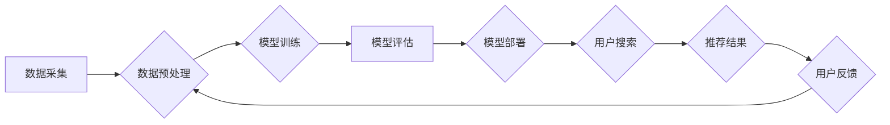

                 

## AI电商搜索的算法偏见问题及解决方案

> 关键词：电商搜索、算法偏见、公平性、推荐系统、机器学习、数据偏差、解决方案

## 1. 背景介绍

电商搜索作为电商平台的核心功能之一，直接影响着用户体验和商业转化。随着人工智能技术的快速发展，基于机器学习的电商搜索算法逐渐成为主流，其强大的个性化推荐能力和精准搜索结果提升了用户购物体验。然而，随着算法模型的复杂性和数据规模的扩大，算法偏见问题日益凸显，给电商平台带来了新的挑战。

算法偏见是指算法在训练过程中由于数据本身的偏差或算法设计缺陷，导致对特定群体或特征的歧视性结果。在电商搜索领域，算法偏见可能导致以下问题：

* **搜索结果不公平：** 算法可能倾向于推荐特定商品或品牌，而忽略其他优质的商品，导致用户无法获得全面、公平的搜索结果。
* **用户体验下降：** 用户可能因为搜索结果不符合预期而产生沮丧情绪，影响购物意愿。
* **品牌形象受损：** 算法偏见可能导致平台被用户认为存在歧视，损害平台的品牌形象和用户信任。
* **法律风险：** 在某些情况下，算法偏见可能构成违反公平竞争法的行为，给平台带来法律风险。

## 2. 核心概念与联系

### 2.1 算法偏见

算法偏见是指算法在处理数据时，由于数据本身的偏差或算法设计缺陷，导致对特定群体或特征的歧视性结果。

### 2.2 数据偏差

数据偏差是指训练算法的数据中存在不均衡、不代表性或有误的现象，导致算法学习到的模型存在偏见。

### 2.3 推荐系统

推荐系统是一种利用用户历史行为、商品特征等信息，预测用户对特定商品的兴趣并提供个性化推荐的系统。

### 2.4 机器学习

机器学习是一种人工智能技术，通过训练算法模型，使模型能够从数据中学习并进行预测。

**Mermaid 流程图**



## 3. 核心算法原理 & 具体操作步骤

### 3.1 算法原理概述

电商搜索算法通常基于机器学习技术，利用用户搜索历史、商品信息、用户画像等数据，构建预测模型，并根据模型预测结果返回相关商品推荐。常见的电商搜索算法包括：

* **基于关键词匹配的算法：** 这种算法简单直接，通过匹配用户搜索关键词与商品标题、描述等信息进行搜索。
* **基于向量空间模型的算法：** 这种算法将用户搜索关键词和商品信息转化为向量，通过计算向量之间的相似度进行搜索。
* **基于深度学习的算法：** 这种算法利用深度神经网络模型，学习用户搜索行为和商品特征之间的复杂关系，进行更精准的搜索和推荐。

### 3.2 算法步骤详解

1. **数据采集:** 收集用户搜索历史、商品信息、用户画像等数据。
2. **数据预处理:** 对收集到的数据进行清洗、转换、特征提取等处理，使其适合算法训练。
3. **模型训练:** 选择合适的机器学习算法，利用预处理后的数据训练模型。
4. **模型评估:** 使用测试数据对训练好的模型进行评估，并根据评估结果进行模型调优。
5. **模型部署:** 将训练好的模型部署到线上环境，用于处理用户搜索请求。
6. **结果展示:** 根据模型预测结果，返回相关商品推荐给用户。

### 3.3 算法优缺点

**优点:**

* **精准度高:** 基于机器学习的算法能够学习用户行为和商品特征之间的复杂关系，提供更精准的搜索和推荐结果。
* **个性化强:** 算法可以根据用户的历史行为和偏好，提供个性化的商品推荐。
* **自动化程度高:** 算法可以自动完成商品推荐任务，减少人工干预。

**缺点:**

* **数据依赖性强:** 算法的性能取决于训练数据的质量和数量。
* **解释性差:** 深度学习模型的内部机制复杂，难以解释其推荐结果背后的逻辑。
* **算法偏见:** 算法可能由于数据本身的偏差或算法设计缺陷，导致对特定群体或特征的歧视性结果。

### 3.4 算法应用领域

电商搜索算法广泛应用于以下领域：

* **商品推荐:** 根据用户搜索历史和偏好，推荐相关商品。
* **搜索结果排序:** 根据商品的相关性、用户兴趣等因素，对搜索结果进行排序。
* **个性化搜索:** 根据用户的身份、位置、行为等信息，提供个性化的搜索结果。
* **新商品推荐:** 根据用户兴趣和市场趋势，推荐新上市的商品。

## 4. 数学模型和公式 & 详细讲解 & 举例说明

### 4.1 数学模型构建

电商搜索算法通常基于以下数学模型：

* **协同过滤模型:** 这种模型基于用户的历史行为和商品的购买记录，预测用户对特定商品的兴趣。
* **基于内容的推荐模型:** 这种模型基于商品的特征和用户兴趣，推荐相关商品。
* **混合推荐模型:** 这种模型结合协同过滤和基于内容的推荐方法，提高推荐效果。

### 4.2 公式推导过程

协同过滤模型的评分预测公式如下：

$$
\hat{r}_{u,i} = \bar{r}_u + \frac{\sum_{j \in N(u)} (r_{u,j} - \bar{r}_u) \cdot (r_{j,i} - \bar{r}_j)}{\sum_{j \in N(u)} (r_{u,j} - \bar{r}_u)^2}
$$

其中：

* $\hat{r}_{u,i}$: 用户 $u$ 对商品 $i$ 的预测评分
* $\bar{r}_u$: 用户 $u$ 的平均评分
* $r_{u,j}$: 用户 $u$ 对商品 $j$ 的实际评分
* $r_{j,i}$: 用户 $j$ 对商品 $i$ 的实际评分
* $N(u)$: 用户 $u$ 评分过的商品集合

### 4.3 案例分析与讲解

假设用户 $A$ 评分过商品 $B$ 和 $C$，用户 $B$ 评分过商品 $C$ 和 $D$，则可以使用上述公式预测用户 $A$ 对商品 $D$ 的评分。

## 5. 项目实践：代码实例和详细解释说明

### 5.1 开发环境搭建

* Python 3.x
* TensorFlow 或 PyTorch
* Jupyter Notebook

### 5.2 源代码详细实现

```python
# 导入必要的库
import tensorflow as tf

# 定义模型结构
model = tf.keras.Sequential([
    tf.keras.layers.Embedding(input_dim=vocab_size, output_dim=embedding_dim),
    tf.keras.layers.LSTM(units=128),
    tf.keras.layers.Dense(units=1, activation='sigmoid')
])

# 编译模型
model.compile(optimizer='adam', loss='binary_crossentropy', metrics=['accuracy'])

# 训练模型
model.fit(X_train, y_train, epochs=10, batch_size=32)

# 评估模型
loss, accuracy = model.evaluate(X_test, y_test)
print('Loss:', loss)
print('Accuracy:', accuracy)
```

### 5.3 代码解读与分析

* **Embedding 层:** 将用户搜索关键词和商品信息转化为向量表示。
* **LSTM 层:** 学习用户搜索行为和商品特征之间的复杂关系。
* **Dense 层:** 输出预测结果，即用户对特定商品的兴趣评分。
* **编译模型:** 选择优化器、损失函数和评价指标。
* **训练模型:** 使用训练数据训练模型。
* **评估模型:** 使用测试数据评估模型性能。

### 5.4 运行结果展示

训练完成后，可以将模型应用于实际场景，例如预测用户对特定商品的兴趣评分，并根据评分结果进行商品推荐。

## 6. 实际应用场景

### 6.1 商品推荐

电商平台可以利用算法推荐相关商品，提高用户购物体验和转化率。

### 6.2 搜索结果排序

算法可以根据商品的相关性、用户兴趣等因素，对搜索结果进行排序，提高用户搜索效率。

### 6.3 个性化搜索

根据用户的身份、位置、行为等信息，提供个性化的搜索结果，满足用户的个性化需求。

### 6.4 未来应用展望

随着人工智能技术的不断发展，电商搜索算法将更加智能化、个性化和精准化。未来，电商搜索算法可能应用于以下领域：

* **多模态搜索:** 结合文本、图像、视频等多模态数据进行搜索，提供更丰富的搜索结果。
* **实时搜索:** 基于用户实时行为，提供实时更新的搜索结果。
* **跨平台搜索:** 实现用户在不同平台（例如手机、电脑、智能音箱）上的统一搜索体验。

## 7. 工具和资源推荐

### 7.1 学习资源推荐

* **书籍:**
    * 《推荐系统实践》
    * 《深度学习》
* **在线课程:**
    * Coursera: Machine Learning
    * edX: Artificial Intelligence

### 7.2 开发工具推荐

* **Python:** 
    * TensorFlow
    * PyTorch
* **数据处理工具:**
    * Pandas
    * Scikit-learn

### 7.3 相关论文推荐

* **《Collaborative Filtering for Implicit Feedback Datasets》**
* **《Deep Learning for Recommender Systems》**

## 8. 总结：未来发展趋势与挑战

### 8.1 研究成果总结

近年来，电商搜索算法取得了显著进展，能够提供更精准、个性化的搜索和推荐结果。

### 8.2 未来发展趋势

未来，电商搜索算法将更加智能化、个性化和精准化，并应用于更多领域。

### 8.3 面临的挑战

* **数据偏差:** 数据偏差是算法偏见的主要来源，需要开发更有效的算法和方法来解决数据偏差问题。
* **算法解释性:** 深度学习模型的内部机制复杂，难以解释其推荐结果背后的逻辑，需要开发更可解释的算法模型。
* **公平性:** 算法偏见可能导致不公平的结果，需要开发更公平的算法模型和评估方法。

### 8.4 研究展望

未来研究方向包括：

* 开发更有效的算法和方法来解决数据偏差问题。
* 开发更可解释的算法模型，提高算法透明度和可信度。
* 研究更公平的算法模型和评估方法，确保算法公平性。


## 9. 附录：常见问题与解答

**Q1: 如何评估算法偏见？**

**A1:** 常见的算法偏见评估方法包括：

* **公平性指标:** 衡量算法对不同群体结果的差异，例如均值差异、标准差差异等。
* **案例分析:** 通过分析算法推荐结果中的特定案例，识别算法偏见。
* **用户反馈:** 收集用户反馈，了解用户对算法推荐结果的评价。

**Q2: 如何解决算法偏见问题？**

**A2:** 解决算法偏见问题的方法包括：

* **数据预处理:** 识别和处理数据中的偏差，例如对少数群体数据进行补充。
* **算法设计:** 设计更公平的算法模型，例如使用公平性约束条件。
* **模型调优:** 通过调整模型参数，减少算法偏见。
* **持续监控:** 持续监控算法性能，及时发现和解决算法偏见问题。


作者：禅与计算机程序设计艺术 / Zen and the Art of Computer Programming 
<end_of_turn>

