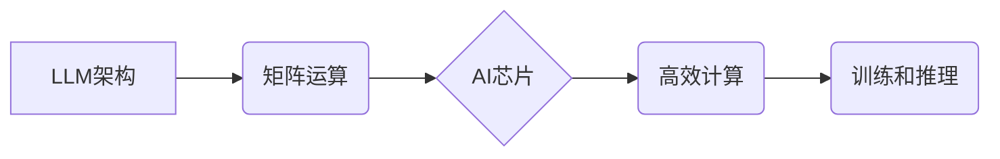

                 

## AI芯片设计：为LLM优化的硬件架构

> 关键词：LLM、AI芯片、神经网络、算力、效率、可扩展性、定制化

## 1. 背景介绍

近年来，大型语言模型（LLM）在自然语言处理领域取得了令人瞩目的成就，从文本生成、翻译到代码编写，LLM展现出强大的能力。然而，LLM的训练和推理都对算力要求极高，传统的CPU和GPU架构难以满足其需求。因此，专门为LLM优化的AI芯片设计成为一个重要的研究方向。

LLM的训练和推理主要依赖于矩阵运算，而AI芯片通过定制化的架构和指令集，可以更高效地执行这些运算。例如，一些AI芯片采用 systolic array 结构，通过数据流的并行处理，大幅提升了算力。此外，AI芯片还可通过量化技术和模型压缩等手段，降低模型参数和精度，从而进一步提高效率。

## 2. 核心概念与联系

### 2.1  LLM架构

LLM通常基于Transformer架构，其核心是自注意力机制，能够捕捉文本序列中的长距离依赖关系。Transformer由编码器和解码器组成，编码器将输入文本序列映射到一个隐藏表示，解码器则根据隐藏表示生成输出文本序列。

### 2.2  AI芯片架构

AI芯片针对LLM的特点，采用以下几种常见的架构：

* ** systolic array:**  一种并行计算架构，数据流通过阵列中的单元进行处理，提高计算效率。
* **tensor processing unit (TPU):**  谷歌开发的专门用于深度学习的AI芯片，采用 systolic array架构，并支持多种并行计算模式。
* **graphics processing unit (GPU):**  原本用于图形渲染的芯片，由于其强大的并行计算能力，也广泛应用于深度学习训练。

### 2.3  核心概念关系

LLM的训练和推理依赖于大量的矩阵运算，而AI芯片通过定制化的架构和指令集，可以高效地执行这些运算。



## 3. 核心算法原理 & 具体操作步骤

### 3.1  算法原理概述

LLM训练的核心算法是反向传播算法，其原理是通过调整模型参数，最小化模型预测结果与真实结果之间的误差。

### 3.2  算法步骤详解

1. **前向传播:** 将输入文本序列通过模型进行处理，得到预测结果。
2. **损失函数计算:** 计算预测结果与真实结果之间的误差。
3. **反向传播:** 计算误差对每个模型参数的梯度。
4. **参数更新:** 根据梯度更新模型参数，减小误差。

### 3.3  算法优缺点

* **优点:** 能够训练出高精度的模型。
* **缺点:** 训练过程耗时且对算力要求高。

### 3.4  算法应用领域

* 自然语言处理
* 图像识别
* 语音识别
* 机器翻译

## 4. 数学模型和公式 & 详细讲解 & 举例说明

### 4.1  数学模型构建

LLM的数学模型通常基于神经网络，其核心是权重矩阵和激活函数。

* **权重矩阵:** 用于存储模型参数，决定输入和输出之间的关系。
* **激活函数:** 用于引入非线性，使模型能够学习复杂的映射关系。

### 4.2  公式推导过程

反向传播算法的核心是计算梯度，其公式如下：

$$
\frac{\partial L}{\partial w} = \frac{\partial L}{\partial y} \cdot \frac{\partial y}{\partial w}
$$

其中：

* $L$ 是损失函数
* $w$ 是模型参数
* $y$ 是模型输出

### 4.3  案例分析与讲解

假设我们有一个简单的线性模型，其输出为：

$$
y = wx + b
$$

其中：

* $x$ 是输入
* $w$ 是权重
* $b$ 是偏置

如果损失函数为均方误差，则其梯度为：

$$
\frac{\partial L}{\partial w} = 2(y - t)x
$$

其中：

* $t$ 是真实值

## 5. 项目实践：代码实例和详细解释说明

### 5.1  开发环境搭建

* 操作系统：Linux
* 编程语言：Python
* 深度学习框架：TensorFlow或PyTorch

### 5.2  源代码详细实现

以下是一个使用TensorFlow实现简单LLM训练的代码示例：

```python
import tensorflow as tf

# 定义模型
model = tf.keras.Sequential([
    tf.keras.layers.Embedding(input_dim=10000, output_dim=128),
    tf.keras.layers.LSTM(units=128),
    tf.keras.layers.Dense(units=10, activation='softmax')
])

# 定义损失函数和优化器
loss_fn = tf.keras.losses.SparseCategoricalCrossentropy(from_logits=True)
optimizer = tf.keras.optimizers.Adam(learning_rate=0.001)

# 训练模型
model.compile(loss=loss_fn, optimizer=optimizer)
model.fit(x_train, y_train, epochs=10)
```

### 5.3  代码解读与分析

* 代码首先定义了一个简单的LLM模型，包含Embedding层、LSTM层和Dense层。
* 然后定义了损失函数和优化器，用于训练模型。
* 最后使用`model.fit()`函数训练模型，传入训练数据和训练轮数。

### 5.4  运行结果展示

训练完成后，可以评估模型的性能，例如使用测试数据计算准确率。

## 6. 实际应用场景

LLM在各个领域都有广泛的应用场景：

* **自然语言理解:**  问答系统、文本分类、情感分析
* **文本生成:**  机器翻译、文章写作、对话系统
* **代码生成:**  自动生成代码、代码补全

### 6.4  未来应用展望

随着AI芯片的不断发展，LLM的应用场景将更加广泛，例如：

* **个性化教育:**  根据学生的学习情况，提供个性化的学习内容和辅导。
* **医疗诊断:**  辅助医生进行疾病诊断，提高诊断准确率。
* **科学研究:**  加速科学研究，例如药物研发和材料设计。

## 7. 工具和资源推荐

### 7.1  学习资源推荐

* **书籍:**
    * Deep Learning by Ian Goodfellow
    * Hands-On Machine Learning with Scikit-Learn, Keras & TensorFlow by Aurélien Géron
* **在线课程:**
    * TensorFlow Tutorials: https://www.tensorflow.org/tutorials
    * PyTorch Tutorials: https://pytorch.org/tutorials/

### 7.2  开发工具推荐

* **TensorFlow:** https://www.tensorflow.org/
* **PyTorch:** https://pytorch.org/
* **Jupyter Notebook:** https://jupyter.org/

### 7.3  相关论文推荐

* Attention Is All You Need: https://arxiv.org/abs/1706.03762
* BERT: Pre-training of Deep Bidirectional Transformers for Language Understanding: https://arxiv.org/abs/1810.04805

## 8. 总结：未来发展趋势与挑战

### 8.1  研究成果总结

近年来，AI芯片设计取得了显著进展，为LLM的训练和推理提供了高效的硬件支持。

### 8.2  未来发展趋势

* **更定制化的架构:**  针对不同LLM任务和模型规模，设计更定制化的AI芯片架构。
* **更高效的计算方法:**  探索新的计算方法，例如量子计算和光计算，进一步提升AI芯片的算力。
* **更低的功耗:**  降低AI芯片的功耗，使其更适合移动设备和嵌入式系统。

### 8.3  面临的挑战

* **模型规模与硬件资源的匹配:**  随着LLM规模的不断增长，硬件资源的限制将成为一个挑战。
* **算法与硬件的协同优化:**  需要进一步探索算法和硬件的协同优化方法，才能充分发挥AI芯片的潜力。
* **可扩展性和灵活性:**  AI芯片需要具备良好的可扩展性和灵活性，才能适应不断变化的应用需求。

### 8.4  研究展望

未来，AI芯片设计将继续朝着更高效、更低功耗、更可扩展的方向发展，为LLM的应用提供更强大的硬件支持。


## 9. 附录：常见问题与解答

* **Q1: AI芯片与GPU相比有什么优势？**

* **A1:** AI芯片针对深度学习任务进行了专门优化，其算力、效率和功耗都优于传统的GPU。

* **Q2: 如何选择合适的AI芯片？**

* **A2:** 选择AI芯片需要考虑模型规模、训练任务、预算和功耗等因素。

* **Q3: AI芯片的未来发展趋势是什么？**

* **A3:** 未来AI芯片将朝着更高效、更低功耗、更可扩展的方向发展，并可能采用新的计算方法，例如量子计算和光计算。


作者：禅与计算机程序设计艺术 / Zen and the Art of Computer Programming 
<end_of_turn>

