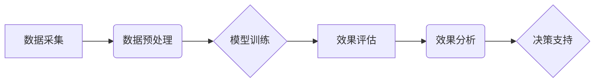

                 

## AI驱动的电商个性化促销活动效果评估系统

> 关键词：电商个性化、促销活动、AI效果评估、机器学习、深度学习、推荐系统、数据分析

## 1. 背景介绍

随着电商行业的快速发展，个性化营销已成为提升用户体验、提高转化率的关键策略。电商平台通过分析用户行为、偏好和购买历史，为每个用户提供定制化的促销活动，以提高营销效率和用户满意度。然而，传统的促销活动效果评估方法往往依赖于简单的指标，如点击率、转化率等，难以全面衡量活动的效果，更无法精准地预测不同用户群体的反应。

人工智能技术的兴起为电商个性化促销活动效果评估提供了新的机遇。通过机器学习和深度学习算法，可以对海量用户数据进行分析，挖掘用户行为模式和潜在需求，从而构建更精准、更有效的促销活动效果评估系统。

## 2. 核心概念与联系

### 2.1  电商个性化促销活动

电商个性化促销活动是指根据用户的个人特征、行为模式和购买历史，定制化地设计和推送促销信息，以提高用户参与度和转化率。常见的个性化促销活动包括：

* **推荐促销:** 根据用户的浏览历史、购买记录和兴趣标签，推荐相关的促销活动。
* **优惠券定制:** 根据用户的消费习惯和偏好，发放个性化的优惠券。
* **价格动态调整:** 根据用户的购买意愿和市场竞争情况，动态调整商品价格。
* **个性化内容推送:** 根据用户的兴趣爱好和需求，推送个性化的促销内容，如活动介绍、产品推荐等。

### 2.2  AI效果评估系统

AI效果评估系统利用人工智能技术，对电商个性化促销活动的效果进行全面、精准的评估。系统主要包括以下几个模块：

* **数据采集与预处理:** 收集用户行为数据、促销活动数据等，并进行清洗、转换和特征提取。
* **模型训练与评估:** 利用机器学习和深度学习算法，训练预测模型，并对模型性能进行评估。
* **效果分析与报告:** 对促销活动的效果进行分析，生成可视化的报告，为商家提供决策支持。

### 2.3  核心架构



## 3. 核心算法原理 & 具体操作步骤

### 3.1  算法原理概述

AI驱动的电商个性化促销活动效果评估系统主要利用以下核心算法：

* **推荐系统:** 基于用户的历史行为和偏好，推荐相关的促销活动，提高用户参与度。常用的推荐算法包括协同过滤、内容过滤和基于知识的推荐。
* **机器学习模型:** 利用机器学习算法，预测用户对促销活动的响应，如点击率、转化率等。常用的机器学习模型包括逻辑回归、决策树、支持向量机和神经网络。
* **深度学习模型:** 利用深度学习算法，挖掘用户行为模式和潜在需求，构建更精准的促销活动效果评估模型。常用的深度学习模型包括卷积神经网络、循环神经网络和强化学习算法。

### 3.2  算法步骤详解

1. **数据收集:** 收集用户行为数据、促销活动数据等，包括用户 demographics 信息、浏览历史、购买记录、评价信息、促销活动内容、时间、价格等。
2. **数据预处理:** 对收集到的数据进行清洗、转换和特征提取，例如处理缺失值、转换数据类型、提取用户特征、构建促销活动特征等。
3. **模型训练:** 选择合适的机器学习或深度学习模型，利用预处理后的数据进行模型训练，并对模型性能进行评估。
4. **效果评估:** 利用训练好的模型，对促销活动的效果进行预测和评估，例如预测用户点击率、转化率、购买金额等。
5. **效果分析:** 对促销活动的效果进行分析，生成可视化的报告，为商家提供决策支持。

### 3.3  算法优缺点

**优点:**

* **精准度高:** 利用人工智能技术，可以对用户行为进行更精准的分析，构建更精准的促销活动效果评估模型。
* **自动化程度高:** 系统可以自动收集数据、预处理数据、训练模型、评估效果，提高效率和准确性。
* **可扩展性强:** 系统可以根据需要扩展功能，例如支持多平台数据采集、多类型促销活动评估等。

**缺点:**

* **数据依赖性强:** 系统的性能取决于数据的质量和数量，数据不足或质量差会导致模型精度下降。
* **算法复杂度高:** 训练和评估深度学习模型需要强大的计算资源和专业技术。
* **解释性弱:** 深度学习模型的决策过程较为复杂，难以解释模型的预测结果。

### 3.4  算法应用领域

AI驱动的电商个性化促销活动效果评估系统可以应用于以下领域:

* **电商平台:** 为电商平台提供精准的促销活动效果评估，优化营销策略，提高转化率。
* **品牌商家:** 为品牌商家提供个性化促销方案，提升品牌影响力和用户忠诚度。
* **广告代理商:** 为广告代理商提供数据驱动的广告投放策略，提高广告效果。

## 4. 数学模型和公式 & 详细讲解 & 举例说明

### 4.1  数学模型构建

为了评估促销活动的效果，我们可以构建一个预测模型，将用户行为数据作为输入，预测用户对促销活动的响应，例如点击率、转化率等。

一个简单的线性回归模型可以表示为：

$$
y = \beta_0 + \beta_1x_1 + \beta_2x_2 + ... + \beta_nx_n + \epsilon
$$

其中：

* $y$ 是预测的响应变量，例如点击率或转化率。
* $x_1, x_2, ..., x_n$ 是用户行为数据特征，例如用户年龄、性别、浏览历史、购买记录等。
* $\beta_0, \beta_1, ..., \beta_n$ 是模型参数，需要通过训练数据进行估计。
* $\epsilon$ 是误差项，表示模型预测值与实际值之间的差异。

### 4.2  公式推导过程

模型参数的估计可以通过最小二乘法进行。最小二乘法旨在找到一组参数，使得模型预测值与实际值之间的误差平方和最小。

具体推导过程如下：

1. 定义误差函数：

$$
E = \sum_{i=1}^{n}(y_i - \hat{y}_i)^2
$$

其中：

* $y_i$ 是第 $i$ 个用户的实际响应值。
* $\hat{y}_i$ 是模型预测的第 $i$ 个用户的响应值。

2. 对误差函数求导，并令导数等于零：

$$
\frac{\partial E}{\partial \beta_j} = 0
$$

3. 解出模型参数 $\beta_j$ 的值。

### 4.3  案例分析与讲解

假设我们想要评估一个优惠券促销活动的转化率。我们可以收集用户行为数据，例如用户年龄、性别、浏览历史、购买记录等，以及优惠券促销活动的信息，例如优惠券面值、有效期等。

利用线性回归模型，我们可以预测用户是否会点击优惠券，并根据点击率和转化率计算促销活动的整体效果。

例如，我们可以发现用户年龄较大的群体更容易点击优惠券，而用户购买频率较高的群体更容易转化。

## 5. 项目实践：代码实例和详细解释说明

### 5.1  开发环境搭建

为了开发AI驱动的电商个性化促销活动效果评估系统，我们需要搭建一个合适的开发环境。

推荐使用以下工具和技术：

* **编程语言:** Python
* **机器学习库:** scikit-learn, TensorFlow, PyTorch
* **数据处理库:** Pandas, NumPy
* **数据库:** MySQL, PostgreSQL
* **云平台:** AWS, Azure, GCP

### 5.2  源代码详细实现

以下是一个使用Python和scikit-learn库实现简单线性回归模型的代码示例：

```python
import pandas as pd
from sklearn.linear_model import LinearRegression
from sklearn.model_selection import train_test_split

# 加载数据
data = pd.read_csv('promotion_data.csv')

# 选择特征和目标变量
features = ['age', 'gender', 'browsing_history', 'purchase_frequency']
target = 'click_rate'

# 将数据分为训练集和测试集
X_train, X_test, y_train, y_test = train_test_split(data[features], data[target], test_size=0.2)

# 创建线性回归模型
model = LinearRegression()

# 训练模型
model.fit(X_train, y_train)

# 评估模型性能
y_pred = model.predict(X_test)
print('模型准确率:', model.score(X_test, y_test))

# 使用模型预测新用户的点击率
new_user_data = pd.DataFrame({'age': [30], 'gender': ['male'], 'browsing_history': [10], 'purchase_frequency': [5]})
predicted_click_rate = model.predict(new_user_data)
print('新用户的预测点击率:', predicted_click_rate)
```

### 5.3  代码解读与分析

* **数据加载:** 使用Pandas库加载促销活动数据。
* **特征选择:** 选择用户行为特征和目标变量。
* **数据分割:** 将数据分为训练集和测试集，用于模型训练和评估。
* **模型创建:** 使用scikit-learn库创建线性回归模型。
* **模型训练:** 使用训练集训练模型，学习用户行为特征与目标变量之间的关系。
* **模型评估:** 使用测试集评估模型性能，计算模型准确率。
* **预测新用户:** 使用训练好的模型预测新用户的点击率。

### 5.4  运行结果展示

运行代码后，会输出模型的准确率和新用户的预测点击率。

## 6. 实际应用场景

### 6.1  电商平台

电商平台可以利用AI驱动的促销活动效果评估系统，对不同用户群体的促销活动效果进行精准评估，优化营销策略，提高转化率。例如，平台可以根据用户的年龄、性别、购买历史等特征，定制化地推送优惠券、推荐商品，并根据用户的响应情况调整促销活动力度。

### 6.2  品牌商家

品牌商家可以利用AI驱动的促销活动效果评估系统，了解用户对品牌产品的偏好，制定更有效的促销策略。例如，商家可以根据用户的浏览历史和购买记录，推荐相关的促销活动，并根据用户的响应情况调整促销活动内容和时间。

### 6.3  广告代理商

广告代理商可以利用AI驱动的促销活动效果评估系统，优化广告投放策略，提高广告效果。例如，代理商可以根据用户的兴趣爱好和行为模式，精准地投放广告，并根据用户的响应情况调整广告内容和投放渠道。

### 6.4  未来应用展望

随着人工智能技术的不断发展，AI驱动的电商个性化促销活动效果评估系统将拥有更强大的功能和更广泛的应用场景。例如，未来系统可以：

* 利用更先进的深度学习算法，挖掘更深层次的用户行为模式和潜在需求。
* 支持多平台数据采集和融合，提供更全面的用户画像。
* 自动生成个性化促销方案，并根据用户的实时反馈进行动态调整。
* 与其他电商系统进行集成，实现更智能化的营销闭环。

## 7. 工具和资源推荐

### 7.1  学习资源推荐

* **书籍:**
    * 《Python机器学习》
    * 《深度学习》
    * 《推荐系统实践》
* **在线课程:**
    * Coursera: 机器学习
    * Udacity: 深度学习
    * edX: 推荐系统

### 7.2  开发工具推荐

* **编程语言:** Python
* **机器学习库:** scikit-learn, TensorFlow, PyTorch
* **数据处理库:** Pandas, NumPy
* **数据库:** MySQL, PostgreSQL
* **云平台:** AWS, Azure, GCP

### 7.3  相关论文推荐

* **深度学习在推荐系统中的应用**
* **基于机器学习的电商促销活动效果评估**
* **个性化推荐系统的设计与实现**

## 8. 总结：未来发展趋势与挑战

### 8.1  研究成果总结

AI驱动的电商个性化促销活动效果评估系统是一个新兴的研究领域，取得了一些重要的成果。例如，利用深度学习算法可以更精准地预测用户对促销活动的响应，并根据用户的实时反馈进行动态调整。

### 8.2  未来发展趋势

未来，AI驱动的电商个性化促销活动效果评估系统将朝着以下方向发展：

* **更精准的预测:** 利用更先进的深度学习算法，挖掘更深层次的用户行为模式和潜在需求，提高预测精度。
* **更个性化的推荐:** 基于用户的实时反馈和行为模式，提供更个性化的促销方案，提升用户体验。
* **更智能化的营销闭环:** 与其他电商系统进行集成，实现更智能化的营销闭环，提高营销效率。

### 8.3  面临的挑战

AI驱动的电商个性化促销活动效果评估系统也面临一些挑战：

* **数据质量:** 系统的性能取决于数据的质量和数量，数据不足或质量差会导致模型精度下降。
* **算法复杂度:** 训练和评估深度学习模型需要强大的计算资源和专业技术。
* **解释性:** 深度学习模型的决策过程较为复杂，难以解释模型的预测结果。

### 8.4  研究展望

未来，我们需要继续研究以下问题：

* 如何提高数据质量和数据获取效率？
* 如何开发更有效的深度学习算法，提高预测精度？
* 如何提高深度学习模型的解释性，增强用户信任？


## 9. 附录：常见问题与解答

### 9.1  问题：如何选择合适的机器学习算法？

**解答：** 选择合适的机器学习算法取决于具体任务和数据特点。

* **分类问题:** 使用逻辑回归、决策树、支持向量机等算法。
* **回归问题:** 使用线性回归、支持向量回归、神经网络等算法。
* **聚类问题:** 使用K-means聚类、层次聚类等算法。

### 9.2  问题：如何评估模型性能？

**解答：** 常见的模型性能评估指标包括准确率、召回率、F1-score、AUC等。

* **分类问题:** 使用准确率、召回率、F1-score等指标。
* **回归问题:** 使用均方误差、平均绝对误差等指标。

### 9.3  问题：如何处理缺失值？

**解答：** 可以使用以下方法处理缺失值：

* **删除缺失值:** 如果缺失值较少，可以删除包含缺失值的样本。
* **填充缺失值:** 使用均值、中位数、众数等方法填充缺失值。
* **使用缺失值指示器:** 将缺失值作为新的特征，指示该特征是否缺失。

### 9.4  问题：如何防止过拟合？

**解答：** 过拟合是指模型对训练数据过拟合，导致在测试数据上的性能下降。

* **使用正则化技术:** L1正则化和L2正则化可以防止模型过拟合。
* **交叉验证:** 使用交叉验证技术可以评估模型的泛化能力，并选择最佳模型参数。
* **减少模型复杂度:** 使用更简单的模型，或者减少模型参数数量。


作者：禅与计算机程序设计艺术 / Zen and the Art of Computer Programming<end_of_turn>

