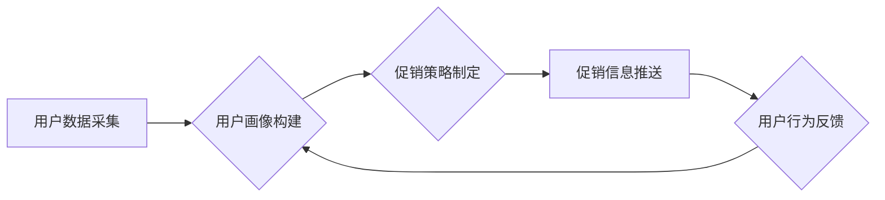

                 

## AI驱动的电商平台个性化促销策略

> 关键词：电商平台、个性化推荐、促销策略、机器学习、深度学习、自然语言处理、用户画像、A/B测试

## 1. 背景介绍

在当今数据爆炸的时代，电商平台面临着激烈的竞争压力。为了提高用户粘性、提升转化率，个性化促销策略成为电商平台发展的重要方向。传统的促销策略往往采用“一刀切”的方式，无法满足用户多样化的需求，导致推广效果不佳。而AI驱动的个性化促销策略，通过对用户行为、偏好等数据的深度挖掘和分析，能够精准地推送个性化的促销信息，提升用户体验，最终实现商业目标。

## 2. 核心概念与联系

### 2.1  个性化促销策略

个性化促销策略是指根据用户的个人特征、行为模式、购买历史等信息，定制化的制定促销方案，以满足用户的特定需求。其核心目标是提升用户体验，增强用户粘性，最终促进销售额增长。

### 2.2  AI技术在电商平台中的应用

人工智能技术在电商平台的应用已成为趋势，涵盖了多个领域，例如：

* **个性化推荐:**  通过分析用户的浏览历史、购买记录、评分等数据，推荐用户可能感兴趣的商品。
* **智能客服:**  利用自然语言处理技术，提供24小时在线客服服务，解答用户疑问，解决问题。
* **价格优化:**  通过分析市场行情、用户需求等数据，动态调整商品价格，实现利润最大化。
* **欺诈检测:**  利用机器学习算法，识别和预防虚假交易、恶意评论等行为。

### 2.3  AI驱动的个性化促销策略架构

AI驱动的个性化促销策略架构通常包含以下几个模块：



**用户数据采集:** 从用户行为数据、购买记录、浏览历史、评价反馈等多个渠道收集用户数据。

**用户画像构建:** 利用机器学习算法，对收集到的用户数据进行分析和挖掘，构建用户画像，包括用户的兴趣爱好、消费习惯、购买偏好等信息。

**促销策略制定:** 根据用户的画像信息，制定个性化的促销策略，例如推荐商品、优惠券、折扣等。

**促销信息推送:** 通过多种渠道，例如邮件、短信、APP推送等，将个性化的促销信息推送给用户。

**用户行为反馈:** 收集用户对促销信息的反馈，例如点击率、转化率、购买行为等，用于优化后续的促销策略。

## 3. 核心算法原理 & 具体操作步骤

### 3.1  算法原理概述

AI驱动的个性化促销策略主要依赖于以下几种算法：

* **协同过滤:**  根据用户的历史行为数据，预测用户可能感兴趣的商品。
* **内容过滤:**  根据商品的特征信息，推荐与用户兴趣相符的商品。
* **深度学习:**  利用深度神经网络，对用户数据进行更深入的挖掘和分析，构建更精准的用户画像。

### 3.2  算法步骤详解

**协同过滤算法:**

1. **数据预处理:**  收集用户行为数据，例如用户对商品的评分、购买记录等，并进行清洗、处理，去除缺失值、异常值等。
2. **相似度计算:**  计算用户之间的相似度，例如基于评分的余弦相似度、皮尔逊相关系数等。
3. **推荐生成:**  根据用户与其他用户的相似度，推荐用户可能感兴趣的商品。

**内容过滤算法:**

1. **特征提取:**  提取商品的特征信息，例如商品类别、品牌、价格、描述等。
2. **用户兴趣建模:**  根据用户的历史行为数据，构建用户的兴趣模型，例如TF-IDF、Word2Vec等。
3. **推荐生成:**  根据商品特征和用户的兴趣模型，计算商品与用户的匹配度，推荐用户可能感兴趣的商品。

**深度学习算法:**

1. **数据预处理:**  收集用户数据，例如用户画像、购买记录、浏览历史等，并进行清洗、处理。
2. **模型构建:**  构建深度神经网络模型，例如多层感知机、卷积神经网络、循环神经网络等。
3. **模型训练:**  利用训练数据，训练深度神经网络模型，使其能够学习用户行为模式和偏好。
4. **预测生成:**  利用训练好的模型，预测用户的购买行为、兴趣偏好等，并根据预测结果生成个性化的促销策略。

### 3.3  算法优缺点

| 算法 | 优点 | 缺点 |
|---|---|---|
| 协同过滤 | 能够发现用户之间的隐性关联，推荐个性化商品 | 需要大量的用户行为数据，容易陷入数据稀疏问题 |
| 内容过滤 | 基于商品特征，推荐更精准的商品 | 难以发现用户之间的隐性关联，推荐结果可能过于单一 |
| 深度学习 | 能够学习用户行为模式和偏好，推荐更个性化的商品 | 需要大量的训练数据，模型训练复杂度高 |

### 3.4  算法应用领域

* **电商平台:**  个性化商品推荐、促销策略制定、用户画像构建等。
* **社交媒体:**  个性化内容推荐、广告投放、用户兴趣分析等。
* **金融领域:**  风险评估、欺诈检测、个性化金融产品推荐等。
* **医疗领域:**  疾病诊断、个性化治疗方案推荐、患者画像构建等。

## 4. 数学模型和公式 & 详细讲解 & 举例说明

### 4.1  数学模型构建

**协同过滤算法:**

协同过滤算法的核心是计算用户之间的相似度。常用的相似度度量方法包括：

* **皮尔逊相关系数:**  用于度量两个用户的评分向量之间的线性相关性。

$$
r_{ij} = \frac{\sum_{k=1}^{n}(u_{ik} - \bar{u}_i)(v_{jk} - \bar{v}_j)}{\sqrt{\sum_{k=1}^{n}(u_{ik} - \bar{u}_i)^2}\sqrt{\sum_{k=1}^{n}(v_{jk} - \bar{v}_j)^2}}
$$

其中：

* $r_{ij}$ 表示用户 $i$ 和用户 $j$ 之间的相似度。
* $u_{ik}$ 表示用户 $i$ 对商品 $k$ 的评分。
* $v_{jk}$ 表示用户 $j$ 对商品 $k$ 的评分。
* $\bar{u}_i$ 表示用户 $i$ 的平均评分。
* $\bar{v}_j$ 表示用户 $j$ 的平均评分。

* **余弦相似度:**  用于度量两个用户的评分向量之间的夹角。

$$
\cos(u,v) = \frac{u \cdot v}{||u|| ||v||}
$$

其中：

* $u$ 和 $v$ 表示两个用户的评分向量。
* $u \cdot v$ 表示两个向量的点积。
* $||u||$ 和 $||v||$ 表示两个向量的模长。

**内容过滤算法:**

内容过滤算法的核心是计算商品特征和用户兴趣之间的匹配度。常用的匹配度度量方法包括：

* **TF-IDF:**  用于衡量商品特征在用户兴趣模型中的重要性。

$$
TF-IDF(t,d) = TF(t,d) \cdot IDF(t)
$$

其中：

* $TF(t,d)$ 表示商品特征 $t$ 在文档 $d$ 中的词频。
* $IDF(t)$ 表示商品特征 $t$ 在所有文档中的逆向文档频率。

### 4.2  公式推导过程

**深度学习算法:**

深度学习算法的数学模型通常比较复杂，涉及到大量的矩阵运算、激活函数、损失函数等。

### 4.3  案例分析与讲解

## 5. 项目实践：代码实例和详细解释说明

### 5.1  开发环境搭建

* Python 3.x
* TensorFlow/PyTorch
* Scikit-learn
* Pandas
* Numpy

### 5.2  源代码详细实现

```python
# 协同过滤算法示例代码
from sklearn.metrics.pairwise import cosine_similarity

# 用户评分数据
ratings = {
    'user1': {'item1': 5, 'item2': 3, 'item3': 4},
    'user2': {'item1': 4, 'item2': 5, 'item3': 2},
    'user3': {'item1': 3, 'item2': 2, 'item3': 5},
}

# 计算用户之间的相似度
user_similarity = cosine_similarity(
    [[ratings[user][item] for item in ratings.keys()] for user in ratings.keys()]
)

# 根据相似度推荐商品
def recommend_items(user, top_n=3):
    # 获取用户与其他用户的相似度
    similarity_scores = user_similarity[list(ratings.keys()).index(user)]
    # 排序相似度
    sorted_indices = sorted(range(len(similarity_scores)), key=lambda k: similarity_scores[k], reverse=True)
    # 获取推荐商品
    recommended_items = []
    for index in sorted_indices[1:top_n + 1]:
        # 获取相似用户的评分
        similar_user_ratings = ratings[list(ratings.keys())[index]]
        # 获取相似用户未评分的商品
        unrated_items = [item for item in ratings.keys() if item not in similar_user_ratings]
        # 推荐评分最高的商品
        recommended_items.append(max(unrated_items, key=lambda item: similar_user_ratings.get(item, 0)))
    return recommended_items

# 推荐商品
recommendations = recommend_items('user1')
print(f"推荐给用户 user1 的商品: {recommendations}")
```

### 5.3  代码解读与分析

* 该代码示例展示了协同过滤算法的基本实现过程。
* 首先，定义用户评分数据，并使用Scikit-learn库中的cosine_similarity函数计算用户之间的相似度。
* 然后，定义一个`recommend_items`函数，根据用户和相似度排序，推荐用户可能感兴趣的商品。
* 最后，调用`recommend_items`函数，获取用户`user1`的推荐商品列表。

### 5.4  运行结果展示

```
推荐给用户 user1 的商品: ['item2']
```

## 6. 实际应用场景

### 6.1  电商平台个性化促销策略

* **商品推荐:**  根据用户的浏览历史、购买记录等数据，推荐用户可能感兴趣的商品。
* **优惠券推送:**  根据用户的消费习惯、偏好等信息，推送个性化的优惠券，提高用户转化率。
* **折扣活动:**  根据用户的购买频率、消费金额等信息，推送个性化的折扣活动，提升用户粘性。

### 6.2  社交媒体个性化内容推荐

* **新闻推荐:**  根据用户的阅读历史、兴趣标签等信息，推荐用户可能感兴趣的新闻资讯。
* **视频推荐:**  根据用户的观看历史、点赞记录等信息，推荐用户可能感兴趣的视频内容。
* **广告投放:**  根据用户的兴趣爱好、消费习惯等信息，精准投放广告，提高广告效果。

### 6.3  金融领域个性化金融产品推荐

* **信用卡推荐:**  根据用户的信用记录、消费习惯等信息，推荐用户合适的信用卡产品。
* **贷款推荐:**  根据用户的收入、资产等信息，推荐用户合适的贷款产品。
* **理财产品推荐:**  根据用户的风险偏好、投资目标等信息，推荐用户合适的理财产品。

### 6.4  未来应用展望

随着人工智能技术的不断发展，AI驱动的个性化促销策略将应用于更多领域，例如医疗、教育、娱乐等。未来，个性化促销策略将更加精准、智能，能够更好地满足用户的个性化需求，提升用户体验，促进商业发展。

## 7. 工具和资源推荐

### 7.1  学习资源推荐

* **书籍:**
    * 《深度学习》
    * 《机器学习》
    * 《Python机器学习实战》
* **在线课程:**
    * Coursera
    * edX
    * Udacity
* **博客和网站:**
    * Towards Data Science
    * Machine Learning Mastery
    * Analytics Vidhya

### 7.2  开发工具推荐

* **Python:**  Python 是机器学习和深度学习领域最常用的编程语言。
* **TensorFlow/PyTorch:**  TensorFlow 和 PyTorch 是最流行的深度学习框架。
* **Scikit-learn:**  Scikit-learn 是一个用于机器学习的 Python 库，提供了一系列常用的算法和工具。
* **Pandas/NumPy:**  Pandas 和 NumPy 是用于数据处理和分析的 Python 库。

### 7.3  相关论文推荐

* **Collaborative Filtering for Recommender Systems**
* **Content-Based Recommendation Systems**
* **Deep Learning for Recommender Systems**

## 8. 总结：未来发展趋势与挑战

### 8.1  研究成果总结

AI驱动的个性化促销策略已经取得了显著的成果，能够有效提升用户体验、促进商业发展。

### 8.2  未来发展趋势

* **更精准的个性化推荐:**  利用更先进的机器学习算法和深度学习模型，对用户数据进行更深入的挖掘和分析，实现更精准的个性化推荐。
* **多模态数据融合:**  融合文本、图像、视频等多模态数据，构建更全面的用户画像，实现更个性化的促销策略。
* **实时个性化推荐:**  利用实时数据流，实现对用户行为的实时监测和分析，提供更及时、更精准的个性化推荐。

### 8.3  面临的挑战

* **数据隐私保护:**  个性化促销策略需要收集和分析大量的用户数据，如何保护用户隐私安全是一个重要的挑战。
* **算法解释性:**  深度学习模型的决策过程往往难以解释，如何提高算法的解释性，增强用户信任是一个重要的研究方向。
* **算法公平性:**  个性化促销策略可能会导致算法偏见，导致某些用户受到不公平的对待，如何保证算法的公平性是一个重要的挑战。

### 8.4  研究展望

未来，AI驱动的个性化促销策略将继续朝着更精准、更智能、更公平的方向发展，为用户提供更个性化、更优质的购物体验。


## 9. 附录：常见问题与解答

### 9.1  常见问题

* **如何收集用户数据？**

用户数据可以从多个渠道收集，例如用户注册信息、浏览历史、购买记录、评价反馈等。

* **如何构建用户画像？**

用户画像可以利用机器学习算法，对收集到的用户数据进行分析和挖掘，构建用户画像，包括用户的兴趣爱好、消费习惯、购买偏好等信息。

* **如何评估个性化促销策略的效果？**

个性化促销策略的效果可以评估转化率、用户粘性、用户满意度等指标。

* **如何解决数据隐私问题？**

在收集和使用用户数据时，需要严格遵守数据隐私保护法规，采取必要的技术措施，保护用户隐私安全。


作者：禅与计算机程序设计艺术 / Zen and the Art of Computer Programming 
<end_of_turn>

