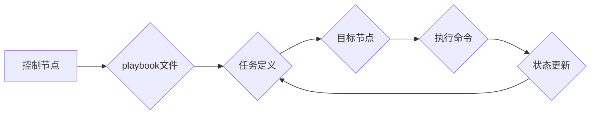

                 

## Ansible自动化：简化IT运维工作流程

> 关键词：Ansible、自动化运维、DevOps、配置管理、Infrastructure as Code (IaC)

## 1. 背景介绍

在当今以数字化转型为核心的时代，IT基础设施的规模和复杂度不断增长，传统的运维模式已难以满足快速迭代和高效交付的需求。自动化运维 (DevOps) 应运而生，旨在通过自动化流程和工具，提高软件开发和部署效率，缩短交付周期，并降低运维成本。

Ansible 作为一款开源的自动化运维工具，凭借其简单易用、功能强大、可扩展性强等特点，迅速成为 DevOps 实践中不可或缺的一部分。它能够帮助 IT 团队自动化各种任务，例如：

* **服务器配置管理:**  Ansible 可以自动配置服务器的软件包、用户、服务、防火墙等，确保所有服务器保持一致的状态。
* **应用部署:**  Ansible 可以自动化应用的部署过程，包括代码拉取、编译、打包、部署等，提高部署效率和可靠性。
* **系统监控和告警:**  Ansible 可以与监控系统集成，自动监控服务器状态和应用性能，并触发告警机制，及时发现和解决问题。
* **安全管理:**  Ansible 可以帮助自动化安全配置，例如密码管理、漏洞扫描、安全策略执行等，提升 IT 安全水平。

## 2. 核心概念与联系

Ansible 的核心概念是 **代理模式** 和 **状态管理**。

* **代理模式:** Ansible 采用无代理的架构，管理节点不需要安装任何额外软件，只需要开启 SSH 服务即可。Ansible 控制节点通过 SSH 连接到目标节点，执行命令和配置变更。
* **状态管理:** Ansible 通过 **playbook** 文件定义自动化任务，并使用 **状态管理机制** 来跟踪目标节点的配置状态。Ansible 会根据目标状态和实际状态进行差异分析，并自动执行必要的操作来实现目标状态。

Ansible 的工作流程可以概括为以下步骤：



## 3. 核心算法原理 & 具体操作步骤

### 3.1  算法原理概述

Ansible 的核心算法是基于 **差分算法** 和 **状态管理机制**。

* **差分算法:** Ansible 会将目标节点的预期状态与实际状态进行比较，并根据差异执行相应的操作。
* **状态管理机制:** Ansible 会记录目标节点的配置状态，并在下次执行任务时进行比较，确保配置的正确性和一致性。

### 3.2  算法步骤详解

1. **定义目标状态:** 使用 Ansible 的 YAML 语法定义目标节点的预期配置状态，包括软件包、用户、服务、防火墙等。
2. **获取实际状态:** Ansible 会通过 SSH 连接到目标节点，获取其实际配置状态。
3. **比较状态差异:** Ansible 会将目标状态与实际状态进行比较，找出差异。
4. **执行操作:** 根据差异，Ansible 会执行相应的操作，例如安装软件包、创建用户、启动服务等。
5. **更新状态:** Ansible 会更新目标节点的配置状态，并记录本次操作的日志。

### 3.3  算法优缺点

**优点:**

* 简单易用: Ansible 的语法简单易懂，易于学习和使用。
* 无代理: Ansible 不需要安装代理软件，降低了管理成本和复杂度。
* 状态管理: Ansible 的状态管理机制确保了配置的正确性和一致性。
* 可扩展性强: Ansible 可以与其他工具和平台集成，扩展其功能。

**缺点:**

* 依赖 SSH: Ansible 依赖 SSH 连接，如果 SSH 服务不可用，则无法执行任务。
* 性能瓶颈: 在管理大量节点时，Ansible 的性能可能会成为瓶颈。

### 3.4  算法应用领域

Ansible 的应用领域非常广泛，包括：

* **云计算:** 自动化云资源的 provisioning 和配置。
* **容器化:** 自动化容器的部署和管理。
* **网络自动化:** 自动化网络设备的配置和管理。
* **安全自动化:** 自动化安全策略的执行和监控。

## 4. 数学模型和公式 & 详细讲解 & 举例说明

Ansible 的核心算法虽然并非基于复杂的数学模型，但其状态管理机制可以抽象为一种状态转换模型。

### 4.1  数学模型构建

我们可以用一个状态转移图来表示 Ansible 的状态管理机制。

* **状态:** 目标节点的配置状态，例如软件包版本、用户权限、服务状态等。
* **转换:** Ansible 执行的操作，例如安装软件包、创建用户、启动服务等。
* **转移条件:** 状态转换的条件，例如目标状态与实际状态的差异。

### 4.2  公式推导过程

Ansible 的状态管理机制的核心公式可以概括为：

```
状态_t+1 = 状态_t + 操作(状态_t, 目标_状态)
```

其中：

* 状态_t: 目标节点在时间 t 的配置状态。
* 状态_t+1: 目标节点在时间 t+1 的配置状态。
* 操作(状态_t, 目标_状态): 根据状态_t 和目标_状态执行的自动化操作。

### 4.3  案例分析与讲解

例如，我们想要将目标节点上的 Apache 版本升级到 2.4.41。

* 状态_t: 目标节点上 Apache 的当前版本。
* 目标_状态: Apache 版本 2.4.41。
* 操作(状态_t, 目标_状态): 如果 Apache 版本小于 2.4.41，则执行升级操作，否则不执行任何操作。

Ansible 会根据状态_t 和目标_状态的差异，执行相应的升级操作，并将目标节点的 Apache 版本更新到 2.4.41。

## 5. 项目实践：代码实例和详细解释说明

### 5.1  开发环境搭建

* 安装 Ansible:  https://docs.ansible.com/ansible/latest/installation_guide/intro_installation.html
* 创建 Ansible 配置文件: `ansible.cfg`

### 5.2  源代码详细实现

```yaml
---
- hosts: all
  become: true
  tasks:
    - name: 安装 Apache
      apt:
        name: apache2
        state: present
    - name: 启动 Apache
      service:
        name: apache2
        state: started
        enabled: yes
```

### 5.3  代码解读与分析

* `hosts: all`: 指定目标节点为所有主机。
* `become: true`: 启用 sudo 权限，以便执行需要 root 权限的操作。
* `tasks`: 定义要执行的任务列表。
* `name`: 任务名称。
* `apt`: 安装软件包模块。
* `name`: 软件包名称。
* `state`: 软件包的状态，`present` 表示安装。
* `service`: 管理服务模块。
* `name`: 服务名称。
* `state`: 服务的状态，`started` 表示启动。
* `enabled`: 服务是否自动启动。

### 5.4  运行结果展示

执行 playbook 文件后，Ansible 会自动安装 Apache 软件包，并启动 Apache 服务。

## 6. 实际应用场景

Ansible 在实际应用场景中具有广泛的应用价值，例如：

* **云平台自动化:** Ansible 可以自动化部署和管理云服务器，例如 AWS、Azure、GCP 等。
* **容器化部署:** Ansible 可以自动化部署和管理 Docker 容器，例如 Kubernetes 集群。
* **网络设备自动化:** Ansible 可以自动化配置网络设备，例如路由器、交换机等。
* **安全自动化:** Ansible 可以自动化执行安全策略，例如漏洞扫描、密码管理等。

### 6.4  未来应用展望

随着 DevOps 文化的深入发展，Ansible 的应用场景将更加广泛，例如：

* **人工智能自动化:** Ansible 可以与人工智能平台集成，自动化 AI 模型的部署和管理。
* **边缘计算自动化:** Ansible 可以用于自动化边缘设备的配置和管理。
* **多云自动化:** Ansible 可以支持跨多个云平台的自动化管理。

## 7. 工具和资源推荐

### 7.1  学习资源推荐

* **Ansible 官方文档:** https://docs.ansible.com/ansible/
* **Ansible 中文社区:** https://www.ansible.com.cn/
* **Ansible 博客:** https://blog.ansible.com/

### 7.2  开发工具推荐

* **Ansible Tower:** https://www.ansible.com/products/ansible-tower
* **Ansible Galaxy:** https://galaxy.ansible.com/

### 7.3  相关论文推荐

* **Ansible: A Declarative Configuration Management System:** https://arxiv.org/abs/1603.06924

## 8. 总结：未来发展趋势与挑战

### 8.1  研究成果总结

Ansible 作为一款开源的自动化运维工具，已经取得了显著的成果，简化了 IT 运维工作流程，提高了效率和可靠性。

### 8.2  未来发展趋势

Ansible 将继续朝着以下方向发展：

* **更强大的功能:** Ansible 将不断增加新的功能，例如支持更多平台和技术的自动化管理。
* **更易于使用:** Ansible 将继续优化用户体验，使其更加易于学习和使用。
* **更安全的管理:** Ansible 将加强安全功能，例如支持多因素身份验证和加密传输。

### 8.3  面临的挑战

Ansible 也面临一些挑战，例如：

* **性能瓶颈:** 在管理大量节点时，Ansible 的性能可能会成为瓶颈。
* **复杂场景的处理:** 对于复杂场景的自动化管理，Ansible 可能需要更复杂的配置和脚本。
* **人才短缺:** Ansible 的应用需要专业的运维人员，而目前人才短缺是一个普遍问题。

### 8.4  研究展望

未来，Ansible 的研究方向将包括：

* **提高性能:** 研究并开发新的算法和架构，提高 Ansible 在管理大量节点时的性能。
* **简化复杂场景的管理:** 研究并开发新的工具和方法，简化复杂场景的自动化管理。
* **培养人才:** 加强 Ansible 的培训和教育，培养更多专业的运维人员。

## 9. 附录：常见问题与解答

* **Q: Ansible 如何连接到目标节点?**

A: Ansible 使用 SSH 连接到目标节点。

* **Q: Ansible 的 playbooks 如何编写?**

A: Ansible 的 playbooks 使用 YAML 语法编写。

* **Q: Ansible 的优势是什么?**

A: Ansible 的优势包括简单易用、无代理、状态管理、可扩展性强等。


作者：禅与计算机程序设计艺术 / Zen and the Art of Computer Programming 
<end_of_turn>

