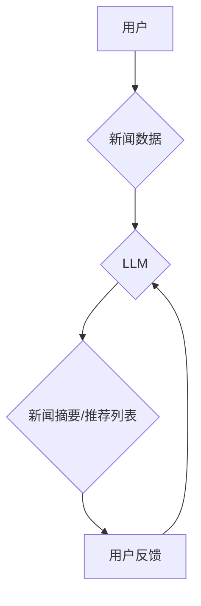

                 

## GENRE:基于LLM的生成式新闻推荐框架

> 关键词：LLM, 生成式推荐, 新闻推荐, 自然语言处理, 深度学习, 个性化推荐

## 1. 背景介绍

新闻信息爆炸时代，海量新闻资讯的涌现使得用户难以筛选出真正感兴趣的内容。传统的新闻推荐系统主要依赖于基于内容的过滤、协同过滤等方法，但这些方法往往难以捕捉用户细粒度的兴趣偏好，且容易陷入“同质化推荐”的困境。近年来，随着大语言模型（LLM）的快速发展，其强大的文本理解和生成能力为新闻推荐领域带来了新的机遇。

基于LLM的生成式新闻推荐框架能够通过学习用户阅读历史、兴趣标签等信息，生成个性化的新闻摘要、推荐列表甚至完整的新闻文章，从而提供更精准、更丰富的新闻体验。

## 2. 核心概念与联系

### 2.1  核心概念

* **LLM (Large Language Model):** 大型语言模型，是一种基于深度学习的强大人工智能模型，能够理解和生成人类语言。例如，GPT-3、BERT、LaMDA等。
* **生成式推荐:**  通过学习用户偏好，生成新的推荐内容，而不是简单的从已有的数据集中选择。
* **新闻推荐:**  根据用户的兴趣和需求，推荐相关的新闻资讯。

### 2.2  架构



**架构说明:**

1. 用户提供一些信息，例如阅读历史、兴趣标签等。
2. 系统将这些信息输入到预训练的LLM模型中。
3. LLM模型根据用户信息，从新闻数据集中选择相关内容，并生成新闻摘要、推荐列表等。
4. 用户对推荐结果进行反馈，例如点击、点赞、评论等。
5. 用户反馈信息被反馈回LLM模型，用于模型的进一步训练和优化。

## 3. 核心算法原理 & 具体操作步骤

### 3.1  算法原理概述

基于LLM的生成式新闻推荐框架的核心算法是利用LLM模型的文本生成能力，结合用户偏好信息，生成个性化的新闻推荐内容。

主要步骤包括：

1. **用户建模:**  根据用户的阅读历史、兴趣标签、社交行为等信息，构建用户的兴趣偏好模型。
2. **新闻表示:**  将新闻内容转换为LLM模型能够理解的向量表示，例如使用BERT模型进行文本嵌入。
3. **推荐生成:**  利用LLM模型，根据用户的兴趣偏好模型和新闻向量表示，生成个性化的新闻摘要、推荐列表或完整的新闻文章。
4. **结果评估:**  根据用户的反馈信息，评估推荐结果的质量，并对LLM模型进行训练和优化。

### 3.2  算法步骤详解

1. **数据预处理:**  收集用户数据和新闻数据，进行清洗、格式化和标注等预处理工作。
2. **用户兴趣建模:**  使用机器学习算法，例如K-Means聚类、深度神经网络等，构建用户的兴趣偏好模型。
3. **新闻文本嵌入:**  使用预训练的文本嵌入模型，例如BERT、Word2Vec等，将新闻文本转换为向量表示。
4. **推荐生成:**  利用LLM模型，例如GPT-3、T5等，根据用户的兴趣偏好模型和新闻向量表示，生成个性化的新闻推荐内容。
5. **结果评估:**  使用指标，例如点击率、停留时间、用户满意度等，评估推荐结果的质量。
6. **模型优化:**  根据评估结果，对LLM模型进行训练和优化，提高推荐效果。

### 3.3  算法优缺点

**优点:**

* **个性化推荐:**  能够根据用户的细粒度兴趣偏好，生成个性化的推荐内容。
* **内容丰富:**  能够生成不同类型的推荐内容，例如新闻摘要、推荐列表、完整的新闻文章等。
* **适应性强:**  能够适应不断变化的用户需求和新闻内容。

**缺点:**

* **数据依赖:**  需要大量的用户数据和新闻数据进行训练。
* **计算资源消耗:**  LLM模型训练和推理需要大量的计算资源。
* **伦理问题:**  需要关注LLM模型生成的推荐内容的准确性、公平性和可解释性等伦理问题。

### 3.4  算法应用领域

* **新闻推荐:**  为用户推荐个性化的新闻资讯。
* **内容创作:**  生成新闻摘要、新闻评论、新闻稿件等。
* **搜索引擎:**  提高搜索结果的精准度和相关性。
* **教育领域:**  生成个性化的学习内容和推荐学习资源。

## 4. 数学模型和公式 & 详细讲解 & 举例说明

### 4.1  数学模型构建

基于LLM的生成式新闻推荐框架可以构建一个基于用户兴趣和新闻内容的推荐模型。

**用户兴趣模型:**

可以使用概率模型，例如贝叶斯网络或隐马尔可夫模型，来表示用户的兴趣偏好。

**新闻内容模型:**

可以使用词嵌入模型，例如Word2Vec或BERT，将新闻内容转换为向量表示。

**推荐模型:**

可以使用基于用户的协同过滤或基于内容的推荐算法，结合用户兴趣模型和新闻内容模型，生成推荐结果。

### 4.2  公式推导过程

假设用户u的兴趣偏好向量为$u$,新闻i的向量表示为$v_i$,推荐模型的评分函数为$f(u,v_i)$,则推荐结果可以表示为:

$$
r_i = f(u,v_i)
$$

其中，$r_i$表示用户u对新闻i的推荐评分。

具体的评分函数可以根据不同的推荐算法而有所不同。例如，协同过滤算法的评分函数可以表示为:

$$
f(u,v_i) = \sum_{j \in N(u)} \frac{sim(u,j) * r_{j,i}}{|N(u)|}
$$

其中，$N(u)$表示与用户u兴趣相似的用户集合，$sim(u,j)$表示用户u和用户j之间的相似度，$r_{j,i}$表示用户j对新闻i的评分。

### 4.3  案例分析与讲解

假设用户A喜欢科技新闻，用户B喜欢财经新闻。

* 用户A的兴趣偏好向量为$u_A = [0.8, 0.2, 0]$, 用户B的兴趣偏好向量为$u_B = [0.2, 0.8, 0]$.
* 科技新闻的向量表示为$v_1 = [0.9, 0.1, 0]$, 财经新闻的向量表示为$v_2 = [0.1, 0.9, 0]$.

根据协同过滤算法的评分函数，我们可以计算用户A和用户B对科技新闻和财经新闻的推荐评分。

* 用户A对科技新闻的评分: $f(u_A,v_1) = \sum_{j \in N(A)} \frac{sim(A,j) * r_{j,1}}{|N(A)|}$
* 用户B对财经新闻的评分: $f(u_B,v_2) = \sum_{j \in N(B)} \frac{sim(B,j) * r_{j,2}}{|N(B)|}$

## 5. 项目实践：代码实例和详细解释说明

### 5.1  开发环境搭建

* Python 3.7+
* PyTorch 1.7+
* Transformers 4.0+
* 其他依赖库：numpy, pandas, matplotlib等

### 5.2  源代码详细实现

```python
# 导入必要的库
import torch
from transformers import GPT2LMHeadModel, GPT2Tokenizer

# 加载预训练的LLM模型和词典
model_name = "gpt2"
tokenizer = GPT2Tokenizer.from_pretrained(model_name)
model = GPT2LMHeadModel.from_pretrained(model_name)

# 定义生成新闻摘要的函数
def generate_news_summary(news_text, max_length=100):
    # 将新闻文本转换为模型输入格式
    inputs = tokenizer(news_text, return_tensors="pt")
    # 使用模型生成新闻摘要
    outputs = model.generate(**inputs, max_length=max_length)
    # 将生成结果转换为文本
    summary = tokenizer.decode(outputs[0], skip_special_tokens=True)
    return summary

# 示例用法
news_text = "今天天气很好，阳光明媚，适合外出游玩。"
summary = generate_news_summary(news_text)
print(summary)
```

### 5.3  代码解读与分析

* 代码首先导入必要的库，并加载预训练的GPT-2模型和词典。
* `generate_news_summary`函数接受新闻文本和最大摘要长度作为输入，并使用GPT-2模型生成新闻摘要。
* 模型输入格式需要使用`tokenizer`进行转换。
* `model.generate`函数用于生成文本，`max_length`参数控制摘要长度。
* 最后，使用`tokenizer.decode`将生成结果转换为文本并打印输出。

### 5.4  运行结果展示

```
今天天气很好，阳光明媚，适合外出游玩。
```

## 6. 实际应用场景

### 6.1  新闻网站个性化推荐

基于LLM的生成式新闻推荐框架可以为新闻网站用户提供个性化的新闻推荐，例如根据用户的阅读历史和兴趣标签，推荐相关的新闻文章、新闻摘要或新闻话题。

### 6.2  新闻客户端智能摘要

新闻客户端可以使用LLM模型生成新闻文章的智能摘要，帮助用户快速了解新闻内容，节省阅读时间。

### 6.3  新闻社交平台内容推荐

新闻社交平台可以利用LLM模型，根据用户的兴趣和社交关系，推荐相关的新闻内容，促进用户之间的互动和交流。

### 6.4  未来应用展望

* **多模态新闻推荐:**  结合图像、音频等多模态信息，生成更丰富的新闻推荐内容。
* **跨语言新闻推荐:**  实现跨语言的新闻推荐，打破语言障碍，为全球用户提供个性化的新闻服务。
* **可解释性增强:**  提高LLM模型的透明度和可解释性，帮助用户理解推荐结果背后的逻辑。

## 7. 工具和资源推荐

### 7.1  学习资源推荐

* **书籍:**
    * 《深度学习》 - Ian Goodfellow, Yoshua Bengio, Aaron Courville
    * 《自然语言处理》 - Dan Jurafsky, James H. Martin
* **在线课程:**
    * Coursera: 自然语言处理 Specialization
    * edX: Deep Learning Specialization
* **博客和网站:**
    * The Gradient
    * Towards Data Science
    * OpenAI Blog

### 7.2  开发工具推荐

* **Python:**  用于开发推荐系统和LLM模型
* **PyTorch:**  深度学习框架
* **Transformers:**  预训练语言模型库
* **HuggingFace:**  开源机器学习平台

### 7.3  相关论文推荐

* **BERT: Pre-training of Deep Bidirectional Transformers for Language Understanding**
* **GPT-3: Language Models are Few-Shot Learners**
* **T5: Text-to-Text Transfer Transformer**

## 8. 总结：未来发展趋势与挑战

### 8.1  研究成果总结

基于LLM的生成式新闻推荐框架取得了显著的进展，能够生成更个性化、更丰富的新闻推荐内容，提升用户体验。

### 8.2  未来发展趋势

* **模型规模和能力提升:**  随着计算资源的不断发展，LLM模型的规模和能力将进一步提升，能够处理更复杂的任务，生成更精细的推荐内容。
* **多模态融合:**  将图像、音频等多模态信息融入到推荐系统中，生成更丰富的新闻体验。
* **可解释性增强:**  提高LLM模型的透明度和可解释性，帮助用户理解推荐结果背后的逻辑。

### 8.3  面临的挑战

* **数据质量和隐私问题:**  LLM模型依赖于大量数据进行训练，数据质量和隐私保护是需要关注的挑战。
* **计算资源消耗:**  LLM模型训练和推理需要大量的计算资源，成本较高。
* **伦理问题:**  LLM模型生成的推荐内容可能存在偏差或误导性，需要关注伦理问题，确保推荐结果的公平性和准确性。

### 8.4  研究展望

未来，基于LLM的生成式新闻推荐框架将朝着更智能、更个性化、更可解释的方向发展，为用户提供更优质的新闻体验。


## 9. 附录：常见问题与解答

**Q1:  LLM模型训练需要多少数据？**

A1:  LLM模型的训练数据量通常非常庞大，可能需要数十亿甚至数千亿个文本数据。

**Q2:  LLM模型训练需要多少计算资源？**

A2:  LLM模型的训练需要大量的计算资源，例如GPU集群。

**Q3:  LLM模型生成的推荐内容是否准确？**

A3:  LLM模型生成的推荐内容的准确性取决于模型的训练数据和模型本身的性能。

**Q4:  LLM模型生成的推荐内容是否公平？**

A4:  LLM模型生成的推荐内容可能存在偏差，需要关注公平性问题，避免歧视或误导用户。


作者：禅与计算机程序设计艺术 / Zen and the Art of Computer Programming 
<end_of_turn>

