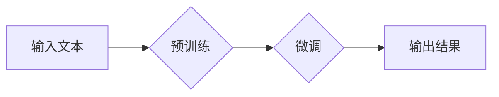

                 

## GPT 系列：语言模型的里程碑

> 关键词：GPT、语言模型、Transformer、深度学习、自然语言处理、文本生成、机器学习

### 1. 背景介绍

近年来，人工智能领域取得了令人瞩目的进展，其中自然语言处理（NLP）领域尤为突出。语言模型作为NLP的核心技术之一，在文本生成、机器翻译、问答系统等领域展现出强大的应用潜力。其中，GPT系列模型作为近年来最具影响力的语言模型之一，其不断突破的性能和应用场景，推动了语言模型的发展迈向新的里程碑。

GPT（Generative Pre-trained Transformer）系列模型由OpenAI公司开发，基于Transformer架构，通过预训练和微调的方式，能够生成流畅、连贯、语义准确的文本。自GPT-1问世以来，GPT系列模型经历了多次迭代升级，包括GPT-2、GPT-3、GPT-3.5、GPT-4等，每一次迭代都带来了显著的性能提升和功能扩展。

### 2. 核心概念与联系

#### 2.1 语言模型

语言模型是一种能够预测文本序列中下一个词出现的概率的统计模型。它通过学习语言的统计规律，例如词频、词语搭配等，来生成新的文本。

#### 2.2 Transformer 架构

Transformer是一种新型的神经网络架构，其核心特点是利用注意力机制来捕捉文本序列中的长距离依赖关系。与传统的循环神经网络（RNN）相比，Transformer具有更快的训练速度和更强的处理能力，因此在自然语言处理领域得到了广泛应用。

#### 2.3 预训练与微调

预训练是指在大量文本数据上训练语言模型，使其学习到语言的通用知识和表示能力。微调是指在特定任务数据上对预训练模型进行进一步训练，使其能够适应特定任务的需求。

**Mermaid 流程图**



### 3. 核心算法原理 & 具体操作步骤

#### 3.1 算法原理概述

GPT系列模型的核心算法是基于Transformer架构的深度学习模型。它通过多层编码器和解码器结构，学习文本序列的上下文信息，并生成新的文本序列。

#### 3.2 算法步骤详解

1. **词嵌入:** 将输入文本中的每个词转换为向量表示，以便模型能够理解和处理文本信息。
2. **编码器:** 利用多层Transformer编码器结构，对输入文本进行编码，提取文本的语义信息和上下文关系。
3. **解码器:** 利用多层Transformer解码器结构，根据编码后的文本信息，生成新的文本序列。
4. **输出层:** 将解码器输出的向量表示转换为词语，生成最终的文本输出。

#### 3.3 算法优缺点

**优点:**

* **强大的文本生成能力:** GPT系列模型能够生成流畅、连贯、语义准确的文本。
* **可迁移性强:** 预训练模型能够在不同的任务上进行微调，实现跨任务的应用。
* **处理长文本的能力:** Transformer架构能够有效地捕捉长距离依赖关系，处理较长的文本序列。

**缺点:**

* **训练成本高:** GPT系列模型的训练需要大量的计算资源和时间。
* **数据依赖性强:** 模型的性能取决于训练数据的质量和数量。
* **缺乏可解释性:** 深度学习模型的决策过程难以解释，难以理解模型是如何生成文本的。

#### 3.4 算法应用领域

GPT系列模型在以下领域具有广泛的应用前景:

* **文本生成:** 自动写作、故事创作、诗歌生成、代码生成等。
* **机器翻译:** 将一种语言翻译成另一种语言。
* **问答系统:** 回答用户提出的问题。
* **聊天机器人:** 与用户进行自然语言对话。
* **文本摘要:** 生成文本的简短摘要。

### 4. 数学模型和公式 & 详细讲解 & 举例说明

#### 4.1 数学模型构建

GPT系列模型的核心是Transformer架构，其核心组件是注意力机制。注意力机制允许模型关注输入序列中与当前词语相关的部分，从而更好地捕捉文本的上下文信息。

#### 4.2 公式推导过程

注意力机制的计算公式如下：

$$
Attention(Q, K, V) = softmax(\frac{QK^T}{\sqrt{d_k}})V
$$

其中：

* $Q$：查询矩阵
* $K$：键矩阵
* $V$：值矩阵
* $d_k$：键向量的维度
* $softmax$：softmax函数

#### 4.3 案例分析与讲解

假设我们有一个句子“The cat sat on the mat”，我们想要计算“sat”这个词语的注意力权重。

* $Q$：包含“sat”词语的查询向量
* $K$：包含所有词语的键向量
* $V$：包含所有词语的值向量

通过计算$QK^T$，我们可以得到一个矩阵，每个元素代表了“sat”词语与其他词语之间的相关性。然后，我们使用softmax函数将这些元素归一化，得到每个词语的注意力权重。

### 5. 项目实践：代码实例和详细解释说明

#### 5.1 开发环境搭建

* Python 3.7+
* PyTorch 1.7+
* CUDA 10.2+

#### 5.2 源代码详细实现

```python
import torch
import torch.nn as nn

class Transformer(nn.Module):
    def __init__(self, vocab_size, embedding_dim, num_heads, num_layers):
        super(Transformer, self).__init__()
        self.embedding = nn.Embedding(vocab_size, embedding_dim)
        self.transformer_layers = nn.ModuleList([
            nn.TransformerEncoderLayer(embedding_dim, num_heads)
            for _ in range(num_layers)
        ])
        self.linear = nn.Linear(embedding_dim, vocab_size)

    def forward(self, x):
        x = self.embedding(x)
        for layer in self.transformer_layers:
            x = layer(x)
        x = self.linear(x)
        return x
```

#### 5.3 代码解读与分析

* `__init__`方法：初始化模型参数，包括词嵌入层、Transformer编码器层和输出层。
* `forward`方法：定义模型的正向传播过程，将输入序列经过词嵌入层、Transformer编码器层和输出层，最终生成输出序列。

#### 5.4 运行结果展示

通过训练和测试，我们可以评估模型的性能，例如困惑度（perplexity）等指标。

### 6. 实际应用场景

GPT系列模型在各个领域都有着广泛的应用场景：

* **文本生成:** ChatGPT是一款基于GPT-3.5的聊天机器人，能够进行自然流畅的对话，并能够根据用户需求生成不同类型的文本，例如故事、诗歌、代码等。
* **机器翻译:** GPT系列模型能够实现高质量的机器翻译，例如将英文翻译成中文，或将中文翻译成英文。
* **问答系统:** GPT系列模型能够理解用户的问题，并从知识库中找到相应的答案，构建智能问答系统。

### 6.4 未来应用展望

随着GPT系列模型的不断发展，其应用场景将会更加广泛，例如：

* **个性化教育:** 根据学生的学习情况，生成个性化的学习内容和辅导。
* **医疗诊断:** 辅助医生进行疾病诊断，并提供个性化的治疗方案。
* **法律服务:** 自动生成法律文件，并提供法律咨询服务。

### 7. 工具和资源推荐

#### 7.1 学习资源推荐

* **OpenAI官方文档:** https://openai.com/blog/gpt-3/
* **HuggingFace Transformers库:** https://huggingface.co/transformers/
* **DeepLearning.AI课程:** https://www.deeplearning.ai/

#### 7.2 开发工具推荐

* **PyTorch:** https://pytorch.org/
* **TensorFlow:** https://www.tensorflow.org/

#### 7.3 相关论文推荐

* **Attention Is All You Need:** https://arxiv.org/abs/1706.03762
* **Language Models are Few-Shot Learners:** https://arxiv.org/abs/2005.14165

### 8. 总结：未来发展趋势与挑战

#### 8.1 研究成果总结

GPT系列模型的成功发展推动了语言模型的进步，其强大的文本生成能力和可迁移性，为自然语言处理领域带来了新的机遇。

#### 8.2 未来发展趋势

* **模型规模的进一步扩大:** 随着计算资源的不断提升，GPT系列模型的规模将会进一步扩大，从而提升模型的性能和能力。
* **多模态学习:** 将文本与其他模态信息，例如图像、音频、视频等进行融合，构建更强大的多模态语言模型。
* **可解释性研究:** 加强对语言模型的解释性研究，使其决策过程更加透明和可理解。

#### 8.3 面临的挑战

* **数据安全和隐私:** 训练大型语言模型需要大量的文本数据，如何保证数据安全和隐私是一个重要的挑战。
* **模型偏见和歧视:** 语言模型可能会学习到训练数据中的偏见和歧视，如何 mitigating 这些问题是一个重要的研究方向。
* **伦理问题:** 语言模型的强大能力也带来了伦理问题，例如如何防止其被用于生成虚假信息或进行恶意攻击。

#### 8.4 研究展望

未来，语言模型将会在更多领域发挥重要作用，例如教育、医疗、法律等。 

### 9. 附录：常见问题与解答

* **GPT系列模型的训练数据是什么？**

GPT系列模型的训练数据来自公开的互联网文本数据，例如书籍、文章、代码等。

* **GPT系列模型的性能如何？**

GPT系列模型在各种NLP任务上都取得了state-of-the-art的性能，例如文本生成、机器翻译、问答系统等。

* **如何使用GPT系列模型？**

OpenAI提供了一些API接口，可以方便地使用GPT系列模型。

* **GPT系列模型的未来发展趋势是什么？**

GPT系列模型的未来发展趋势包括模型规模的扩大、多模态学习、可解释性研究等。


作者：禅与计算机程序设计艺术 / Zen and the Art of Computer Programming 
<end_of_turn>

