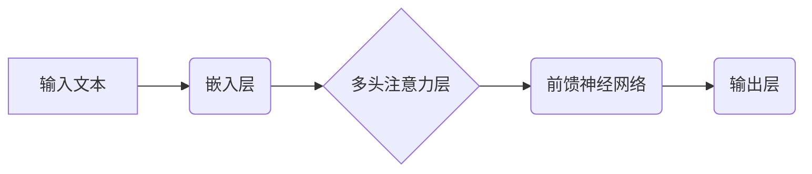

                 

## LLM上下文长度持续扩展

> 关键词：LLM,上下文长度,Transformer,注意力机制,长序列建模,参数效率,高效训练,应用场景

## 1. 背景介绍

大型语言模型 (LLM) 近年来取得了令人瞩目的成就，在自然语言处理 (NLP) 领域展现出强大的能力，例如文本生成、翻译、问答和代码生成等。然而，LLM 的核心能力之一——上下文理解，仍然面临着挑战。

LLM 的上下文长度是指模型能够处理的文本序列长度。上下文长度的限制直接影响着模型对长文本的理解和生成能力。目前大多数 LLMs 的上下文长度有限，通常在几千字左右，这对于处理长篇小说、学术论文等长文本任务来说仍然不够。

## 2. 核心概念与联系

**2.1 核心概念**

* **Transformer:** Transformer 是一种基于注意力机制的深度学习架构，是 LLMs 的基础。它能够有效地处理长序列数据，并捕捉文本中的长距离依赖关系。
* **注意力机制:** 注意力机制允许模型在处理文本时，对不同部分的文本给予不同的权重，从而更好地理解上下文信息。
* **上下文长度:** 指模型能够处理的文本序列长度。

**2.2 架构关系**



**2.3 联系分析**

Transformer 架构的核心是多头注意力机制，它能够捕捉文本中的长距离依赖关系，从而提高 LLMs 的上下文理解能力。然而，Transformer 架构的复杂性和参数量也导致了上下文长度的限制。

## 3. 核心算法原理 & 具体操作步骤

**3.1 算法原理概述**

为了扩展 LLMs 的上下文长度，研究者们提出了多种算法和方法，例如：

* **长距离依赖模型:** 这些模型通过引入新的机制，例如相对位置编码和门控机制，来更好地处理长距离依赖关系。
* **混合架构:** 将 Transformer 与其他模型，例如 RNN 或 CNN，进行混合，以提高模型的效率和性能。
* **参数效率优化:** 通过使用更小的模型参数、量化技术和知识蒸馏等方法，降低模型的计算成本，从而实现更长的上下文长度。

**3.2 算法步骤详解**

以长距离依赖模型为例，其具体操作步骤如下：

1. **文本预处理:** 将输入文本进行分词、标记化等预处理操作。
2. **嵌入层:** 将文本词语转换为向量表示。
3. **相对位置编码:** 为每个词语添加相对位置信息，以表示其在句子中的位置关系。
4. **多头注意力层:** 使用多头注意力机制，捕捉文本中的长距离依赖关系。
5. **前馈神经网络:** 对注意力输出进行进一步处理，提取文本特征。
6. **输出层:** 生成最终的输出结果，例如预测下一个词语或分类文本内容。

**3.3 算法优缺点**

* **优点:** 能够有效地处理长距离依赖关系，提高 LLMs 的上下文理解能力。
* **缺点:** 计算成本较高，训练时间较长，模型参数量较大。

**3.4 算法应用领域**

* **文本摘要:** 能够生成更准确、更完整的文本摘要。
* **机器翻译:** 能够更好地理解长文本的语义，提高翻译质量。
* **问答系统:** 能够处理更复杂、更长篇的自然语言问题。

## 4. 数学模型和公式 & 详细讲解 & 举例说明

**4.1 数学模型构建**

LLMs 的核心是 Transformer 架构，其多头注意力机制的数学模型可以表示为：

$$
Attention(Q, K, V) = softmax(\frac{QK^T}{\sqrt{d_k}})V
$$

其中：

* $Q$：查询矩阵
* $K$：键矩阵
* $V$：值矩阵
* $d_k$：键向量的维度
* $softmax$：softmax 函数

**4.2 公式推导过程**

注意力机制的目的是计算每个词语与其他词语之间的相关性，并根据相关性赋予不同的权重。

1. 计算查询矩阵 $Q$ 与键矩阵 $K$ 的点积，并进行归一化处理。
2. 应用 softmax 函数，将点积结果转换为概率分布。
3. 将概率分布与值矩阵 $V$ 进行加权求和，得到最终的注意力输出。

**4.3 案例分析与讲解**

假设我们有一个句子 "The cat sat on the mat"，其词语向量分别为 $Q_1, Q_2, ..., Q_6$。

在计算注意力输出时，每个词语 $Q_i$ 会与其他词语 $K_j$ 进行点积计算，得到一个相关性分数。

例如，计算 $Q_1$ 与 $Q_2$ 的相关性分数为：

$$
Q_1 \cdot K_2
$$

然后将所有相关性分数进行归一化处理，并应用 softmax 函数，得到一个概率分布，表示 $Q_1$ 与其他词语的相关性。

最终的注意力输出将是每个词语与所有其他词语的相关性加权求和的结果。

## 5. 项目实践：代码实例和详细解释说明

**5.1 开发环境搭建**

* Python 3.7+
* PyTorch 或 TensorFlow
* CUDA 和 cuDNN (可选)

**5.2 源代码详细实现**

```python
import torch
import torch.nn as nn

class Attention(nn.Module):
    def __init__(self, d_model, num_heads):
        super(Attention, self).__init__()
        self.d_model = d_model
        self.num_heads = num_heads
        self.head_dim = d_model // num_heads

        self.query = nn.Linear(d_model, d_model)
        self.key = nn.Linear(d_model, d_model)
        self.value = nn.Linear(d_model, d_model)
        self.fc_out = nn.Linear(d_model, d_model)

    def forward(self, query, key, value, mask=None):
        batch_size = query.size(0)

        # Linear projections
        Q = self.query(query).view(batch_size, -1, self.num_heads, self.head_dim).transpose(1, 2)
        K = self.key(key).view(batch_size, -1, self.num_heads, self.head_dim).transpose(1, 2)
        V = self.value(value).view(batch_size, -1, self.num_heads, self.head_dim).transpose(1, 2)

        # Scaled dot-product attention
        scores = torch.matmul(Q, K.transpose(-2, -1)) / torch.sqrt(torch.tensor(self.head_dim, dtype=torch.float))
        if mask is not None:
            scores = scores.masked_fill(mask == 0, -1e9)
        attention_weights = torch.softmax(scores, dim=-1)

        # Weighted sum of values
        context = torch.matmul(attention_weights, V)

        # Concatenate heads and project
        context = context.transpose(1, 2).contiguous().view(batch_size, -1, self.d_model)
        output = self.fc_out(context)

        return output, attention_weights
```

**5.3 代码解读与分析**

* `Attention` 类定义了多头注意力机制的结构。
* `forward` 方法实现注意力机制的计算过程。
* `query`, `key`, `value` 分别表示查询矩阵、键矩阵和值矩阵。
* `mask` 用于屏蔽无效的注意力连接。
* `scores` 表示每个词语与其他词语之间的相关性分数。
* `attention_weights` 表示每个词语与其他词语的相关性加权分布。
* `context` 表示注意力输出，即每个词语与所有其他词语的相关性加权求和的结果。

**5.4 运行结果展示**

运行上述代码，可以得到注意力输出和注意力权重矩阵，从而分析模型对文本的理解和关注点。

## 6. 实际应用场景

**6.1 文本摘要**

LLMs 可以利用注意力机制对长文本进行理解，并生成更准确、更完整的文本摘要。

**6.2 机器翻译**

LLMs 可以更好地捕捉长文本的语义，提高机器翻译的质量。

**6.3 问答系统**

LLMs 可以处理更复杂、更长篇的自然语言问题，并提供更准确的答案。

**6.4 未来应用展望**

随着 LLMs 上下文长度的持续扩展，其应用场景将更加广泛，例如：

* **对话系统:** 构建更自然、更流畅的对话系统。
* **代码生成:** 自动生成更复杂的代码。
* **创意写作:** 辅助人类进行创意写作。

## 7. 工具和资源推荐

**7.1 学习资源推荐**

* **论文:** "Attention Is All You Need"
* **博客:** Jay Alammar's Blog
* **课程:** Stanford CS224N

**7.2 开发工具推荐**

* **PyTorch:** https://pytorch.org/
* **TensorFlow:** https://www.tensorflow.org/

**7.3 相关论文推荐**

* "Longformer: The Long-Document Transformer"
* "Reformer: The Efficient Transformer"
* "T5: Text-to-Text Transfer Transformer"

## 8. 总结：未来发展趋势与挑战

**8.1 研究成果总结**

近年来，研究者们在 LLMs 上下文长度扩展方面取得了显著进展，提出了多种算法和方法，例如长距离依赖模型、混合架构和参数效率优化。

**8.2 未来发展趋势**

未来，LLMs 上下文长度的扩展将继续朝着以下方向发展：

* **更长序列建模:** 研究更有效的算法和架构，能够处理更长的文本序列。
* **更高效训练:** 探索新的训练方法和技术，降低模型训练成本。
* **更广泛应用:** 将 LLMs 应用于更多领域，例如对话系统、代码生成和创意写作。

**8.3 面临的挑战**

LLMs 上下文长度扩展仍然面临着一些挑战：

* **计算成本:** 处理长文本序列需要大量的计算资源。
* **模型复杂度:** 随着上下文长度的增加，模型的复杂度也会随之增加。
* **数据需求:** 训练大型 LLMs 需要大量的文本数据。

**8.4 研究展望**

未来研究将重点关注以下方面：

* **新型注意力机制:** 设计更有效的注意力机制，能够更好地处理长距离依赖关系。
* **高效训练方法:** 探索新的训练方法和技术，降低模型训练成本。
* **跨模态理解:** 将 LLMs 与其他模态数据，例如图像和音频，进行融合，实现跨模态理解。

## 9. 附录：常见问题与解答

**9.1 如何选择合适的上下文长度？**

上下文长度的选择取决于具体的应用场景。对于需要处理长文本的应用，例如文本摘要和机器翻译，需要选择较长的上下文长度。而对于需要处理短文本的应用，例如问答系统，可以选择较短的上下文长度。

**9.2 如何提高 LLMs 的上下文理解能力？**

除了扩展上下文长度，还可以通过以下方法提高 LLMs 的上下文理解能力：

* 使用更复杂的 Transformer 架构。
* 引入新的机制，例如相对位置编码和门控机制。
* 使用更大的模型参数。
* 使用更丰富的训练数据。


作者：禅与计算机程序设计艺术 / Zen and the Art of Computer Programming 
<end_of_turn>

