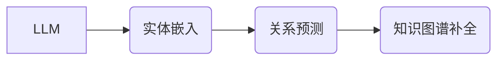

                 

## LLM在关系预测领域的研究新思路

> 关键词：LLM、关系预测、知识图谱、自然语言处理、深度学习、Transformer、图神经网络

## 1. 背景介绍

关系预测是知识图谱 (KG) 补全和推理的关键任务，旨在预测实体之间的潜在关系。传统的基于规则和统计的方法在处理复杂关系和语义信息方面存在局限性。近年来，深度学习的兴起为关系预测带来了新的机遇。

**1.1 知识图谱与关系预测**

知识图谱是一种结构化的知识表示形式，由实体和关系组成。实体代表现实世界中的事物，关系描述实体之间的连接。关系预测旨在学习实体之间的关系模式，并预测新的关系。

**1.2 传统方法的局限性**

传统的基于规则和统计的方法依赖于人工设计的特征和规则，难以捕捉复杂的关系语义。这些方法通常需要大量的标注数据，且难以扩展到新的领域。

**1.3 深度学习的应用**

深度学习方法能够自动学习复杂的特征表示，并有效地处理语义信息。近年来，基于深度学习的关系预测模型取得了显著的进展，例如：

* **基于图神经网络 (GNN) 的模型:** GNN 可以有效地学习实体之间的关系表示，并捕获图结构信息。
* **基于 Transformer 的模型:** Transformer 可以学习长距离依赖关系，并有效地处理文本语义信息。

## 2. 核心概念与联系

**2.1 核心概念**

* **LLM (Large Language Model):** 大型语言模型是一种基于 Transformer 架构的深度学习模型，能够理解和生成人类语言。
* **关系预测:** 预测实体之间的潜在关系。
* **知识图谱 (KG):** 结构化的知识表示形式，由实体和关系组成。

**2.2 架构关系**

LLM 可以用于关系预测，通过学习实体之间的语义关系，并预测新的关系。



## 3. 核心算法原理 & 具体操作步骤

**3.1 算法原理概述**

LLM 在关系预测中的应用主要基于以下原理：

* **实体嵌入:** 将实体映射到低维向量空间，以便捕捉实体之间的语义相似性。
* **关系表示学习:** 学习实体之间的关系表示，并预测新的关系。

**3.2 算法步骤详解**

1. **数据预处理:** 将知识图谱数据转换为适合 LLM 处理的格式。
2. **实体嵌入:** 使用 LLM 对实体进行嵌入，生成实体向量表示。
3. **关系表示学习:** 使用 LLM 学习实体之间的关系表示，例如通过训练一个分类器来预测关系类型。
4. **关系预测:** 使用训练好的模型预测新的关系。

**3.3 算法优缺点**

**优点:**

* 能够学习复杂的语义关系。
* 不需要人工设计的特征。
* 可以处理大量的文本数据。

**缺点:**

* 需要大量的训练数据。
* 计算成本较高。
* 训练过程复杂。

**3.4 算法应用领域**

* 知识图谱补全
* 关系抽取
* 实体链接
* 知识推理

## 4. 数学模型和公式 & 详细讲解 & 举例说明

**4.1 数学模型构建**

假设我们有一个知识图谱 G = (E, R)，其中 E 是实体集合，R 是关系集合。我们使用 LLM 学习实体嵌入向量，并表示为：

$$
e_i \in R^d
$$

其中，$e_i$ 是实体 $i$ 的嵌入向量，$d$ 是嵌入维数。

**4.2 公式推导过程**

关系预测可以使用分类器来实现，例如逻辑回归或支持向量机。对于关系类型 $r$，我们可以使用以下公式预测实体对 $(h, t)$ 是否具有关系 $r$：

$$
P(r|h, t) = \frac{1}{1 + exp(-(w^T * [e_h; e_t]) + b)}
$$

其中，$w$ 是分类器的权重向量，$b$ 是偏置项，$[e_h; e_t]$ 是实体 $h$ 和 $t$ 的拼接向量。

**4.3 案例分析与讲解**

例如，我们想要预测实体对 (张三, 李四) 是否具有关系 "朋友"。我们可以使用 LLM 学习实体嵌入向量，并使用上述公式预测关系类型 "朋友" 的概率。

## 5. 项目实践：代码实例和详细解释说明

**5.1 开发环境搭建**

* Python 3.7+
* PyTorch 1.7+
* Transformers 4.10+

**5.2 源代码详细实现**

```python
import torch
from transformers import AutoModel, AutoTokenizer

# 加载预训练模型和词典
model_name = "bert-base-uncased"
tokenizer = AutoTokenizer.from_pretrained(model_name)
model = AutoModel.from_pretrained(model_name)

# 实体嵌入
def get_entity_embedding(text):
    inputs = tokenizer(text, return_tensors="pt")
    outputs = model(**inputs)
    return outputs.last_hidden_state[:, 0, :]

# 关系预测
def predict_relation(h, t):
    h_embedding = get_entity_embedding(h)
    t_embedding = get_entity_embedding(t)
    # ... (使用分类器预测关系)

# 运行示例
h = "张三"
t = "李四"
relation = predict_relation(h, t)
print(f"实体对 ({h}, {t}) 的关系预测结果: {relation}")
```

**5.3 代码解读与分析**

* 代码首先加载预训练的 BERT 模型和词典。
* `get_entity_embedding` 函数使用 BERT 模型获取实体的嵌入向量。
* `predict_relation` 函数使用实体嵌入向量和分类器预测关系类型。

**5.4 运行结果展示**

运行代码后，会输出实体对 (张三, 李四) 的关系预测结果。

## 6. 实际应用场景

**6.1 知识图谱补全**

LLM 可以用于预测知识图谱中缺失的关系，从而补全知识图谱。

**6.2 关系抽取**

LLM 可以用于从文本中抽取实体和关系，构建知识图谱。

**6.3 实体链接**

LLM 可以用于将文本中的实体链接到知识图谱中的实体。

**6.4 未来应用展望**

LLM 在关系预测领域具有巨大的潜力，未来可以应用于：

* 更复杂的知识推理
* 跨语言关系预测
* 关系类型细粒度分类

## 7. 工具和资源推荐

**7.1 学习资源推荐**

* **论文:**
    * "BERT: Pre-training of Deep Bidirectional Transformers for Language Understanding"
    * "Graph Convolutional Networks for Web Knowledge Graph Embedding"
* **博客:**
    * https://towardsdatascience.com/
    * https://blog.paperspace.com/

**7.2 开发工具推荐**

* **PyTorch:** https://pytorch.org/
* **Transformers:** https://huggingface.co/transformers/

**7.3 相关论文推荐**

* "Knowledge Graph Embedding with Graph Convolutional Networks"
* "Relation Extraction with BERT"

## 8. 总结：未来发展趋势与挑战

**8.1 研究成果总结**

LLM 在关系预测领域取得了显著的进展，能够学习复杂的语义关系，并预测新的关系。

**8.2 未来发展趋势**

* 更强大的 LLMs
* 更有效的关系表示学习方法
* 跨语言关系预测
* 关系类型细粒度分类

**8.3 面临的挑战**

* 数据标注成本高
* 计算成本高
* 模型解释性差

**8.4 研究展望**

未来研究方向包括：

* 开发更有效的 LLMs 和关系表示学习方法
* 探索新的数据来源和标注方法
* 研究 LLMs 在关系预测中的可解释性


## 9. 附录：常见问题与解答

**9.1 如何选择合适的 LLM 模型？**

选择合适的 LLM 模型取决于具体的应用场景和数据特点。

**9.2 如何处理稀疏关系？**

可以使用关系嵌入技术或图神经网络来处理稀疏关系。

**9.3 如何评估关系预测模型的性能？**

常用的评估指标包括准确率、召回率、F1-score 和 AUC。


作者：禅与计算机程序设计艺术 / Zen and the Art of Computer Programming 
<end_of_turn>

