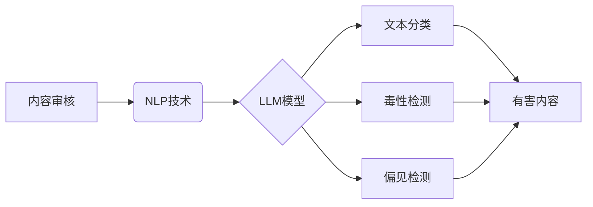

                 

## LLM在智能内容审核中的应用

> 关键词：大型语言模型（LLM）、内容审核、自然语言处理（NLP）、机器学习、深度学习、文本分类、毒性检测、偏见检测

## 1. 背景介绍

随着互联网的蓬勃发展和社交媒体的普及，海量信息涌入网络，其中包含着大量需要审核的内容，例如评论、帖子、文章等。传统的文本审核方式依赖人工审核，效率低下且成本高昂。而大型语言模型（LLM）的出现为智能内容审核带来了新的机遇。

LLM 是一种基于深度学习的强大人工智能模型，能够理解和生成人类语言。其强大的文本处理能力和学习能力使其在内容审核领域展现出巨大的潜力。LLM 可以自动识别和分类有害内容，例如仇恨言论、虚假信息、色情内容等，从而提高审核效率，降低成本，并帮助构建更安全、健康、文明的网络环境。

## 2. 核心概念与联系

### 2.1 内容审核概述

内容审核是指对网络上发布的内容进行审查，以确保其符合相关法律法规、平台规则和社会道德规范。内容审核的目标是过滤掉有害内容，保护用户安全和权益，维护网络秩序。

### 2.2 自然语言处理（NLP）

自然语言处理（NLP）是人工智能领域的一个重要分支，旨在使计算机能够理解、处理和生成人类语言。NLP 技术包括文本分类、情感分析、文本摘要、机器翻译等，为智能内容审核提供了重要的技术基础。

### 2.3 大型语言模型（LLM）

大型语言模型（LLM）是一种基于深度学习的强大人工智能模型，其参数数量巨大，能够学习和理解复杂的语言模式。LLM 可以通过训练大量的文本数据，学习语言的语法、语义和上下文关系，从而实现各种自然语言处理任务，包括文本分类、毒性检测、偏见检测等。

**核心概念与架构流程图**



## 3. 核心算法原理 & 具体操作步骤

### 3.1 算法原理概述

LLM 在内容审核中的应用主要基于以下核心算法原理：

* **文本嵌入:** 将文本转换为向量表示，以便模型能够理解和处理文本信息。常用的文本嵌入方法包括 Word2Vec、GloVe 和 BERT 等。
* **分类模型:** 使用分类模型对文本进行分类，例如判断文本是否包含有害内容。常用的分类模型包括支持向量机（SVM）、逻辑回归（Logistic Regression）和深度神经网络（DNN）等。
* **注意力机制:** 允许模型关注文本中的重要部分，从而提高分类精度。

### 3.2 算法步骤详解

LLM 在智能内容审核中的具体操作步骤如下：

1. **数据预处理:** 对待审核文本进行预处理，例如去除停用词、标点符号等，并进行文本清洗和格式化。
2. **文本嵌入:** 使用文本嵌入模型将预处理后的文本转换为向量表示。
3. **特征提取:** 从文本向量中提取特征，例如词频、词性、语法结构等。
4. **模型训练:** 使用分类模型对训练数据进行训练，学习文本特征与类别之间的关系。
5. **模型评估:** 使用测试数据评估模型的性能，例如准确率、召回率、F1-score 等。
6. **模型部署:** 将训练好的模型部署到生产环境中，用于对实时文本进行审核。

### 3.3 算法优缺点

**优点:**

* **自动化:** LLM 可以自动识别和分类有害内容，提高审核效率。
* **精准度:** LLM 能够学习复杂的语言模式，提高审核的精准度。
* **可扩展性:** LLM 可以轻松扩展到处理更大的数据量和更复杂的审核任务。

**缺点:**

* **数据依赖:** LLM 的性能取决于训练数据的质量和数量。
* **偏差问题:** 训练数据可能存在偏差，导致模型产生偏见。
* **解释性:** LLM 的决策过程难以解释，难以进行审计和监管。

### 3.4 算法应用领域

LLM 在内容审核领域的应用范围广泛，包括：

* **社交媒体平台:** 识别和过滤仇恨言论、虚假信息、色情内容等有害内容。
* **在线论坛:** 维护论坛秩序，防止垃圾信息和恶意攻击。
* **新闻网站:** 检测和标记虚假新闻和谣言。
* **教育平台:** 过滤不适宜的学习内容，保护学生安全。

## 4. 数学模型和公式 & 详细讲解 & 举例说明

### 4.1 数学模型构建

LLM 的核心数学模型是 Transformer，它是一种基于注意力机制的深度神经网络架构。Transformer 模型由编码器和解码器组成，编码器用于将输入文本转换为向量表示，解码器用于生成输出文本。

**Transformer 模型结构**


### 4.2 公式推导过程

Transformer 模型中使用的注意力机制公式如下：

$$
Attention(Q, K, V) = softmax(\frac{QK^T}{\sqrt{d_k}})V
$$

其中：

* $Q$：查询矩阵
* $K$：键矩阵
* $V$：值矩阵
* $d_k$：键向量的维度
* $softmax$：softmax 函数

### 4.3 案例分析与讲解

假设我们有一个句子“The cat sat on the mat”，我们需要使用 Transformer 模型将其转换为向量表示。

1. 将句子中的每个词转换为词嵌入向量。
2. 将词嵌入向量输入到编码器中，编码器会通过多层 Transformer 块进行处理，最终将句子转换为一个句子向量。
3. 句子向量可以用于后续的文本分类、毒性检测等任务。

## 5. 项目实践：代码实例和详细解释说明

### 5.1 开发环境搭建

* Python 3.7+
* PyTorch 或 TensorFlow
* NLTK、SpaCy 等 NLP 库

### 5.2 源代码详细实现

```python
import torch
from transformers import BertTokenizer, BertModel

# 加载预训练模型和词典
tokenizer = BertTokenizer.from_pretrained('bert-base-uncased')
model = BertModel.from_pretrained('bert-base-uncased')

# 文本预处理
text = "This is a sample text."
inputs = tokenizer(text, return_tensors='pt')

# 模型推理
outputs = model(**inputs)

# 获取句子向量
sentence_embedding = outputs.last_hidden_state[:, 0, :]

# ...后续使用句子向量进行文本分类、毒性检测等任务
```

### 5.3 代码解读与分析

* 代码首先加载预训练的 BERT 模型和词典。
* 然后对输入文本进行预处理，转换为模型可识别的格式。
* 使用模型对预处理后的文本进行推理，获取句子向量。
* 最后，可以使用句子向量进行后续的文本分析任务。

### 5.4 运行结果展示

运行代码后，会输出句子向量的数值表示。这些数值可以用于后续的文本分类、毒性检测等任务。

## 6. 实际应用场景

### 6.1 社交媒体平台

LLM 可以用于识别和过滤社交媒体平台上的有害内容，例如仇恨言论、虚假信息、色情内容等。

### 6.2 在线论坛

LLM 可以用于维护在线论坛的秩序，防止垃圾信息和恶意攻击。

### 6.3 新闻网站

LLM 可以用于检测和标记新闻网站上的虚假新闻和谣言。

### 6.4 未来应用展望

LLM 在内容审核领域的应用前景广阔，未来可能应用于：

* **更精准的审核:** 通过更复杂的模型和更大的训练数据，提高审核的精准度。
* **多语言审核:** 支持多种语言的审核，覆盖更广泛的用户群体。
* **个性化审核:** 根据用户的偏好和需求，提供个性化的审核服务。

## 7. 工具和资源推荐

### 7.1 学习资源推荐

* **论文:**
    * Vaswani, A., Shazeer, N., Parmar, N., Uszkoreit, J., Jones, L., Gomez, A. N., ... & Polosukhin, I. (2017). Attention is all you need. Advances in neural information processing systems, 30.
    * Devlin, J., Chang, M. W., Lee, K., & Toutanova, K. (2018). BERT: Pre-training of deep bidirectional transformers for language understanding. arXiv preprint arXiv:1810.04805.
* **书籍:**
    * Deep Learning with Python by François Chollet
    * Natural Language Processing with Python by Steven Bird, Ewan Klein, and Edward Loper

### 7.2 开发工具推荐

* **PyTorch:** https://pytorch.org/
* **TensorFlow:** https://www.tensorflow.org/
* **Hugging Face Transformers:** https://huggingface.co/transformers/

### 7.3 相关论文推荐

* **Toxicity Detection with BERT:** https://arxiv.org/abs/1903.08067
* **Detecting Bias in Text with BERT:** https://arxiv.org/abs/1909.08327

## 8. 总结：未来发展趋势与挑战

### 8.1 研究成果总结

LLM 在智能内容审核领域取得了显著的成果，能够自动识别和分类有害内容，提高审核效率和精准度。

### 8.2 未来发展趋势

* **模型更强大:** 训练更大规模、更复杂的 LLMs，提高审核的精准度和泛化能力。
* **多模态审核:** 将文本、图像、音频等多模态信息融合到内容审核中，实现更全面的审核。
* **可解释性增强:** 研究更可解释的 LLMs，提高审核结果的可信度和透明度。

### 8.3 面临的挑战

* **数据偏差:** 训练数据的偏差可能导致模型产生偏见，需要不断收集和清洗数据，减轻数据偏差的影响。
* **恶意攻击:** 攻击者可能利用对抗样本攻击 LLMs，需要研究防御对抗样本的策略。
* **伦理问题:** LLMs 的应用可能引发伦理问题，例如隐私保护、言论自由等，需要制定相应的伦理规范和监管机制。

### 8.4 研究展望

未来，LLM 在智能内容审核领域将继续发挥重要作用，并与其他人工智能技术融合，实现更智能、更安全、更文明的网络环境。

## 9. 附录：常见问题与解答

* **Q: LLM 是否能够完全替代人工审核？**

A: 目前，LLM 无法完全替代人工审核，但可以有效辅助人工审核，提高效率和精准度。

* **Q: 如何解决 LLM 数据偏差的问题？**

A: 可以通过收集更全面、更均衡的数据，并使用数据清洗和去偏置技术来解决数据偏差的问题。

* **Q: 如何评估 LLM 的审核性能？**

A: 可以使用准确率、召回率、F1-score 等指标来评估 LLM 的审核性能。

作者：禅与计算机程序设计艺术 / Zen and the Art of Computer Programming


<end_of_turn>

