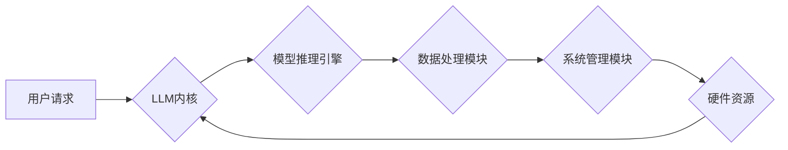

                 

## LLM操作系统内核：AI时代的新基石

> 关键词：大型语言模型 (LLM)、操作系统内核、AI基础设施、可编程AI、模型推理、高效计算、可扩展性、安全性和隐私

### 1. 背景介绍

人工智能（AI）正以惊人的速度发展，大型语言模型（LLM）作为其重要组成部分，展现出强大的文本生成、理解和翻译能力。然而，LLM的应用场景远不止于此，它们有潜力彻底改变我们与计算交互的方式，成为未来智能应用的基础。

传统操作系统内核为我们提供了硬件资源管理、进程调度和系统安全等基础功能，为应用程序提供运行环境。随着AI技术的飞速发展，LLM的规模和复杂度不断增加，对计算资源的需求也越来越高。传统的操作系统内核架构难以满足LLM的特殊需求，例如高效的模型推理、可编程性以及对海量数据处理的适应性。

因此，我们需要一种新的操作系统内核架构，专门针对LLM进行设计和优化，以充分发挥其潜力，并为AI时代的新应用场景提供坚实的基础。

### 2. 核心概念与联系

LLM操作系统内核的核心概念是将LLM模型本身作为内核的一部分，将模型推理、数据处理和系统管理等功能紧密集成在一起。

**架构图：**



**核心概念解释：**

* **用户请求:** 用户通过应用程序或接口向LLM操作系统内核提出请求，例如文本生成、翻译或问答。
* **LLM内核:** 作为操作系统内核的核心，负责接收用户请求、调度模型推理、管理数据处理和与硬件资源交互。
* **模型推理引擎:** 负责执行LLM模型的推理过程，根据输入数据生成输出结果。
* **数据处理模块:** 负责处理用户请求中的数据，例如文本预处理、数据格式转换和数据存储。
* **系统管理模块:** 负责管理LLM内核的运行状态，包括模型更新、资源分配和安全控制。
* **硬件资源:** 包括CPU、GPU、内存和存储等硬件设备，为LLM内核提供运行环境和计算能力。

### 3. 核心算法原理 & 具体操作步骤

#### 3.1 算法原理概述

LLM操作系统内核的核心算法原理是基于深度学习和神经网络的模型推理，结合高效的计算框架和数据处理技术。

* **深度学习:** LLM模型基于深度神经网络结构，通过大量的训练数据学习语言的模式和规律，从而能够生成、理解和翻译文本。
* **神经网络:** 神经网络是一种模仿人脑神经元结构的计算模型，通过连接多个神经元层进行信息处理，学习复杂的非线性关系。
* **模型推理:** 模型推理是指将训练好的LLM模型应用于新的输入数据，预测输出结果的过程。

#### 3.2 算法步骤详解

LLM操作系统内核的具体操作步骤如下：

1. **接收用户请求:** 用户通过应用程序或接口向LLM操作系统内核提出请求，例如文本生成、翻译或问答。
2. **数据预处理:** 数据处理模块负责对用户请求中的数据进行预处理，例如文本清洗、分词、词向量化等操作，将数据转换为模型可以理解的格式。
3. **模型推理:** 模型推理引擎负责执行LLM模型的推理过程，根据预处理后的数据生成输出结果。
4. **结果处理:** 数据处理模块负责对模型推理的结果进行处理，例如文本解码、格式转换和结果展示等操作，将结果转换为用户可以理解的格式。
5. **系统管理:** 系统管理模块负责管理LLM内核的运行状态，包括模型更新、资源分配和安全控制等操作。

#### 3.3 算法优缺点

**优点:**

* **高效的模型推理:** 将模型推理引擎直接集成到内核中，可以减少数据传输和上下文切换的开销，提高模型推理效率。
* **可编程性:** LLM操作系统内核可以支持用户自定义模型和算法，实现更灵活和定制化的AI应用。
* **可扩展性:** LLM操作系统内核可以根据需要扩展硬件资源和模型规模，满足不同应用场景的需求。

**缺点:**

* **复杂性:** LLM操作系统内核的架构和实现更加复杂，需要更高的开发和维护成本。
* **安全性和隐私:** LLM模型本身可能存在安全和隐私风险，需要采取相应的措施进行保护。

#### 3.4 算法应用领域

LLM操作系统内核的应用领域非常广泛，包括：

* **自然语言处理:** 文本生成、翻译、问答、文本摘要、情感分析等。
* **计算机视觉:** 图像识别、物体检测、图像分类等。
* **语音识别:** 语音转文本、语音合成等。
* **智能助手:** 聊天机器人、虚拟助理等。
* **个性化推荐:** 产品推荐、内容推荐等。

### 4. 数学模型和公式 & 详细讲解 & 举例说明

#### 4.1 数学模型构建

LLM模型通常基于Transformer架构，其核心是自注意力机制（Self-Attention）。自注意力机制允许模型在处理文本序列时，关注不同位置的词语之间的关系，从而更好地理解上下文信息。

#### 4.2 公式推导过程

**自注意力机制公式:**

$$
Attention(Q, K, V) = \frac{exp(Q \cdot K^T / \sqrt{d_k})}{exp(Q \cdot K^T / \sqrt{d_k})} \cdot V
$$

其中：

* $Q$: 查询矩阵
* $K$: 键矩阵
* $V$: 值矩阵
* $d_k$: 键向量的维度

**公式解释:**

* $Q \cdot K^T$: 计算查询矩阵和键矩阵的点积，得到每个词语对之间的相似度得分。
* $\sqrt{d_k}$: 对点积结果进行缩放，防止梯度爆炸。
* $exp()$: 将相似度得分进行指数化处理，得到注意力权重。
* $\frac{exp(Q \cdot K^T / \sqrt{d_k})}{exp(Q \cdot K^T / \sqrt{d_k})}$: 将注意力权重归一化，使其总和为1。
* $ \cdot V$: 将注意力权重与值矩阵相乘，得到每个词语的加权平均值，作为最终的输出。

#### 4.3 案例分析与讲解

例如，在翻译句子“The cat sat on the mat”时，自注意力机制可以帮助模型理解“cat”和“sat”之间的关系，以及“mat”与“on”之间的关系，从而生成更准确的翻译结果。

### 5. 项目实践：代码实例和详细解释说明

#### 5.1 开发环境搭建

LLM操作系统内核的开发环境需要包含以下软件：

* **操作系统:** Linux或macOS
* **编译器:** GCC或Clang
* **深度学习框架:** TensorFlow或PyTorch
* **编程语言:** C++或Python

#### 5.2 源代码详细实现

由于篇幅限制，这里只提供LLM操作系统内核的代码框架示例，具体实现细节需要根据实际需求进行定制。

```c++
// LLM内核类
class LLMKernel {
public:
    // 初始化内核
    void init();
    // 处理用户请求
    void handleRequest(const std::string& request);
    // 释放资源
    void shutdown();

private:
    // 模型推理引擎
    ModelInferenceEngine* inferenceEngine;
    // 数据处理模块
    DataProcessor* dataProcessor;
    // 系统管理模块
    SystemManager* systemManager;
};
```

#### 5.3 代码解读与分析

* `LLMKernel`类定义了LLM操作系统内核的核心功能，包括初始化、处理用户请求和释放资源。
* `ModelInferenceEngine`类负责执行LLM模型的推理过程。
* `DataProcessor`类负责处理用户请求中的数据。
* `SystemManager`类负责管理LLM内核的运行状态。

#### 5.4 运行结果展示

LLM操作系统内核的运行结果将根据用户请求的不同而有所不同。例如，如果用户请求文本生成，则内核将生成一段符合语义和风格的文本；如果用户请求翻译，则内核将将文本翻译成目标语言。

### 6. 实际应用场景

LLM操作系统内核可以应用于各种实际场景，例如：

* **智能客服:** 提供快速、准确的客户服务，例如回答常见问题、处理订单和提供技术支持。
* **个性化教育:** 根据学生的学习进度和需求，提供个性化的学习内容和辅导。
* **自动写作:** 自动生成新闻报道、产品描述、营销文案等文本内容。
* **代码生成:** 根据用户需求，自动生成代码片段或完整的程序。

### 6.4 未来应用展望

随着LLM技术的不断发展，LLM操作系统内核将有更广泛的应用场景，例如：

* **边缘计算:** 将LLM模型部署到边缘设备上，实现本地化推理和决策。
* **工业自动化:** 利用LLM模型进行机器视觉、语音识别和自然语言理解，提高工业生产效率。
* **医疗诊断:** 利用LLM模型分析医学图像和病历，辅助医生进行诊断和治疗。

### 7. 工具和资源推荐

#### 7.1 学习资源推荐

* **书籍:**
    * 《深度学习》 by Ian Goodfellow, Yoshua Bengio, and Aaron Courville
    * 《自然语言处理》 by Dan Jurafsky and James H. Martin
* **在线课程:**
    * Coursera: Deep Learning Specialization
    * Udacity: Artificial Intelligence Nanodegree
* **博客和论坛:**
    * Towards Data Science
    * Reddit: r/MachineLearning

#### 7.2 开发工具推荐

* **深度学习框架:** TensorFlow, PyTorch, JAX
* **编程语言:** C++, Python
* **虚拟机和云平台:** Docker, AWS, Google Cloud

#### 7.3 相关论文推荐

* **Attention Is All You Need:** https://arxiv.org/abs/1706.03762
* **BERT: Pre-training of Deep Bidirectional Transformers for Language Understanding:** https://arxiv.org/abs/1810.04805
* **GPT-3: Language Models are Few-Shot Learners:** https://arxiv.org/abs/2005.14165

### 8. 总结：未来发展趋势与挑战

#### 8.1 研究成果总结

LLM操作系统内核为AI时代的新应用场景提供了坚实的基础，其高效的模型推理、可编程性和可扩展性使其在自然语言处理、计算机视觉、语音识别等领域具有广阔的应用前景。

#### 8.2 未来发展趋势

LLM操作系统内核的未来发展趋势包括：

* **模型压缩和加速:** 提高LLM模型的效率，使其能够在更低功耗的设备上运行。
* **联邦学习:** 允许多个设备协同训练LLM模型，保护数据隐私。
* **可解释性:** 提高LLM模型的可解释性，使其决策过程更加透明。

#### 8.3 面临的挑战

LLM操作系统内核也面临着一些挑战，例如：

* **安全性和隐私:** LLM模型本身可能存在安全和隐私风险，需要采取相应的措施进行保护。
* **可维护性和可扩展性:** LLM操作系统内核的架构和实现更加复杂，需要更高的开发和维护成本。
* **硬件资源限制:** LLM模型的规模不断增长，对硬件资源的需求也越来越高，需要开发更强大的硬件平台。

#### 8.4 研究展望

未来，LLM操作系统内核将继续朝着更安全、更高效、更可解释的方向发展，为AI时代的新应用场景提供更强大的基础设施。

### 9. 附录：常见问题与解答

**常见问题:**

* **LLM操作系统内核与传统操作系统有什么区别？**

LLM操作系统内核将LLM模型本身作为内核的一部分，将模型推理、数据处理和系统管理等功能紧密集成在一起，而传统操作系统则主要负责硬件资源管理、进程调度和系统安全等功能。

* **LLM操作系统内核的开发难度如何？**

LLM操作系统内核的开发难度较高，需要对深度学习、操作系统和软件架构等领域有深入的了解。

* **LLM操作系统内核的应用场景有哪些？**

LLM操作系统内核可以应用于各种实际场景，例如智能客服、个性化教育、自动写作和代码生成等。

**作者：禅与计算机程序设计艺术 / Zen and the Art of Computer Programming**<end_of_turn>

