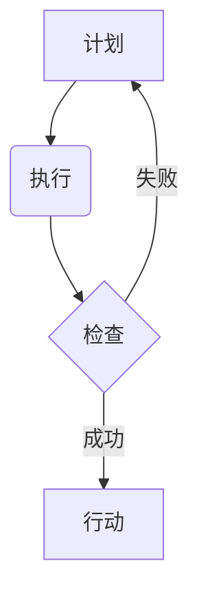

                 

## PDCA:高效管理者的行动方法论

> 关键词：PDCA, 循环管理, 持续改进, 软件开发, 项目管理, 敏捷开发, 流程优化

## 1. 背景介绍

在瞬息万变的科技时代，高效的管理方法对于个人和组织的成功至关重要。传统的管理模式往往过于僵化，难以适应快速变化的环境。而PDCA循环管理方法，凭借其简单易懂、灵活高效的特点，逐渐成为现代管理领域的一项重要工具。

PDCA循环管理方法，全称为Plan-Do-Check-Act，意为计划-执行-检查-行动。它是一种持续改进的管理方法，通过不断循环迭代，不断优化流程，提升效率和质量。

PDCA方法最初由美国质量管理专家Walter Shewhart提出，后来被W. Edwards Deming广泛应用于管理实践，并最终成为现代管理的基石之一。

## 2. 核心概念与联系

PDCA循环管理方法的核心在于四个步骤的相互关联和循环迭代。

**2.1  计划 (Plan)**

计划阶段是PDCA循环的起点，在这个阶段，我们需要明确目标，制定计划，并确定执行步骤。

* **明确目标:**  首先要明确需要达成的目标，并将其分解成具体的、可衡量的任务。
* **制定计划:**  根据目标，制定详细的计划，包括所需资源、时间安排、责任分配等。
* **风险评估:**  对计划进行风险评估，并制定相应的应急措施。

**2.2  执行 (Do)**

执行阶段是计划付诸实践的阶段，在这个阶段，我们需要按照计划执行任务，并收集相关数据。

* **按照计划执行:**  严格按照计划执行任务，并记录执行过程中的数据。
* **数据收集:**  收集执行过程中的数据，包括时间、成本、质量等方面的数据。

**2.3  检查 (Check)**

检查阶段是评估执行结果的阶段，在这个阶段，我们需要分析收集到的数据，并判断计划是否有效。

* **数据分析:**  对收集到的数据进行分析，找出执行过程中的问题和改进点。
* **结果评估:**  评估执行结果是否达到预期目标，并分析原因。

**2.4  行动 (Act)**

行动阶段是根据检查结果进行改进的阶段，在这个阶段，我们需要根据检查结果，修改计划，并重新执行。

* **改进计划:**  根据检查结果，修改计划，并制定新的执行步骤。
* **重新执行:**  按照改进后的计划重新执行任务，并继续收集数据进行检查。

**2.5  流程图**



## 3. 核心算法原理 & 具体操作步骤

PDCA循环管理方法本身并非一个算法，而是一种管理方法论。它没有固定的算法步骤，而是根据具体情况灵活调整。

**3.1  算法原理概述**

PDCA方法的核心原理是通过不断循环迭代，不断优化流程，提升效率和质量。

* **循环迭代:**  PDCA循环是一个不断重复的过程，通过循环迭代，可以不断发现问题，并进行改进。
* **持续改进:**  PDCA方法强调持续改进，不断追求更高的效率和质量。
* **数据驱动:**  PDCA方法强调数据驱动，通过收集和分析数据，可以更准确地评估执行结果，并进行改进。

**3.2  算法步骤详解**

PDCA方法的四个步骤可以详细描述如下：

* **计划阶段:**  明确目标，制定计划，并确定执行步骤。
* **执行阶段:**  严格按照计划执行任务，并记录执行过程中的数据。
* **检查阶段:**  对收集到的数据进行分析，找出执行过程中的问题和改进点。
* **行动阶段:**  根据检查结果，修改计划，并重新执行任务。

**3.3  算法优缺点**

**优点:**

* 简单易懂，易于实施。
* 灵活高效，可以根据具体情况灵活调整。
* 持续改进，可以不断提升效率和质量。
* 数据驱动，可以更准确地评估执行结果。

**缺点:**

* 需要持续投入时间和精力。
* 难以应对快速变化的环境。
* 需要具备良好的数据分析能力。

**3.4  算法应用领域**

PDCA方法广泛应用于各个领域，包括：

* 软件开发
* 项目管理
* 质量管理
* 流程优化
* 持续改进

## 4. 数学模型和公式 & 详细讲解 & 举例说明

PDCA方法本身没有固定的数学模型和公式，但我们可以用数学模型来描述PDCA循环的迭代过程。

**4.1  数学模型构建**

我们可以用一个简单的状态转移模型来描述PDCA循环的迭代过程：

* 状态：Plan (计划)、Do (执行)、Check (检查)、Act (行动)
* 状态转移：

    * Plan -> Do
    * Do -> Check
    * Check -> Act (成功)
    * Check -> Plan (失败)

**4.2  公式推导过程**

我们可以用一个简单的公式来描述PDCA循环的迭代次数：

*  n = (时间) / (循环周期)

其中：

* n: 迭代次数
* 时间: 从开始到结束的时间
* 循环周期: 一个PDCA循环的持续时间

**4.3  案例分析与讲解**

假设一个软件开发项目，采用PDCA循环管理方法，每个PDCA循环的持续时间为2周。

* 如果项目持续时间为8周，则迭代次数为：n = 8 / 2 = 4次。

这意味着这个软件开发项目将经历4个PDCA循环，不断改进和优化开发流程。

## 5. 项目实践：代码实例和详细解释说明

由于PDCA方法本身不是一个代码实现，因此无法提供具体的代码实例。

但是，我们可以通过一个简单的项目实践，来演示如何应用PDCA方法进行项目管理。

**5.1  开发环境搭建**

假设我们想要开发一个简单的记事本应用程序。

* 我们可以使用Python语言进行开发。
* 我们需要安装Python开发环境，以及一些必要的库，例如Tkinter。

**5.2  源代码详细实现**

由于篇幅限制，这里只提供一个简单的记事本应用程序的代码框架：

```python
import tkinter as tk

def add_note():
    note_text = note_entry.get()
    # 将note_text添加到记事本中
    pass

window = tk.Tk()
window.title("记事本")

note_label = tk.Label(window, text="请输入笔记:")
note_label.pack()

note_entry = tk.Entry(window)
note_entry.pack()

add_button = tk.Button(window, text="添加笔记", command=add_note)
add_button.pack()

window.mainloop()
```

**5.3  代码解读与分析**

* 这个代码框架创建了一个简单的记事本应用程序，用户可以输入笔记，并点击“添加笔记”按钮将笔记添加到记事本中。
* 由于代码框架没有实现笔记的存储功能，因此需要根据实际需求进行修改。

**5.4  运行结果展示**

运行这个代码框架，会弹出一个简单的记事本窗口，用户可以输入笔记，并点击“添加笔记”按钮将笔记添加到记事本中。

## 6. 实际应用场景

PDCA方法在软件开发、项目管理、质量管理等领域都有广泛的应用场景。

**6.1  软件开发**

在软件开发过程中，可以使用PDCA方法来管理开发流程，不断改进开发效率和软件质量。

* **计划阶段:**  明确软件功能需求，制定开发计划，并确定开发步骤。
* **执行阶段:**  按照计划进行软件开发，并记录开发过程中的数据。
* **检查阶段:**  对开发结果进行测试和评估，找出缺陷和改进点。
* **行动阶段:**  根据检查结果，修改开发计划，并重新执行开发任务。

**6.2  项目管理**

在项目管理过程中，可以使用PDCA方法来管理项目进度，确保项目按计划完成。

* **计划阶段:**  明确项目目标，制定项目计划，并确定项目任务和资源分配。
* **执行阶段:**  按照计划执行项目任务，并记录项目进度和问题。
* **检查阶段:**  对项目进度进行评估，找出项目风险和改进点。
* **行动阶段:**  根据检查结果，修改项目计划，并重新执行项目任务。

**6.3  质量管理**

在质量管理过程中，可以使用PDCA方法来持续改进产品质量，降低产品缺陷率。

* **计划阶段:**  明确质量目标，制定质量计划，并确定质量控制措施。
* **执行阶段:**  按照计划执行质量控制措施，并记录质量数据。
* **检查阶段:**  对质量数据进行分析，找出质量问题和改进点。
* **行动阶段:**  根据检查结果，修改质量计划，并重新执行质量控制措施。

**6.4  未来应用展望**

随着科技的不断发展，PDCA方法将在更多领域得到应用，例如：

* 人工智能
* 大数据
* 云计算

## 7. 工具和资源推荐

**7.1  学习资源推荐**

* 《管理的本质》 - 彼得·德鲁克
* 《输出管理》 - 埃里克·沃尔特

**7.2  开发工具推荐**

* Python
* Git
* Jira

**7.3  相关论文推荐**

* Deming, W. E. (1986). Out of the crisis. MIT press.
* Shewhart, W. A. (1939). Statistical method from the viewpoint of quality control.

## 8. 总结：未来发展趋势与挑战

PDCA方法作为一种经典的管理方法，在未来将继续发挥重要作用。

**8.1  研究成果总结**

PDCA方法已经得到广泛应用，并取得了显著的成果。

* 提高了效率和质量
* 增强了组织的竞争力

**8.2  未来发展趋势**

* 与人工智能、大数据等新技术融合
* 更加注重数据驱动和自动化
* 更加灵活和定制化

**8.3  面临的挑战**

* 难以应对快速变化的环境
* 需要持续投入时间和精力
* 需要具备良好的数据分析能力

**8.4  研究展望**

* 研究PDCA方法在不同领域应用的最佳实践
* 研究如何将PDCA方法与新技术融合
* 研究如何提高PDCA方法的自动化程度

## 9. 附录：常见问题与解答

**9.1  问题:**  PDCA方法需要多长时间才能看到效果？

**答案:**  PDCA方法的效果取决于具体的项目和环境。一般来说，需要经历几个循环才能看到显著的效果。

**9.2  问题:**  如何才能更好地实施PDCA方法？

**答案:**  

* 明确目标和计划
* 坚持数据驱动
* 持续改进和优化


作者：禅与计算机程序设计艺术 / Zen and the Art of Computer Programming 
<end_of_turn>

