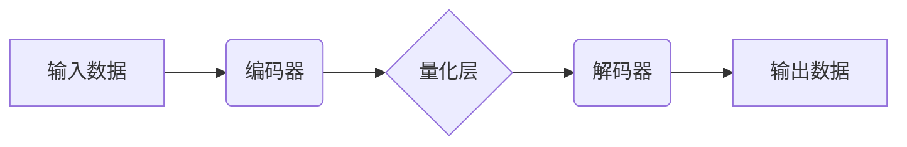
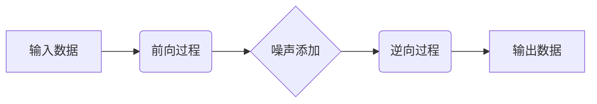

                 

## VQVAE和扩散变压器：跨模态AI的前沿技术

> 关键词：VQVAE,扩散模型,变压器,跨模态学习,生成模型,图像生成,文本生成

## 1. 背景介绍

跨模态人工智能 (AI) 领域近年来取得了显著进展，旨在训练模型理解和生成不同模态的数据，例如文本、图像、音频等。传统的跨模态学习方法通常依赖于手工设计的特征提取和融合模块，难以捕捉复杂的多模态关系。近年来，基于深度学习的跨模态模型涌现，取得了令人瞩目的成果。其中，VQVAE (Vector Quantized Variational Autoencoder) 和扩散变压器 (Diffusion Transformer) 作为两大重要技术，在跨模态AI领域展现出巨大的潜力。

VQVAE是一种基于变分自编码器的生成模型，通过量化编码器输出的连续表示，将数据映射到离散的代码本中，从而实现高效的图像生成和文本编码。扩散变压器则结合了扩散模型和变压器网络，通过逐步添加噪声和逆向去除噪声的过程，学习数据分布，并生成高质量的图像和文本。

## 2. 核心概念与联系

### 2.1 VQVAE

VQVAE是一种将连续数据映射到离散代码本的生成模型，其核心思想是将编码器输出的连续表示量化为离散的代码本向量。

**VQVAE 的架构:**



**VQVAE 的工作原理:**

1. 编码器将输入数据映射到一个连续的潜在空间中。
2. 量化层将潜在空间中的连续向量量化为离散的代码本向量。
3. 解码器将离散的代码本向量解码回原始数据空间。

**VQVAE 的优势:**

* **高效的图像生成:** 通过量化操作，VQVAE 可以生成高质量的图像，同时保持较低的计算成本。
* **文本编码:** VQVAE 可以将文本编码为离散的代码本向量，用于文本相似度计算和文本分类等任务。

### 2.2 扩散模型

扩散模型是一种生成模型，其核心思想是通过逐步添加噪声和逆向去除噪声的过程，学习数据分布，并生成新的数据样本。

**扩散模型的架构:**



**扩散模型的工作原理:**

1. **前向过程:** 将输入数据逐步添加噪声，最终生成纯噪声数据。
2. **逆向过程:** 从纯噪声数据开始，逐步去除噪声，恢复原始数据。

**扩散模型的优势:**

* **生成高质量数据:** 扩散模型能够生成高质量的图像、音频和文本等数据。
* **灵活的应用场景:** 扩散模型可以应用于各种生成任务，例如图像修复、超分辨率和文本摘要等。

### 2.3 变压器

变压器是一种基于注意力机制的神经网络架构，能够有效地处理序列数据，例如文本和音频。

**变压器的架构:**


**变压器的优势:**

* **强大的序列建模能力:** 变压器能够捕捉长距离依赖关系，有效地处理长序列数据。
* **并行计算能力:** 变压器可以并行计算，提高训练效率。

### 2.4 VQVAE和扩散变压器的联系

VQVAE 和扩散变压器可以相互结合，形成更强大的跨模态学习模型。例如，可以将 VQVAE 用于文本编码，并将扩散变压器用于图像生成，从而实现文本到图像的生成任务。

## 3. 核心算法原理 & 具体操作步骤

### 3.1 算法原理概述

VQVAE 和扩散变压器都是基于深度学习的生成模型，其核心原理是学习数据分布，并生成新的数据样本。

VQVAE 通过量化编码器输出的连续表示，将数据映射到离散的代码本中，从而实现高效的图像生成和文本编码。扩散变压器则结合了扩散模型和变压器网络，通过逐步添加噪声和逆向去除噪声的过程，学习数据分布，并生成高质量的图像和文本。

### 3.2 算法步骤详解

#### 3.2.1 VQVAE

1. **数据预处理:** 将输入数据预处理，例如图像归一化、文本词嵌入等。
2. **编码:** 使用编码器将输入数据映射到一个连续的潜在空间中。
3. **量化:** 使用量化层将潜在空间中的连续向量量化为离散的代码本向量。
4. **解码:** 使用解码器将离散的代码本向量解码回原始数据空间。
5. **损失函数:** 使用重建损失函数和代码本损失函数来训练模型。

#### 3.2.2 扩散变压器

1. **前向过程:** 将输入数据逐步添加噪声，最终生成纯噪声数据。
2. **逆向过程:** 从纯噪声数据开始，逐步去除噪声，恢复原始数据。
3. **训练:** 使用重建损失函数来训练模型。

### 3.3 算法优缺点

#### 3.3.1 VQVAE

**优点:**

* **高效的图像生成:** 通过量化操作，VQVAE 可以生成高质量的图像，同时保持较低的计算成本。
* **文本编码:** VQVAE 可以将文本编码为离散的代码本向量，用于文本相似度计算和文本分类等任务。

**缺点:**

* **离散代码本的限制:** VQVAE 的离散代码本可能导致图像生成质量的下降。
* **训练复杂度:** VQVAE 的训练过程相对复杂，需要调优多个超参数。

#### 3.3.2 扩散变压器

**优点:**

* **生成高质量数据:** 扩散模型能够生成高质量的图像、音频和文本等数据。
* **灵活的应用场景:** 扩散模型可以应用于各种生成任务，例如图像修复、超分辨率和文本摘要等。

**缺点:**

* **训练时间长:** 扩散模型的训练时间相对较长。
* **计算成本高:** 扩散模型的计算成本相对较高。

### 3.4 算法应用领域

VQVAE 和扩散变压器在跨模态AI领域具有广泛的应用前景，例如：

* **图像生成:** 生成高质量的图像，例如人物图像、风景图像和物体图像。
* **文本生成:** 生成高质量的文本，例如故事、诗歌和新闻报道。
* **图像 captioning:** 将图像描述为文本。
* **文本到图像:** 根据文本描述生成图像。
* **多模态检索:** 根据文本或图像查询，检索相关的多模态数据。

## 4. 数学模型和公式 & 详细讲解 & 举例说明

### 4.1 数学模型构建

#### 4.1.1 VQVAE

VQVAE 的数学模型主要包括以下几个部分:

* **编码器:** 使用神经网络将输入数据映射到一个连续的潜在空间中。
* **量化层:** 使用离散的代码本向量来近似潜在空间中的连续向量。
* **解码器:** 使用神经网络将离散的代码本向量解码回原始数据空间。

#### 4.1.2 扩散变压器

扩散变压器的数学模型主要包括以下几个部分:

* **前向过程:** 使用神经网络逐步添加噪声到输入数据中。
* **逆向过程:** 使用变压器网络逐步去除噪声，恢复原始数据。

### 4.2 公式推导过程

#### 4.2.1 VQVAE

VQVAE 的损失函数主要包括两个部分:

* **重建损失:** 衡量解码器输出与输入数据的差异。
* **代码本损失:** 衡量量化后的代码本向量与编码器输出的连续向量的差异。

#### 4.2.2 扩散变压器

扩散变压器的损失函数主要使用重建损失，衡量逆向过程输出的去噪数据与真实数据的差异。

### 4.3 案例分析与讲解

#### 4.3.1 VQVAE

VQVAE 可以用于图像生成和文本编码。例如，可以训练一个 VQVAE 模型，将图像编码为离散的代码本向量，然后使用这些代码本向量生成新的图像。

#### 4.3.2 扩散变压器

扩散变压器可以用于生成高质量的图像和文本。例如，可以训练一个扩散变压器模型，根据文本描述生成相应的图像。

## 5. 项目实践：代码实例和详细解释说明

### 5.1 开发环境搭建

* **操作系统:** Linux 或 macOS
* **编程语言:** Python
* **深度学习框架:** PyTorch 或 TensorFlow
* **其他依赖:** NumPy, Matplotlib 等

### 5.2 源代码详细实现

```python
# VQVAE 的简单实现示例
import torch
import torch.nn as nn

class Encoder(nn.Module):
    def __init__(self, input_dim, latent_dim):
        super(Encoder, self).__init__()
        # 定义编码器网络结构
        self.layers = nn.Sequential(
            nn.Linear(input_dim, 128),
            nn.ReLU(),
            nn.Linear(128, 64),
            nn.ReLU(),
            nn.Linear(64, latent_dim)
        )

    def forward(self, x):
        return self.layers(x)

class Decoder(nn.Module):
    def __init__(self, latent_dim, output_dim):
        super(Decoder, self).__init__()
        # 定义解码器网络结构
        self.layers = nn.Sequential(
            nn.Linear(latent_dim, 64),
            nn.ReLU(),
            nn.Linear(64, 128),
            nn.ReLU(),
            nn.Linear(128, output_dim)
        )

    def forward(self, x):
        return self.layers(x)

class Quantizer(nn.Module):
    def __init__(self, latent_dim, codebook_size):
        super(Quantizer, self).__init__()
        self.codebook = nn.Embedding(codebook_size, latent_dim)

    def forward(self, z):
        # 计算每个向量到代码本中所有向量的距离
        distances = torch.sum((z.unsqueeze(1) - self.codebook.weight) ** 2, dim=2)
        # 选择距离最近的代码本向量
        indices = torch.argmin(distances, dim=1)
        # 将向量映射到对应的代码本向量
        quantized_z = self.codebook(indices)
        return quantized_z

# 构建 VQVAE 模型
encoder = Encoder(input_dim=784, latent_dim=128)
decoder = Decoder(latent_dim=128, output_dim=784)
quantizer = Quantizer(latent_dim=128, codebook_size=512)

# 训练模型
# ...

```

### 5.3 代码解读与分析

* **Encoder:** 负责将输入数据映射到潜在空间中。
* **Decoder:** 负责将潜在空间中的向量解码回原始数据空间。
* **Quantizer:** 负责将潜在空间中的连续向量量化为离散的代码本向量。

### 5.4 运行结果展示

训练好的 VQVAE 模型可以用于生成新的图像。

## 6. 实际应用场景

### 6.1 跨模态检索

VQVAE 和扩散变压器可以用于跨模态检索，例如根据图像查询相关的文本，或者根据文本查询相关的图像。

### 6.2 文本到图像生成

扩散变压器可以根据文本描述生成相应的图像，例如根据“一只可爱的猫”的文本描述生成一只猫的图像。

### 6.3 图像修复

VQVAE 可以用于图像修复，例如修复损坏的图像或去除图像中的噪声。

### 6.4 未来应用展望

VQVAE 和扩散变压器在跨模态AI领域具有巨大的潜力，未来应用场景将更加广泛，例如：

* **虚拟现实和增强现实:** 生成逼真的虚拟场景和增强现实体验。
* **机器人交互:** 帮助机器人理解和生成人类语言和图像。
* **个性化教育:** 根据学生的学习风格和需求生成个性化的学习内容。

## 7. 工具和资源推荐

### 7.1 学习资源推荐

* **书籍:**
    * 《深度学习》 by Ian Goodfellow, Yoshua Bengio, and Aaron Courville
    * 《Generative Deep Learning》 by David Foster
* **在线课程:**
    * Coursera: Deep Learning Specialization
    * Udacity: Deep Learning Nanodegree
* **博客和网站:**
    * Distill.pub
    * Towards Data Science

### 7.2 开发工具推荐

* **深度学习框架:** PyTorch, TensorFlow
* **代码编辑器:** VS Code, Atom
* **数据可视化工具:** Matplotlib, Seaborn

### 7.3 相关论文推荐

* **VQVAE:**
    * Vector Quantized Variational Autoencoders by Karim et al. (2017)
* **扩散模型:**
    * Denoising Diffusion Probabilistic Models by Ho et al. (2020)
    * Imagen: Text-to-Image Diffusion Models Refine the Prompt by Nichol et al. (2022)

## 8. 总结：未来发展趋势与挑战

### 8.1 研究成果总结

VQVAE 和扩散变压器是跨模态AI领域的重要技术突破，取得了显著的成果，例如生成高质量的图像和文本，以及实现跨模态检索等。

### 8.2 未来发展趋势

* **模型规模和性能提升:** 未来将继续探索更大规模和更强大的跨模态模型，以提高生成质量和多样性。
* **多模态融合:** 将更多模态数据整合到跨模态模型中，例如音频、视频和传感器数据，以实现更全面的理解和生成。
* **可解释性和控制性:** 研究更可解释和可控的跨模态模型，以便更好地理解模型的决策过程和增强用户对模型的控制。

### 8.3 面临的挑战

* **数据获取和标注:** 跨模态数据获取和标注成本高昂，需要开发更有效的收集和标注方法。
* **模型训练效率:** 训练大型跨模态模型需要大量的计算资源和时间，需要探索更有效的训练方法和硬件加速技术。
* **伦理和安全问题:** 跨模态AI技术可能带来伦理和安全问题，例如生成虚假信息和侵犯隐私，需要制定相应的规范和政策。

### 8.4 研究展望

未来跨模态AI研究将更加注重模型的通用性和鲁棒性，以及与人类交互的自然性和流畅性。


## 9. 附录：常见问题与解答

### 9.1 VQVAE 和扩散变压器有什么区别？

VQVAE 是一种基于变分自编码器的生成模型，通过量化编码器输出的连续表示，将数据映射到离散的代码本中。扩散变压器则结合了扩散模型和变压器网络，通过逐步添加噪声和逆向去除噪声的过程，学习数据分布，并生成新的数据样本。

### 9.2 如何选择合适的跨模态模型？

选择合适的跨模态模型取决于具体的应用场景和需求。例如，如果需要生成高质量的图像，可以选择扩散变压器模型；如果需要进行跨模态检索，可以选择 VQVAE 模型。

### 9.3 跨模态AI技术有哪些伦理和安全问题？

跨模态AI技术可能带来伦理和安全问题，例如生成虚假信息、侵犯隐私、歧视和偏见等。需要制定相应的规范和政策来规避这些风险。


作者：禅与计算机程序设计艺术 / Zen and the Art of Computer Programming<end_of_turn>

